# Android逆向-基础篇 - P17：章节3-10-解析http结果 - 1e0y_s - BV15jhbeCEQk

好的，那么。下面我们看一下如何对HTTP返回的内容进行解析。在这里我们是使用了jason。

这个项目。这是安卓里面的一个标准项目啊，可以看到有2万个用户在关注他。

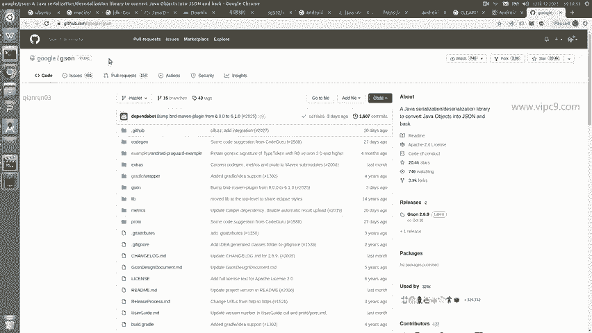

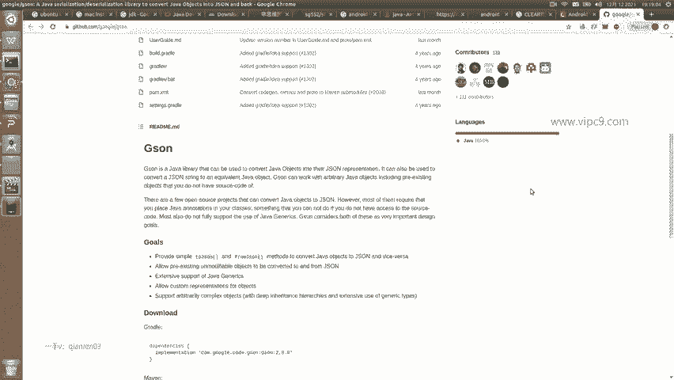

看一下他的安装。安装的话，打开build点gradle这个文件增加34行就可以。增加完之后，点击。这个小按钮啊。他就会给我们同步，也就是下载对应的组件。然后呢。我们来到发起HTTP请求这里。75行。

增加对应的代码。这个代码什么意思啊？先创建一个jason的实例。然后啊用jason点from jason这个方法。把这个结果进行转换。在这里大家需要注意哈，这个结果内容看起来是这样的。😊。

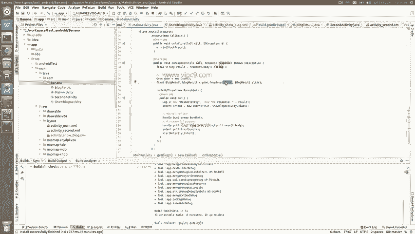

对不对？最外层是一个result，只有一个key。啊。然后这一个K里面。它又是一个hsh啊，有这么多的key啊，包括brower title啊、ID啊等等的。

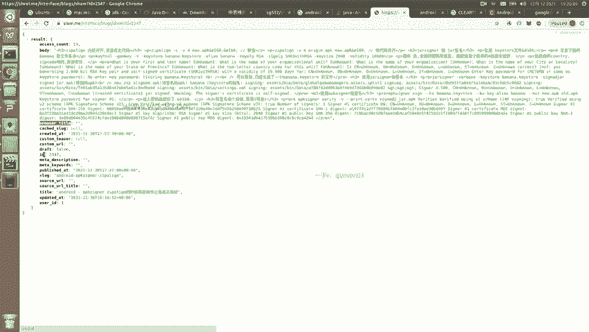

那么大家要注意哈，对于jason解析，他是一定要让我们来写对应的class。那么这个class我已经写好了。就在这里。叫做blog result。打开可以看到blog result啊在这里。

那么它只有一个普通的成员啊，这个普通的成员就叫做result，也就是这个第九行定义的这个result。

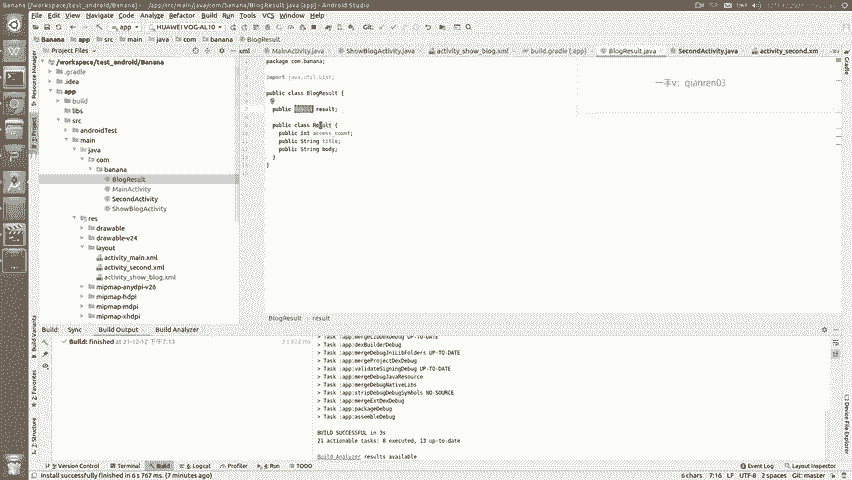

也就是。这里所对应的看到没有？因为这里的结果是两层，第一层只有一个result。

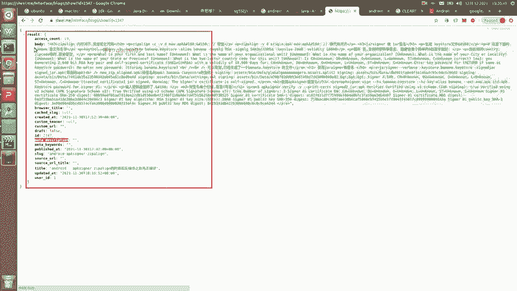

所以说我定了这个。

，也就是这个。然后第二层一个result里面有这么多不同的key。那么正常来说，我是需要给他们都挨个都写出来，罗列在这里的。但是考虑到我们现在只是一个演示的作用，所以说解析哪个，我就写哪个就好了。

那么我这里只写了写了三个啊，三个里面其实只用到了一个body。

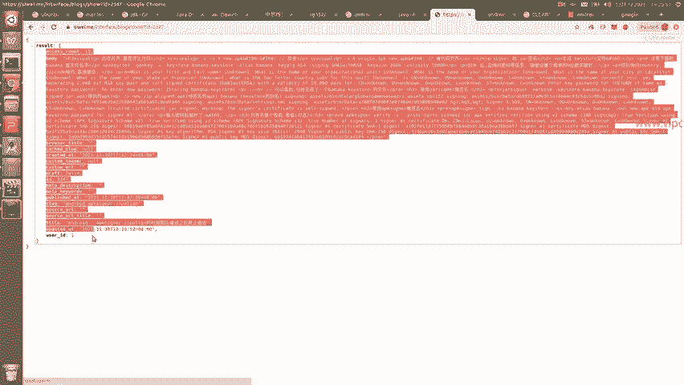

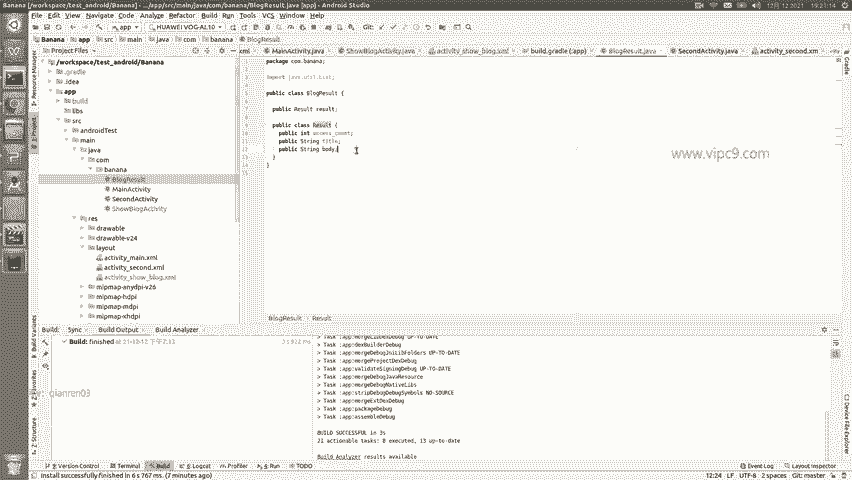

所以说对应了这个body。

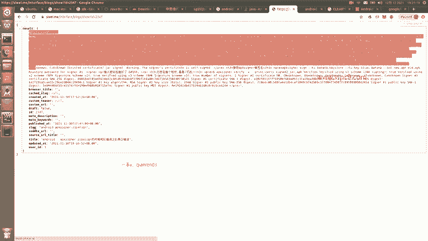

这里。所以我们回到刚才。这里。就可以看到。77行声明了一个blog result。是这里，然后这个blog result的呢。对应了一个class。大家认为这是一个固定的写法就好了。

然后我们打算把HTTP返回的内容展示到这个activity里面。那么在这里我们刚才。可以看一下这个页面是只有一个叫blog text啊，这是一个text view。所以说这个我已经给它加好了。

找到对应的这个activity。在这里面啊。需要涉及到一个叫做。页面接收参数啊，在这里就要有一个ble，这个ble在上面import过来的，可以看到。那么这个时候啊大家就可以按照这个代码来写。

第一句肯定是固定的写法永远不变的。然后第二十三行这里啊我们。根据邦do传进来的key叫做blog text啊，给它放到这个临时变量里面。然后25行获得XML页面上的这个text view。哦。

也就是对应的这里。Text view。然后给它的值从loading点儿点点儿改成刚才的jason的内容。就结束了。那么在ma activity这里，我们注意到啊这段代码。先创建了一个int。

刚才已经说了。然后创建一个bdo bundledo这个类。我们在一开始写的时候，他可能会给我们报错啊，没有找到帮do。那么其实我们摁alt加回车就会自动给我们补齐。然后。调整这里是传进来的参数啊。

那么key就是blog下号线text，然后参数的内容就是blog resultult点 resultult点 body，刚好就是我们上面看到的这个result点 resultult点 body。

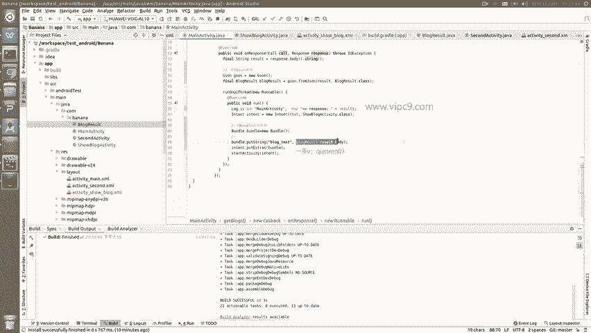

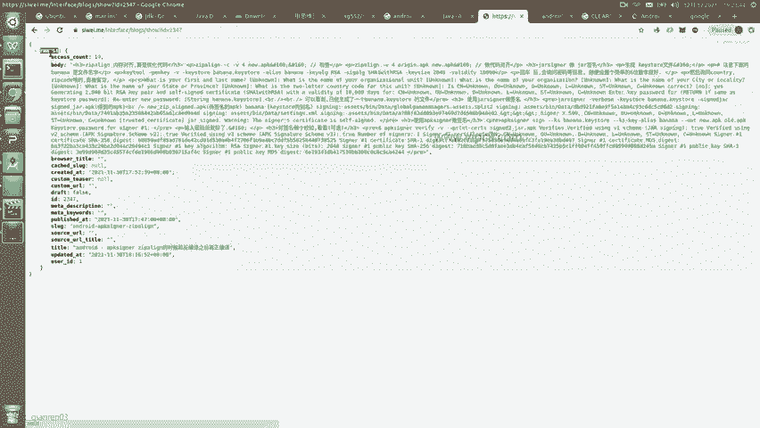

最后啊我们在对应的。按照的man这里啊要保证这个I activity是可见的。好的，那么我们运行它。嗯，在这里。在这里的话呢，点击上面的这个按钮。点击。

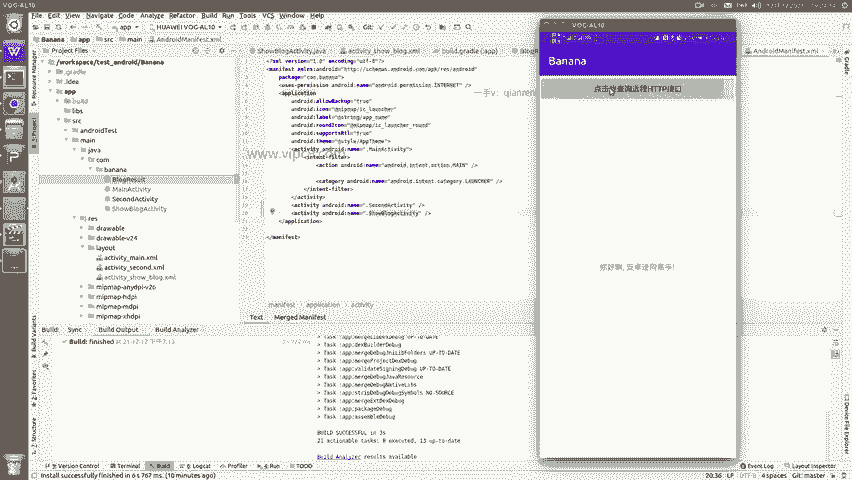

有没有看到？现在这个页面。就是。显示blog内容的页面。然后。这里看到的这个HTHTML标签的内容都是从远程传递过来的，内存对齐算是优化代码。内存对齐算是优化代码，看到了吧？所以说呢这个就是。

把远程的这次内容。

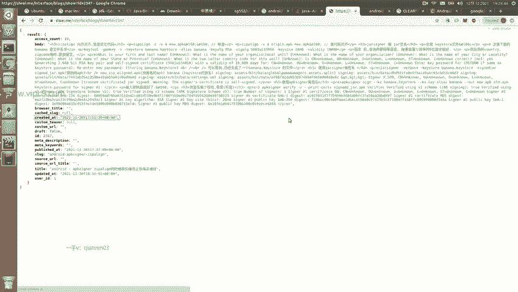

通过安卓的组件给它渲染到了这个安卓的页面上，这就是一个完整的链条。

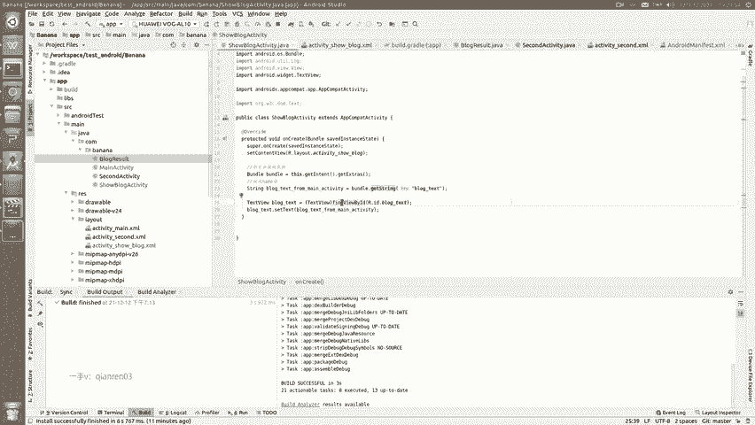