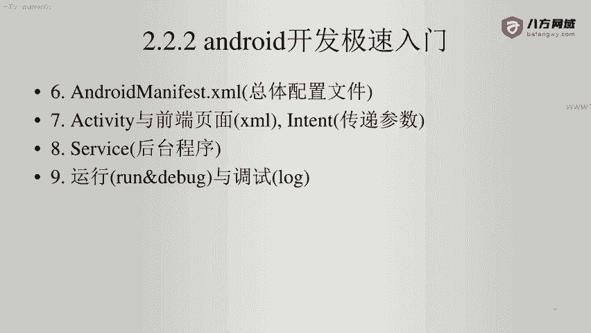
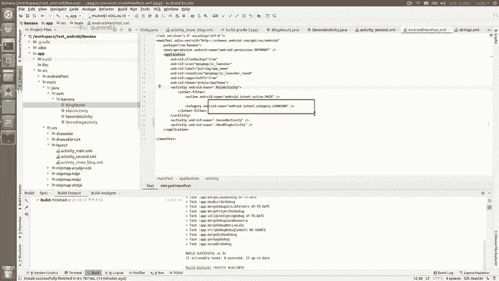
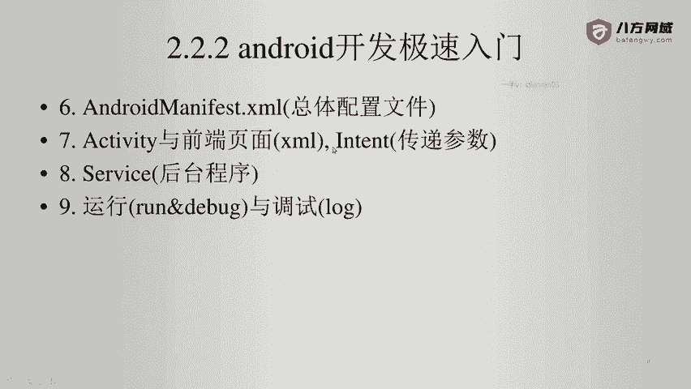
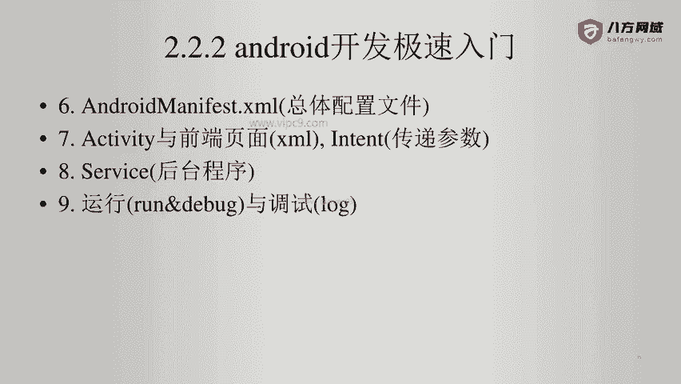

# Android逆向-基础篇 - P18：章节3-11-AndroidManifest - 1e0y_s - BV15jhbeCEQk

下面我们看一下一个典型的androidroid manifest，这个文件是什么样子。

这个文件呢啊清爽版就是长这样。我们在这里可以看到。😊，上面先是做了一些声明，这些声明呢其实都没有太大的意义啊。那么在这里唯一有意义的就是package的名字。

因为packash的名字对于安卓来说非常重要，它决定了安卓在整个设备里面的。进程的名称，以及决定了安卓的名字啊，比如说我们这个安卓它的这个内部名字就叫做big banana。啊，那么。

以后在涉及到自动更新的时候啊，是可以对自己的程序进行更新的啊。如果报名改变的话，那就不行。那么看一下下面。第四行，这里就是。为当前的应用申请internet访问权限。

然后第五行这里application。就是所有的页面都会声明在这里。在这里面。icon啊就是这个APP的图标label就是它的名字。那么我们在这里按住ctrl，点击鼠标左键是可以对安卓的名字进行修改的。

下面这里啊声明了每一个activity啊，可以看到我们这里面声明了3个。那么第儿main activity这个点儿前面就完整路径就come点banana。然后在这里面最最重要的就是这个lancher啊。

lancher就是程序的入口。

那么下面看一下activity与前端页页面的这个。

传递的参数。那么原则上每一个activity。都会对应一个叉ML。对不对？因为。activity它的目的就是为了展示页面。那么这里的话activity里面写的都是一些逻辑性的代码。

然后在这里面使用XML文件，对逻辑进行了分离啊，只是把逻辑啊的结果给它展现出来。😊，然后不同的activity。之间的跳转是通过这个intent进行跳转的。看到了吗？因泰的。传递两个参数。

第一个就是当前的activity。第二个就是目标的activity。然后通过start就可以了。最后的话呢。可以传递额外的参数，通过bdo来传递。

细节的话大家就可以看文档。

