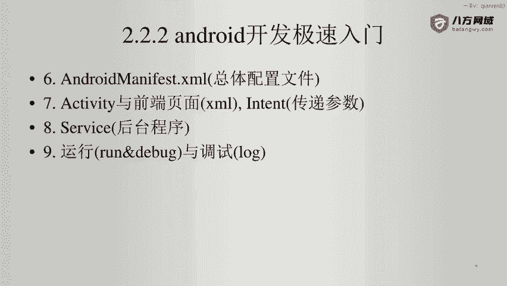
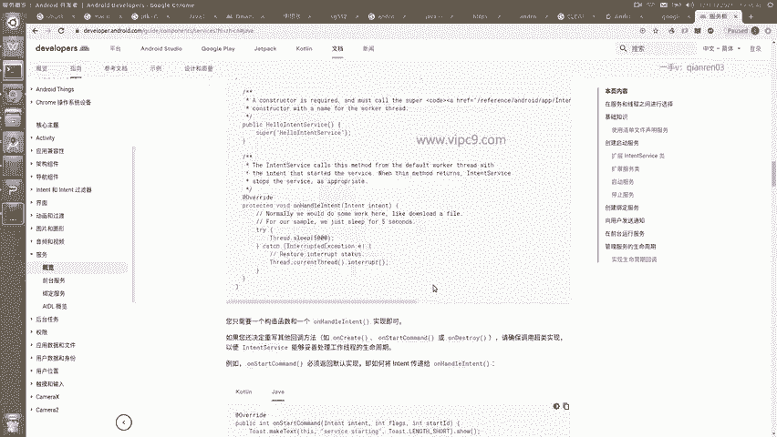
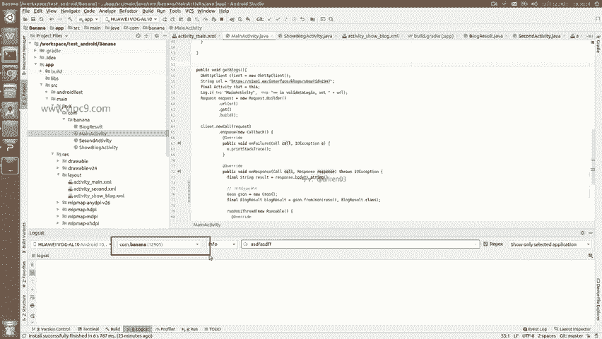
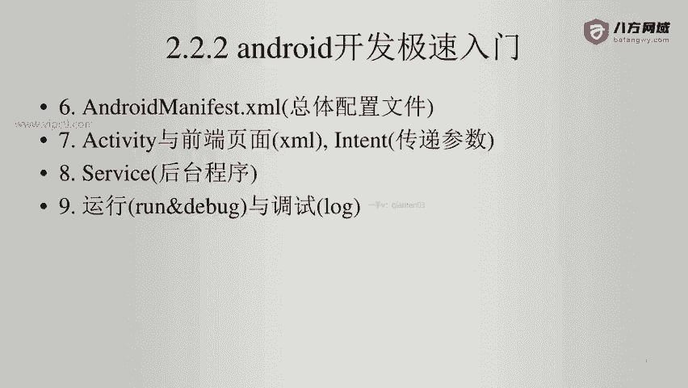

# Android逆向-基础篇 - P19：章节3-12-service与运行-调试 - 1e0y_s - BV15jhbeCEQk

下面我们看一下后台程序，也就是service。Service。官方对他的解释是在后台执行长时间操作而不提供界面的应用组件。这个跟activity是不一样的。

我们知道每一个activity都对应了一个页面。那么。大家对于这里啊可以不用写，但是一定要能够看懂。比如说打开many fast文件，如果看到了这样的内容。

service开头的我们就会知道这个APP它是一定是在后台做一些事情的。那么这里就是它的启动方式。

最后我们看一下运行和调试。非常简单。运行就是点run这个按钮，然后第一个就好了啊，这里的话往往是开发的时候要大量的使用到这个快捷键shift加F10。调试的话呢，基本上我们要打log啊。

log会出现在log cat这里，点击之后就会根据不同的等级来显示不同的内容。然后在这里也可以通过搜索啊来显示内容。这里。😊，通过下拉选择当前APP的包名啊，这个包名是一定要选的，否则的话我们会发现。

这个日志量非常的大，我们根本是看不过来的。

