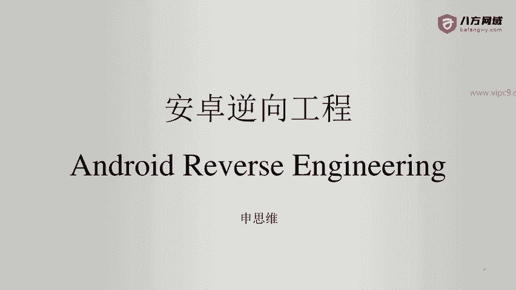
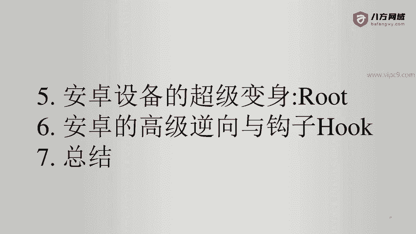
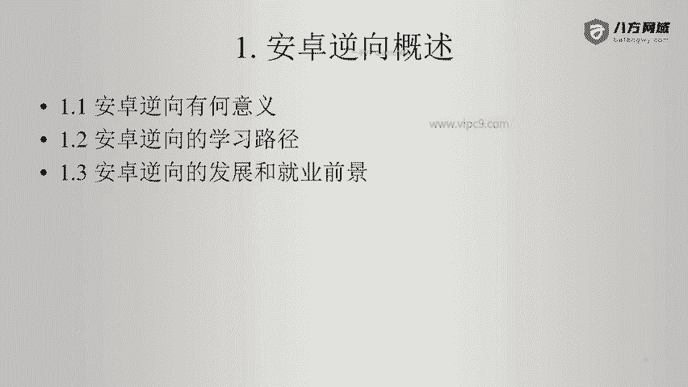

# Android逆向-基础篇 - P1：章节1-安卓逆向概述 - 1e0y_s - BV15jhbeCEQk

马士兵教育。定制未来，成就更好的你。

各位同学大家好，欢迎大家学习安卓逆向工程。

下面是本次课程的章节。第一章，安卓逆向概述。第二章。安卓正向基础与快速入门。第三章。安卓逆向基础。第四章。安卓抓包与高级hick方法。第五章。安卓设备的超级变身root。第六章，安卓的高级逆向与钩子。

第七章总结。那么在这7章里面。第一章是一个概述性的内容。第二章是正向基础。那么这个是我们绕不开的啊。接下来的第三章。讲的是逆向基础。大家学习了第三章之后，基本上如果没有经没有经过加固的手机APP。

都能够进行逆向。第四章安卓抓包和高级hack，这里呢就讲述了如何对安卓设备进行抓包，以及跟这个抓包技术。周边相关的一些方法和概念。第五点呢，这里是root。只要我们做的这一行稍微深入一点点。

都会用到root，否则的话，安卓对我们来说就是一个不可见的盒子。有了root设备，我们才能够彻彻底底的对它进行操作。第六章。非常重要。几乎所有加了壳的安卓都是没有办法通过正常的手段来逆向的。

那么我们前面做的这些铺垫，包括安卓的正向工作，逆向工作，对设备的root，这些都是为了为第六章打基础。也就是说我们需要做一些高级的逆向和钩的方法。

第七章是总结。下面我们来看一下安卓逆向概述。首先我们会讲安卓逆向的意义。第二，我们会讲安卓逆酱的学习路径。第三，我们会讲安卓逆向的发展和就业前景。下面我们看一下安卓逆向的意义。在2012年之前。

几乎所有的互联网应用都是外部应用，可能偶尔会有一些手机APP类的应用嗯，但是特别少见。据我了解，应该是J two SE的时代或者J twoME的时代。

那个时候大家还在用呃诺基亚或者一些相关的老的机型的机器啊，那个时候J twoME啊是有一些应用的，不过用的非常少。后来到了2012年之后，几乎所有的大中型互联网公司都会使用手机app，包括。

安卓端苹果端。在早期还有林凤。啊，还有TV等等。那么后来呢出现了小程序和H5啊。所以说可以认为现在任何一个互联网项目。都分成2块，一块儿。是API端啊，1个API端下面会有苹果、安卓和小程序等等。

另外一部分就是传统的web页面。那么所以我们做安卓逆向的意义啊，如果我们是红队的同学。那么安卓逆向可以把这个系统的所有接口都暴露在我们的眼前。这个时候我们在做攻击的时候。就会发现哇，我们的目标多了很多。

所以说安卓逆向。是我们做。渗透测试的时候，一种正面攻击的方式。或者说它是我们正面渗透测试的大门。那么对于蓝队或者说公司的安全防护方来说。安卓逆向的意义也非常大。通过安卓逆向。

防守方可以知道自己的薄肉点在哪里。自己有哪些地方是不足的？比如说我们的接口有没有签名啊，不止一次，我居我居然见到有项目方的接口居然还不带签名的。啊，他们就傻乎乎的认为我上了SSL证书就高枕无忧了。😊。

这个。挺有意思啊，所以说安卓的逆向能够让我们更好的进行防护。啊，另外就是任何一个项目做大了之后是绕不开安全的。安全方面要么不出事儿，出了事儿都是大事儿啊。

那个时候那个时候几乎每一个项目方都希望自己有一个时光机能够回到过去啊，但这个呢是不可能的啊，所以说我们一定要在事情还没有发生的时候，就要做好防护啊。😊，所以说这个就是安卓逆向的意义。

下面我们看一下安卓逆向的学习路径。首先啊我们要明确，如果想做逆向。一定要懂得正正向。也就是说不会正向，逆向我们是走不远的。😊，下面就是安卓正向的开发技能术。首先要知道java的语法。

如果java语法看不明白，那么反编译出来的代码你也看不懂，对不对？第二点。我们要了解安卓开发啊。因为光懂java语法是不行的啊，java这个语言它太简单了啊，但是java做的项目呢几乎都是嗯。😊。

着根于各种框架啊，比如说你用。java做web开发，那么基本上离不开spring啊，数据库离不开hybernet或者ibes。那么安卓也是一样的。安卓框架呢其实已经由官方给我们准备好了。

比如说我们要在这里学习一些java组件啊，学习一些安卓的，比如说几大知识点，什么activity啊、service啊等等的啊。😊，然后我们要学习安卓的工具。比如说开发的时候。啊，我们不能用记事本。

我们得用android studio啊官方推荐的。或者说有的同学说我喜欢用。我喜欢用imax都行啊。然后就是gradle。gradle可以认为是专门为安卓开发量身打造的自动化工具。啊，当然了它的功能。

就是。把一切。工作流程做成自动化啊，能省人工就省人工。然后就是ADB。ADB是连接我我们的电脑端和安卓设备的桥梁。那么ADB它包含了一些基本命令，这个我们在后面会学到。有了ADB。

我们就能够随心所欲的操作我们自己的安卓机了。下面就是安卓的虚拟机和实体机。那么。每一个安卓开发的同学都是离不开这种虚拟机或者实体机的啊，他们有一定的区别，到时候我我们也会说到。下面就是编译和打包啊。

那么这里其实比较简单，但是也很必要。最后呢就是安卓的加固和发布。所以说这些就是安卓的正向开发技能数啊。那么除了上面这两点啊，我们还需要知道安卓逆向的发展和就业前景。基本上安卓逆向是我们做安全领域。

绕不开的一个问题啊，可以说呃你去做安全领域的面试，那么80%的岗位都会问到你安卓逆向的问题啊，因为每一个网络或者说每一个应用都离不开安卓APP。也就是说，安卓逆向是怎么绕都绕不开的这是第一点。第二点。

我们要知道嗯，现在市面上存在漏洞的点。很多很多都在于APP的接口上，也就是我们俗称的API。啊。那么几乎啊90%的接口或者API都是由毕业两三年的小孩写的。那么这里面其实是充满了很多漏洞的啊。

因为我国的互联网虽然发展的很迅猛啊，从业人员很多，开发人员每年在北京都有好几万。但是呢。几乎所有的培训机构都不会告诉这些新入行的同学，说你们要注意安全编码规则。那么在基本上大中型的互联网公司。

我也很少见到有对于安全方面有专门的培训，或者告诉他们如何安全编程的。所以说。基本上我知道的一些圈子内部比较知名的安全事件啊，很多都是从接口上面暴露出来的啊。

所以说安卓逆向啊是攻破某一个项目的一个非常好的手段啊，这个也是我们防护的重点对象。所以说就业前景非常好，只要你把安卓逆向搞定啊，市面上10个APP，你能搞定个7个8个。

或者说只要这个APP加固的不是特别变态，你都能给它搞定。那么找到一个收入不错的很有前景的工作机会是非常简单的。😊。

