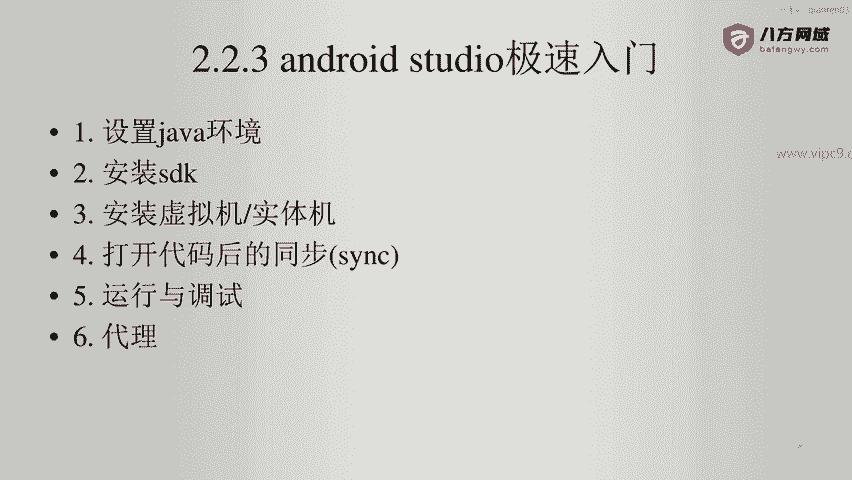
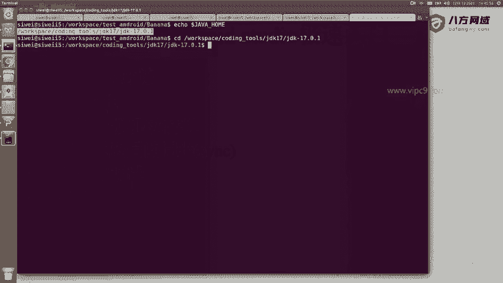
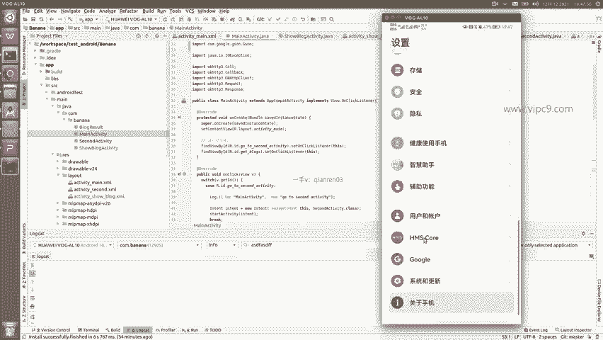
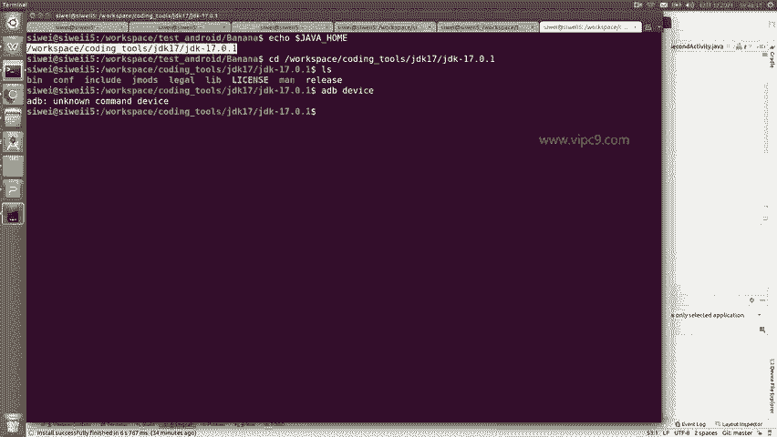
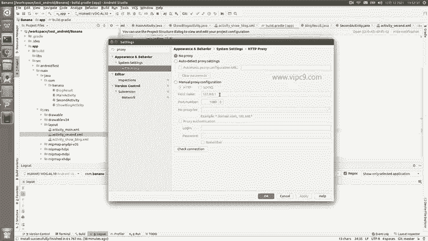
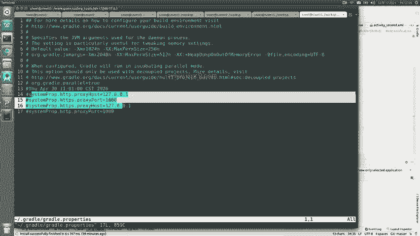
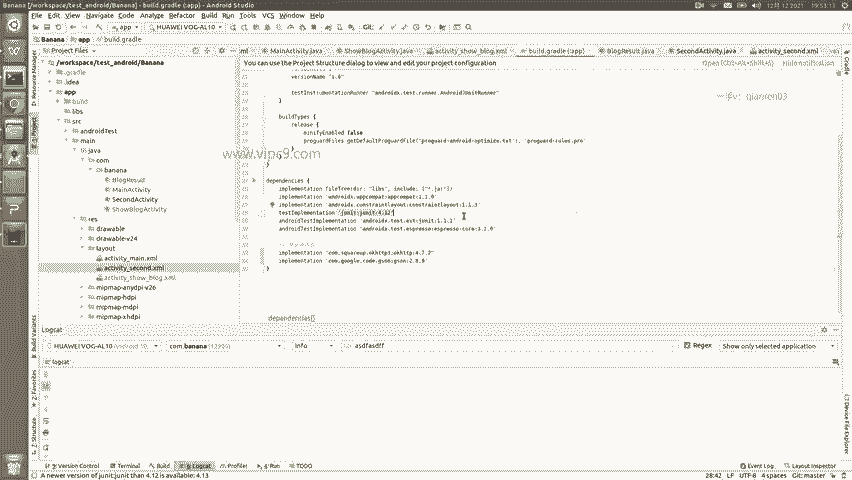

# Android逆向-基础篇 - P20：章节3-13-android studio的急速入门 - 1e0y_s - BV15jhbeCEQk

下面。我们学习一下安卓studio的极速入门。也算是对刚才的一个总结。首先要设置一个java环境，也就是说。

我们把java压缩包下载之后。要设置一个变量，叫做java home啊，都是大写的。这样的话。任何java程序都能够找到。

这是第一个。第二个。要安装安卓的SDK。也就是在这里。进来之后，toth SDDK manager。在这里面就可以。下载对应的安卓版本。然后在这里需要知道啊。可以给他指定一个地方。

第三个就是安装虚拟机和实体机啊，如果没有这个的话，我们是做不了开发的。点击tth。AVD manager。这个就是。一个虚拟机的列表。在这里我们可以对它进行修改啊，也可以对它进行这个启动或者停止。

比如说这里是一个竖向的，横向的等等。那么虚拟机的软件其实有很多，除了安卓自带的这个呃虚拟机之外，还有janymotion啊，以及国内的雷电虚拟机、雷电模拟器等等。啊，但是国内自带的版本比较低啊。

不像安卓官方带的这么全啊，比如说安卓官方，你想要什么样的API就有什么样的API但是国内的那种呢，它其实是只有安卓7的。然后就是实体机。那么在做实体机的时候啊，我们把这个设备连接上之后。

记得啊要使用这个。开发者模式，并且要使用最好的数据传输线，而不是那种特别便宜的，只是能充电的线。然后呢，记得连接到电脑之后，我们要给它在这里面设置里面嗯打开。

开发者模式。这样的话呢，我们才能够通过ADB这个命令。找到咱们的设备，那么ADB devices啊就能够看到这个就是当前的安卓设备。

然后呢，就是打开代码之后，我们要对项目进行同步。比如说。这里啊。回头大家把我的这个代码下载到本地之后，一定需要点击file，然后叫think project with gradle。这样的话。

就会把相关的第三方包都下载到本地啊，那么目前来看，额外下载的是这两个。然后呢就是运行和调试。运行和调试刚才已经说了，点run啊，然后呢调试的话看下面这里就可以了。其实大家在正常开发的时候啊。

我们是不会把这个窗口放的这么小的，基本上都会找1个27寸的显示器。然后下面这里该收就给它收掉。啊，然后这里大家要记住啊，要用好快捷键。比如说我按alt加6啊，就能够开启或者关闭啊。

因为在这里6这里可以看到它有一个下划线啊。嗯，IDE玩的好不好？快捷键是特别重要的。比如说我我按ctrorl加E就能够显示刚才打开的呃所有文件。比如说我想打开呃second activity。

大家不能用鼠标去点，一定要这个second啊，然后摁上按回车就可以了。啊，然后同时左侧这里的这个下拉单。也是很重要的啊，可以根据我们不同的喜好来查看不同的形式。比如说有的同学。

喜欢比较简洁的这种或者说比较经典的这种文件夹结构，那么就可以选择project。我个人就喜欢啊，一切都要由我自主可控。那么我就喜欢。看这种界面。

也就是说这个界面是跟实际的操作系统文件夹的结构是一模一样的。然后啊点击这个一就能给它收回去啊，打开任何一个XMR的文件，在右上角都有这个对应的设计。但是这里需要注意哈，就是这个设计会。😊。

根据版本的不同有略微的变化，有的时候你会发现，明明明设计是长这个样子。但是在实体机上却又不是，所以说这个是需要我们注意的。最后一个大家要注意的地方就是代理服务器啊。我个人就。曾经卡住啊，怎么回事呢？

就是我们下载完一个安卓项目之后，不是应该做这个think project吗？😊，结果发现每次要think的时候，都需要从谷歌的站点去下载内容啊，但是发现谷歌这个站点有的时候它是在国内是访问不了的。😊。

那这个时候怎么办呢？啊，我们就可以通过这个设置，比如说sttings看到没有？这个是非常重要的哈。ss这里。😊，ss，然后我们可以。挨个给他们打开啊，比如说editor啊，里面什么内容。

比如说version and controll啊什么内容等等等等都可以，这是一种。第二种的话呢，我们可以在这里进行搜索。比如说输入proxy。代理。那么在这里的话呢。

就可以看到我现在是并没有设置任何代理的啊，可以手动在这里设置代理服务器。然后呢，如果你的代理服务器不是sox5，也可以用这个啊。但是我推荐大家使用HTTP或者HTTPS的代理。

如果你们用的是sox5的代理的话，大家记住啊，不能在。这里来使用啊，因为我已经试过了，它应该是不支持sox5代理的。

呃，怎么做呢？😊，在我们的。ho目录下。

有一个文件。啊，叫做gradal properties啊，windows和m克几乎也都是这样的文件夹。然后在这里我们就可以把我们代理服务器在这里给它加上了。

那么在这里的优先级是比在这边的优先级啊是要高的。

但这个问题他不会一直出现，所以说大家不用担心。

