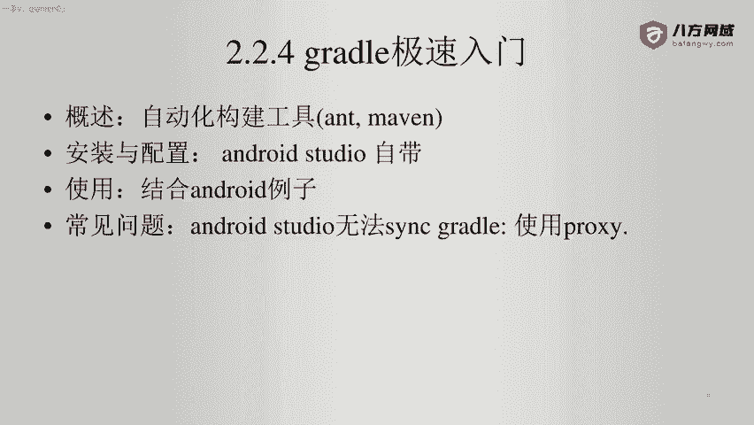
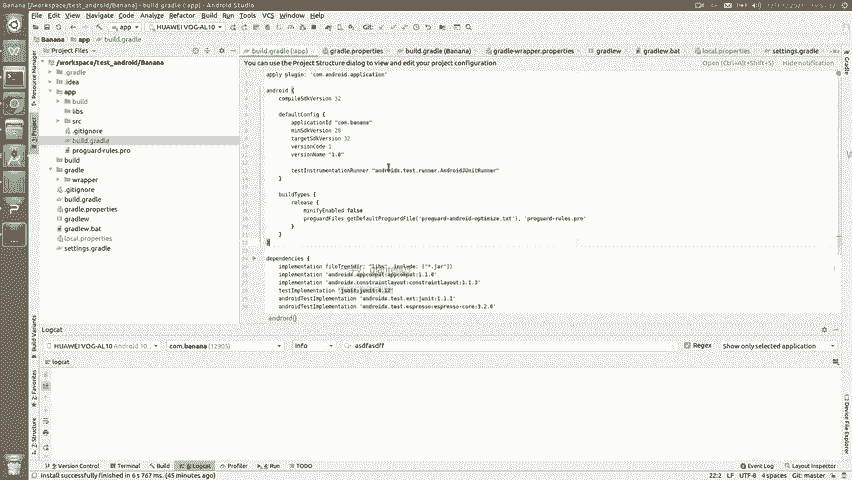

# Android逆向-基础篇 - P21：章节3-14-gradle极速入门 - 1e0y_s - BV15jhbeCEQk

下面我们看一下gradle的急速入门。首先大家一定要明确gradle它就是一个自动化的构建工具，跟java里面的ant或者man是一样的。好。那么他在我看到用的最多的就是安卓开发商。啊，我们可以。

独立的下载一个gradle文件啊，也可以。通过按照studio来自带这个gradle命令。那么我推荐就是使用studio自带的这个gradle，它能更加方便。然后我们看一下刚才的例子啊。😊。

这个是我们的项目。在这个项目里面可以看到有这么几个gradle。一个是。根目录下有个点grale啊，可以看到这个就是。由安卓studio自动下载的内容。然后呢，在根目录下有个叫build点gradle。

这个文件大家不要改它啊。它是哪些内容呢？首先。告诉当前项目。有两个代码库。一个是谷歌的，一个是jacenter的。我们所有的第三方包都从这里面找。然后依赖啊路径的话是这个不用动。

然后后面这两个也都是写死的啊，google jacent也不动它。总之这个内容呢，我们就认为这个文件是一个呃。必须得有，但是我们又不会改动它的文件。第二个。

gradle their properties。这个文件就是gradle运行时候的一些选项。比如说在这里他说需要的JVM啊，内存是2个G。啊，等等。下面这两个gradle W啊，这个就是启动命令了。

这个我们就不说了。😊，忽略他就好。下面sing their grale啊，我们原则上也不要动它，这个就告诉当前的安卓项目，他说啊root project name啊就是跟目录或者说最根的那个路径。

是名字叫banana。最顶层的是banana包含的模块啊，include啊冒号APP。这个冒号APP对应了这个文件夹APP。看到了吧。然后呢，在安卓开发里面，他会认为。这种就叫做一个模块啊，冒号APP。

然后呢，在每一个模块里面也都会有一个对应的gradle文件。啊，我们打开看一下。在这里面第一行。就是要应用一个pug in啊，所以说这个我们跳过这里面第四行。当前编译的SDK版本是32啊。

这个32也就是我每次runAPP啊所使用的安卓版本。下面的application ID，这就是包名come点banana，然后最小的SDK版本，然后目标的SDK版本啊，这些都会有一个。限制。

比如说我希望我的APP用在嗯2015年的时候，那么你的SDK版本可能就是安卓5对应的版本。build type啊，这里就告诉了我们。如果是发布版啊，那么就应该把一些功能开启或者关闭。

然后这里都是一些第三方的依赖，上面这几个都是系统自动生成的，我们先不用做。下面这些啊一个是发起HTTP请求用到的OKHTTP。一个是解析jason的组件。所以说呢这个就是gradle的基本作用啊。

我们在开发的时候可能还会有各种各样不同的用法，它的口味啊等等等等。但是对于我们逆向的同学来说。

只要我们能够把gradle代码读懂就够了。