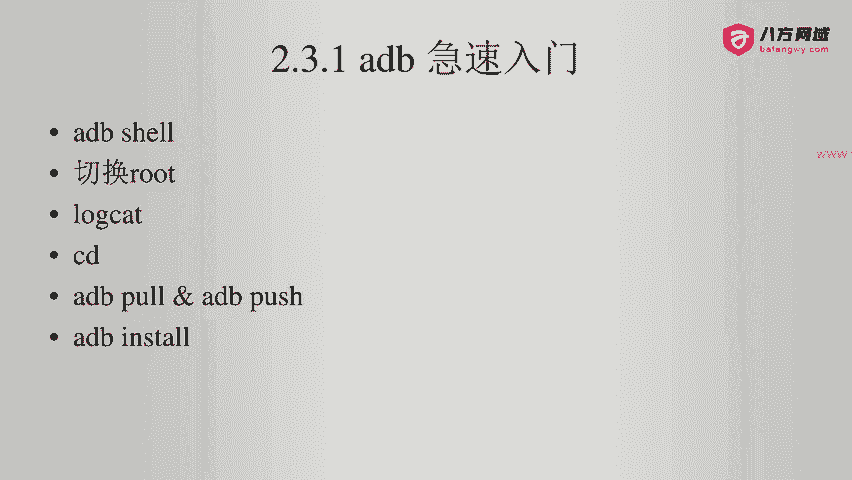
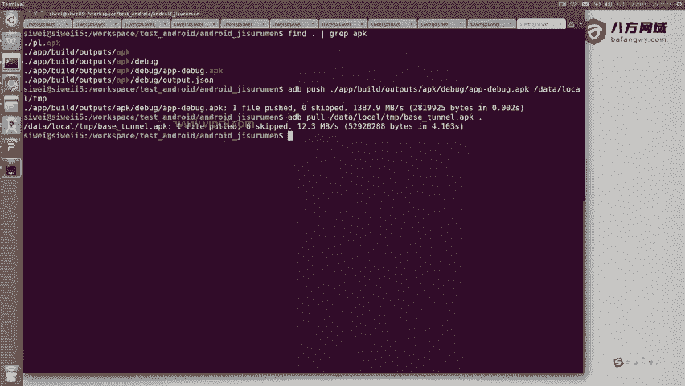
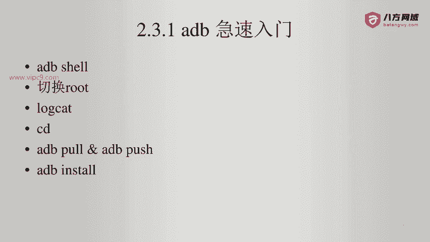

# Android逆向-基础篇 - P23：章节3-16-adb-push-pull - 1e0y_s - BV15jhbeCEQk

下面我们看一下ADB的p pushush和install。

那么push呢就是把本机的。文件啊传到手机端。那么假设我们看一下本机的这个APK文件。可以看到有1个APPdbug。我们就可以通过ADBpush。然后加上这个目标文件名，然后给它铺ush到哪儿呢？

push到这里复制。啊，push到手机端的datalocal TMP目录下。回车可以看到一个文件瞬间上传啊，每秒钟是一个G。回到这里来。可以看到这个APPDbug已经在这儿了。然后也可以通过ADB铺啊。

把一个文件从远程给它拉过来。比如说我们再拉一个文件啊。比如说叫base tu APK啊。拉到当前目录下点回车。嗯，进度条已经在跑了。好的，这个文件已经过来了。

就是下面这个文件。那么它还有一个功能就是APK啊，叫ADBinst，可以把APK文件直接以命令行的这种操作形式安装在手机上啊，那么。效果跟我们直接手动安装是一样的。所以说这个非常简单，就先不演示了。

