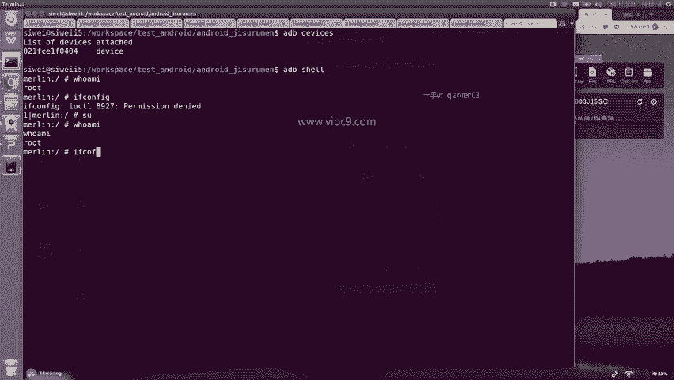
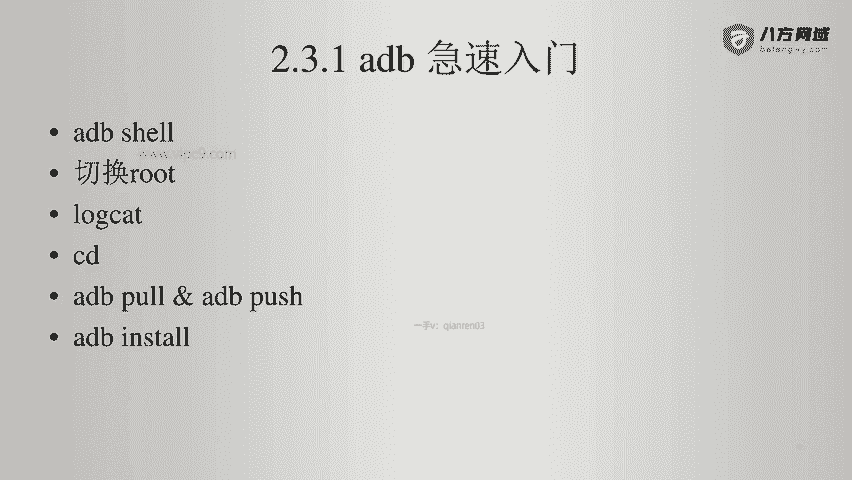
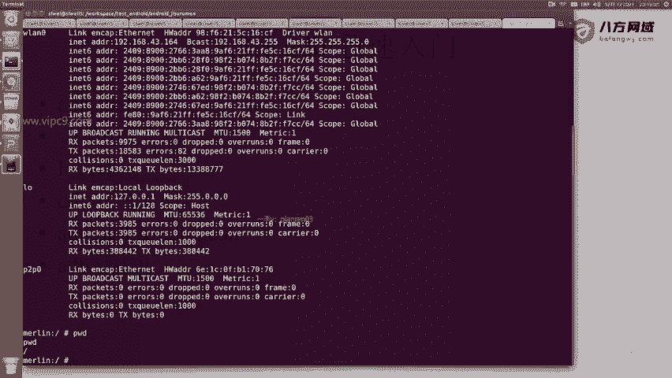
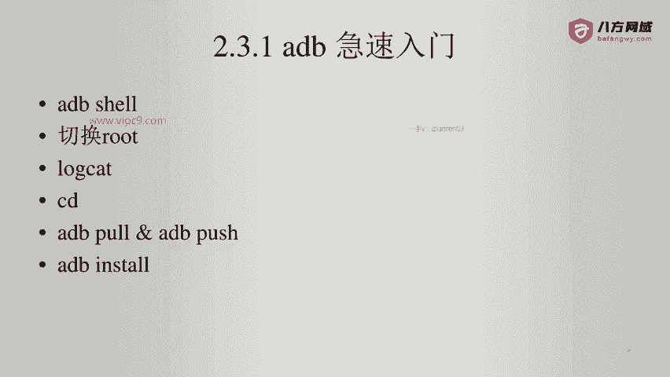

# Android逆向-基础篇 - P24：章节3-17-adb-使用root设备 - 1e0y_s - BV15jhbeCEQk

这台设备是我的小米设备。我已经对他做了root。可以看到这个软件。已经安装好了。那么我们通过ADB来查看。AB devices。可以看到021开头的设备已经就绪。ADB shell登录到我的手机。

输入嗯who am I啊虽然这个时候它显示成root，但是我想查看当前设备的IP地址的时候，他告诉我说permission denied啊，所以说不要紧，我们再来一遍，通过SU这个命令来切换啊。

也就是switch user。然后再输入who am I可以看到这里。啊，ho amI之后呢又多了一个root啊，这个就是货真价实的root。这个时候我通过输入if confi。

就可以看到啊，当前的网络情况是这样的。那么在这里面。Wline0，这个就是真实可可信的啊。因为我的这个可以看到。IP地址是这个192点168点43点164。啊。

下面这两个都是他的本地的这个所谓的一些网卡。

然后我们看一下它的基本命令吧。比如说我想看一下手机都有哪些内容，现在是。所在的路径PWD啊。是在根目录下。查看一下。

硬盘的情况，DF横线KH。就能够看到有这么多。那么在这里呢最多的是这个。是这个105个G啊，以及datamedia105个G。啊，可用的是89个G。然后比如说想查看一下日志。

那么通过这个命令log cat。这个命令会打印出手机端的日志，可以看到手机啊在现在已经晚上8点19了，它在不断的写日志，基本上都是wi有wifi的内容啊，还有其他的内容等等等等。

如果这个时候我们在手机端运行1个APP。比如说打开随便一个吧。我们比如说打开1个APP叫党报头条啊。那么这个时候其实在后台是能够看到对应党报头条的。logg的啊。

只不过这个log已经被刚才的大量信息给冲刷掉了。除此之外，我们还可以啊。往下找。比如说看一下下面的ADB是有p和push这样的命令的。铺的话呢就是。把APK文件。从手机端拿到。PC端。

push的话就反之啊，那么我们经常常见的一个操作，就是通过ADBinst或者push这个命令。来把APK文文件安装到手机上，我们看一下。

