# Android逆向-基础篇 - P25：章节3-18-Linux极速入门 - 1e0y_s - BV15jhbeCEQk

下面我们看一下lininux的极速入门。我们学习lininux的重要意义就在于每一个安卓机都是一个小型的linux啊，它的内核跟lininux是一个内核的。所以说我们想通过命令行的形式来操作安卓机。

就一定要学会linux命令。下面这些就是我们最最常见的lininux命令，我来跟大家依次说一下。

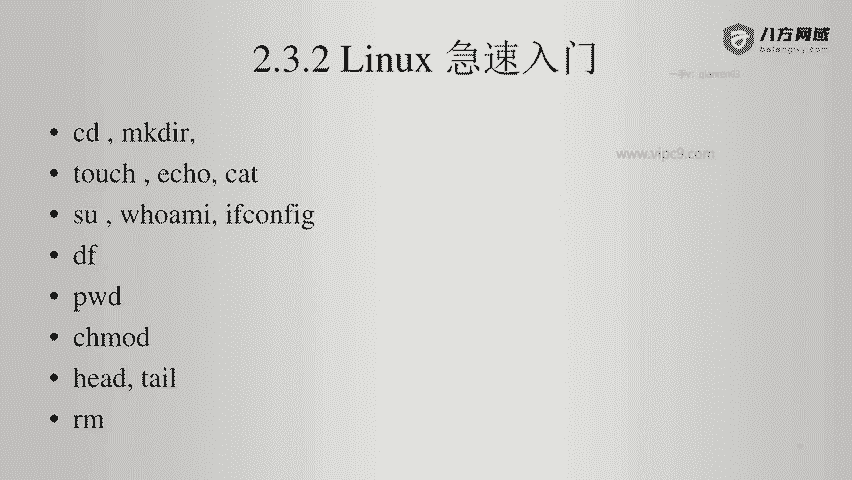

首先看一下CD和makeDIR。这个呢在我们这边是非常简单的。比如说。嗯，现在。查看LS。workspace吧。比如说进入到。这个是我的workspace。在这里呢。输入CD啊。

比如说进入到test android。就可以CD空格test and。这样就是切换了目录。想进入到上一级目录CD空格点点。然后一个点儿目录就表示当前目录。make DIR比如说我们进入到android。

在这里面。makeDIR比如说就叫做。Good morning。就可以进来了。所以说可以看到makeDR就是创建目录的意思。

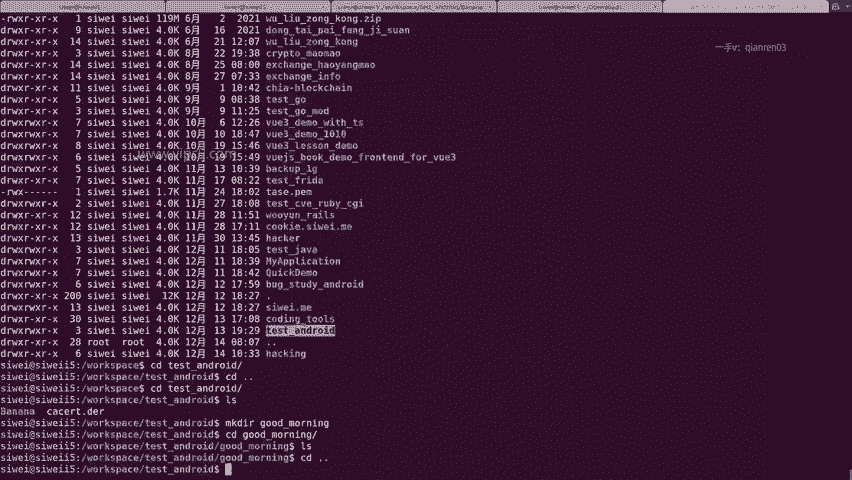

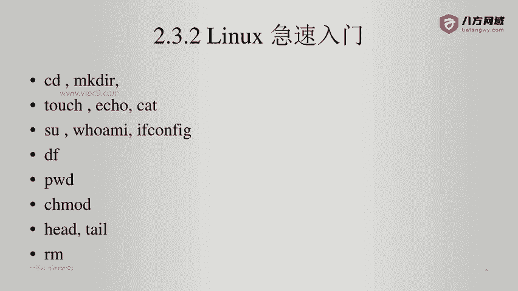

touch， echo和 cat。touch是创建一个文件。touch比如说嗨嗨嗨。然后我们看一下这个文件是一个空的文件。对不对？

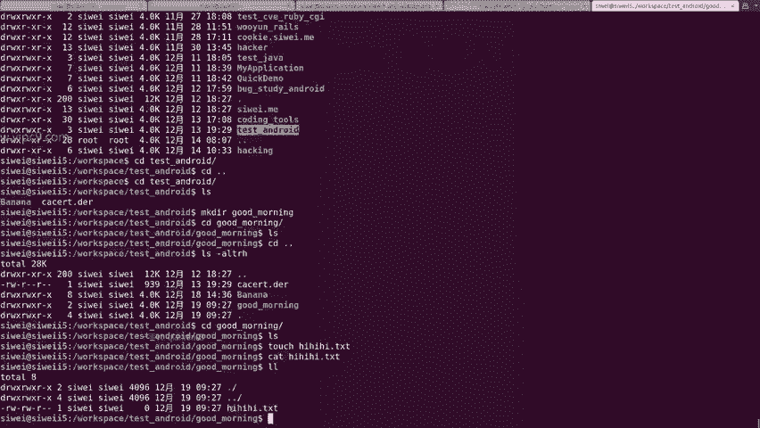

它的字节长度是0。

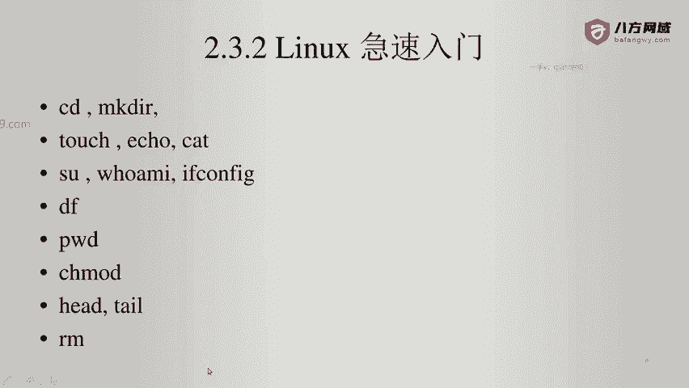

icical就是输出。比如说。你好。这是输出一个字符串。输出java home。输出一个java home到。任意一个文件。我们看一下。对不对？现在s file点TXT文件内容就是这个。当然了。

我们也也可以用其他的编辑器来打开。

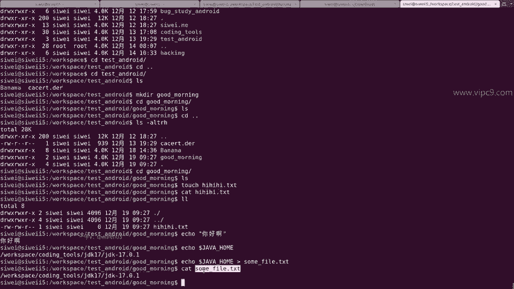

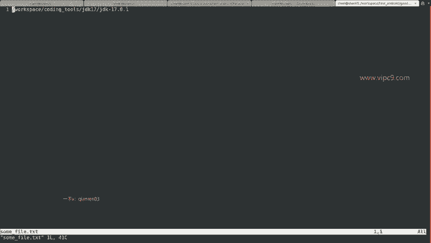

kite就是。看一个文件的内容。当然了，如果这个文件是几兆或者多少个G的话，那你的电脑就会卡死。

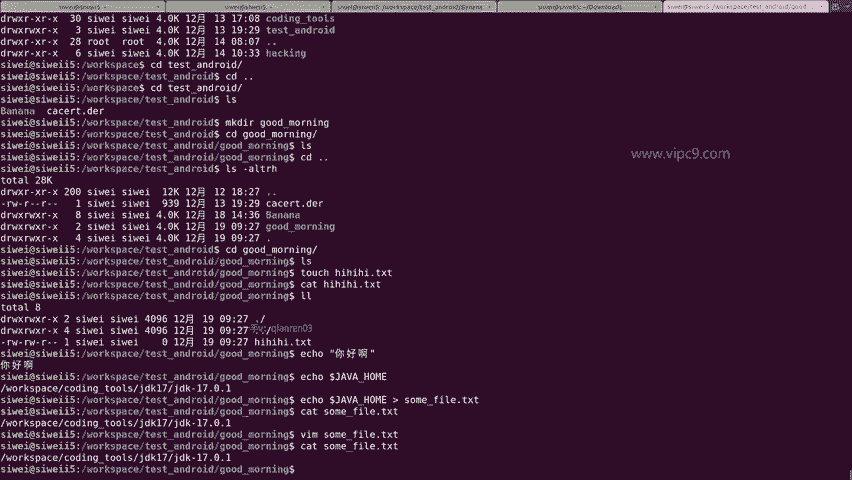

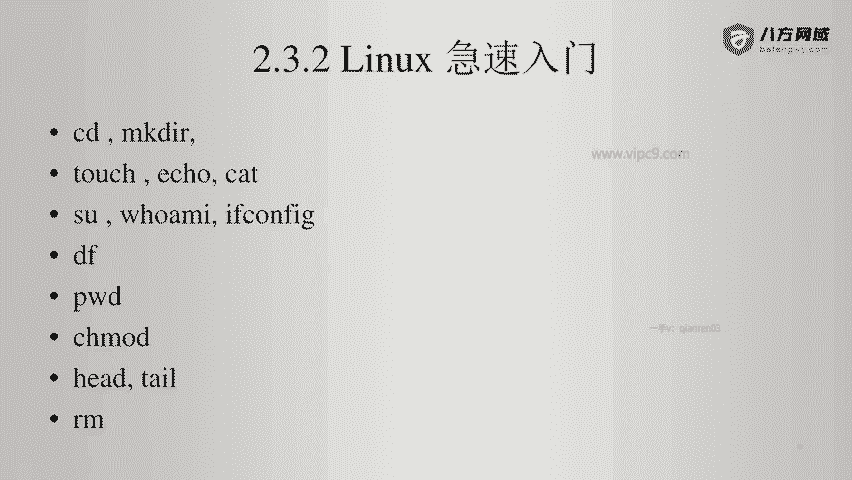

SU切换用户啊，比如说switch userSU rootot。输入密码。这是一个啊。那么。SU跟SU rootot是一个意思。那么在这里呢，我这个是lininux系统，并没有设置root用户直接登录。

所以说在这里看起来是不可以的啊。如果我登录的是一台服务器的话。

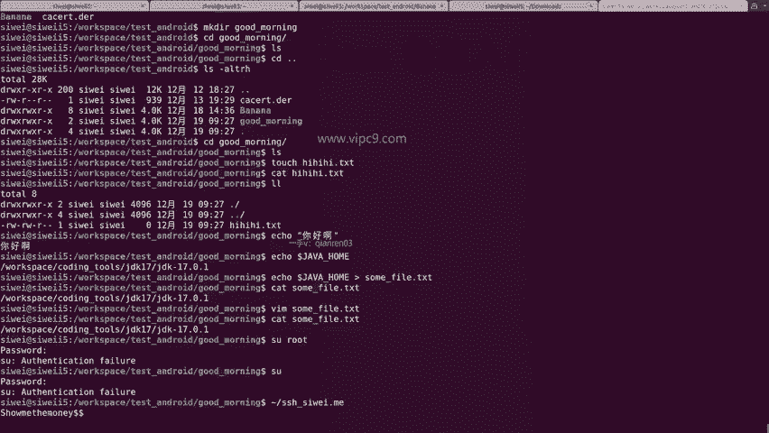

那么就可以通过SU来切换了。下面就是who am I。

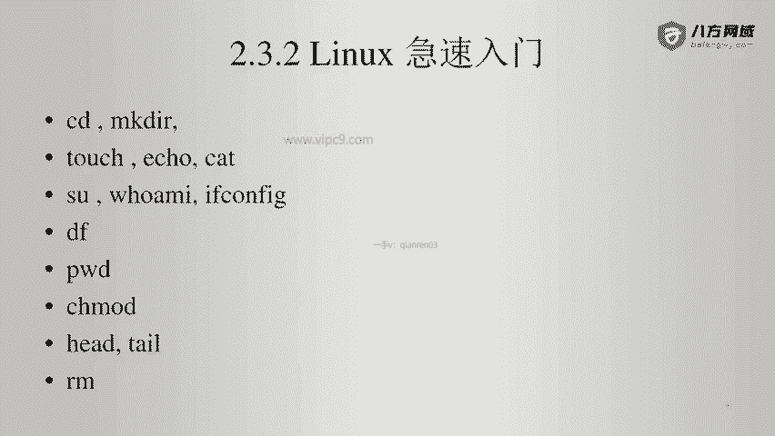

户外卖这个是谁？这个就是。Root。那么比如说我再切换到刚才那里。Who am I。4位。可以看到这个结果。跟思维艾特什么什么什么，这个是一个。if config查看网卡配置。那么在windows下面。

这个配置名称叫做IP confi。linux下面是if confi。曾经有过几个网卡，那么。这里就会显出几段来。比如说这个是docker的，这个呢是什么看不出来啊，这个是local host本地的。

所以说它的IP地址是127。点0。0。1，这个就是无线网卡。对不对？那么它的IP地址就是这个。DF查看磁盘，比如说我最喜欢用的就是DF横线KH。啊，KH呢就是单位是KH的话呢。

就是把K转换成兆或者转换成G。啊。是这样的。所以说这个就能够看到所有的呃。分区或者路建。在linux和呃windows它不一样的地方就是linux下面，它不分C盘D盘E盘linux下面分的都是这个斜线。

比如说。比如说这样的格式。再比如说这样的格式。啊，那么一个斜线，这里就表示跟路径。然后这样的话就是一个。子路啊，就是一个子的路径。所以说看我这里。上面这里。就是一个文件路径。好的。

我们再往下看PWD查看当前所在的路径。一方面呢是可以在这里看到。另一方面呢，比如说进入到你的home目录下。那么home目录下，大家就会觉得懵，这是哪儿呢？你输入PWD就能看到啊，原来是。

波浪线就等于这个你当前的后目目录。CH mode。这个呢就是修改文件的权限。比如说。这个文件现在就叫some file。看一下他。你可以打开，对不对？啊，在这里的话呢，some file。

前面这里是三部分RWRWR啊，第一个RW就表示。当前。用户的权限又能读又能写。第2个RW指的就是所属的用户组的权限啊。这个就是用户。这个就用户组。第三个就是。不跟你在一个用户组的用户，他具有什么权限。

是只能写。那么我们最简单的modode加X，比如说some file，这个时候它就会变绿。看到这里多出来一个X没有。表示。你和你所在的用户组都能够执行这个文件啊，如果这个文件是可执行的话。

那么其他的用户是不能够执行的啊，其他用户也能执行，这里X已经加上了，对不对？啊，你也可以CHmod777啊，some file这个时候看它。发现啊其他的用户组也具备了。读写和执行的权限啊。

那么呃基本上读呃读写和执行分别是。一。二和。4啊，那他们加起来刚好是7啊，所以说我可以用啊4Hm777来设置这个文件的属性。更多的话呢大家可以参考这个。通过MAN。加这个命令就能够看到了。行。

那这个就不细说了。head和tail这个非常简单。比如说嗯。

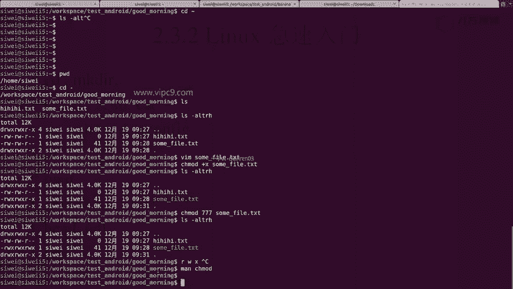

比如说我们这个文件非常长。我给他复制了999行。非常非常长。那么headd是只能够看最前面的十行。

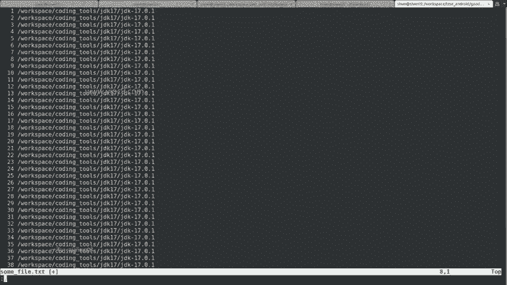

tailll也是只能看最后面的1行。那么我们可以通过tail横线F。来实时的跟踪这个文件输出了多少。也可以通过tail横线N来指定输出。

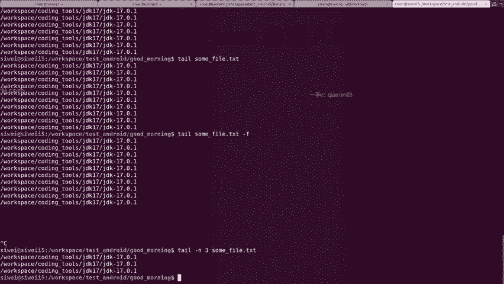

这个文件的最下面几行。

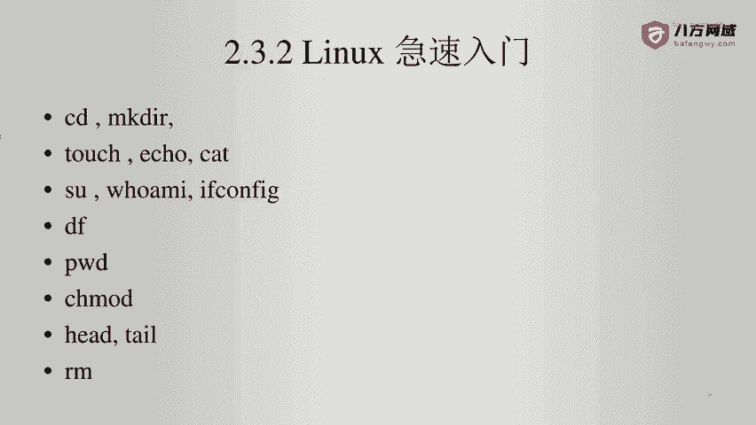

最后就是RMRM非常简单，就把文件给删掉。

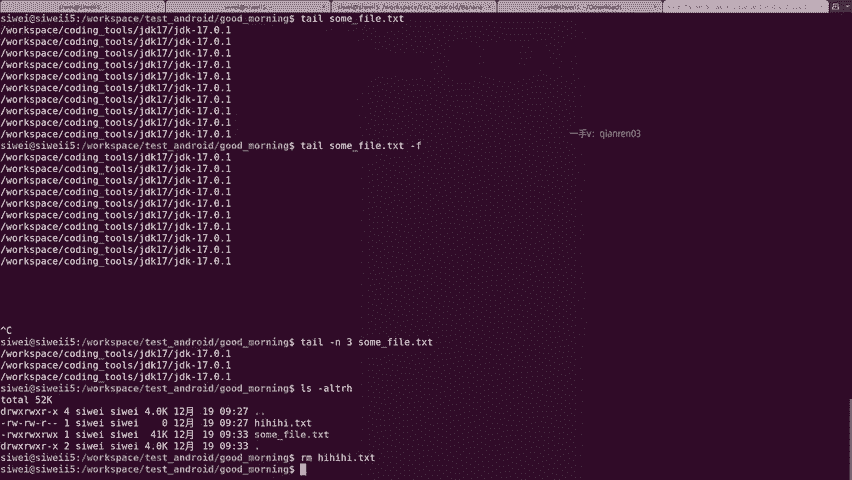

看没有了。所以说这个就是lininux的极速入门。那么在安卓端其实也是完完全全一样的。

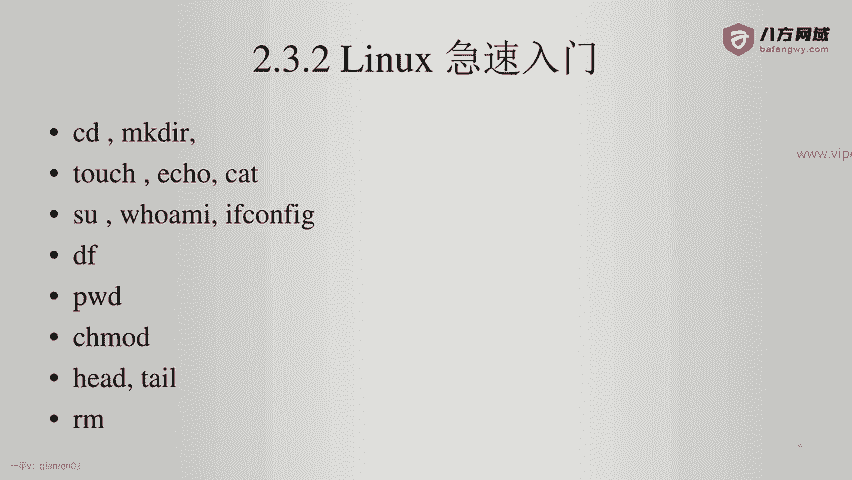

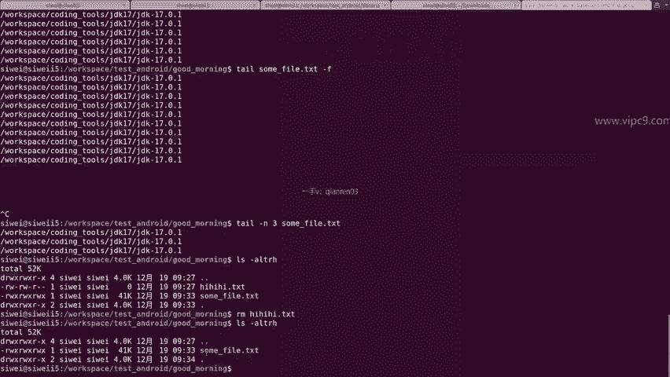

给大家再演示一下。现在我把我的测试机已经连到了。这个电脑上。

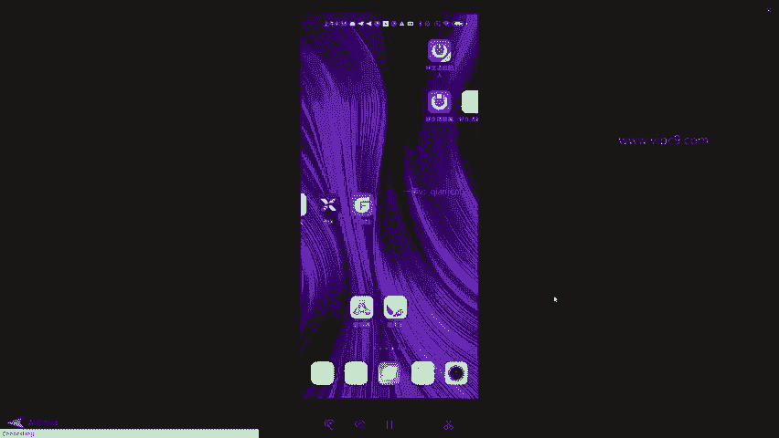

然后我们进来看一下。ADB devices看一下设备有没有在。好的，已经在了。ADB shall。

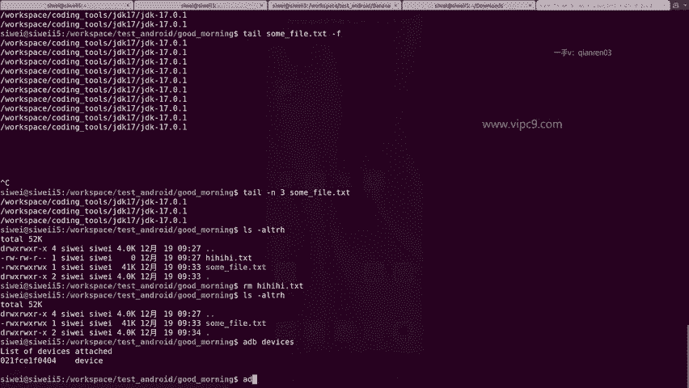

试着运行一下刚才我们的这几个命令。

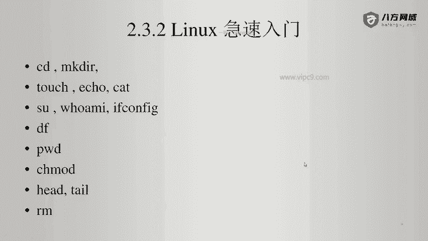

比如说PWD啊当前目录DF是这么多。DF横线KH可以看到手机是128G的，基本上。进入到。呃。Data。Local。TMP目录下啊可以看到这个目录下，我创建过这么多的文件。touch一个啊，嗨嗨嗨。

是不是？可以看到这个嗨嗨嗨文件已经在下面出来了。可以给它往里面写文件。比如说写什么呢？略略略。给它写到hi这里面，让我们ca一下。是不是进来了？我们也可以给它加上这个权限，比如说帽子加X嗨嗨嗨。

那么我们就可以这样执行它了，只不过它是执行不了的啊，因为它这里面是没有什么内容。啊，然后呢再看一下，比如说。Who am I。已经是root了，但这个是假的啊，因为我输入if confi是不行的。

输入SU。这个时候再输入who am I可以看到跟刚才的命令是不太一样。这个在我的小米它root设备上表现起来是这样的。输入这个时候输入if confi。可以看到IP地址这就出来了。0。102。

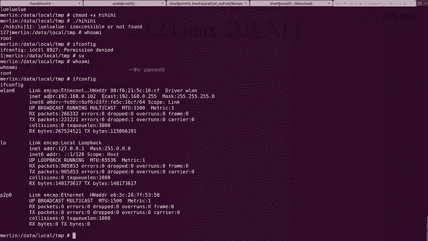

再看一下，比如说。

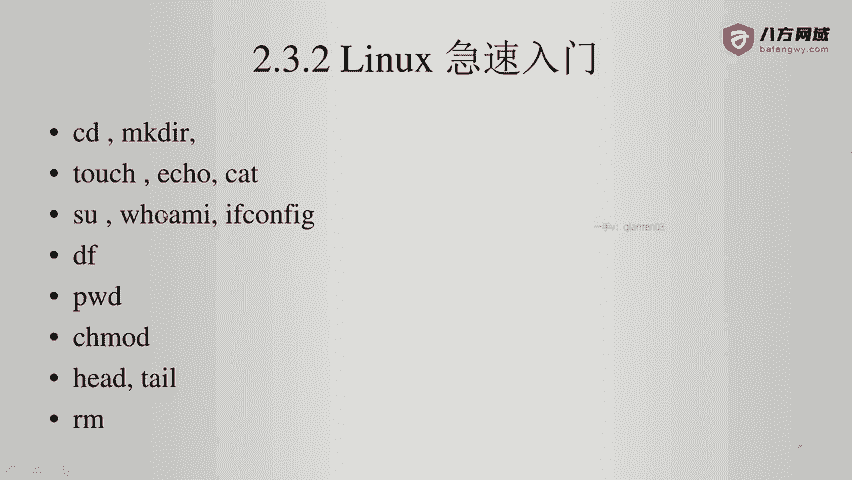

创建目录吧。好的，这个目录就创建起来了。最后的话呢就删除这个目录。他告诉我们，这样是安不行。好的。横线F。这就删掉了。RM横线F稍等。RF好的，这个时候文件夹就已经被我删掉了。

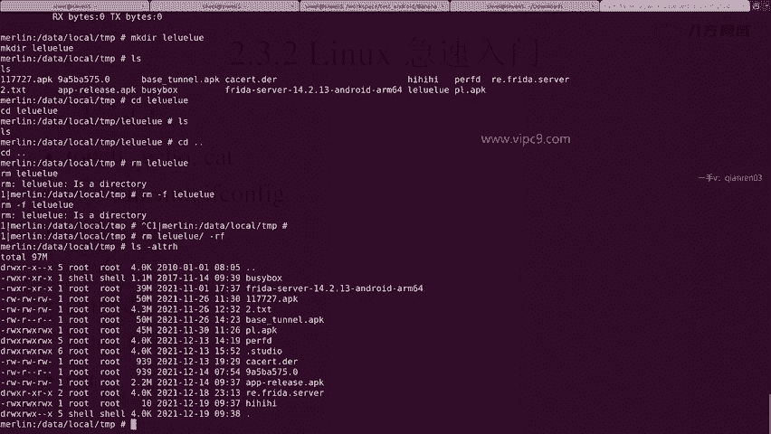

那么这个就是linux的极速入门。