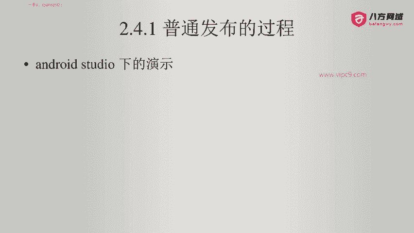
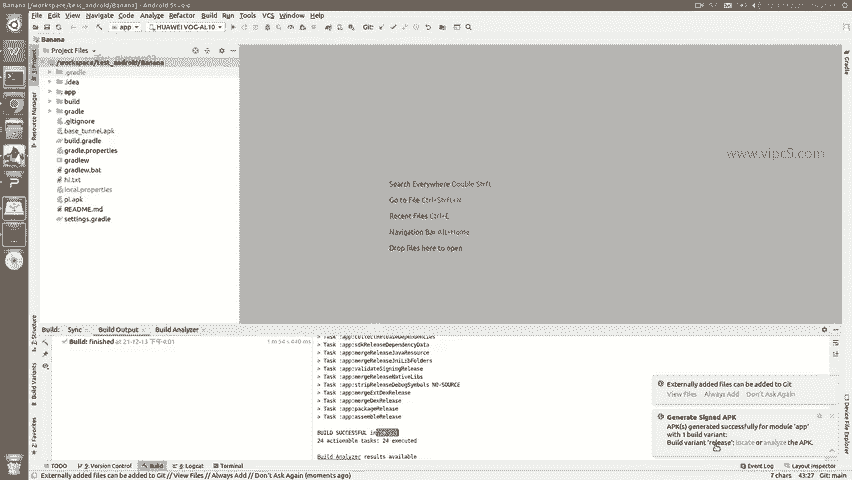
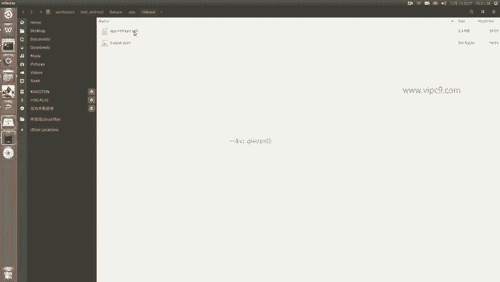
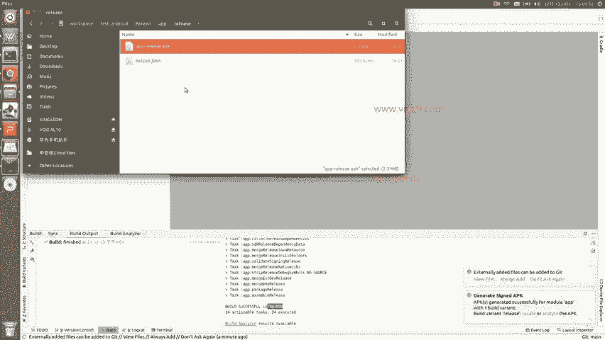

# Android逆向-基础篇 - P27：章节3-20-普通发布的过程 - 1e0y_s - BV15jhbeCEQk

下面我们看一下普通发布与加固发布。先看一下普通发布的过程。然后看为什么要加固。第三，看加固的多种阶段的演进和概述。第四。不同加固方案的概述。下面看一下普通发布的过程啊。

这个过程我们在按照studio下面进行演示。这个是我们的例子。然后非常简单。点击build。一个叫做jarate signed bundledo或者APK点击。在这里让我们进行选择。

我们选择下面的这个APK。点nex。在这里面啊需要让我们找到这个key store的路径。因为我们打包的时候一定需要一个key啊。那么key store的话呢，我们就给它创建一个新的啊。

比如说问我们保存在哪，我们就给它比如说放在我的。嗯。选择一个地方吧，好吧，就放在我的这这里吧。比如说就叫做。安卓。即使。极速入门啊，点JKS。pass word123456。123456。

我读出来是为了让大家知道这个密码是123456啊，但你们在做的时候不要这么说。123456。123456。Alias比如说就叫做呃。嗯，急速入门好了，好吧，al alias它的别名。

我们给它起成跟key的名字是一样就好了，密码都是123456，下面这些啊可填可不填。好吧，至少填一个。那么这个时候这个key文件就会生成了。然后密码啊等等的，他就都会给我们添好。

然后我们选择记住点next。这个时候问我们啊是要哪一种口味儿，也就是说是一个开发版还是一个正式版啊，这个在gradle里面它叫做flavor啊，叫口味。我们选择这个release。

也就正式发布版V1和V2都给它选中啊，大家一定要记住，这里不能够只选一个。然后点击fininish。看下面gradle buildingil。然后我们把这个build这里打开，可以看到。正在build。

我们等待。大概需要一段时间。可以看到他这里正在下载对应的内容。好的，然后现在正在合并发布资源。正在处理这个资源。然后。正在link啊。一边link一边在下载东西。

这个下载的内容只有在首次编译的时候才会用到啊，之后的话就不会再用了。然后右侧这里。可以看到的是这个具体的。打包的过程啊是有很多个子任务来组合起来的。那么这里我们就可以啊给它忽略。我们就等待就好了。

这个是package releasease啊，可以看到这里。嗯，总共是花了将近2分钟，然后打包已经打好了。右下底右下角这里告诉我们说。这个文件呃已经弄好了。点击一下我们。

就可以看到了。在这里叫APPrelease啊点APK目录呢是放在了放在了这里啊，banana APPrelease这里面。

然后我们在手机端啊就可以安装这个APK文件，并且这个APK文件就是一个所谓的安卓的正式版。

