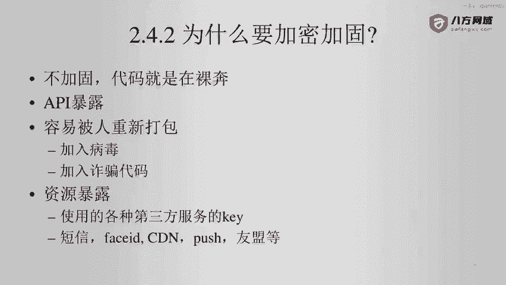
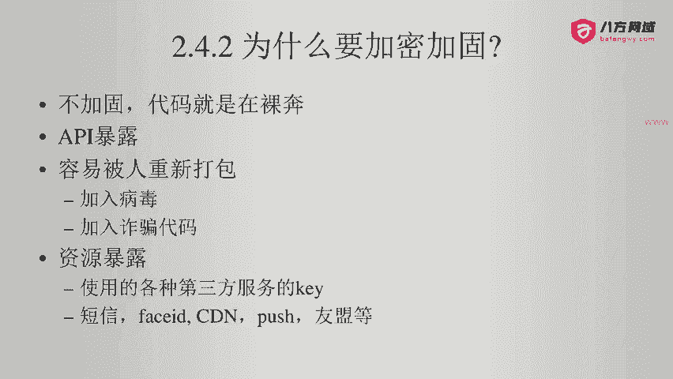
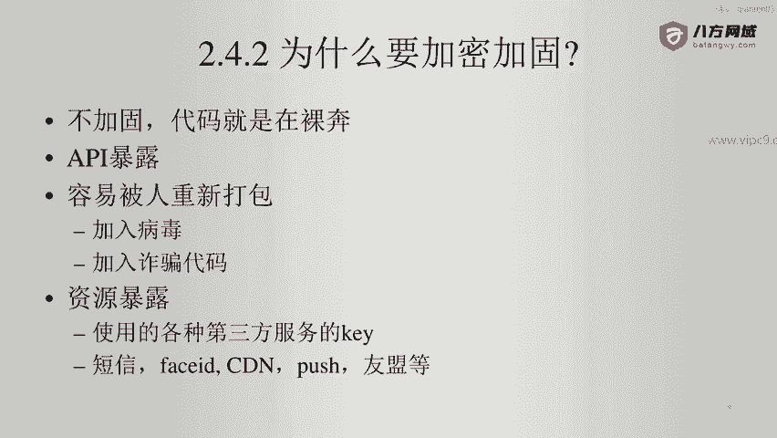
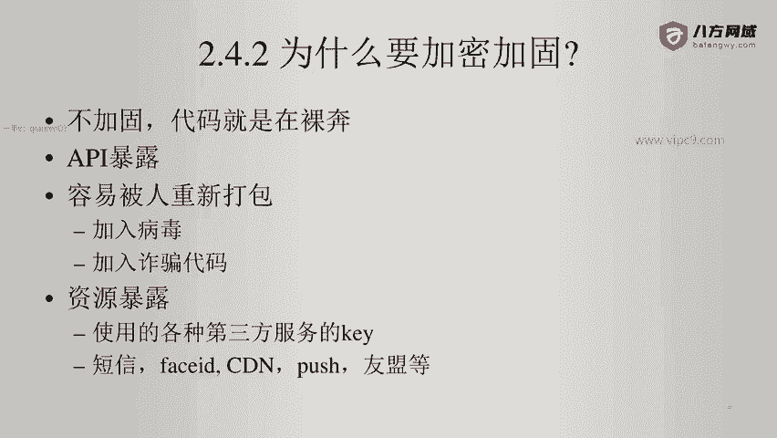
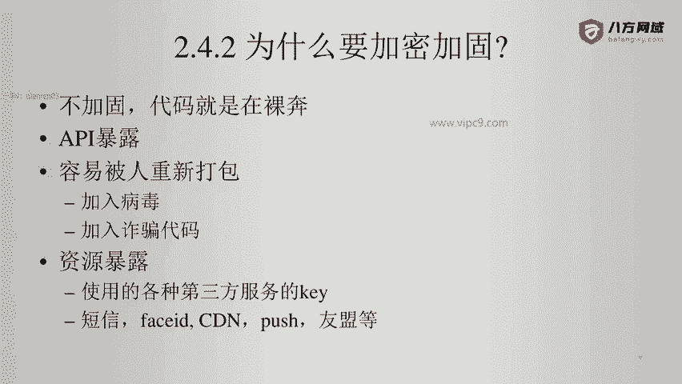
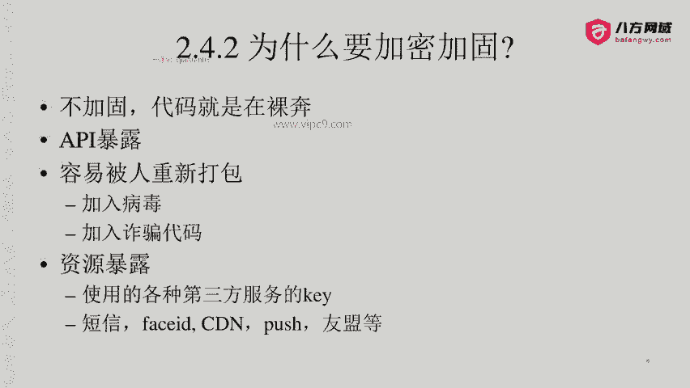
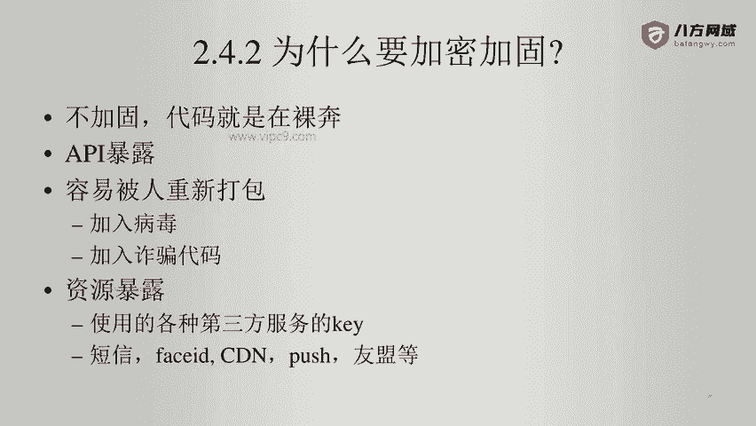

# Android逆向-基础篇 - P28：章节3-21-为什么要加固加密 - 1e0y_s - BV15jhbeCEQk

下面我们看一下为什么要加固加密。

那么不加固我们的代码就是在裸奔啊。首先我们的API是肯定是暴露出去的。

另外呢我们的这个APK是特别容易被人重新打包的。比如说加入一个病毒，加入一些诈骗的代码啊，如果我们的APP里面有用户收款功能。那么这个作恶方，很可能把收款方二维码换成他自己的收款二维码。啊。

再比如说加入一段后门啊，加入一段代码能够读取用户的相册。

把用户的比特币钱包、密钥都传到远程的呃攻击方的服务器啊，所以说这个是非常脆弱的。另外就是造成资源的暴露。比如说凡是我们的一些第三方服务，都会用到一些key。那么这些key如果是放在安卓端。

那么打包的时候啊，就要写进去。包括短信人脸识别。CDN推送有盟统计等等。那么这些都属于资源暴露。

