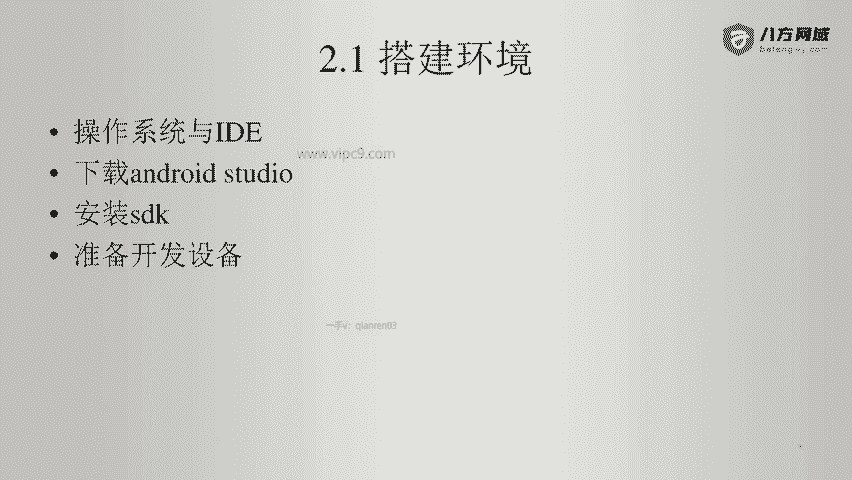
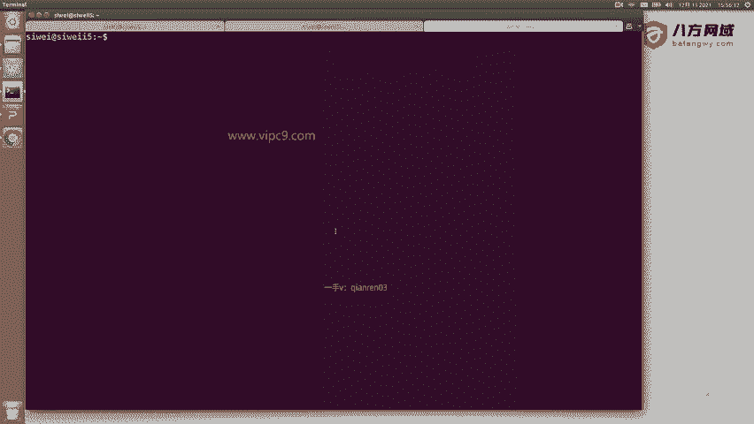
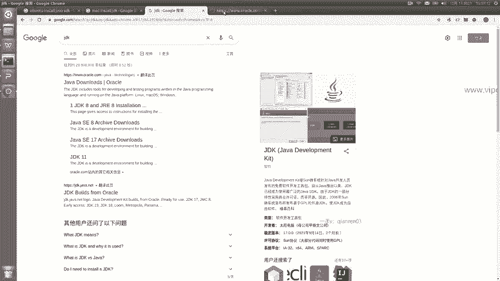
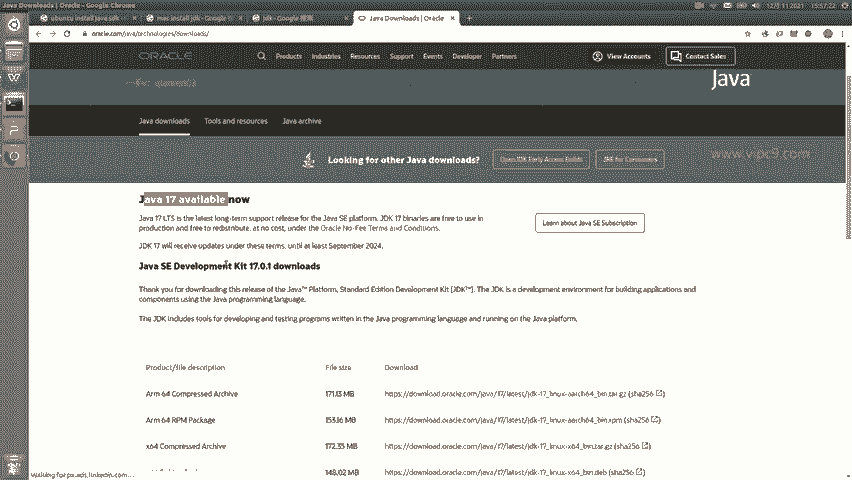
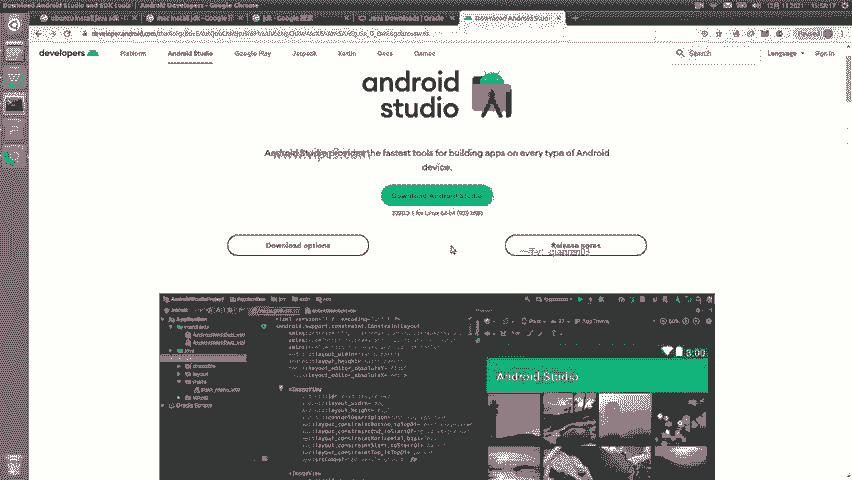
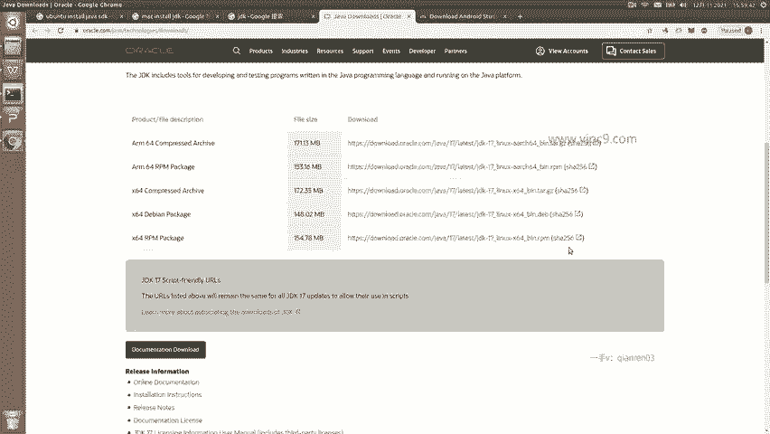

# Android逆向-基础篇 - P2：章节2-1-Linux-mac设置jdk - 1e0y_s - BV15jhbeCEQk

下面我们学习安卓正向。那么在这里呢是一个快速入门，因为我们的课程是安卓逆向。所以在这里我只会快速的让大家领进门来，知道正向如何来开发啊。那么有更多细节的内容，大家遇到问题的时候，要多看官方的文档。好的。

那么下面就是看一下本节的内容。首先，搭建环境。第二，我们会做到一个小demo。第三，我们会对它进行编译。打包。这里还有会用到开发机。第四，我们会做普通发布。也会做一个加密发布。下面我们看一下搭建环境。

首先是操作系统和开发工具啊，那么操作系统呢，windows也可以。麦克也可以，linux也可以啊，那么我这个系统是linux。

啊，我这个是雾班图18啊。

那么在这里。给大家看一下呃，IDE呢我们就是安卓t。那么在做这个事儿之前，我们需要先安装相关的javaSDK啊，也叫JDK。

我们打开google。我们搜索一下，比如说。乌班图下载java SDDK啊，那么现在的这个JDK其实都叫open什么什么什么啊，那么在这里我们可以看到啊，如何在乌班图上面安装。

如果如果各位同学你用的是mike啊，你就可以搜索mikeint JDK啊。如果是windows的话，你也可以一样搜windows。那么我们看一下JDK啊，它一般来说它的下载地址是在官网上。

我们搜索JDK，那么就会给我们引导到。

oracle的官方。然后在这里我们可以看到JDK啊，最新是17。那么我建议大家先不要下载最新的啊，我们下载一个稳定的版本啊，看一下安卓的安卓studio，它要求的是什么版本啊。

所以说我们同时也打开android studio。

搜索一下啊，最上面这个就是那么我们打开它。在这里呢可以看到。这里会自动为我们进行一个。针对不同操作系统的选择。那么在这里可以看到是专门为lininux啊做了一个选择，这里是935兆。

那么在这里也可以查看其他的下载选项和这个发布的内容啊，那么这里的话就不多说了。因为这个呃其实国内的这个环境还是很多的。

那么在这里我们可以看到。可以看到。有针对不同操作系统的，包括windows的m克的啊和这个linux以及chrome。那么在这里，如果各位同学，我估计大家用的都是windows啊。

那么在windows这里呢，我们选择windows这个点EXE的这个文件就可以了啊，这边下载，然后看一下它对JDK有没有什么要求。一般来说，安卓stud对于JDK的要求是不严格的啊。

也就是说它支持的非常好。所以说我们在这里随便下载一个就可以了。那么我建议呢大家下载这个叫LTS有没有看到。也个叫也叫做long term support，就是说长期能够支持的啊，看到没有？

long term support。那么在这里的话呢，我们就下载它就好了。下载完之后啊，我们应该会得到一个。压缩包。那么在官网上，他提供的应该是这么几种。比如说包括。TR包啊，也包括这样的这个。

也包括这样的DEB或者RPM这样的安装包。啊，那么有一个最简单的方式，就是我们下载安装包，给它在本地解压。

