# Android逆向-基础篇 - P30：章节3-23-加密加固的多种方案 - 1e0y_s - BV15jhbeCEQk

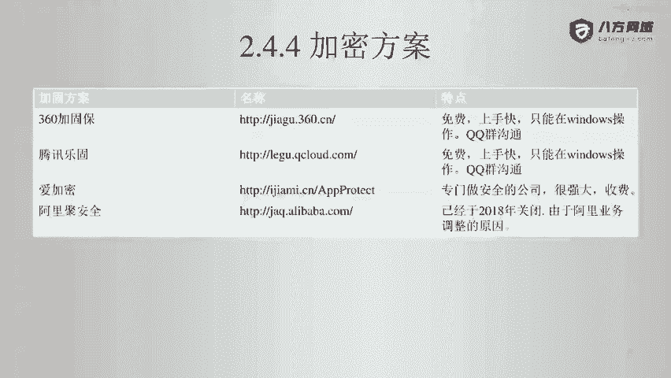

下面我们看一下加密方案。原则上来说，加密方案啊。

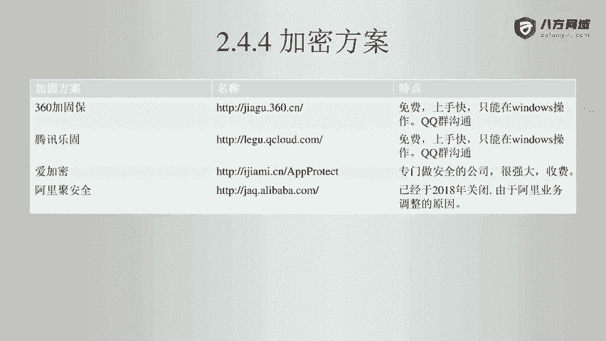

在下面这个表格里面啊，可以看到呃有360加固宝。

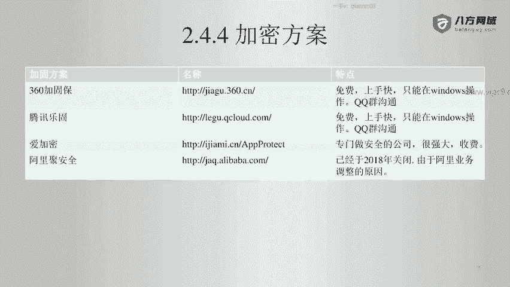

有腾讯乐酷。

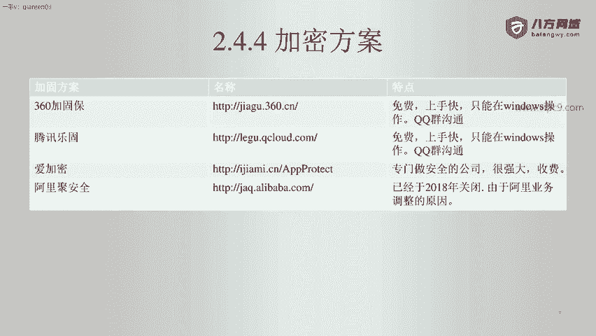

艾加密和阿里居安全。其中呢，阿里居安全是在2018年已经关闭了。

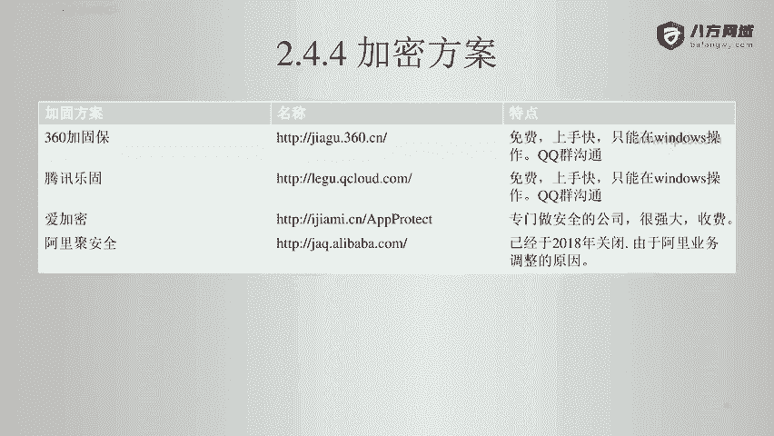

然后被大家用的最多的是360和腾讯。因为这两个都是免费的。

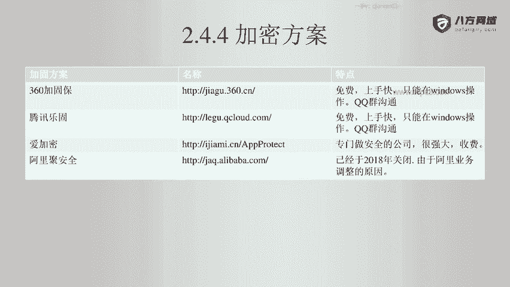

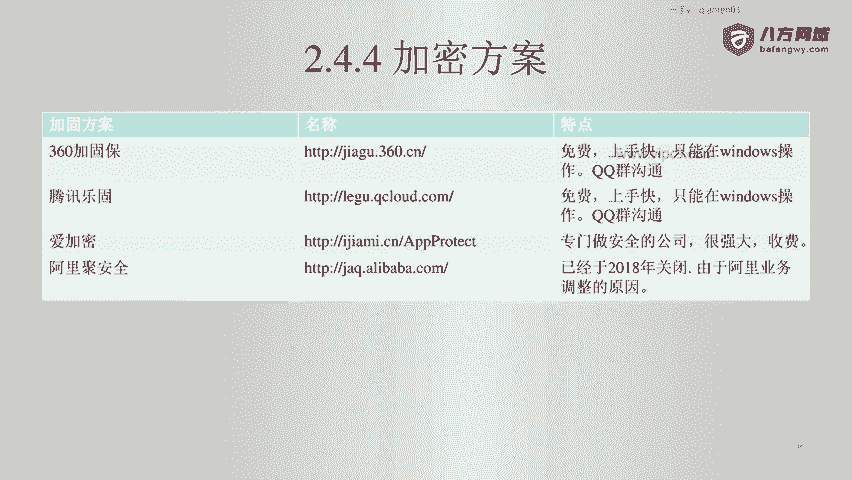

爱加密呢，它是一个商业级的加密啊，所以说比较贵，但是效果呢算是最好的。

对于一般用户来说，如果你的用户量在100万以内，那么用360或者腾讯就已经很好了啊。如果是金融类的项目，比如说手机银行啊，那么用I加密是很不错的一个选择。

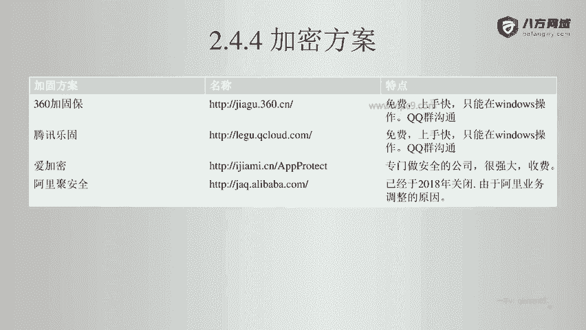

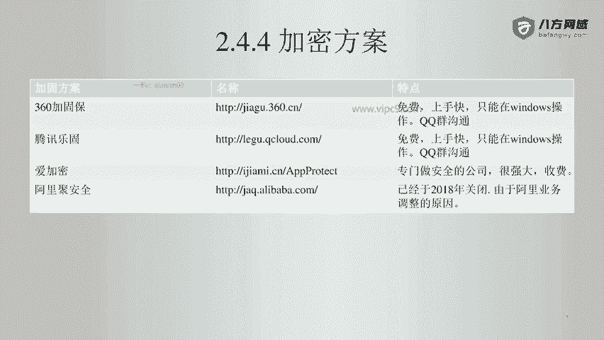

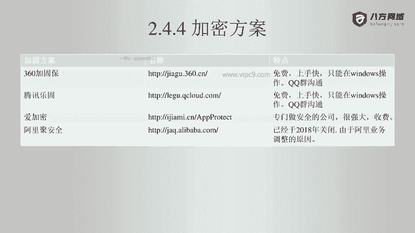

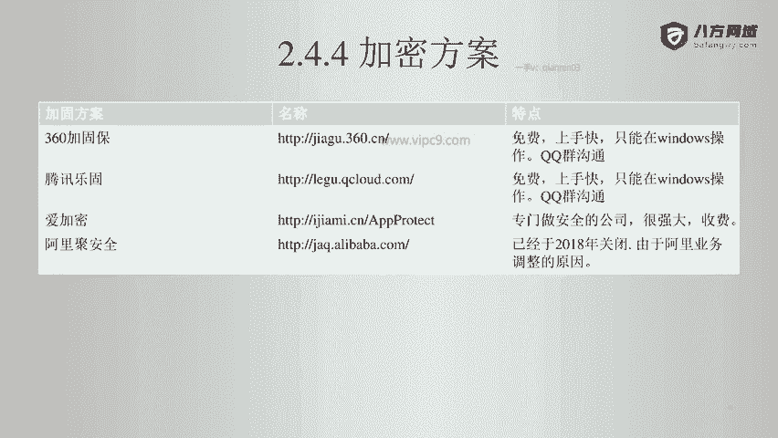

然后在这里需要注意的就是腾讯和360的加密，很有意思，他们只能在windows端进行操作。

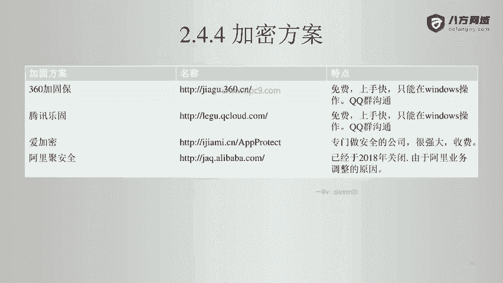

然后呢，沟通呢是只有QQ群。啊。

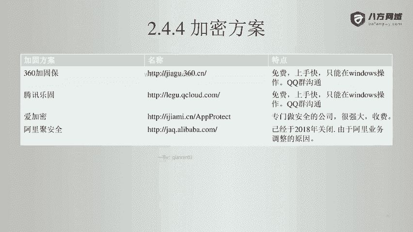