# Android逆向-基础篇 - P31：章节4-1-安卓逆向基础-基本路径&基本用法 - 1e0y_s - BV15jhbeCEQk

下面我们学习第三章安卓逆向基础。经过前两章的学习啊，我们对安卓的正向已经有了一个很好的入门。那么下面我们开始系统的学习安卓逆向。安卓逆向的话，我们可以认为它有两大部分。一部分就是。

基础的逆向一部分是针对于加固后的安卓进行高级的逆向。那么这张我们只学习基础的逆向。首先会学习这个反编译的路径。然后再学习基本的反变译方法。下面我们看一下反编译路径，目前来看是这么四大种。

第一种是从APK转换成smiy。这种路径是用于重新打包的。下面三种是用于反变译的，也就是说把APK最终要获得一个java文件。那么第一个路径就是从APK到dex，再到JR到java。

第二种呢就是ABK到通过frreeder得到dex啊，再得到JR和java。第三种呢就是从APBK直接得到java。那么会根据不同的情况走不同的路径。下面给大家做一个演示啊，基本的反编译方法。

那么我们先看一下之前我们通过打包曾经获得了1个APK文件。

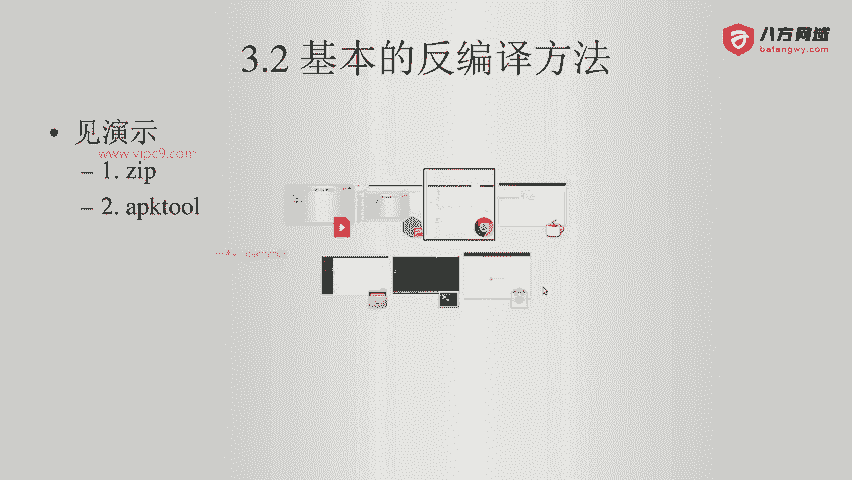

进入到。Test， enjoyed。这个是我们的项目。我们之前曾经打了一个包，叫做。APPrelease点APK文件。大家记住啊，这个APK文件的本质其实是一个zip文件。

我把这个APK文件给它做了一个重命名啊，叫做点zip文件。然后双击打开。就能够看到这个zip文件。是这么多。这边会有它的具体的路径，这边就是名称。

然后我把这个A呃APPrelease点zip解压缩之后呢，就会得到外面的这些内容啊，我给它。呃，放到一个专门的文件夹吧。Unz。放到这里面。那么大家就能够看到。有android manifest文件。

Classes啊 resources。然后上面这三个分别是cotline呢、HTTP3呢啊资源文件呢。coly啊基本是看不出来什么的。这些啊每个文件也就是926byt，这些没有太大的意义。

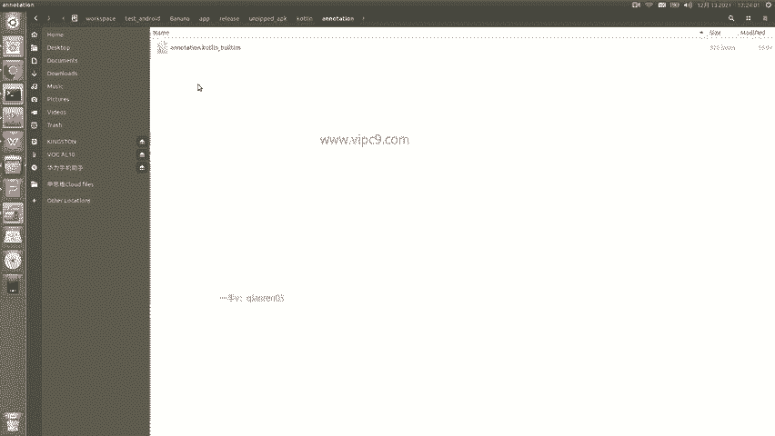

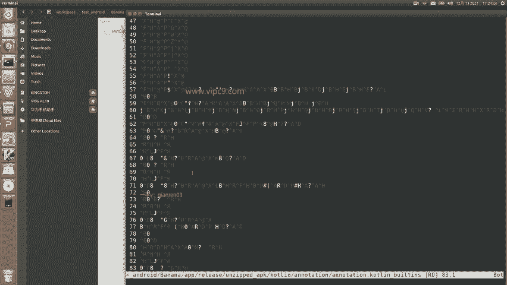

mate in也没有什么意义啊，都是一些基本的配置。OKHTTP3啊，这个是已经打包好的1个GZ文件。IES这个就是我们的一些叉ML图片等等。那么在这里可以看到一些叉ML已经啊。可以看到内容，但是呢。

格式已经进行了转换，或者说它已经有了一部分的压缩或者怎么样。这个呢啊我们了解就好。外面的。按照man啊也是进行了转换。所以说啊看。所以说。这里面得到最重要的就是这个classes点儿DEX。

所以说呢这个路径就是我们。刚才看到的路径2。1，从APK转换成dex。那么，如何走下一步，从dex到JR到java呢？我们可以通过一个工具啊。工具就叫做dex to扎。dex图扎啊。打开第一个就是。

P叉B1988，他应该是我们的啊杭州的啊，杭州的一个兄弟。那么这个兄弟呢，他的这个项目啊目前还是在维护。上个月啊曾经出现过。合计9000人关注。那么在这里我们下载它最新的版本就可以了。

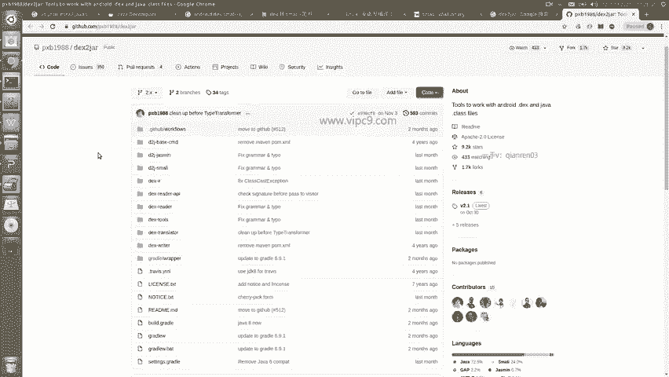

那么在我的本机已经下载好了，下载之后呢，它就是一段。

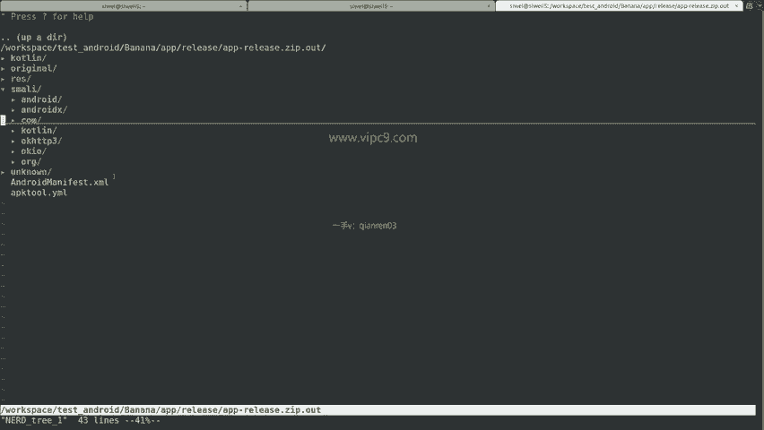

嗯，就是一个命令啊，然后我们把这个命令放到我们的执行路径下就可以。

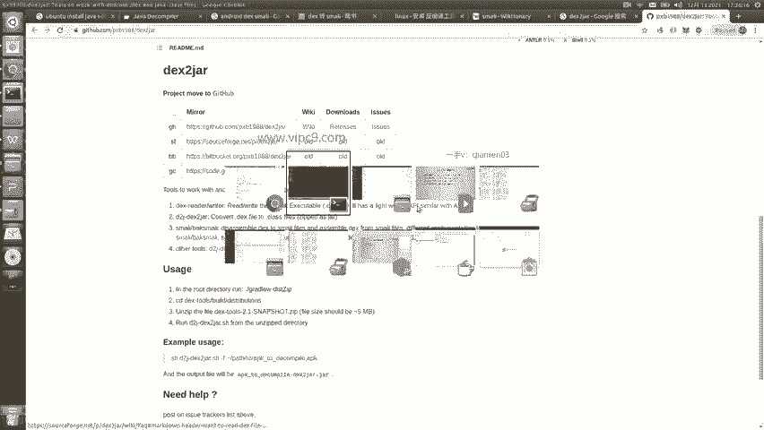

那么在这里。给大家做一个演示啊。进入到刚才的unzip文件夹，这里面不是有这个classes点 decks吗？

我们就可以。嗯。找到对应的命令。那么刚才的这个dex to JR。

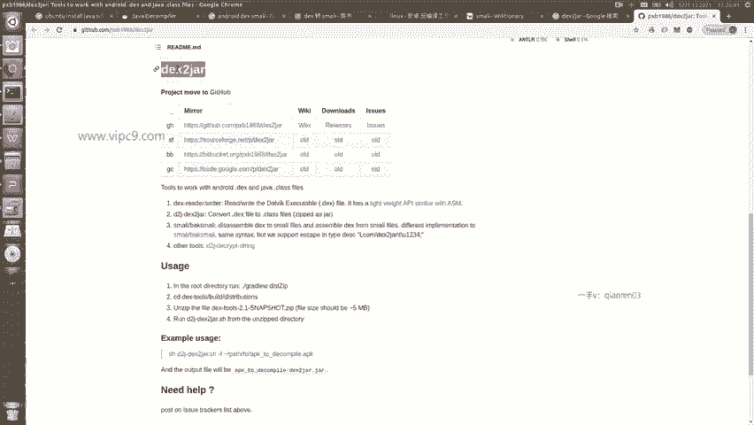

他有一系列的命令啊，就这么多。在这里面呢。最最重要的就是这个啊dex toJR点SH。所以说我们就。2 JR。点SH。回车之后可以看到它的用法是这样的。用法呢。第一个啊叫skip exceptions。

跳过异常，第二个就是输出详细的信息啊。横线F强制执行，这个就是把已有的文件给它覆盖掉。O就是输出。等等等等等等。在这里其实用的参数不多啊。我们直接就是D two jd to JR点XI啊点SH啊。

然后加上这个目标的。classs点 decks看到没有？这里。就已经在执行了。我们等几秒钟。好的，执行好了，已经得到了1个JR文件看一下。在这里。啊。转换之前，dex文件是4。3兆。转换之后是3。6兆。

那么下一个问题。就是这个JR文件，我们应该如何读取它呢？

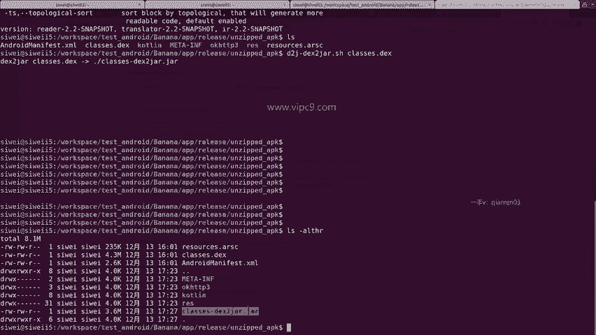

可以用这个啊叫做JDGUI。这个就是JDGUI啊，我们叫做java deccompr。

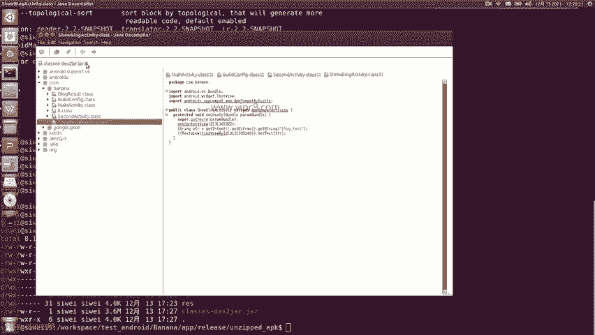

如果搜索的话，就是这里。java的comp点github点儿IO。在这里的话呢分成。JDGUI一个独立的程序，也有这个eclipse的插件。那么我们下载的时候下载这些就好了。包括啊JR版。

linux版苹果和windows版。大家可以根据自己的情况来下载。那么我用的是JR。

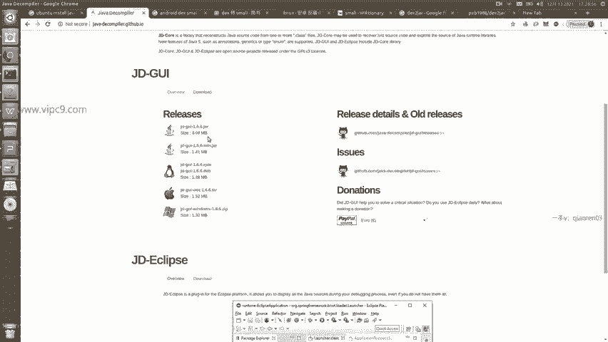

下载之后我们输入。这个命令就好，就java横线JR，然后这个JR文件的绝对度径就可以了。

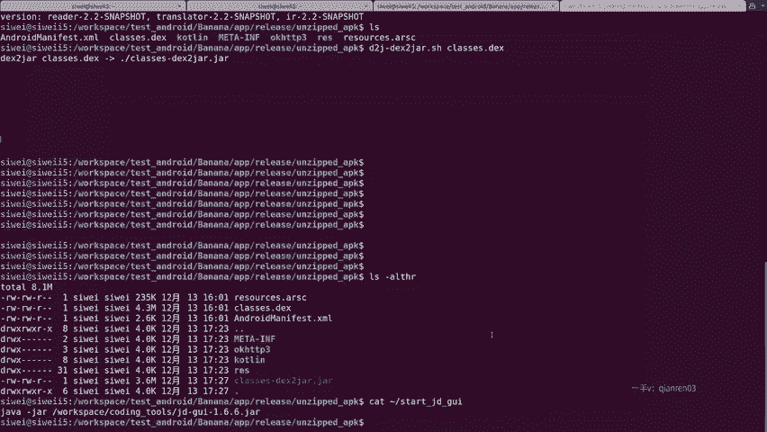

打开之后就长这个样子。第一个是file，就是可以打开哪个文件。然后编辑啊跳转等等。后面这些我们基本用上，只有这个open file。那么在这里的话呢，可以看到。上面这里啊是可以进行选择的。

选择打开哪个目录。比如说我想打开这里面的unzip这个目录，这里面啊就是我们刚才解压缩得到的这个文件。

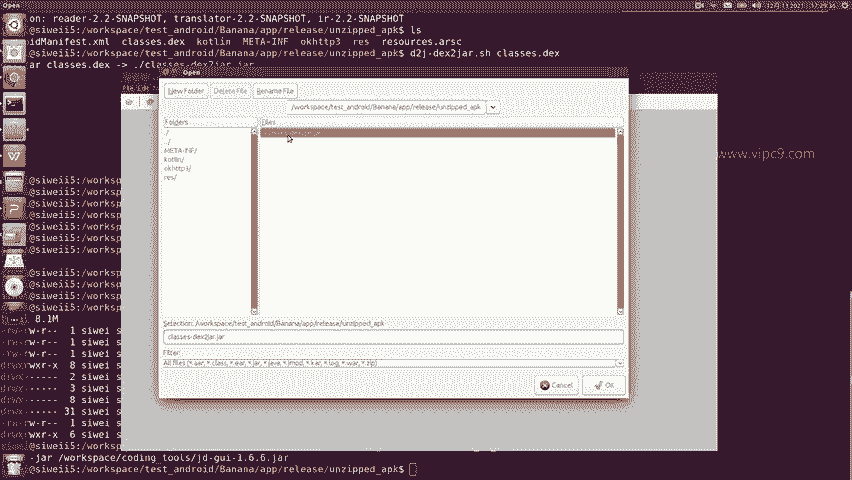

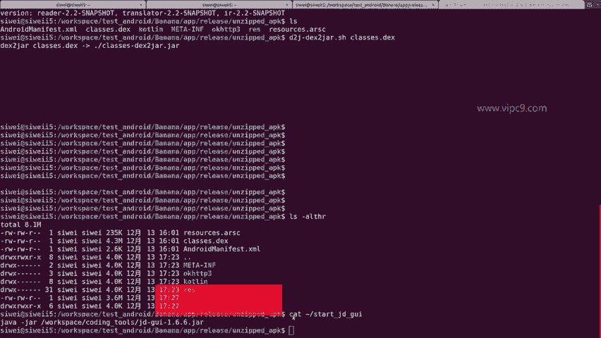

这个文件。双击。那么在这里我们可以看到有安卓自带的包。安卓X啊，这些我们都不用看。coly不用看OKHTTP3这些呃，大家用多了就都不用看。那么点com是最有可能的。因为我们这个包是呃好吧，就正常来说。

我们这个包名字叫做come点banana，对不对啊，基本上点com开头的都是我们。的目标。那么对于首次进行安卓逆向的同学来说，你肯定不知道这个包它的包名是什么，或者说不知道它这个APK的包名是什么。

不要紧啊不要紧。我们后面会说到，那么这里我们通过经验判断就好。或者说我们多点几次就能试出来了。那么在这里可以看到，banana啊已经找到了。ma点class。

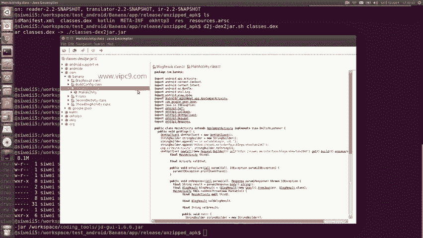

放大一些。看这个是不是跟我们之前的是一样的。create on click和get blocks啊，包括里面的接口的地址都是一模一样。

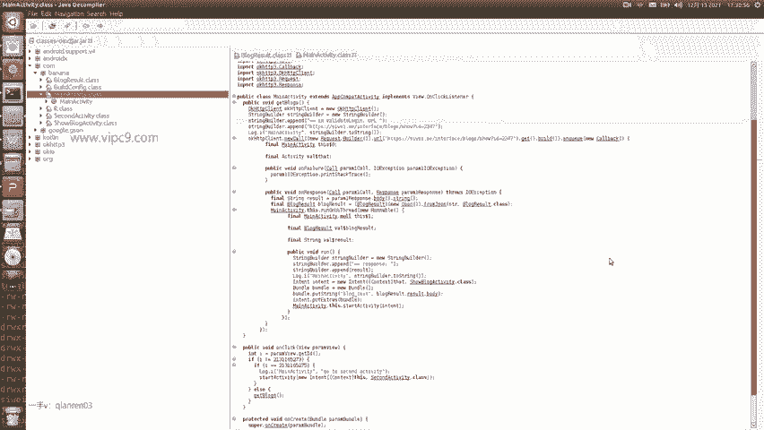

我给大家打开android studioio。

好的，android studioio已经启动了。我们。打开看一下。control加shift加N。Ma activity。嗯，可以看到源代码里面第一个文件，或者说第一个方法是uncreate。啊。

第二个方法是uncl。第三个方法是get blocks。跟。反编译之后的啊方法是能够一一对应的，只不过他们的。出现的顺序是不一样的这是第一个。第二个，原来里面的注释不见了啊，比如说29行的这一行代码。

在这里面是没有的。然后呢可以看到。像这个log点I什么什么什么的，也是能够找到的。只不过前面加上了if if。嗯，那么上面的这个。on click里面是有两个if。那么在这里用的是switch。

这个在逻辑上都是一样的。所以说这个就是。JDGUI它的作用看一下第二个activity。看一下第三个activity。这跟我们的。都是一模一样的。看啊second activity。

找到这里second activityuncluncre。Uncle， uncreate。所以说这个就是我们最简单的安卓逆向。

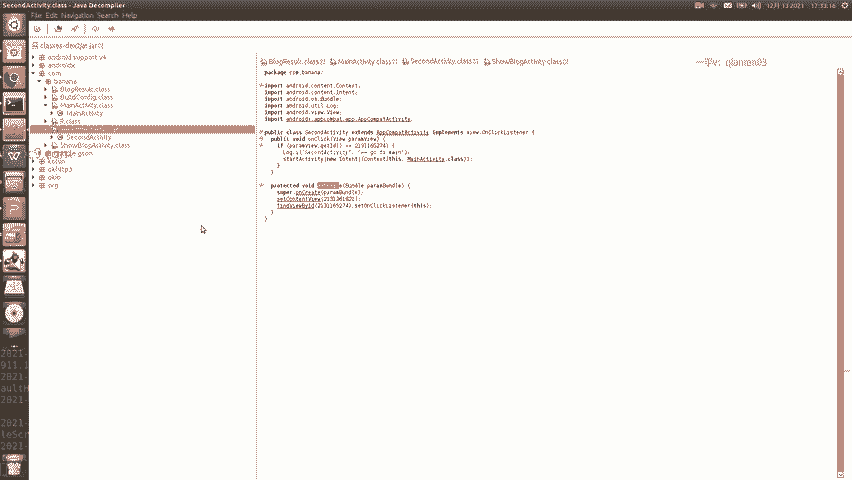