# Android逆向-基础篇 - P32：章节4-2-jd-gui的基本用法 - 1e0y_s - BV15jhbeCEQk

然后这里我跟大家说一下呃，JDGUY它的常见的用法。首先可以通过鼠标的点击来快速跳转方法。比如说这里我们可以看到这行代码是跳转到main activity上。所以说用鼠标左键点一下。

就跳到了这个main activity。

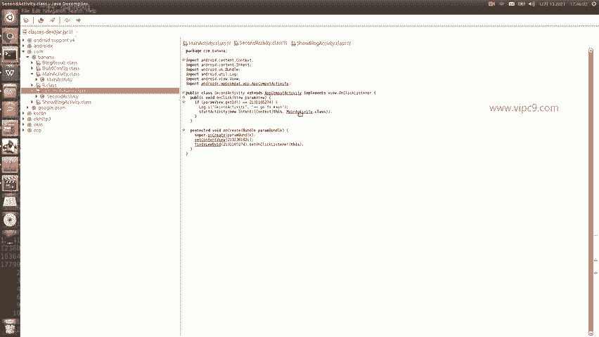

然后比如说这里叫做APPcomp activity。

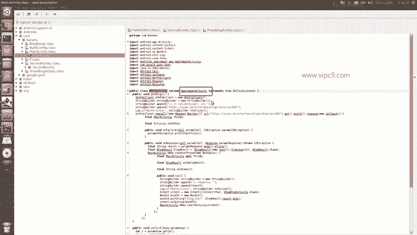

点击。就跳过来了。

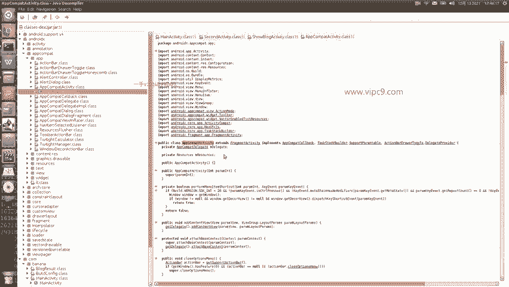

然后我们随便再找一下。AP，P Comp delegate。

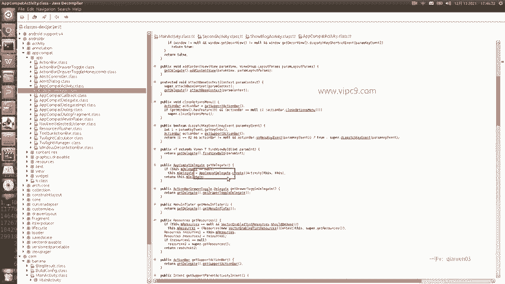

点击嗯就跳过来。所以说通过鼠标点击是能够在不同的class和方法之间进行跳转的。

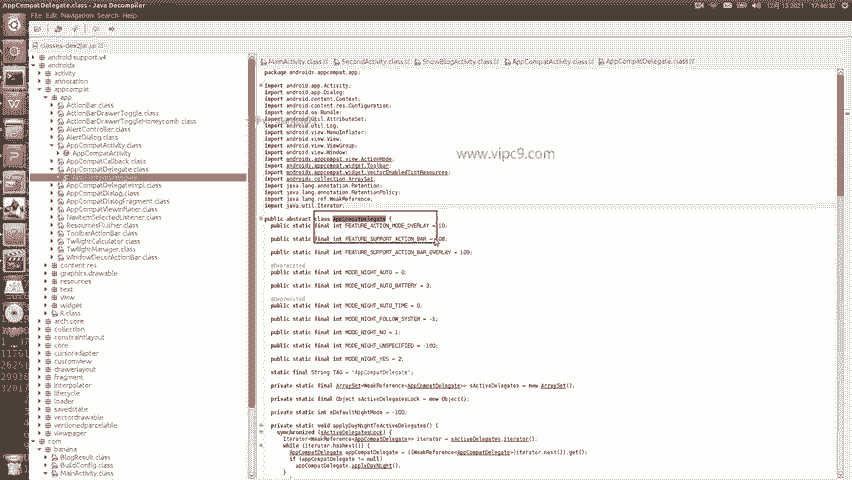

第二个，比如说我们打开的这个类越来越多了啊，应该怎么办呢？

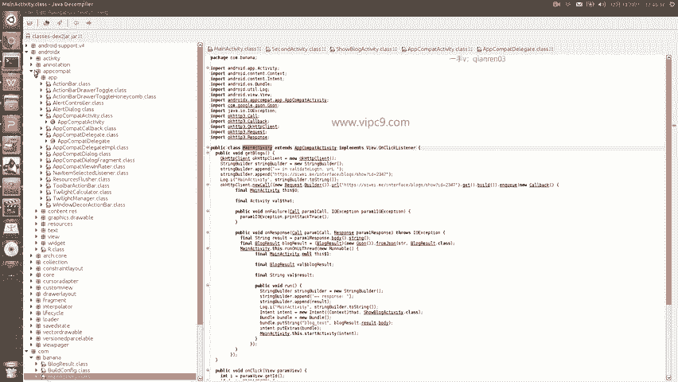

看随便打开打开越来越多越来越多越来越多。那么打开的文件都会集中在上面。

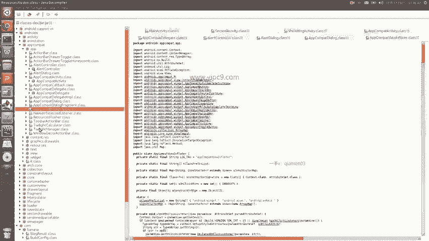

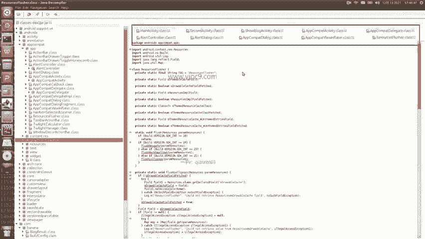

这个时候我们可以点击一下啊，它就是在最前面点右键叫做close others或者close all啊，close others。

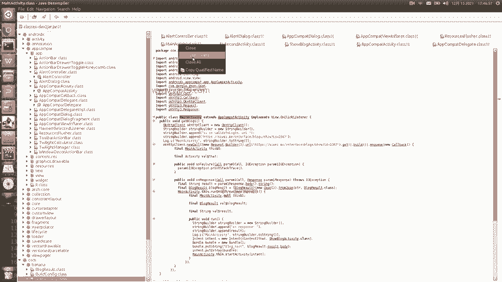

就可以把其他的都给它关掉。然后就是。

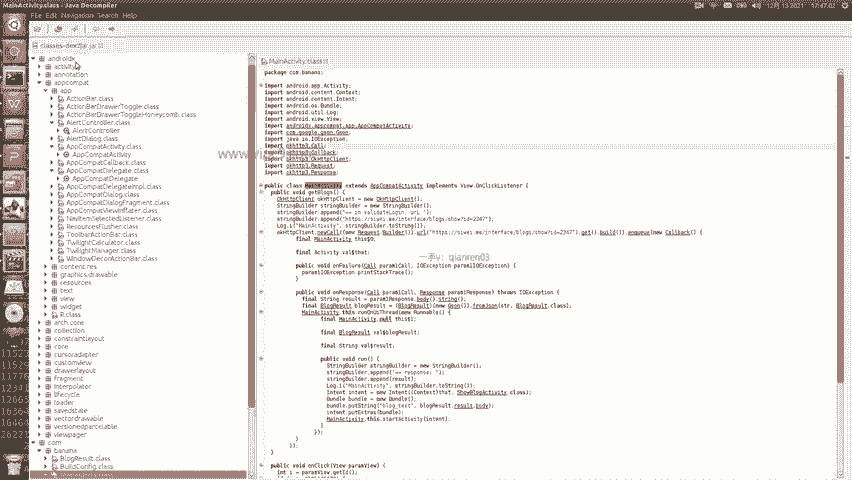

在这里啊我们比如说想给它保存。

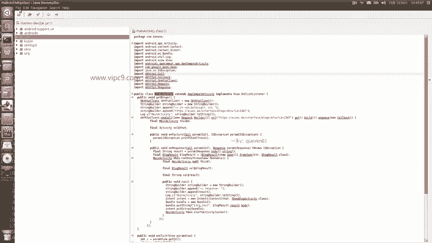

那么一个叫做save啊，save就是保存当前的这个文件。

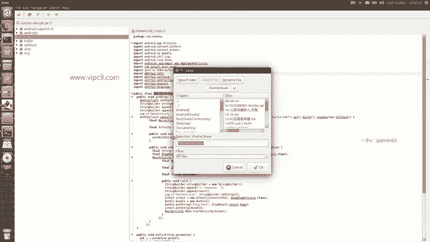

也就是这里。然后也可以。

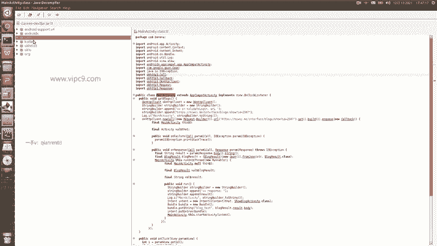

打开。所有的文件，比如说ma class second等等等等啊，我们现在只打开了3个，但是呢在这里是支持我们把左侧的这个里面。

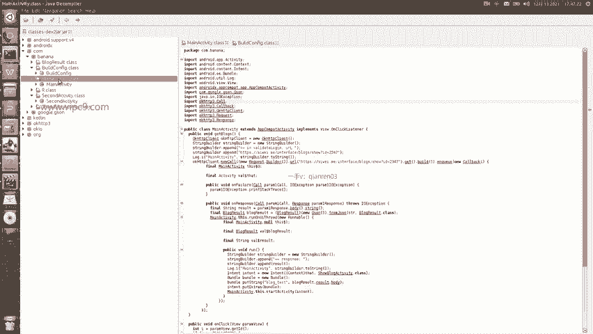

包里面包含的所有的class都导出成java文件的啊，那么点这里，然后叫做save all sources。

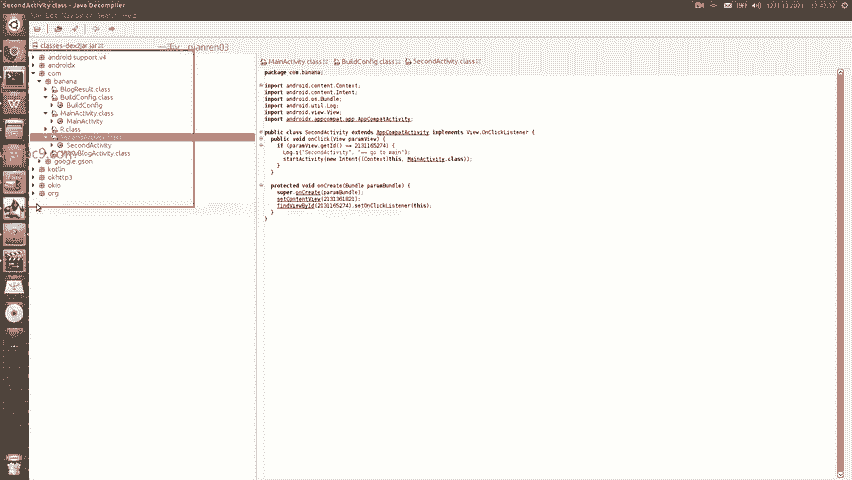

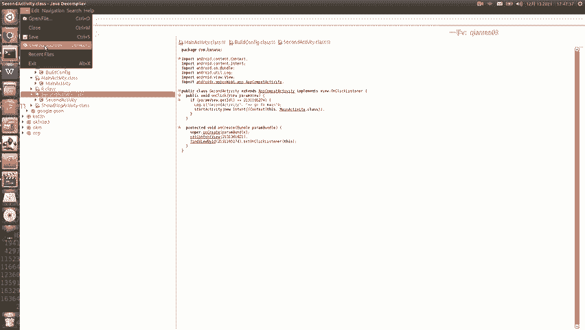

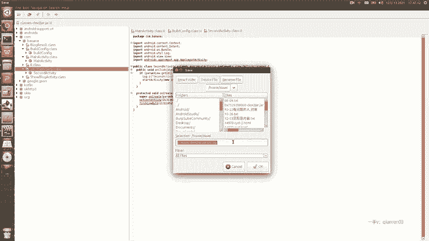

在这里啊选择对应的地址。然后。

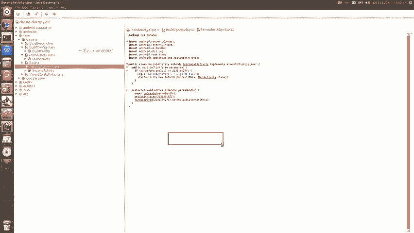

点击回车就可以，保存好之后，会把所有的java文件打成一个包啊，到时候我们找到这个压缩包就可以了。

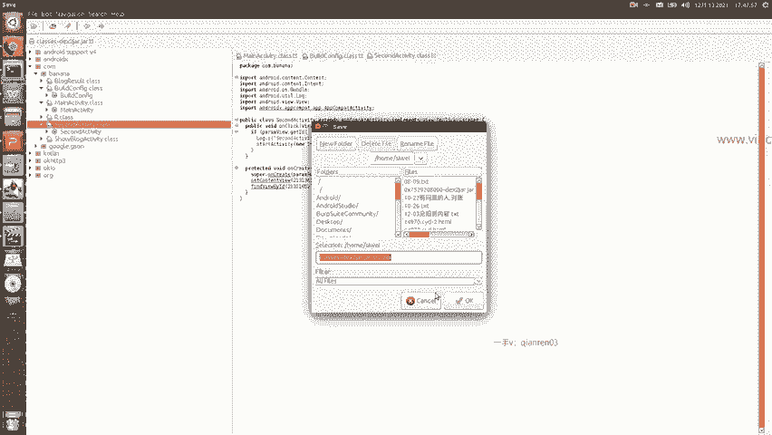

比如说我点。那么在这里就会有这样的进度条啊，等它走到头就行了。由于我们现在是呃大约几十兆吧，需要一定的时间，所以说这里就不演示了。

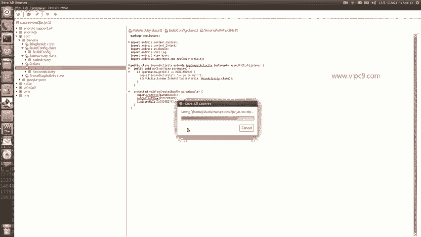