# Android逆向-基础篇 - P33：章节4-3-apk-to-smali路径 - 1e0y_s - BV15jhbeCEQk

下面我们看一下反编译路径，从APK文件。变成smary。这个路径呢是用于重新打包的。

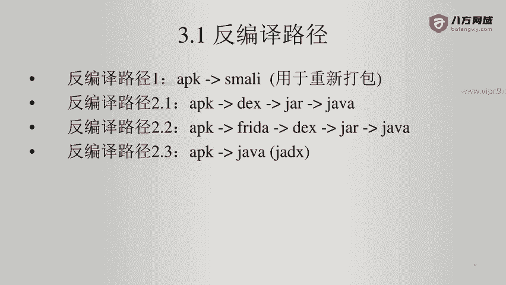

找到这个APK文件啊，他没有做过加固。路径是在上面。这个时候我们通过一个命令。

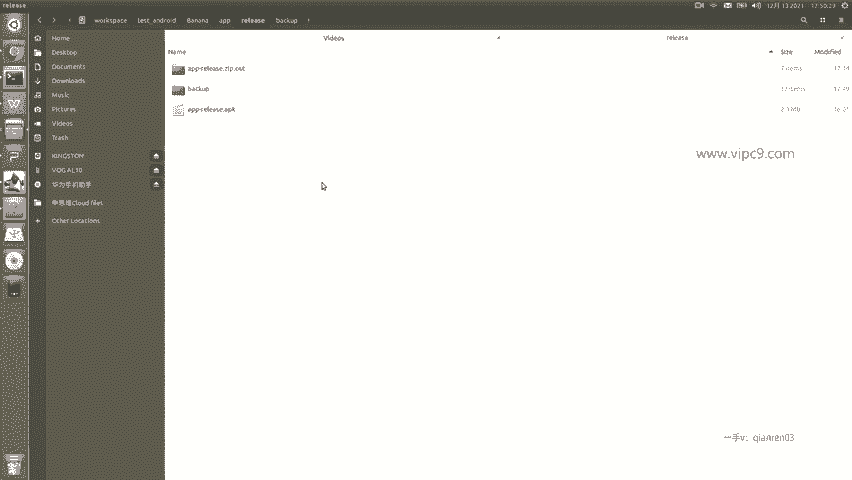

叫做APK two。APK two啊，这个就是用来做反编译的，可以把APK文件转成smarly。看一下他的基本用法啊，他说。2。6。0是一个工具啊，用来。安卓逆向的啊reeng。然后这个是版本啊。

哪年哪年。在这里的话就是用法。那么在这里就是APK two，然后呢加上这个用法if等等或者。D啊，那么这个D就是decode。decode的话就是给它逆向。所以说给大家做一个演示啊。

下面的这个大家回头可以自己再看。看一下，进入到上面的这个文件夹。嗯，好的，是糖啊。在这个文件夹里面。APK在这里了，对不对？我们就APKwo。D啊，然后再加上APPrelease点APK回车。

就可以看到正在加载，然后是正在decoding。资源叉M2，包括这个这个就是把dex文件转成smarly文件。然后我们看一下。那么这个APPrease这个文件夹。就是刚刚生成的文件夹。我们进来看一下。

可以看到有这么多内容，有点多。我们从根目录开看吧。最上面是一个coly。跟我们刚才通过解压缩看到的内容基本是一一致的啊。

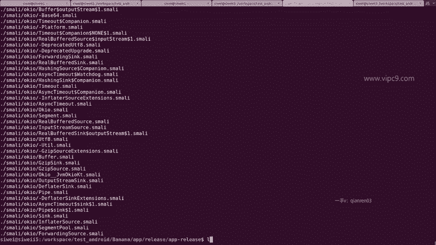

不看了。Original。mettter in这里这些也都是一些配置文件啊，也都不用看了。没有异议。RES。那么这些呢就是resource文件，我们找到layout。找到我们的actactivity。

mainactivity有没有看到这三个文件？这三个文件。啊，打开。嗯。有没有发现这三个文件它已经很完整的给我们逆向出来了。对比一下我们的原文件。是原文件啊，有button buttonbut都是一样。

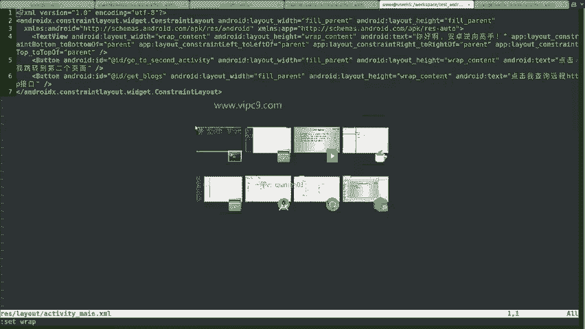

看一下。to一个button。在这边。Second。Aboutten。内容都是一样的，只不过反编译之后嗯，回车换行没有了。

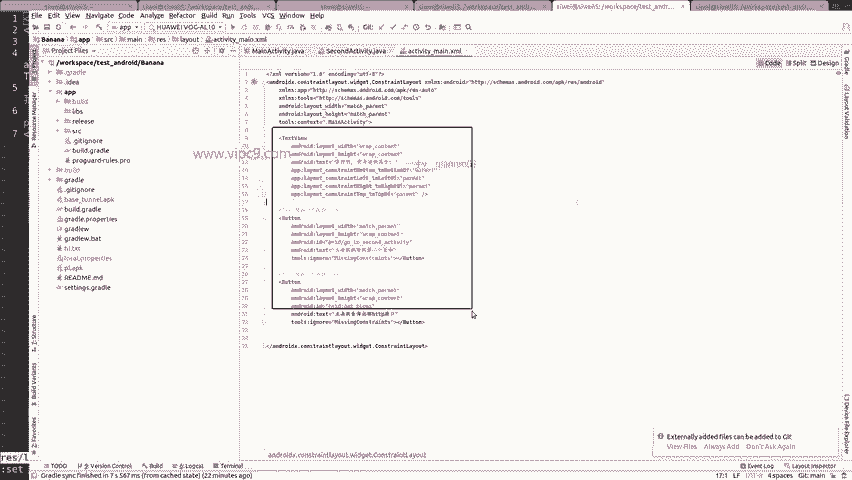

资源文件看完了。关掉。这里就是smarly啊，等一下我们再看。看一下按照的man这个资源文件啊，一个activity，2个3个。

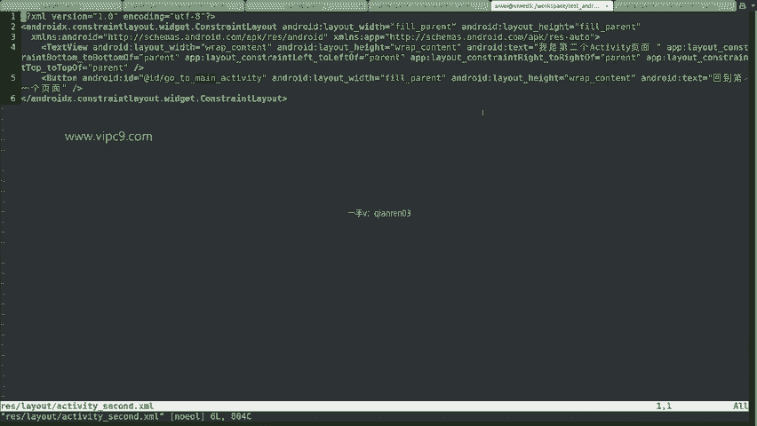

跟我们源代码里面的是一模一样的。啊。三个activity，对不对？

所以说这个就是对于资源文件的编译。然后注意到这个smarly文件夹。在这里的话呢。Come， banana。啊，比如说叫ma activitymarly。

这个就是对应了我们刚才看到的main activity。

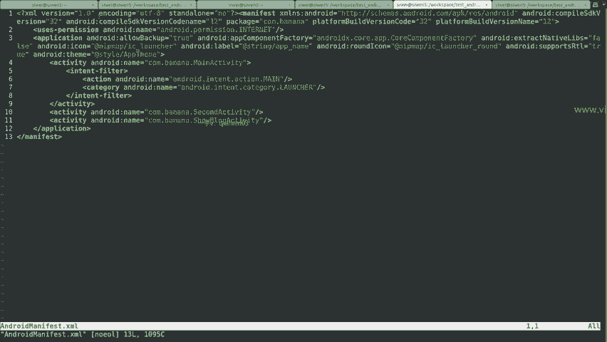

一共是。这么几个。函数啊，那么这是override。好吧，用这个视图来看吧，uncreate。找一下。On create。

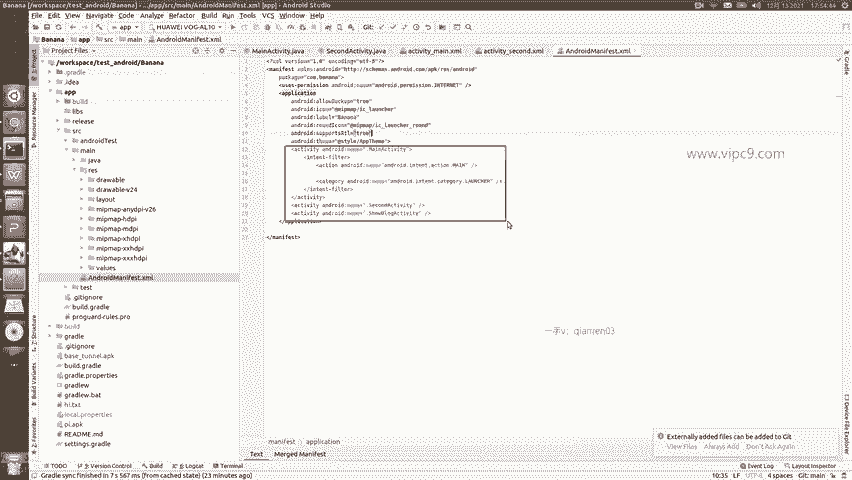

131行这个就是。uncreate函数。顶部的这个get blocks。就是。这个get blocks。

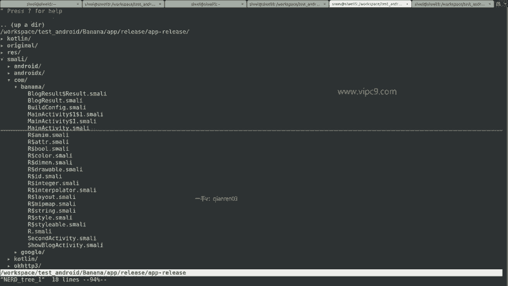

所以说可以看到。smarly文件跟我们的java文件是一一对应的。那么这个smar里文件总共多少行，总共161行。然后里面的代码比较晦涩，难懂啊，像这种充满了go to这样的语句啊，if等等等等。

这些都是呃。

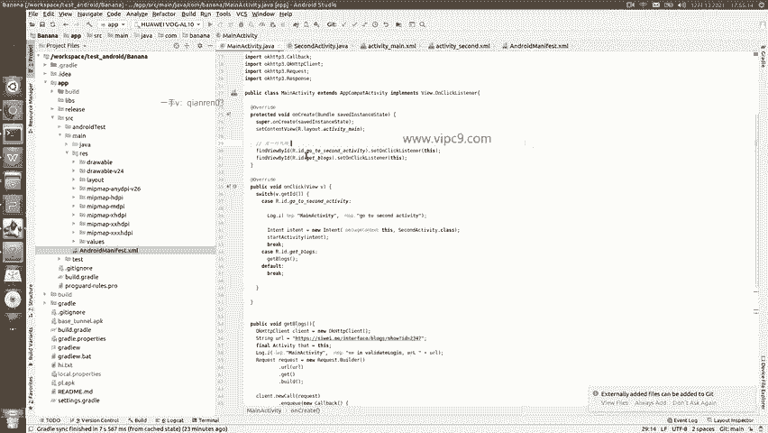

类似于一种会编语言一样的编程语言。那么目前来看，smarty是呃没有一个特别合适的调试的方法的啊，只能通过重新打包，再看行不行。这个我们后续再说。

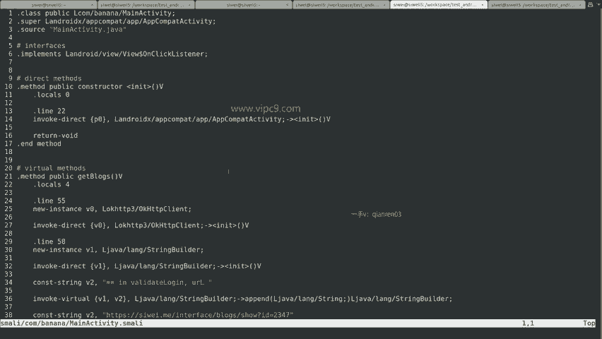

总之呢这个路径就是通过。

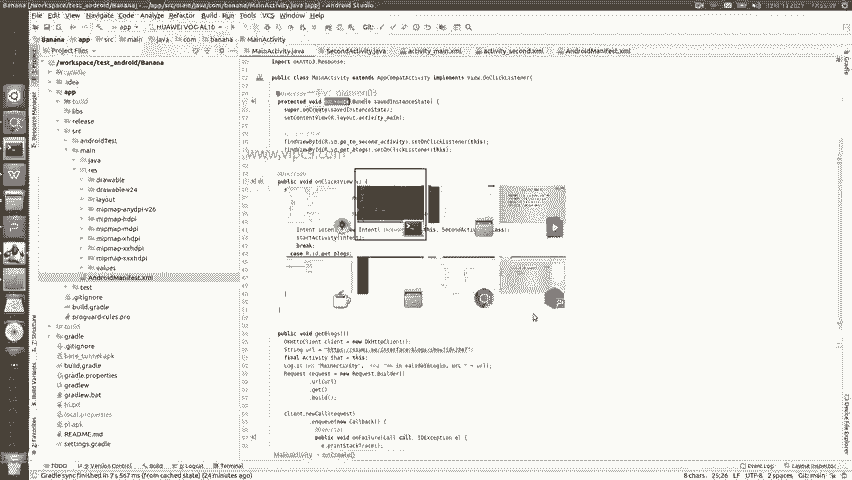

APK two啊，从APK转成smarly用于重新打包。然后这里是一个ymo文件。列出来APK文件的。名字是什么？然后在这里它的SDK版本啊最低是28，最高是啊目标是32等等等等。所以说这个就是。

这个路径的情况。

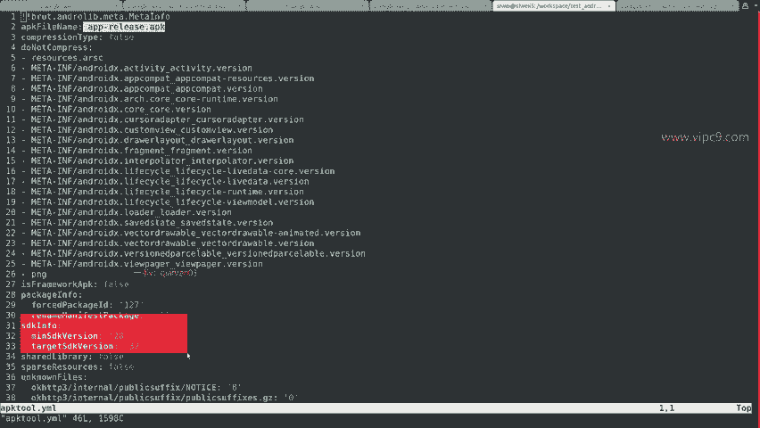