# Android逆向-基础篇 - P34：章节5-1-burpsuite的安装与基本使用 - 1e0y_s - BV15jhbeCEQk

我们学习第四章安卓抓包与高级hick方法。分成两大块内容。第一块是burp suit抓包工具的基本使用。第2块是抓HTTPS的内容。先看一下第一节啊，bb suit。burp suit它是一个抓包工具。

啊，跟charles。fedel是一样的。那么。具体用哪个，大家可以凭喜好啊，比如说charles它是一个收费的。那么我们用bp suit这个免费的就挺好。当然了，burp suit。它分成免费的。

也分成商用的啊，这个看大家的条件。

看一下它的官方网站吧。verb suit是在这里。打开第一个叫做。posts ser点net，这个就是它的网址。是这个是这个公司的一个产品。

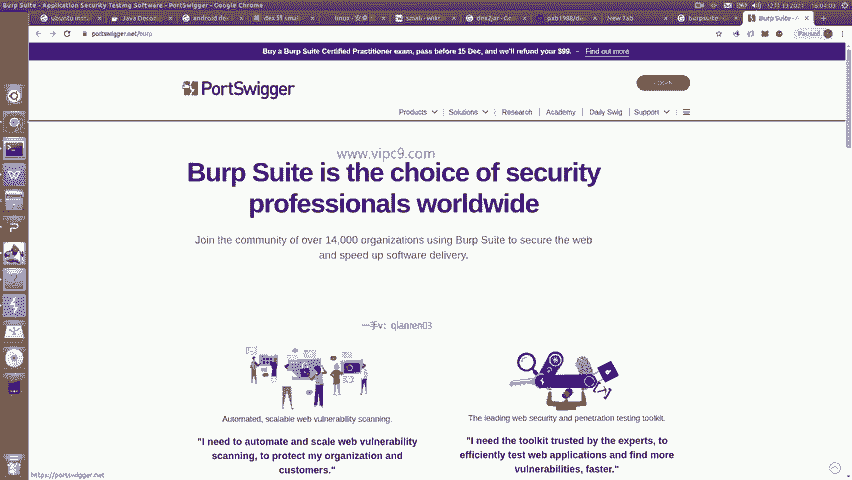

在这里的话，我们就可以查看它的官方网站，然后找到下载。

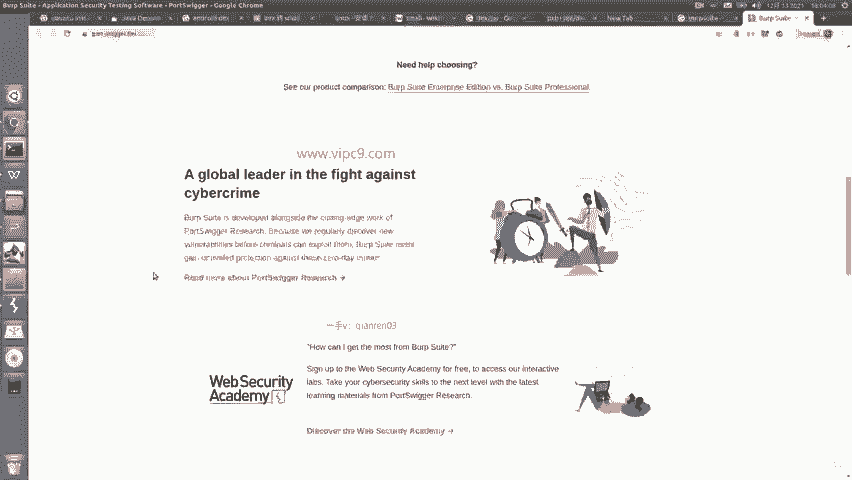

比如说products啊，那么在这里的话可以看到它有三个版本，一个是企业版。一个是专业版，一个是社区版。那么社区版的话就是免费版。

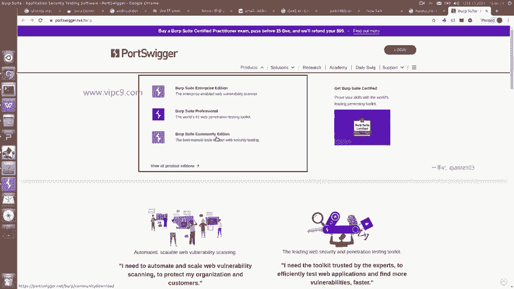

在这里大家就可以自行下载。下载的时候呢。可以根据不同的操作系统来。

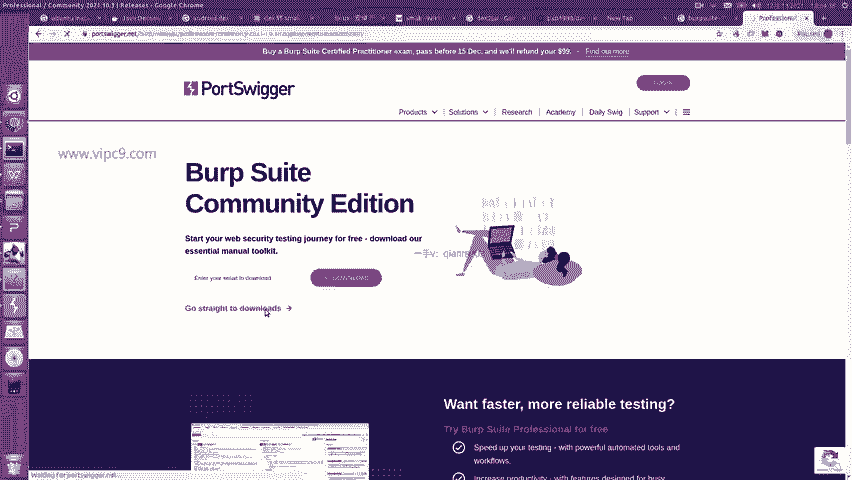

比如说我这个它已经检测出来了啊，我是linux。也可以选择mikewin或者JR。

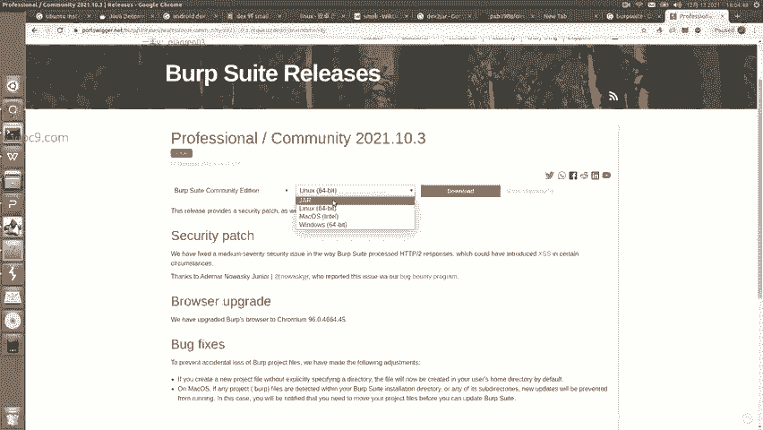

这么一看，这个工具是通过java来写的。

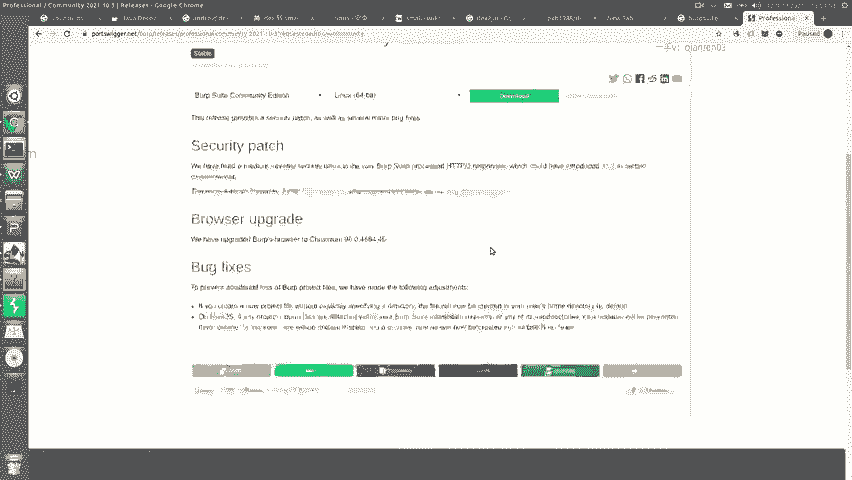

下载安装，这个我就不说了。那么说一下它的基本用法。

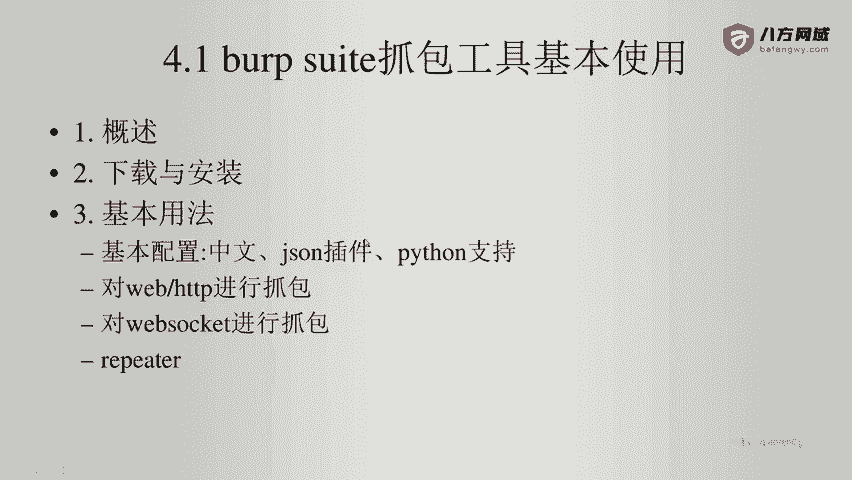

那么这个工具大家有一点要记住啊，就是呃。

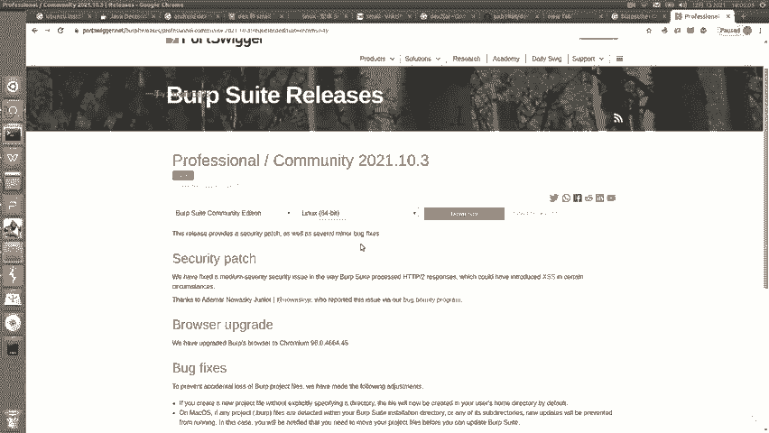

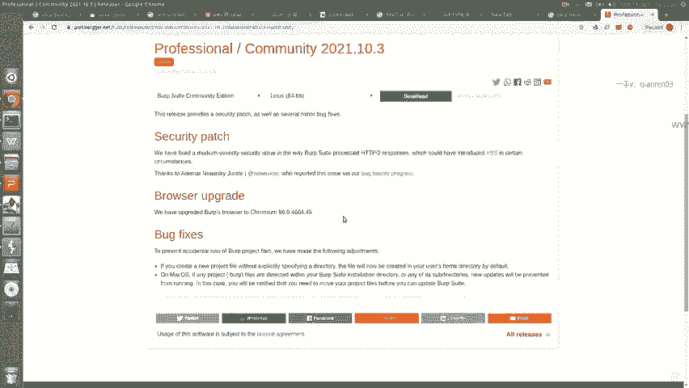

安装之前是需要我们安装java环境的。那么java环境的话，一般来说它会有一个对应的版本号啊。

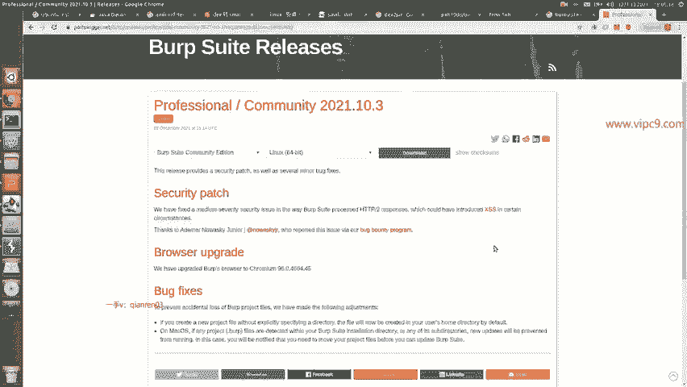

在这里大家注意一点就可以，就JDK一定要是十4这个版本，然后加36小版本。才能够安装verb suit pro。如果用JDK8的话是不行的，版本太低了。如果用JDK17的话也不行，版本太高了。好的。

那么我们给它运行起来跑一下，我这个是社区版免费版了。那么每次打开都会让我们做一个之前配置文件的选择。这里不选了，然后这个也不选了。然后呢，这个界面我们就进来了啊，英语不好的同学可以给它转换成中文。

在这里的话呢，我说一下几个基本用法。

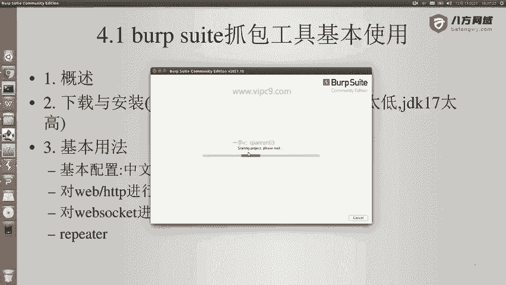

那么先看一下它对于呃HTTP的抓包和配置吧。在这里我们需要先做一个设置。看到这个proxy了吗？intercept is on啊，这个呢先给它关掉啊，因为有了这个东西的话。

我们通过客户端来查看是看不了的。然后我们点击这个HTTP historyistory。这里显示的就是我们抓到的什么包。web socket historyory就是显示的web socket的抓包。

Options。这里。就是一些。选项。比如说现在这个。p suit在本机的地址是17。0。0。1，冒号8080。我可以给他改一下这个地址。那么。在这里点击all interfaces。

然后比如说叫8888吧。8888。这样的话。就会像所有局域网，就是本机所在的局域网都开放8888这个端口。然后怎么用代理呢？比如说打开浏览器。找到。你的插件。或者如果你用火壶就没有用这种插件的话呢。

你可以进行配置。那么在这里。我可以找一个，比如说这个叫proxy。端口号8888。这里啊用的方法是HTTP的带。第样呢，加打了一个勾，这是否为所有其他做代理？啊，我这里用的这个插件叫做。

Switch his shop。其实这个插件也有名字叫做欧米。我先给它保存吧。我们打开firefox。在firefox里面啊，我们点击。I dance。在这里输入。应该是叫extensions啊。

More兔。不是这个啊。点击菜单。然后有一个叫做扩展。点击ss在底部有一个叫扩展和主题啊，这个在不同的操作系统看起来是有一点点不同的。那么在这里的话，大家输入这个欧米ga。就能够得到这个差件。

用这个插件来做转换是最快的。点击就能够看到啊，到时候我们给它安装就可以了。安装好之后它就是这个样子。好的，那么我把这个fire fox先给它关掉。然后回到刚才的谷歌。在这里给他改一个名字。

你说这个就叫做。Bb suit， proxy。跑在8888端口。Save。然后这个时候我打开思维点密，这个就是我的个人网站。

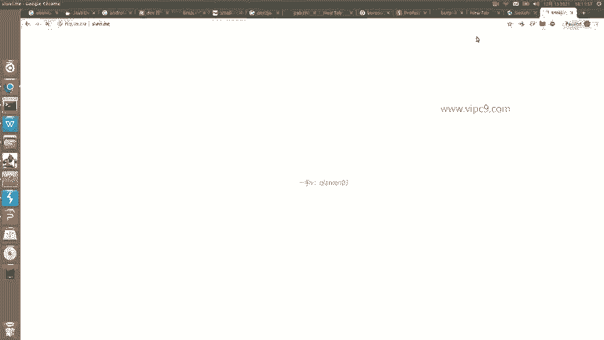

这个时候网页走的。好，需要在这这里进行选择啊。选择啊在这里已经选择好了。那么用的就是bb suit，然后灰车。

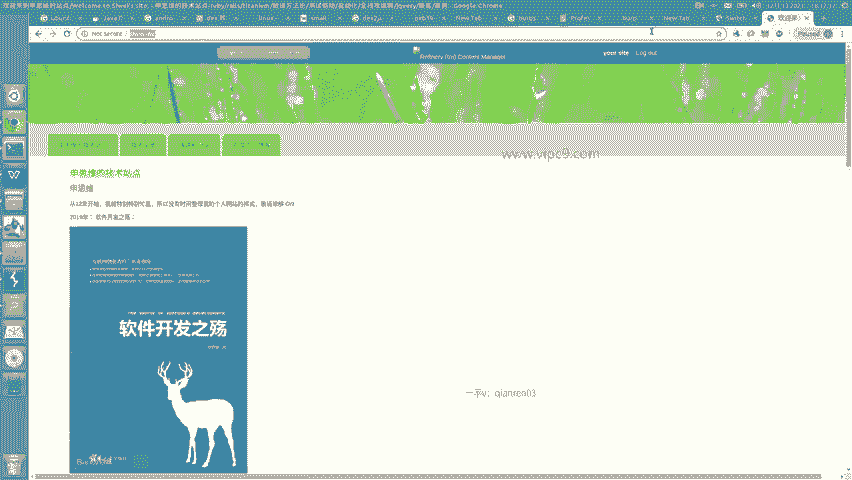

这个页面打开了，对不对？回到。这里。点击HTTP historyistory。大家是不是看到了？这里已经出现了。出现了这里是思维点密。访问了这个请求。然后呢，有点奇怪，对不对？

在这里为什么只看到了一个请求啊，正常来说，在这个页面上。访问一次是有很多的这个资源的。我再刷新一下。看包括HTML页面，包括PNG图片，包括CSS。那么这里的话。

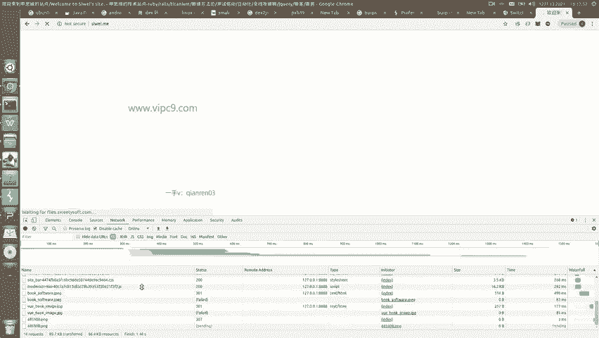

这边是没有看到的。

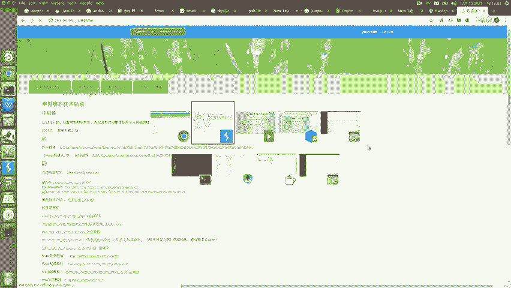

必须怎么样呢？必须有个叫做收 all。记住这一点啊，叫做收 out。把它给打开。P。这样的话，所有的过程才能够都看完整。然后点击右键。Clear history。啊，还有数啊数。整个删掉。

所以说我们再来一遍。

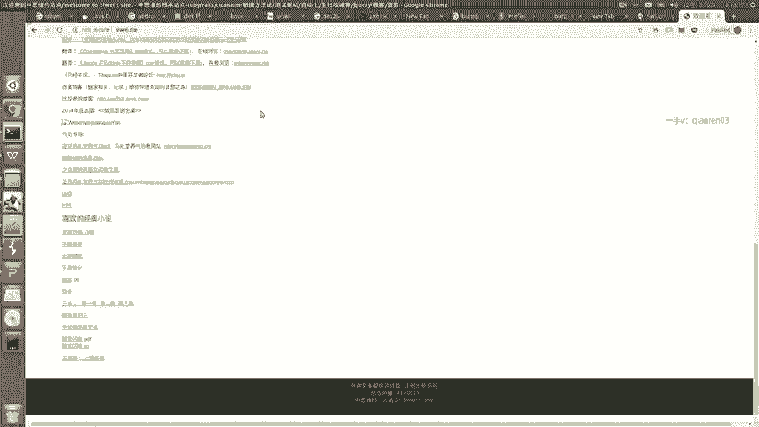

刷新。等待。

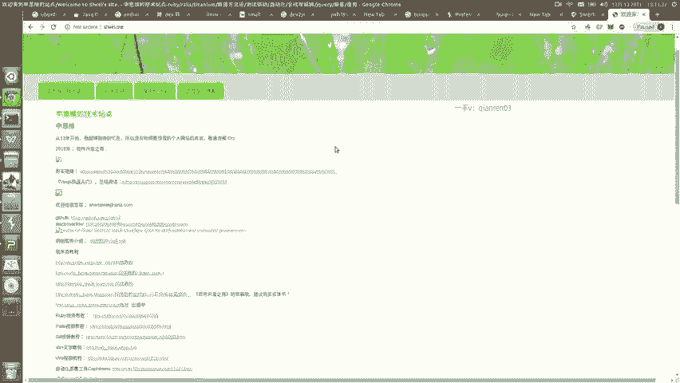

然后在这边。就能够看到。15号。哦，我知道了，在这里的话，我需要对它进行ctrl加F强制刷新。在这边才会JS和CSS才能出现，否则的话第一次就会给缓存住。那么这个呢就是它的基本用法。

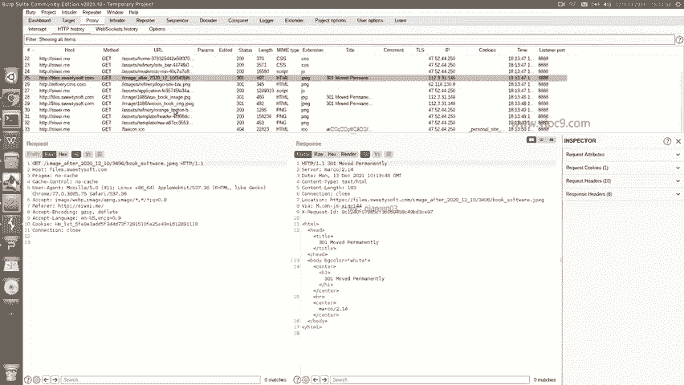