# Android逆向-基础篇 - P35：章节5-2-burpsuite的基本配置 - 1e0y_s - BV15jhbeCEQk

下面说一下它的基本配置啊，显示中文jason插件和python的支持。那么显示中文的话，默认它是对抓取过来的jason。是存在两个问题，第一个是不显示中文，第二个没有办法对jason进行格式化。

所以说我们需要找到右上角的这个user options。用户选项。这里front啊改成中文字体就可以了。比如说我在这里点击新送啊，sim song。这里。这个。就会显示中文了。这是第一点。第二点。

我们需要对它安装一些插件。插件的话呢，我们在这里叫做exendder。在这里点击。然后可以看到可以安装java的插件，pyython的插件和ruby的插件。

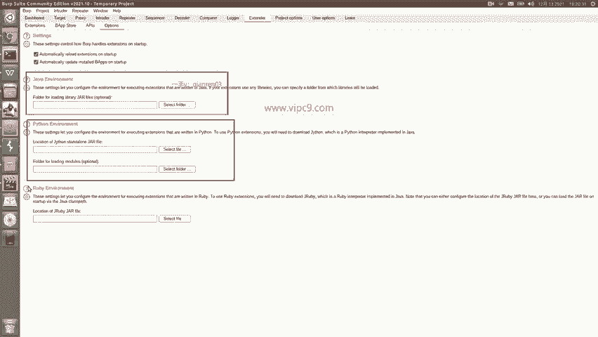

那么。我搜索了一下哈。

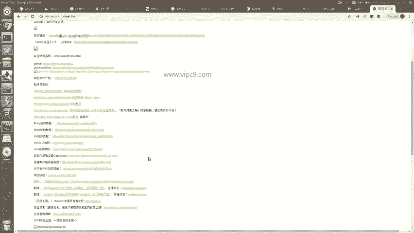

叫做。B pursuit。jason for就是格式化。jason。嗯。这里我用的是。本机的。那么通过我的搜索啊，我就搜到了一个组件叫for jason。

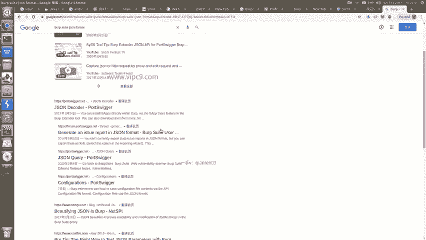

那么刚才已经下载好了，安装的话怎么安装呢？需要先安装python环境。那么在这里我先选择文件。可以看到啊，在这里。对应的文件是一个。格式化的是1个PY文件，然后呢对应的呃这就需要一个python环境。

那么pyython环境的话，我们就需要让verb suit来支持python。所以说在这里安装了这个文件，大家可以随便到网上去搜索。这样就可以了。然后我们再点击extensions。在这里点击艾。

然后呢选择它的类型叫做python。选择文件就是就是这个文件。双击。啊，后面两个都不用动啊，standard output output标准是把内容输出在哪啊，那么都给它输出到界面上。点击next。

看他正在加载。好的，现在已经加载完毕了。output是这个，他说success。那么这个时候。verbsuit就支持显示中文，显示jason。

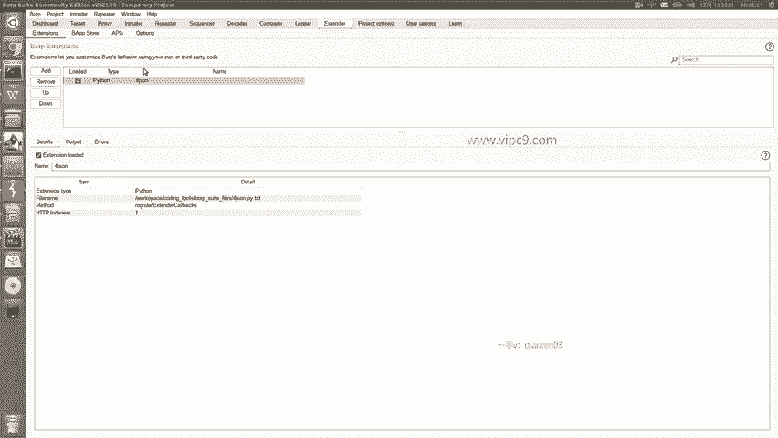

然后这里面有一个比较有意思的地方。就是说我们可以对请求进行重放。比如说在这里。比如说在这里啊。把它重放一下。选择send to repeatpeer。可以看到上面这几块啊。

包括呃inruderrepeer sequence和 decoder等等等等等等。那么上面这些啊用的最多的就是repeater，repeater就能够把我们刚才抓到的接口啊拉过来，然后重新发起请求。

在这里就是。对应的各种参数，cookie的 sessionession呢。我们的路径啊等等等等。那么比如说仍然是这个首页，我点击send。那么这个时候就可以看到这个response这个返回了。

那么我们可以对它做一点点修改。怎么修改呢？点击proxy。

看到左上角的intercept吗？点击现在这里是不拦截的啊，intercept is off关闭的。给它变成on。然后切换到刚才的8888。

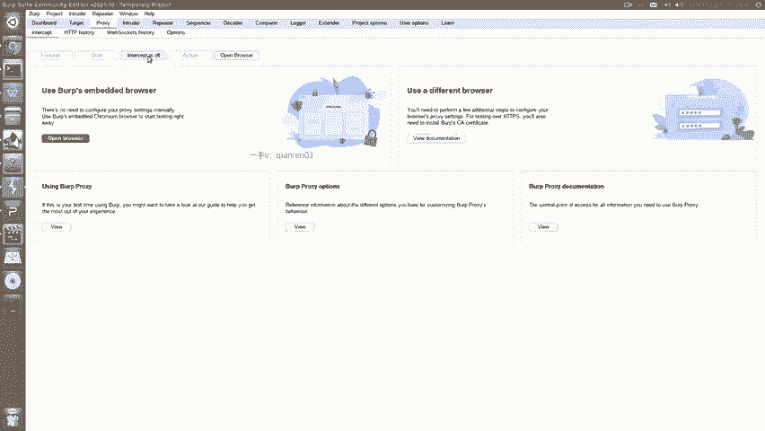

然后打开思维点儿。

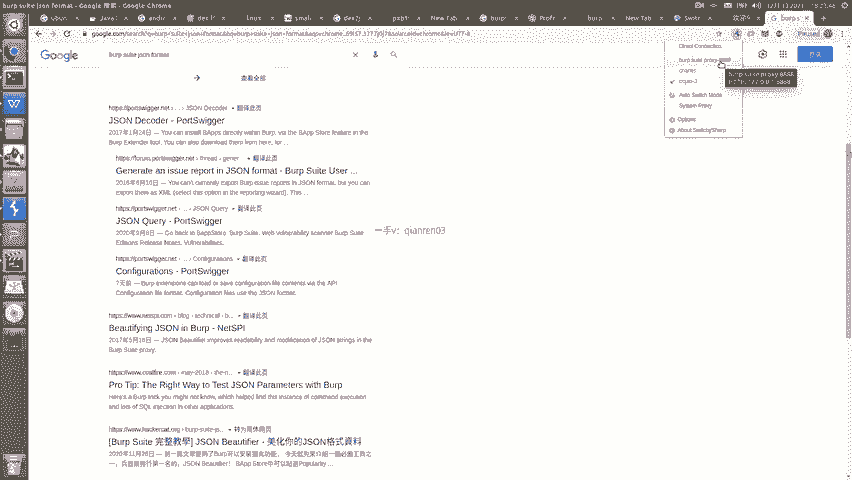

me回车。可以看到这里浏览器在不停的转。其实这个时候呢，bb suit看告诉我们说已经得到了这个请求，问我们是转发还是jo啊，然后呢我们就可以看一下啊，应该怎么做。那么在这里的话呢。

我们就选择转发forward。

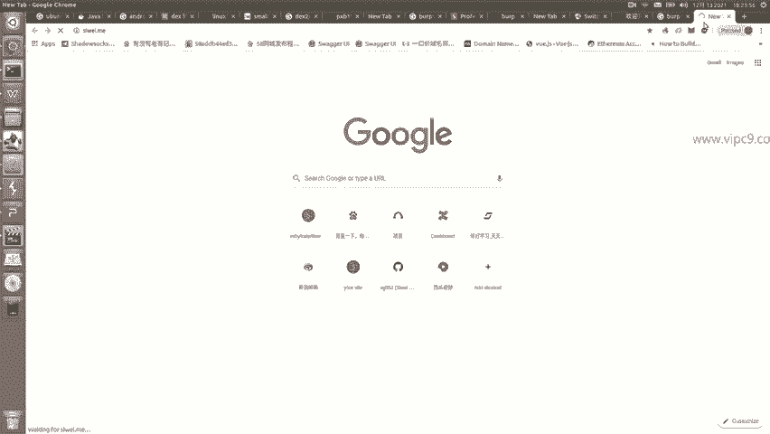

再转发forward。那么这个时候前端页面才会展示出来啊，那么其中一个比较有意思的地方就是我们是可以在这里来对这个内容进行修改的啊，修改之后。

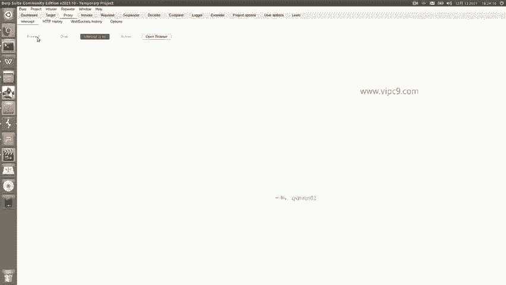

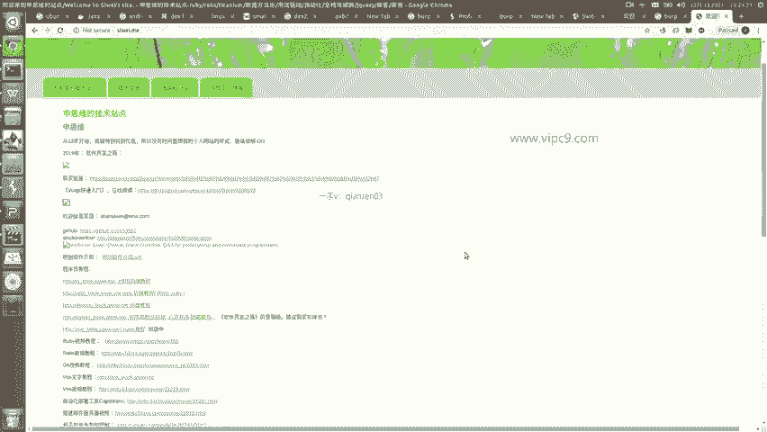

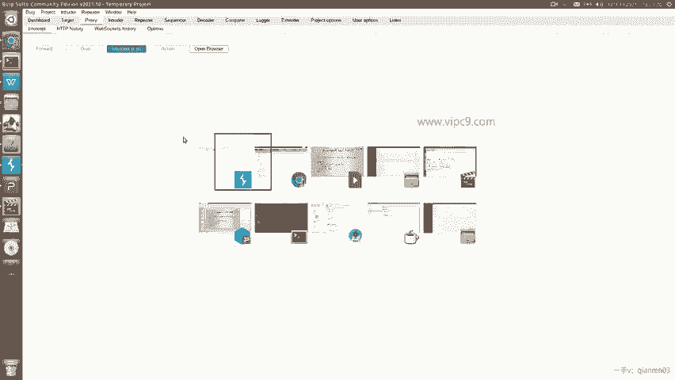

浏览器得到的就会是我们修改后的内容。

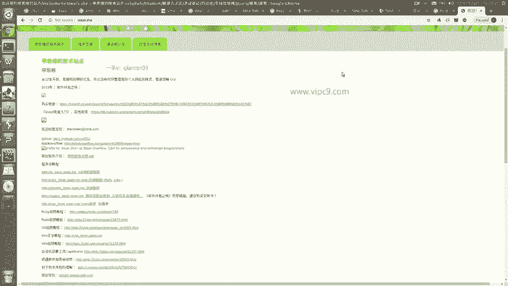