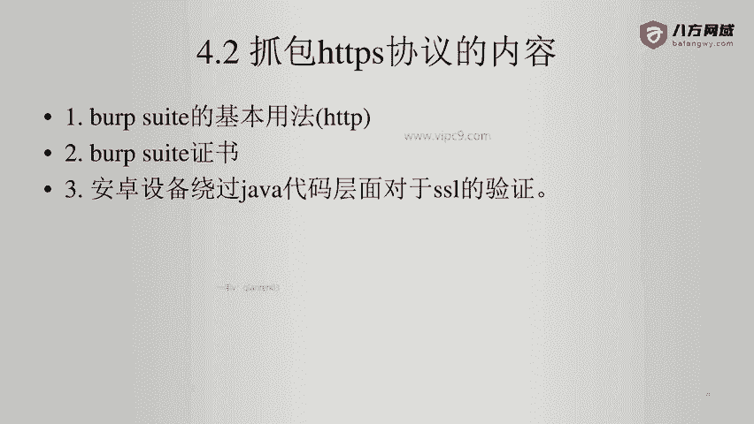
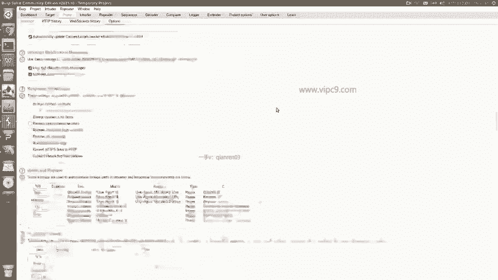
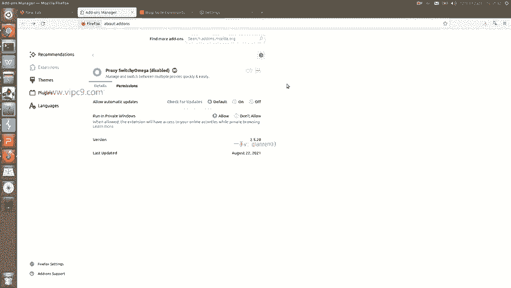
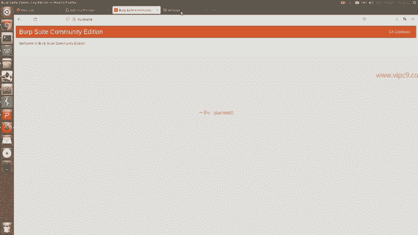
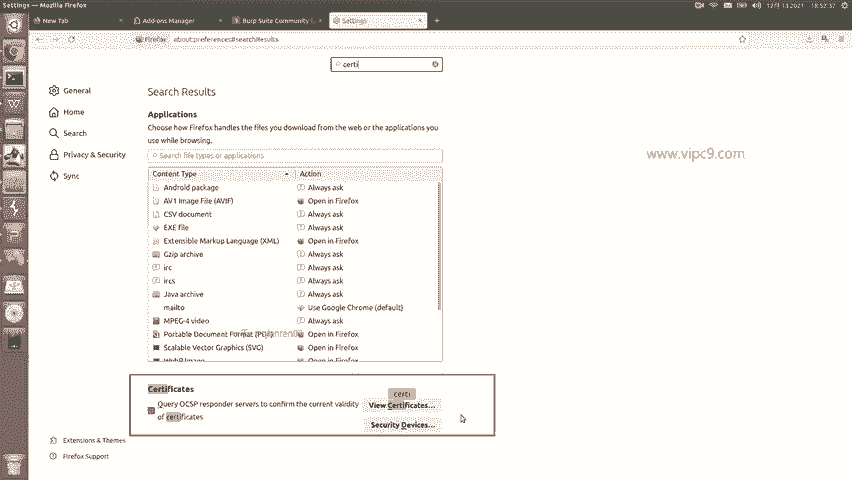
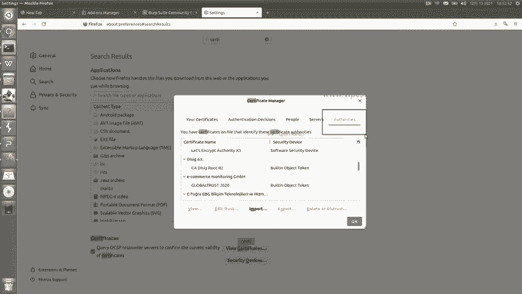
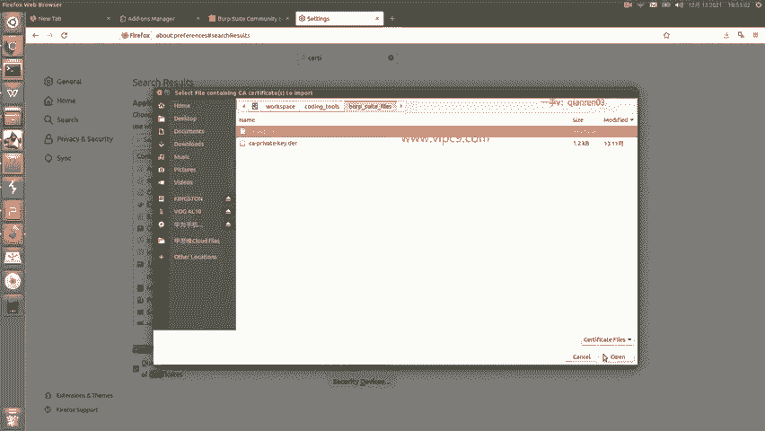
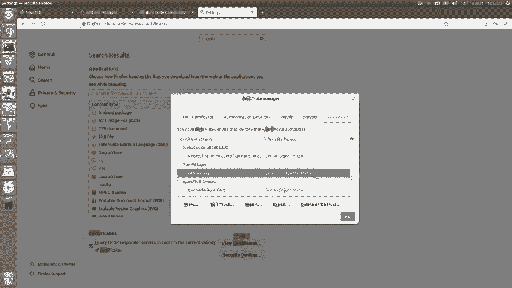
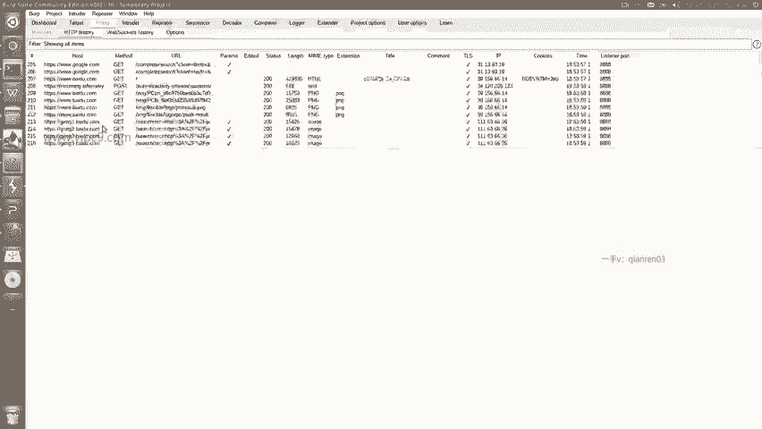

# Android逆向-基础篇 - P36：章节5-3-使用burpsuite抓包https-web - 1e0y_s - BV15jhbeCEQk

我们学习用burp suit来对HTDPS的内容进行抓包。在这里的话呢，大家需要了解HTTPS的基本情况。也就是说。如果。用户向某一个目标站点。进行HTTPS这样的协议的通讯的时候。

双方是有一个证书的交换过程的。那么这个时候如果我们要引入一个第三方的代理。那么这个代理向目标网站发起请求，也要有证书。然后用户向这个代理之间进行数据传输，也要有证书。

所以说这个就是bb suit证书存在的意义。换句话说，就是没有这个证书，我们就没有办法进行HTTPS的抓包。

那么看一下啊。在bbsuit这里点击proxy这个标签页，然后点击options就能看到这段内容。这段内容里面啊右边这个是重新生成证书。一般来说没有必要。并且对于老的用户或者老鸟来说。

他们的证书从来都不会重新生成的。因为对于一些安卓设备来说，导入证书太麻烦了啊，所以说大家记住啊。你要保护好你的证书啊，那么证书的话呢，其实是两个文件。一个是私钥，一个是公钥。

也就是这个certificate啊，翻译成证书也行。那么导入的话。是用这个就好了，可以看到点next。让我们同时导两个文件。那么导出的话啊是一个文件，一个文件的来。那么我先演示导出啊。

选择第一个啊next啊，随便选一个文件，点击保存就可以了。第二个导出私钥，选择文件啊，选择好一个位置就可以了。比如说这两个文件就是我刚刚导出的啊。

然后放到了workspace coding toolsth这个目录下。那么导入的话就很简单。比如说点import next。啊，先选择上面的这个是。CA certificates，那么这个就是证书文件。

证书文件也就是这个。点open下面这个是选择私钥。次要的话呢。选择这个。点next啊，他告诉我们说已经成功导入了successfully。那么这个就是我们对bp suit的证书的一个配置。

这个配置好了之后呢，我们需要在浏览器端啊先进行一个配置。因为这个演示是通啊通过浏览器来演示抓包HTTPS的。

那么在浏览器端呢，我们假设先使用火狐啊，firefox。fireair fox，我这个版本看起来都是英文啊，大家呃不要紧啊，windows的版本的火狐跟这个略有差别，但基本都是一样的。

首先啊不要使用任何的。代理插件。比如说刚才我在演示的时候，我告诉大家说有一个插件叫做switch啊，欧米ga这个插件这个插件呢就是一个允许我们非常便捷的使用代理的插件，那么一定要把它关掉。否则的话。

我们是用不了它的。

这是第一点。关掉之后，我们这个火壶。要打开一个网址，就叫做HTTP冒号bp suit。打开这个页面之后，可以看到右上角这里。多了一个叫做CA certificate这个按钮。点击啊就会问我们在哪里下载。

或者说下载到哪里，这个文件就是他们的证书文件啊，CACET。啊，点D啊。那么我点保存之后。就可以在火狐里面把这个证书导入。

导入的话呢，点击sttings。stes里边有一个叫做隐私的啊，隐私，或者说我们直接搜索一下certificate。那么在这里这个就是证书。

点击这个view certificates这个按钮。就可以看到了啊，有这么多在这里呢有我自己的，有认证的，有这个其他人的，大家就找这个默认的authorities，这个就好了。

点击导入，然后找到对应的文件啊。那么刚才这个应该只要证书文件，不许不是私要文件。那么点它点open。

他说这个证书已经存在了，怎么怎么怎么样。然后大家记住点呃点击导入的时候，我们要信任它啊。我们要信任他，这样的话呢这个才能使用。我找一下啊。这个就是我们导入的证书，看到这个ID trust没有？

导入的时候，这两个条一定要打上。

那么这个时候我们就能够进行测试了。我们打开一个网站进行测试吧。比如说。百度。可以看到相关的内容都已经抓到了。

那么在这里就是HDDP啊，这个HDTPS协议的内容。这个就是使用burp suit来抓HTTPS的包。这个呢是通过浏览器来抓。

