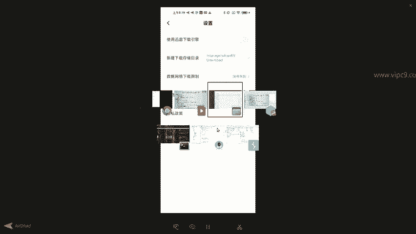
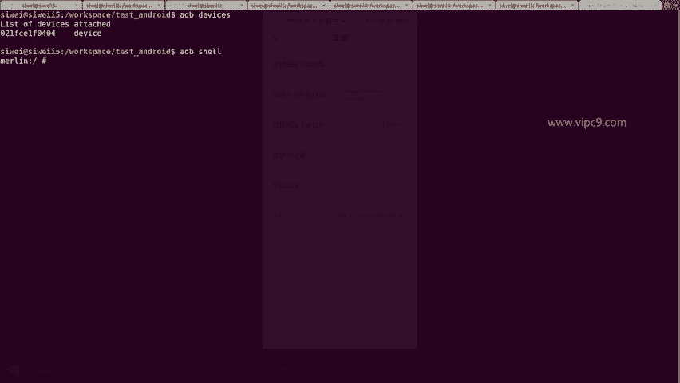
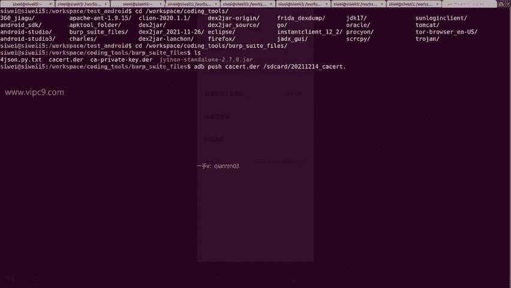
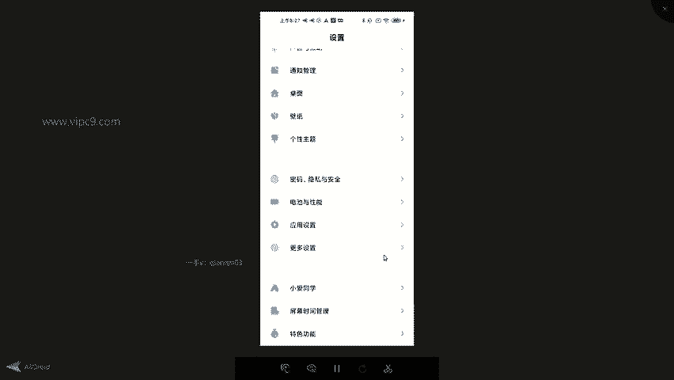

# Android逆向-基础篇 - P37：章节5-4-安卓设备安装证书 - 1e0y_s - BV15jhbeCEQk

下面我们学习超级重要的内容。叫做安卓设备，添加bp suit证书。这节内容超级重要，为什么呢？因为。可以说这个步骤是把好多好多安卓逆向人员挡在门外的原因啊，可以说是一个超级巨大的门槛。

那么我们先看一下啊，就是说想把一个证书导入到安卓设备里面，在安卓6以前是很简单的啊，下载，然后导入就可以了。那个时候安卓6和6以下的版本是能够信任用户导入的证书的。但是到了安卓7以后，就不信任了。嗯。

这里我要吐槽一下啊，就这些手机厂商为了自己所谓的系统稳定啊，他会把自己的手机主人当成贼一样的去防。所以说这个就对于我们这种hack啊。或者说对于我们这种技术从业人员是一个不小的阻碍。那么也没关系啊。

我们有办法。对于安卓大于等于7的版本。第一点，我们要有一个root过的安卓设备。然后第二点我们需要下载一个magist，然后安装一个插件。然后第三点，我们用正常的过程或者步骤去安装证书就可以了。

然后第四步重启。那么给大家看一下我的测试机啊，给它放大到全屏。这个是我的这台测试设备。点击设置可以看到这个是我的设备。是红米时叉4G。然后呢。在这里。找到隐私与安全。点击。然后找到。系统安全。

然后找到加密与平距。在这里面我们可以看到哈。😊，有信任的凭据和用户凭据。那么我们的目的是把证书导入到信任的凭据这里。看到了吧。这里分成系统的和用户的。那么。安卓设备只信任系统里边的啊。

它是不信任用户的啊。那么在这里呢。我们就先安装怎么安装呢？先把bp suit的证书下载到一个位置，比如说下载到我们的SD卡上。那么。把证书下载到SD卡上，一种是通过浏览器去下载。啊，打开小米的浏览器。

然后输入。HTTP。冒号。pepe，然后bp suit。但这种过程呢其实是。有问题的啊，对于小米手机来说。为什么有问题呢？因为它很多时候是打不开的。😊，我告诉大家为什么打不开啊，你会发现就是要么打不开。

要么下载不了，为什么呢？因为这里小米是有一个设置的啊，非常讨厌。😊，点设置在这里在下载的地方，它是有一个。通过。下载引擎去下载的。我们看一下，在我的下载这里，它是有一个设置啊，在设置看到没有？

使用迅雷下载引擎这个地方啊是非常非常讨厌的啊，大家一定一定要记住啊，把它给关掉。然后另外记住我们的这个下载路径，这里是storage SD card0download，对不对？

那么这个对我们来说就很简单。第一步，我们登录到我们的手机端。

ADB devices。ADB shellll进来了，然后看一下啊，刚才这个路径说是下载路径是storage SD card downloadload，对不对？我们看一下。

Storage， S， D card， download。嗯，在这里面是我们的下载路径。另外呢一个好用的路径就是就叫SD card。看SD cardLS。也可以看到好多内容。放哪儿都行。

只要你能找到就可以。然后我们把。昨天。或者说上一节课的。内容给他放过来。比如说这个DER啊，就是我们的ver suit证书文件，这个是sell文件，sell文件不用动，把证书文件通过ADBpush。

给他。推送到，比如说。一个位置就叫SD card的吧。那么就叫SD card。那么这里大家一定要记住啊，要给它起一个名字啊，这个名字呢叫什么名字？不要紧。比如说2021年12月14号的CACERT点。

就不要以DER为结尾，注意哈，这里结尾要做叫做点儿CRT。

好的，push过去了。然后我们在这里。再来。看到这里没有？这个就是我刚才上传的文件。那么回到手机端。找到设置。点从SD卡安装。就可以找到刚才我们上传的证书。看到没有？20211214。这个文件它是一个。

黑色的啊，其他文件是灰色的，灰色的文件。比如说这个表示不可用啊。那么这里也还有1个CRT文件啊，这两个文件都是可以点的。啊，如果大家记住啊，如果我们很生硬的啊给他就默认的用DRT。

或者CERT这个文件啊。是识别不了的，也就是说没有办法导入。然后找到这个文件，点击一下。为证书做一个命名。然后就可以正常导入了。Bp。我给他起了一个名字啊。点击确认。这里就可以正常导入了。

导入之后点击用户凭据啊，就可以看到是20211214，这个已经安装好了。那么这一步就是我们。做了一半的内容。下一半的内容就是我们需要有一个软件叫做magic。然后这个软件需要安装一个插件。

叫always trust user certificates。那么回到我的手机给大家看一下。大家要下载这个手机啊，手机上的这个应用叫做magist啊，是一个京剧的脸谱这个头像。点击。进来之后啊。

可以看到当前的版本什么什么什么什么什么的。注意下面这四个按钮，第一个是一个首页。第二个是一个盾牌一样的东西啊，可以看到现在是这些APP正在使用超级用户。比如说奇兔刷机助手啊。

比如说排在第一个的fake location，这个是地址模拟啊。然后点击第三个底部按钮，这是这个debug的信息。点击第四个啊，类似于一个拼图一样的东西。

在这里面可以看到有有一个叫做always trust user certificates。它的作用看一下英文描述，说这个模块啊，at or installed user certificates什么呀？

把所有。把所有用户安装的。证书都copy到系统信任的区域。也就是说把我们刚才这个用户凭据。给他移动到信任的凭据这里。所以说大家啊做完。😊，我刚才的这个复制证书的操作。

然后在这个软件里边把这个模块下载并且安装，然后重启设备就可以了。安装这个APP的话呢，叫小面具啊，magic是不需要翻墙的。目前来看，大家可以搜索一下它的网址，在一些商店里面也会有。😊。

搜索完这个并且安装之后呢，点击右下角的放大镜。然后搜索它的名字啊，正常来说就应该可以出现。对不对？因为我这边已经安装好了，所以说它并不会出现。那么这里就就先不演示了。😊，做好了之后呢。我们重启设备。

并且重新登录进来。如何验证呢？我们查看systemETC下面的这个路径。进入到CD空格system。ETC然后security。然后CAC啊。LS发现有很多很多点0为后缀的文件。那么在这里。

我用一个命令啊，LS横线ALTRH这个就能够把文件根据时间进行倒序排序，可以看到最底下的这个就是我们刚刚。导进来的这个。文件啊，这个文件是不能够在ADB模式下，通过copy命令给它copy进来的啊。

只能通过刚才的操作看一下它的内容。发现没有？它的内容是这些。在这些啊看起来都是乱码啊，实际是实际上它应该是一个加密过的或者二进制的内容。可以看到port figure。

这个呢就是bb suit证书的公司。我们看一下本地的这个证书内容。啊，这个是本地证书的内容，可以看到在这里这时的本地它的内容跟刚才我们手机上是一模一样的。所以说也就说明这个证书已经正确的导入到了我们的。

安卓系统上。好的，那么这个过程就是把证书安卓到。安卓7以上的手机设备的过程。

