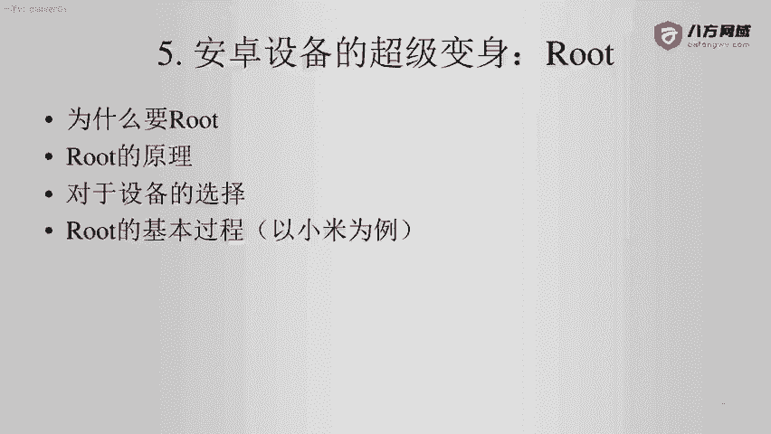
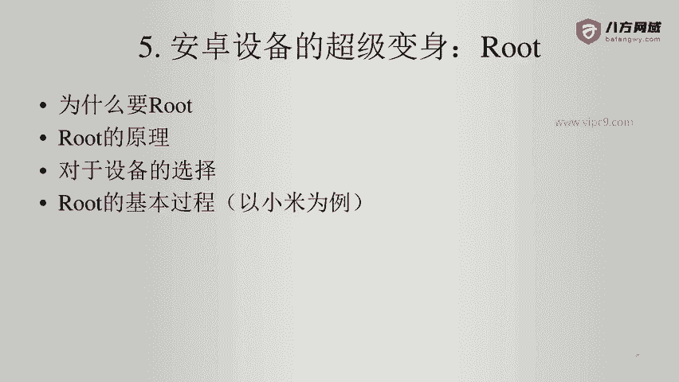

# Android逆向-基础篇 - P38：章节6-1-为什么root与root原理 - 1e0y_s - BV15jhbeCEQk

本章我们讲解安卓设备的超级变身。Root。分成下面这些内容，一、为什么要root？2、root的原理。3、对于设备的选择。4。以小米为例，讲述一下root的基本过程。

看一下为什么要root。这个非常简单。就是如果我们不root，很多很多事情都做不了啊，root之后会获得，首先是超级管理员权限。那么正常的手机登录之后，它不是root用户啊。

大家就认为root是linux系统里面的超级管理员的默认用户名就好了。所以说对于安卓来说啊，root那就是拿到超级管理员权限。我们对于PC端的渗透测试啊，也经常用root这个词。

比如说经常说到啊已经拿到了某某机器的root啊，这个就表示已经彻彻底底的掌握了对方机器的管理员的权限。第二点。可以获得所有文件和文件夹的权限。那么我们知道默认的这个ADB登录手机端之后。

几乎99%的文件或者文件夹你是动不了的啊，因为这是安卓系统的自我保护啊，很多用户啊通过误删除就会造成手机端或者PC端的系统崩溃。那么安卓也是这样的。

所以说几乎所有手机在出厂的时候都是不具备root权限的。然后呢，就是我们的手机可以获得超级能力啊，比如说修改地理位置信息啊，这个对于钉钉。这样的打卡啊，那就是没有办法打卡了。所以说这种算是超级能力。

然后呢，就是你的机器，那就是你的。啊，对不对？不能说我买了一台机器，发现哇塞里面好多好多内容嗯，我都用不了我的机器像防贼一样防着我像防贼一样，防着他的主人啊啊，这个跟苹果就啊是完全不一样的。

苹果就是这样啊，你拿到一一台设备发现啊，你的设备好多东西都不是你的啊，我想把这个。😊。

一些资料从这个手机端备份出来，还需要下载一系列的操作。所以说那个肯定是不太。不太符合一个黑客的逻辑啊。那么缺点就是root不适合小白啊，比如说这个小白是一个五六十岁的大妈啊，那么他要去root的话。

那得了。这个系统可能有一段时间啊，什么文件缺失了就变砖了。下面说一下root的原理。root基本就等同于电脑的重装系统。那么重装之前，几乎这个系统好多功能是不给用户使用的啊，好多能力都是不具备的。

重装之后啊，就相当于把这个设备安装了一个新的系统的镜像。那么这个新的系统。默认是给到用户足够多的权限。比如说我们安卓设备在root之后，往往会带上一个magic工具包啊，这里面就是一系列的超级工具啊。

