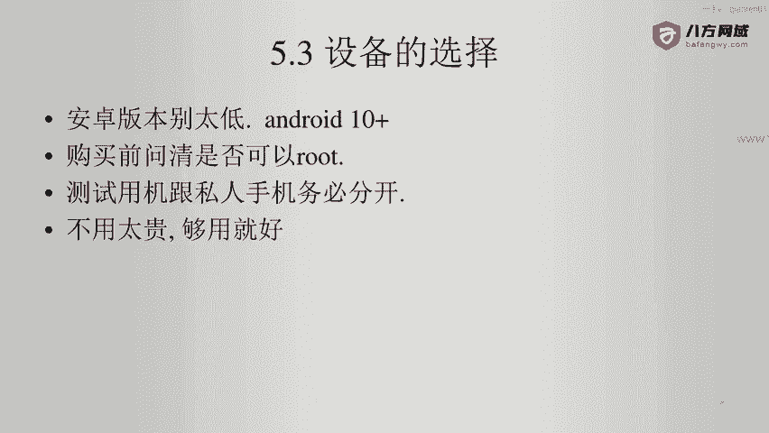
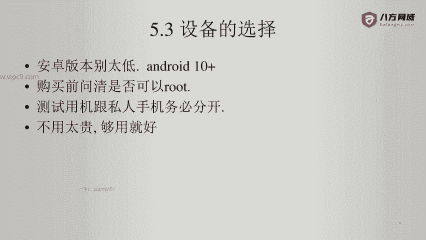
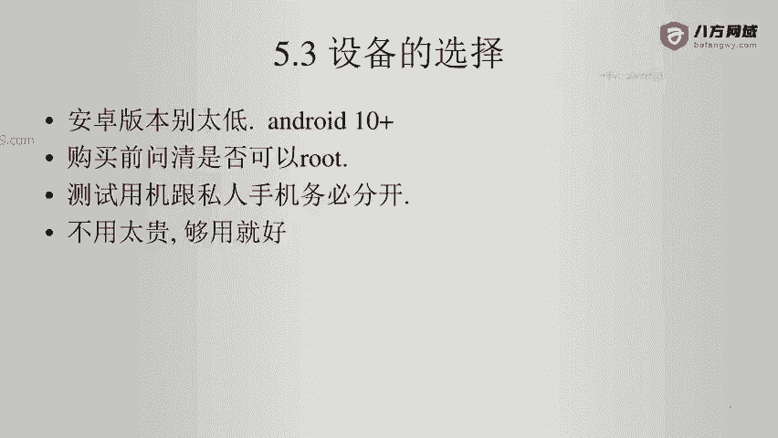

# Android逆向-基础篇 - P39：章节6-2-设备的选择 - 1e0y_s - BV15jhbeCEQk

下面说一下设备的选择。首先呢我建议大家嗯可以买一台新的设备啊，如果买二手设备的话呢，可以到闲鱼上面去买。嗯，版本别太低。比如说现在已经2021年了啊，你弄出来一个安卓5的啊，这样这样的话会出很多问题。

第二点就是购买设备之前要问清这个设备是否可以root。因为现在是很多机型是不能够root的。那么可以root的机型。比如说小米啊，这个就非常人性化啊，华为部分机型也可以root。然后要记住。

我们的测试用机跟私人手机务必分开。因为root是有很大的风险的。比如说我的设备曾经出现过，安装了一个软件之后，整个机器就不能开机了啊，需要给它重新做root，也就是重新安装系统才行。所以说。

root之后的设备，你就当它上面的资料都是随时会丢失的风险。就可以。然后呢，就是不用太贵的，够用就可以了。比如说我们买root机器，你不需要搞一个华为P50啊，我的这个呃摄像头。可以放大100倍啊。

那个是用不上的啊，并且呢我建议大家如果在做一些安卓逆向的时候，因为你不确定。他的设备或者说。我们的设备会不会被某些APP所远程操控？所以说我建议可以把前置摄像头啊用一个小纸片给它糊上。

