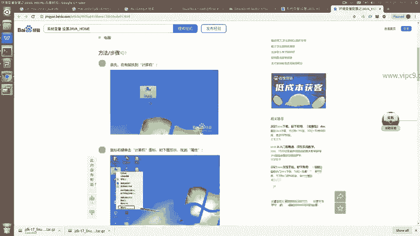
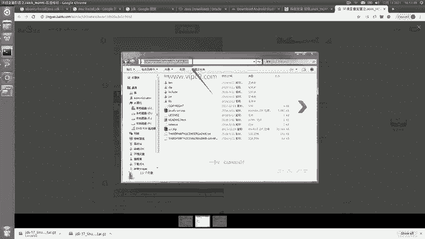
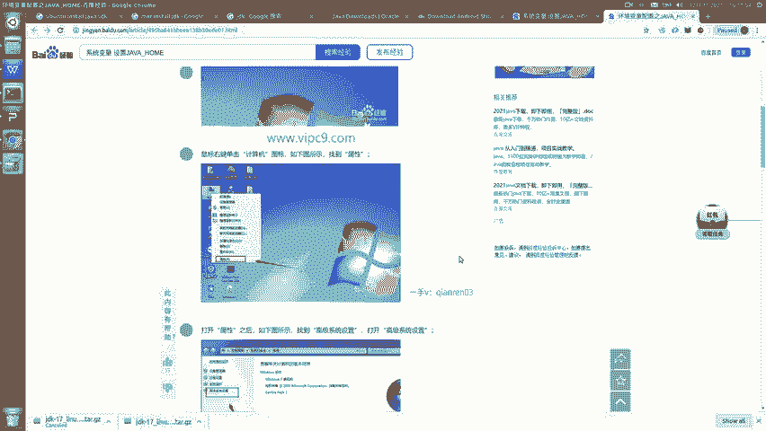
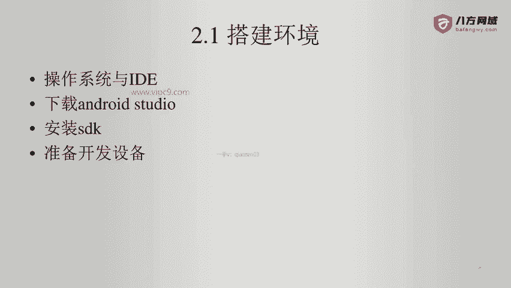
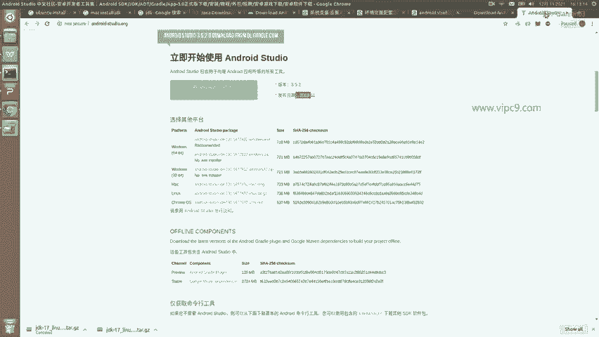
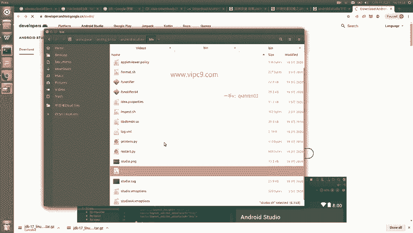
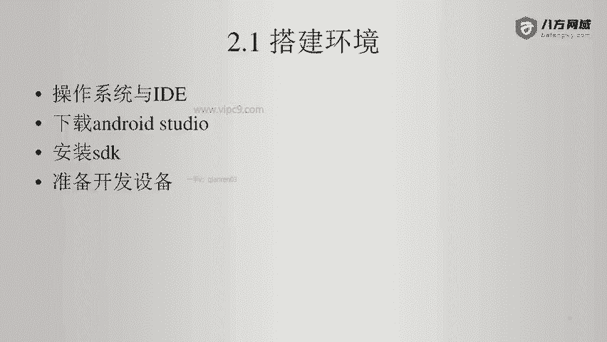
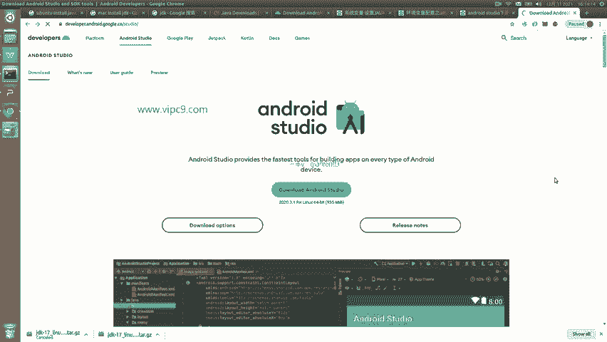

# Android逆向-基础篇 - P3：章节2-2-Windows设置jdk - 1e0y_s - BV15jhbeCEQk

那么我们下面说一下在windows里面如何设置java home。这个非常简单啊，首先进入到桌面。😊。

然后在桌面右键点击我的电脑，然后点击这个属性啊，然后就会弹出一个。这样的窗口我们选择这个高级系统设置。选择好之后，点击这个高级这个标签页，这里就会看到环境变量这四个字。

之后我们在上面或者下面都可以新建啊，一般来说我们是在下面这里新建，这样会给所有用户都能都能够用到这个变量。点击新建之后，变量名，这里就是大写的java home。

变量值就是啊我们刚才java压缩包的解压缩的这个完整的路径啊，比如说在这里顶部啊，我们把这个java啊，给它解压缩到了C盘的这个目录下，直接到这里啊用鼠标复制它，给它粘贴进来就可以了。

好的，那么这个就是。安装JDK。下面是我们需要下载android studio。

那么在这里呢。我们可以到官方网站上面来下载。也可以通过百度啊到这个现成的镜像位置去下载。比如说百度一下啊。比如说在这里有安卓中文社区啊。和这个下载官网google点CN嗯。

那么一般来说官网这里有的时候偶尔会不稳定啊，那么大家呃。就需要另外做一个选择。比如说到其他地方来下载，那么下载的时候一定要注意好版本。比如说这里第三方下载确实很快，但它用的是2019年的这个时间。

其实已经很慢了啊。这个现在是2021年，这是两年以前的了。啊，所以说我们在这里啊还是推荐在官网上去下载啊。另外对于一个这个程序员来说，还是要具备这个一些必要的翻墙能力的啊，因为这个没有办法。

那么下载好之后，这个非常简单，夹缩就可以。比如说我是把它解压到呃这个位置。啊，按照的呃按照的t啊，比如说在这里。那么在这里的话就行了。然后启动的时候，这里有一个b文件夹。

在这里面会给到我们一个studio点SH这样的一个文件啊。那么对于windows和mike几乎都是一样的啊，windows的话就是一个studio点EXE啊，mike的话呃鼠标这个双击就可以了。

另外呢。嗯，就是准备开发设备和安装SDK。

好的，那么我们准备打开一下我们的安卓tio。

