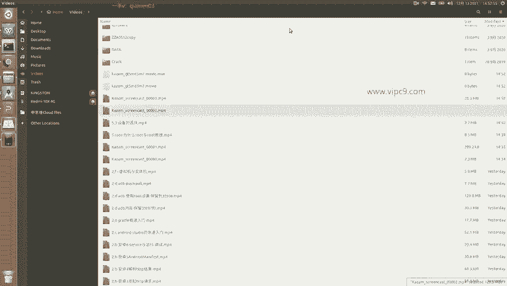
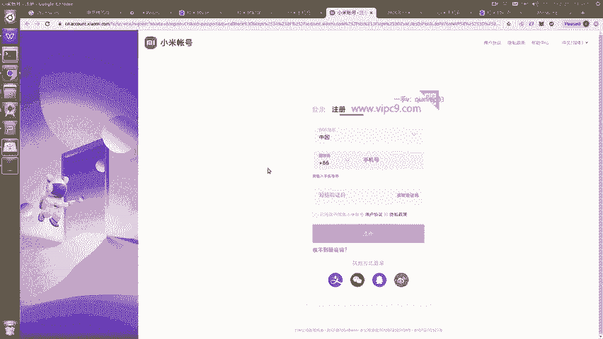
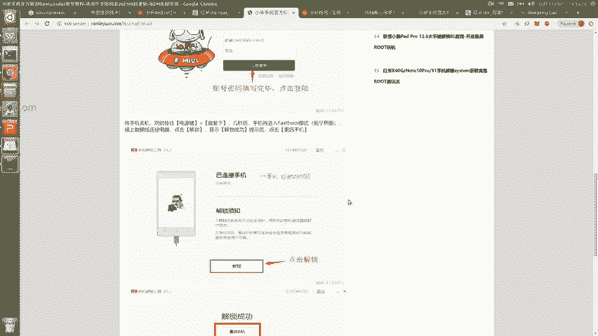

# Android逆向-基础篇 - P40：章节6-3-小米账户的绑定与设备解锁 - 1e0y_s - BV15jhbeCEQk

下面我们看一下如何root。以红米十叉手机为例。那么呢其实就是分成四步。首先注册一个小米账号。第二，要设置账号和设备相绑定啊，并且得至少绑定一周。第三，在手机端要申请解锁，并且在PC端要进行一个操作。

然后第四，重新安装ro就可以。我们看一下图文过程啊。

在这里。小米的官网account点小米点com这里啊，我们要注册一个账户。需要一个手机号码。接收短信之后就可以了。

然后第二步呢，我们需要在我们的手机端。登录这个账号。嗯，可以看到顶部这里我已经登录了这个小米账号。点击。可以看到这个小米账号是这样的。绑定一周之后，我们进入到开发者模式。

开发者选项在这里面会有一个项目叫做设备解锁。由于我的这台设备已经解锁过了。所以说这里显示的是已解锁。正常的话，这里应该会有个选项，说我要申请为设备解锁。到时候的话到时候的话呢就可以解锁了。解锁之后啊。

我们看一下。申请解锁之后，我们需要在PC端下载一个专用的工具。也就是这里。那么这个工具呢叫做红米专用解锁工具。点击这个按钮就可以下载了。下载之后是在windows端进行安装的。安装之后。

首先会要求我们登录。那么登录的时候呢啊先看到这个免责声明。大家不要怕，因为这款手机就是给我们做开发和研究使用的啊，只要你不把个人的信息放上去，你的资料就没有任何危险。呃，虽然他这里免责声明是这不行。

那不行，看起来好像是不怎么样。嗯，好像我们这个安全嗯。不保证稳定性不高，这样那样的。实际上。我个人认为嗯一个没有root权限的系统是没有灵魂的。然后。就是。输入我们的小米账号啊登录。登录之后呢。

把手机关机，然后同时按住电源键和音量下啊，等几秒之后，手机就会进入到兔子界面。也叫做fast boot模式。大概是长这个样子。之后呢，我们要把手机和电脑之间用数据线啊相连接。注意啊。

数据线是比电源线要高级很多的啊，可以认为是很高端的充电线啊。那么那种很便宜，10块钱一根的，可能是只能充电，不能够传输数据的啊，那是不行的。然后呢，我们在。PC端这里点击解锁啊这个按钮。就会。

显示啊解锁成功之后，我们重启手机就可以了。这个就是结锁。

