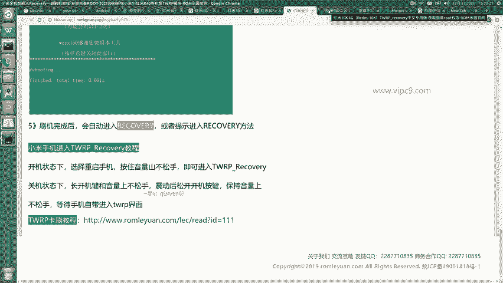
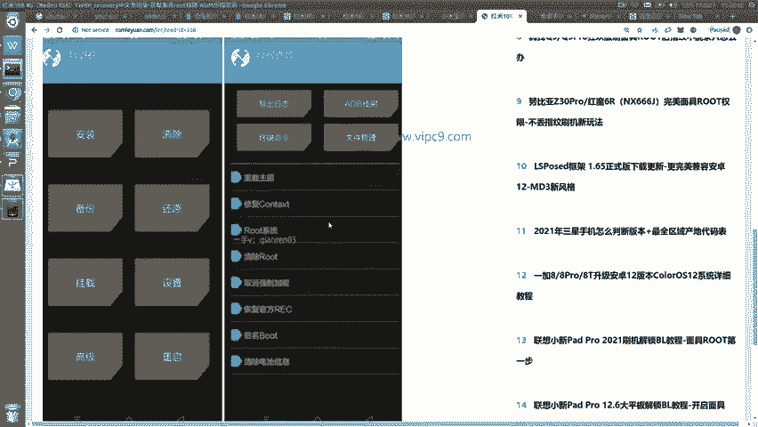
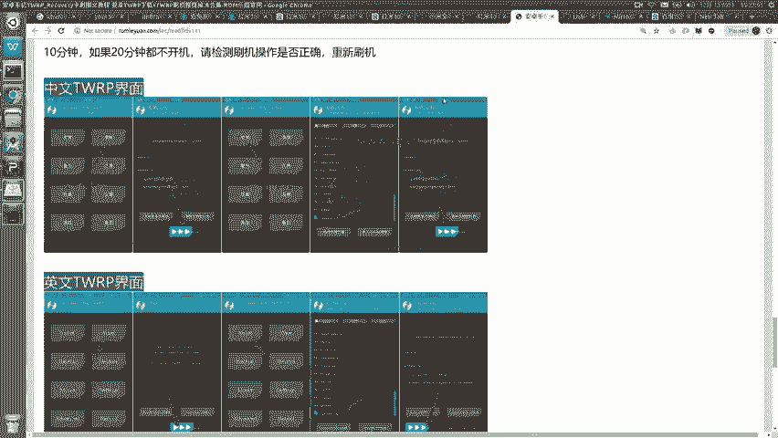
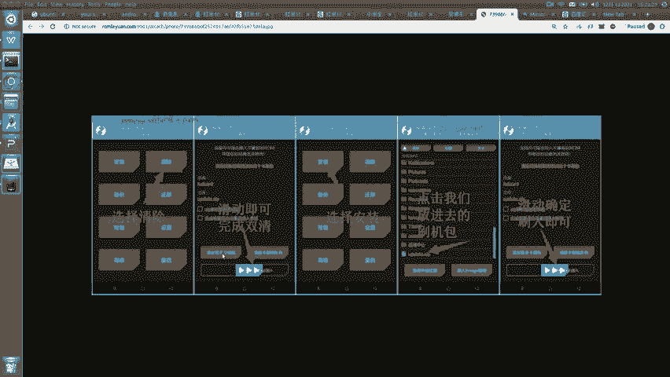
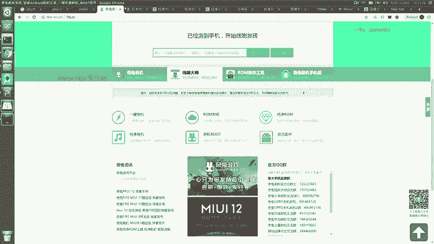

# Android逆向-基础篇 - P41：章节6-4-刷机 - 1e0y_s - BV15jhbeCEQk

下面我们看一下。root的具体过程。root分两种方式啊，一种是傻瓜式，我个人非常推荐，另外一种就是亲力亲为型啊，那个我个人是不推荐的。那么先说简单的。我个人是使用奇兔软件。这个工具先到他的官网来下载。

下载之后呢，这是只支持windows的。下载完之后呢，我们会可以看到这样的页面啊，这里面啊页面长这个样子。然后我们就可以。找到我们的机型啊，比如说我们输入红米十叉。就能够在列表当中看到对应的内容。

然后我们点击。一键刷机，选择好这个rom。然后呢，把手机和电脑之间。用专门的数据线给他们连上，也就是这个页面。然后根据提示。来一键刷机就好了啊。用这个软件会特别舒服，因为这个软件它就两步。

第一步在这个软件里边选择我们的机型。啊，然后第二步啊我们进行刷机，中间可能会有一个购买的过程，大概是啊这个是12块钱。我认为呢是非常简单的，也是我非常推荐的。如果大家想亲力七眉的话，也可以这样。

根据这个教程来啊，比如说这个是网上随便搜的啊，小米全机型啊，一键刷机教程。在这里呢。先下载一个。刷机工具啊是这个百度网盘下载。下载之后在本机进行解压缩。然后呢。有一个叫做一键刷入工具。根据这个提示来。

打开之后呢，我们彻底关闭手机，音量下和开机进入到这个兔子模式。然后双击这个recovery这个脚本之后呢，就会看到这样的页面啊，然后我们的手机就会进入到recovery模式。

进入到recovery recovery模式之后呢，页面会长成这个样子。

在这里啊有的机型它会自带这个选项，就是点击高级之后可以看到root系统这个选项啊，但有的是不带的啊，那么我们就需要点击安装，然后。找到我们。导入过去的安装包。

就是长这个样子。

翻大一些。在这里的话呢，它其实多了一步叫做先清除，把本地的这个所有数据都清除掉，然后呢再点安装安装呢再点我们刚才放进去的刷机包。然后。这个通过滑动确定就可以。由于很多同学呢呃没有经历过这个清除这样的。

操作过程。所以说我个人建议还是使用奇兔刷机啊，这个是最稳定、最快的。

