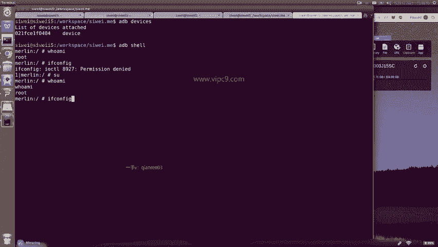
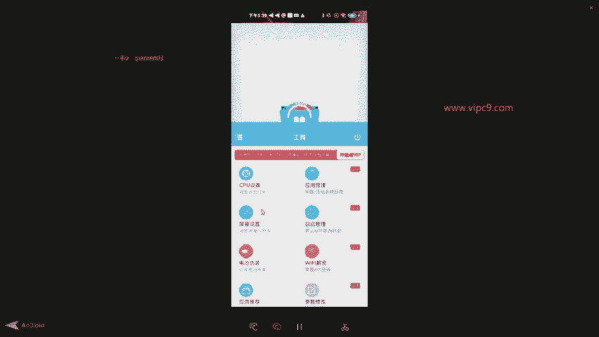

# Android逆向-基础篇 - P42：章节6-5-刷机后的验证 - 1e0y_s - BV15jhbeCEQk

这个时候我们的手机显示已经root过了。那么我们如何去验证呢？最稳妥的能力是这样的，通过ADB devices。可以看到。这个设备已经连接。然后ADB shell。这个进来了，进来了之后，我们。啊。

不要认为现在就是root了，其实不是的。输入who am I啊，虽然显示是root，但这个root呢它是有一定限度的。我们比如说查看当前手机所分配的IP地址。If config。啊，提示说权限不够。

我们啊通过SU命令来切换，然后再输入who am I。可以看到。这跟刚才返回的值是不一样的。啊，然后再。If config。

可以看到啊，这里就出来了。是19216843。164。所以说这个就是我们对于root方面的验证。另外我们也可以看一下。一些系统层面的文件夹，我们能否可以登录？比如说啊我们进入到ETC。

这个呢是所有linux最最核心的文件夹。我们看一下，比如说这里有一个文件。这个吧啊。是1个XML文件，我们ca一下。这就都出来了。所以说这个是从呃命令行的层面来验证。

我们也可以通过手机端界面的方式来验证。比如说现在可以看到在这个页面底部有一个叫做奇兔刷机助手，还有一叫magist，还有叫ED叉post。一般来说，如果我们的手机。嗯，没有通过root的话，那么。

这种软件是没法正常使用的。那么在这里可以看到，检测到您的手机已经root。在这里的话可以看到有CPU啊等等等等。有这个屏幕设置、电池伪装等等啊，有很多高级的特性。

好的，那么这些就是我们如何将安卓设备进行root的内容。