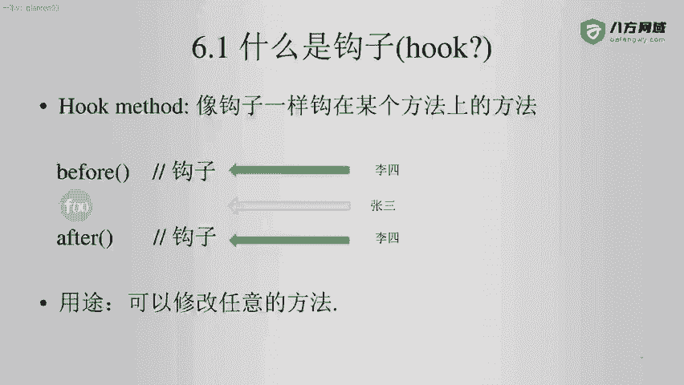
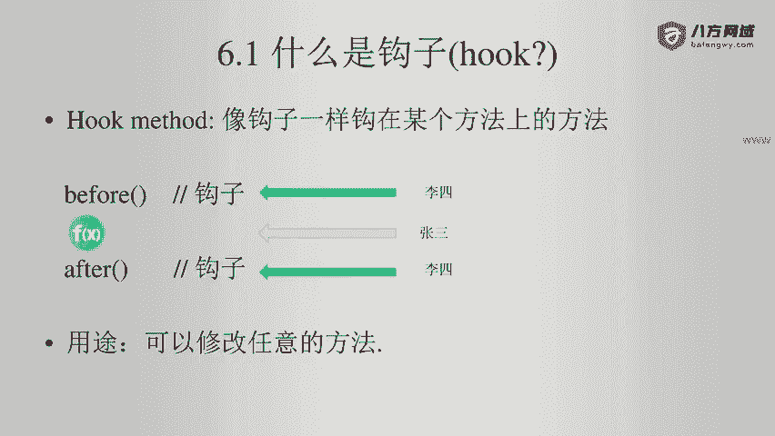
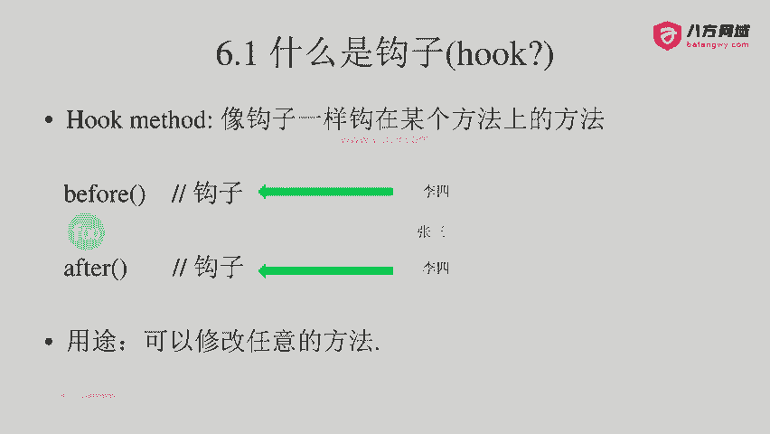
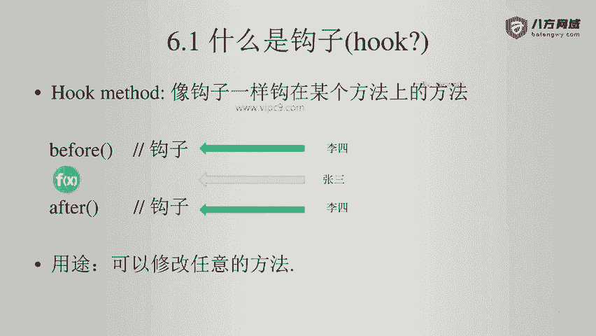
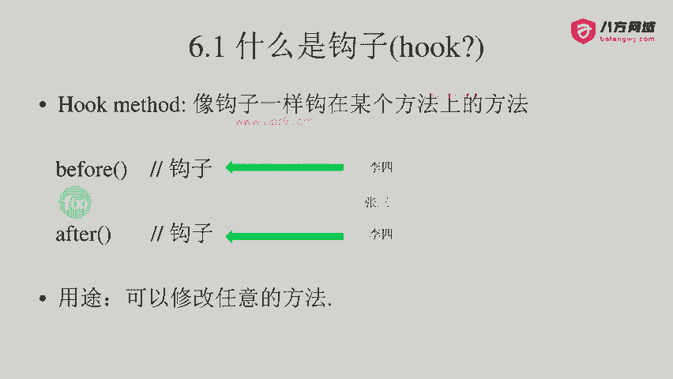
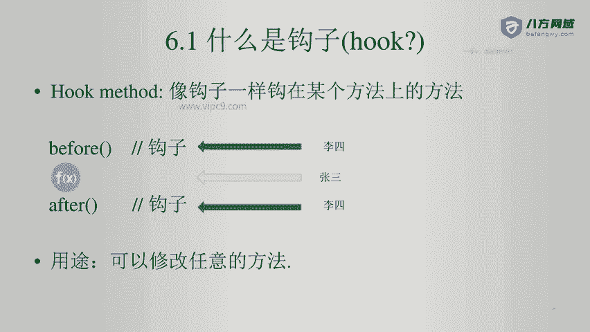
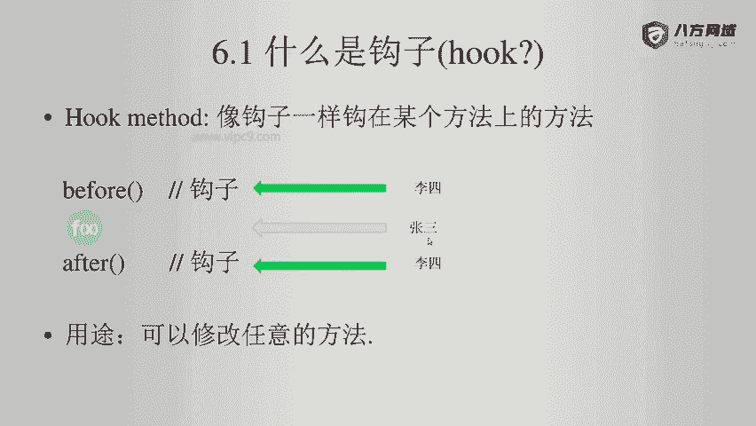
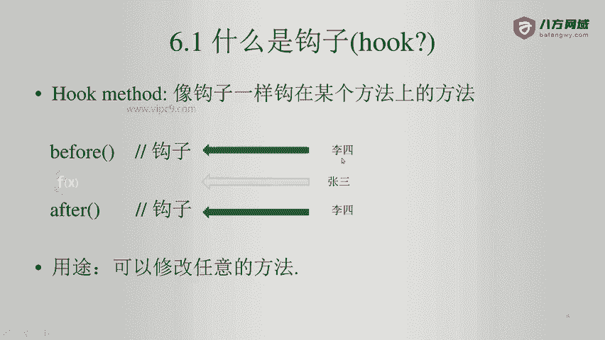
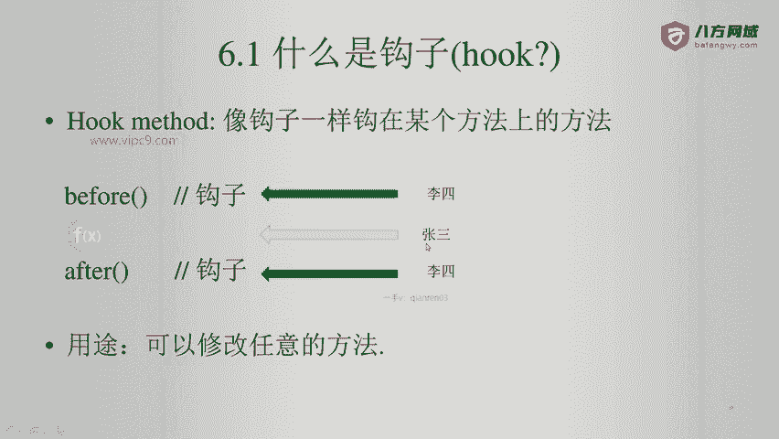
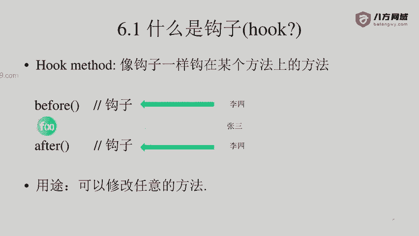

# Android逆向-基础篇 - P44：章节7-2-钩子方法 - 1e0y_s - BV15jhbeCEQk

首先我们看一下什么是钩子。

那么钩子呢就是能够挂在一个东西上。英文叫做hoook。

在软件开发领域，我们往往管这个叫做钩的方法。勾的方法非常简单，就是一个方法，前面有个before一个方法，后面有个after啊，比如说我们做viGS开发啊，或者我们做这个安卓开发。

都会看到什么befo create after create before pause before destroy等等啊。所以说凡是带有before after这样前缀的内容，都是勾的方法。

在我们数据库操作里面也会遇到，比如说我们的一个事物啊，在创建之前啊，那么会有before创建之后有after，这个是非常方便的啊，也是一个在开发层面上来讲，非常常用的呃实现模式。

那么对于。

逆向或者黑客来说啊，也是有这一套用法。那么在黑客的视角里面，勾的方法就是自己写的啊。

方法本体就是别人写的。那么在下面的这个图里面，方法本体啊，蓝色的圆圈是张三写的。

然后钩子befo after就是李四写的。那么李四就是逆向人员。

钩子的作用就是可以通过钩子来修改任意的方法。

比如说张三写了一个函数，写了1000行，函数这个非常非常的耗费系统资源。经过一通计算啊，得出我这个方法返回te还是fse。

那么李四很简单，直接通过before或者after这个钩子就直接可以修改这个函数返回的值。所以说这个就是钩子的意义。可以说钩子给我们提供了一个天神视角。

