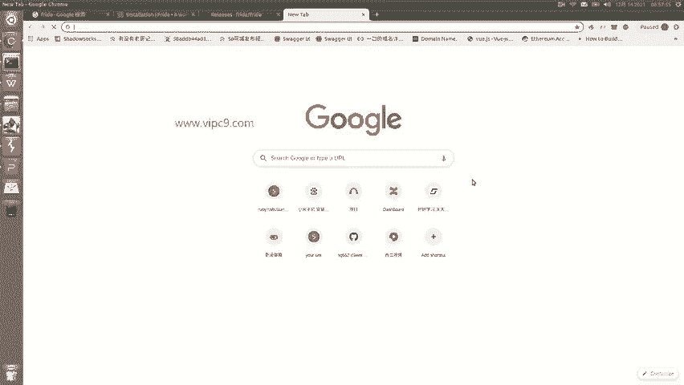
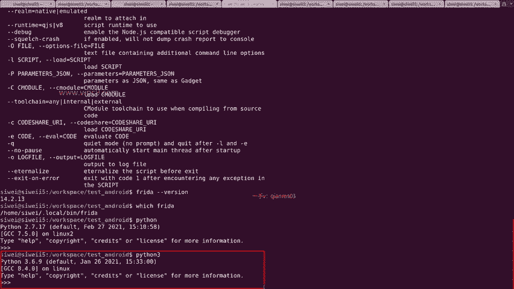
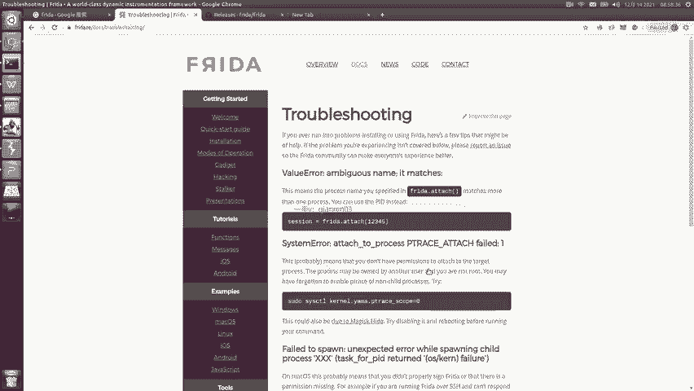
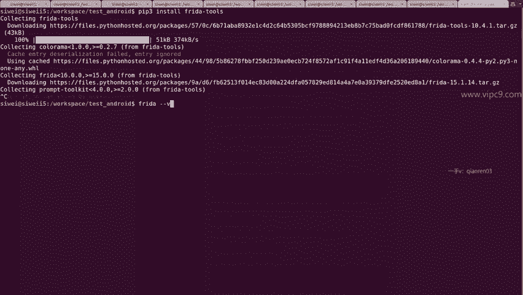
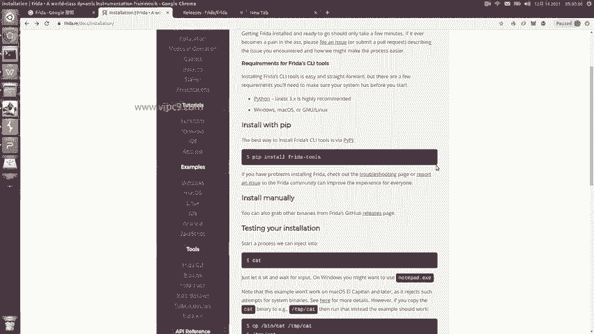
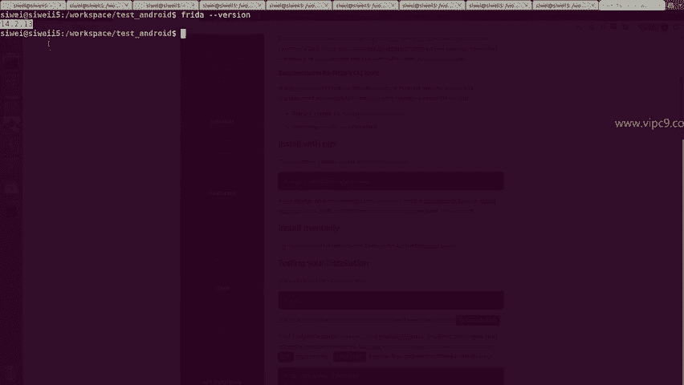
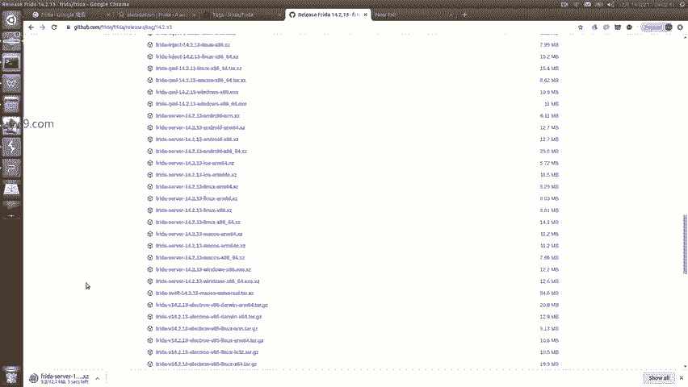
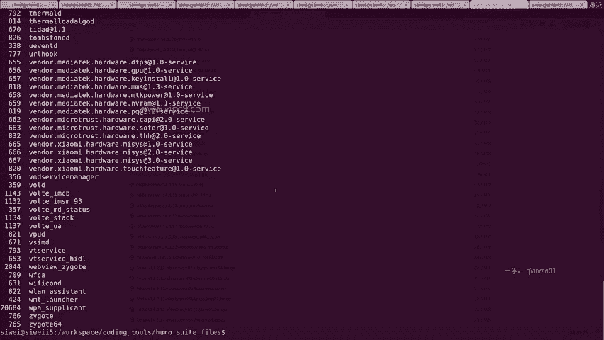

# Android逆向-基础篇 - P45：章节7-3-frida-server-client的安装与注意事项 - 1e0y_s - BV15jhbeCEQk

下面我们学习第二节freeder钩子框架。本节我们会分别讲到fred服务器和fred客户端的安装和使用。然后我们用fred来实现一个简单的钩子方法。那么frda是什么？它是一个世界级的底层框架。

点击呃frda可以看到它的官方网站叫frreed点RE啊。在这里。frreed点RE在这里可以看到，它是给开发人员，给逆向人员和安全人员使用的。这个是他的官方网站。在这里如何安装啊，我们点击它的文档。

点击左侧的这个installation。非常简单。第一步，先安装python啊，必须是3点几。然后在其他系统里面都可以安装windows麦克和linux。那么安装python这个过程我就先不多说了啊。

大家呃网上有很多大家可以自己寻找。比如说python安装。

那么我这边已经安装好了。回车。啊，这个是python2。7。python3可以看到我这里已经展示出来了，python33。6。9，对不对？

安装的话呢。我们python会自带一个组件叫做pipe。那么这个pipe大家用的时候就可以去用了，比如说pipeint free tools就可以了。那么对于python三的版本来说，可能是会这样。

叫pape3inst，然后。

Freeda。Toth。是这么一个过程。好的，我先给它终止哈，因为我这边已经安装过了。

嗯，好的。那么除了使用paip安装，我们也可以使用手动的安装。Install manually。点击这个release界面，在gitthub上可以看到它的网址是githubfrfr。

点击这个release，我们就能看到有这些。这些大家一看的话，可能会蒙啊，不用蒙。其实这里很简单，我们搜索一个，看到这个free toolsth了吗？这个就是我们需要安装的包。也可以看一下他有没有。

可执行文件，这里是没有的。没有的话，那么还是大家呃新手的话还是不要轻易尝试这个在PC端啊，通过手动去安装。那么大家要记住一点啊，PC端安装的这个。命令给我们装上来的叫做fred client啊。

而fred server是什么呢？fred server是手机端。

所以说在这里大家一定要记住啊。Frida。Sver。对应PC。啊，对应手机。Freedda client。对应我们的PC。这是第一点。第二点。Freda so。跟。Client。版本号务必一致。好的。

那么我们frreda刚才的安装，这里说好之后呢，我们就可以看一下。比如说frda横线横线version可以看到。在我的PC端，它的版本号是14。2。13。那么大家在手机端安装的时候怎么装呢？很简单。

先根据你的。PC端的版本号。

找到。手动下载这里看看有没有版本号。那么在这里我的是14。2。13，跟现在的15。1啊是不一样的。所以说呢我们找到这个tag吧。或者说find a release。哎，好的。14。2。

直接通过路径来修改啊。那么在这里就是14。2。13。然后在这里大家找到啊，你们的手机基本上都是ARM芯片的。所以说呢我们要在这里找fredda server。嗯，出来了啊。

有这么多啊frda server，然后有没有看到上面的这个安卓。😊，是在这里，那么安卓这里面又分4种啊，这四种怎么找呢？首先你们的手机肯定是ARM芯片的。😊，不会有这个叉86的。所以说呢是在这里。

然后呢。你们的手机肯定是64位的。所以嗯所以说我们就选择这个。ARM64就好了。然后在这里比如说下载。下载完之后，这是1个XY，是一个压缩包。这个呢我们可以给它下载到本地。然后并且对它进行解压缩。

解压缩之后，把这个文件通过ADBpush命令给它推送到远程。那么这个过程我也先不做了。推送到远程之后。比如说给它放到远程的datalocalTMP目录下。那么在这里可以看到。这个目录下。

我历史上曾经下载了这么多个。不同的fred server。那么其中真正对我有用的是哪个呢？是这个。14。2。13android ARM64刚好对应了我的测试机，首先是个安卓，然后它是ARM芯片啊。

所有的移动版都是ARM。然后我的手机是。2020年买的它肯定是1个64位芯片。所以说呢就是他了。然后。我们的这个fda就算是弄好了。弄好之后呢。告诉大家如何启动以及调试。现在。

我是通过ADB进入到了安卓端，并且呢我要把自己的当前用户通过SU给它切换一下。然后。点儿斜线。复zhi。粘贴。就可以了。这个时候大家会发现啊，这个我把命令输入完之后，他什么都没有输出啊。

我们不知道它成功没成功，不要紧。进入到我们的PC端。然后输入frda。横线PS。横线大写的U。可以看到有好多内容。看到没有？come点小米，这是啥意思呢？跟大家解释一下。

fridePS就表示通过freded来读取。正在运行的进程啊，PS大家知道它是linux的一一个系统命令啊，比如说我想查看我的系统PS杠EF就能够看出所有的运行当中的进程。PSAUX sortRSS。

这个是特指lin啊特指linux系统啊。那么在这里的话可以看到我的这个。进程所使用的内存啊，bb suit用了1。3个G。嗯，安卓studio用了1。2个G。那么回到刚才这里。

查看freder是否安装好，就是我们在PC端运行。fred的横线PS横线大写的U。那么在这里横线大写的U是不能丢失的啊，这个就表示通过USB数据线来读取安卓手机上运行的进程。那么在这里列出来了。

可以看到啊找到这个com点小米，大家就明白了啊，这就就是小米手机。那么这里说明关键点就是PC端的frreed。跟我们的手机端的freeder必须版本号一模一样。第二点。手机端这个就叫做。

frreed server而PC端这个就叫做fred client，或者说fred tools。所以说现在啊我的手机跟PC就已经很好的连接到了一起。

