# Android逆向-基础篇 - P46：章节7-4-frida-安卓例子 - 1e0y_s - BV15jhbeCEQk

下面我们用一个真实的例子来看frer实现钩子方法。

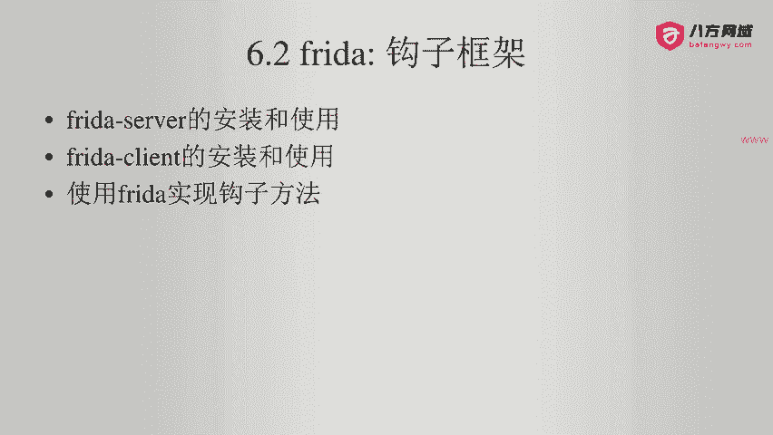

那么我们回到我们的APP啊。这个APP我给它做了一点点改动，现在页面上是三个按钮。第一个按钮是点击跳转到第二个页面。第二个按钮是点击查询远程的接口，这个就不说了。然后我又增加了一个功能，叫做第三个按钮。

点击刷新文字。点击这个按钮之后，下面的你好啊，安卓逆向高手这个文字就会刷新啊。那么我现在点它之后，大家会看到它好像没有发生什么作用。实际上我们看一下代码。

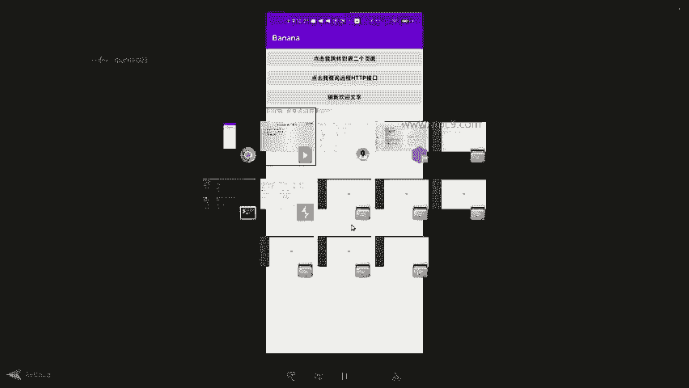

在代码里面。这个是对应的叉ML啊，我们点击design，可以看到上面是三个静态的按钮，然后呢还有一个叫做welcome text，这个是。这个就是text文字。那么这个文字一开始是空的，这个空的文字。

在activity里面。第三6行这里啊对这个文字的内容进行了一个设置，叫做set text。这个值是来自于叫get welcome text。来自于这个方法啊，大家注意啊，这个是一个独立的方法。

刚好可以为我们加上勾字啊，非常方便。然后呢，这个方法返回的值就是你好啊，什么什么什么。所以说啊我们给它运行的时候看一下啊。嗯，那么这里呢就是连上了我的小米设备。小米设备呢？你现在跑的是一个。嗯，正式版。

所以说这里没有debug什么什么process，不过不要紧。注意到这了吗？在这里有一个。logg啊。log点I第一个参数是一个字符串。第二个参数是。log的内容啊告诉我们已经刷新之后内容是什么。

所以说呢我们在这里输入两个等号。嗯。给他先清空一下。清空了哈。然后我们就再来点击刷新。看到没有？已经刷新，内容是您好啊，安卓逆向高手。

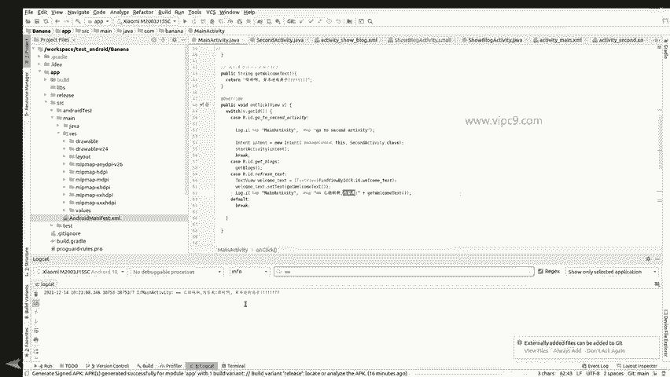

我们再点击一下刷新。

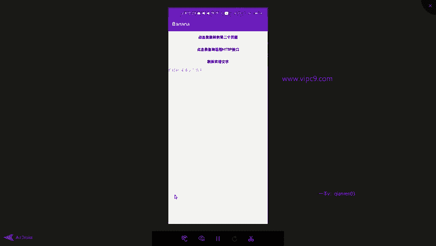

看这里出现第二行，你好啊，安卓逆向高手说明这个按钮它是起了作用的啊。然后下面我们看一下如何使用frreeda来影响这里面的内部逻辑。这个时候我们要确保两点。

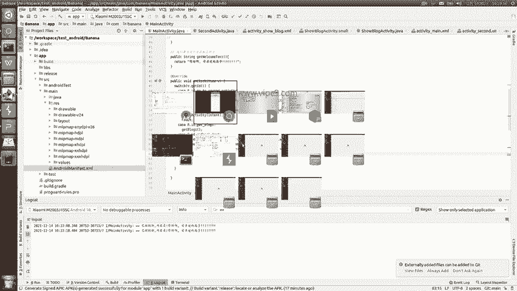

第一点。我们通过ADBshall。来登录手机端。然后。第二点，记住啊，一定要使用管理员的这个权限，也就是通过SU切换到root之后，再运行这个fred server。这个时候发现他就已经跑起来了。

跑起来了之后呢，我们可以通过这样。PS free P。横线优。grarab banana看一下这个进程在不在啊，发现这个进程是在的，它的进程ID号是。😊，30753对不对？我们查看一下啊。

比如说前五行后五行。那么通过这个福瑞达PS就能知道啊，这个APP已经在运行了啊，它的对应的进程ID是30753。我们这个时候可以通过ADBlog cat。grab30753。可以看到啊。

这里的log内容跟我们刚才在安照studio里面看到的是一样的。然后现在是fredda已经跑起来了。在这里。我们。

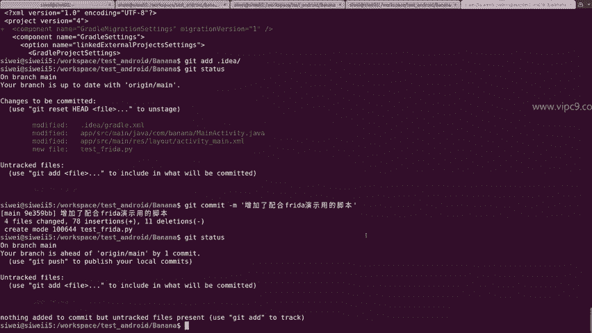

修改一下刚才的修改一个脚本啊。大家看这个脚本。这个脚本就是我们的fer的脚本。我们把这个内容给它统一进行复制粘贴。放到你的PC端的任意一个位置。比如说在这里我给它放在了这个文件夹下。总共是35行。

包括空格啊。说一下它的作用。上面。第二行，这里是一个注释。python里面注释用井号。第三行是导入对应的第三方库啊，这个不说了。第四行DF这里定义了一个方法。方法名称叫做on message啊。

传递两个参数，一个是message，一个是data啊，这里是print啊，这个是不说这个方法是干嘛用的呢？方法是用在了下面的这个3十行啊，也就是报错的时候，这个方法特别有用。然后第十行这里是JS代码。

也就是javascript。在这里面。第十二行声明了一个变量，这个变量通过java点use。获得了。对应的。进城的activity，这个进程的。包是com点banana啊。

然后对应的activity叫ma activity。所以说这里是它的完整的class的名字。然后下面这个根据class的名字获得了这个对应的方法。那么这个方法呢。在第十五行到第十九行这里进行了改写。

为了大家看起来方便，我把这两行代码注释给它关掉。那么在这里。把这个方法进行了改写，这里点implementation英文就是实现的意思。然后这个方法现在返回的值是你好，略略略。

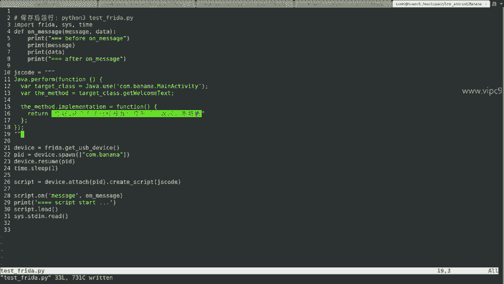

啊，之前的返回的值是你好啊，安卓逆向高手。

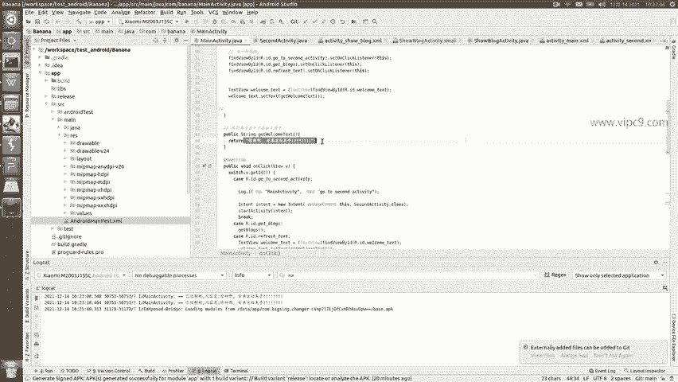

所以说这个就是通过JS代码来覆盖掉原来的方法。下面第21行啊，python代码先。

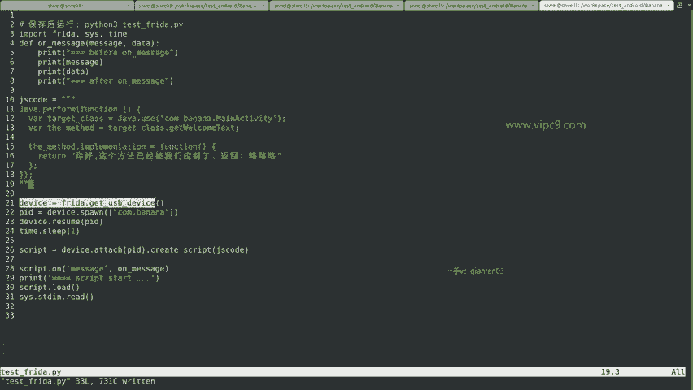

获得USB的设备，也就是我的这台手机。

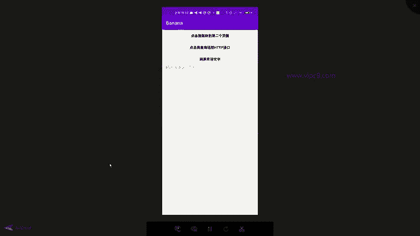

然后通过报名获得对应的进程。然后把这个进程给它重启一下。然后等一秒钟。啊，然后就把我们刚才写的GS代码给它挂载上去，我们就可以看到效果。

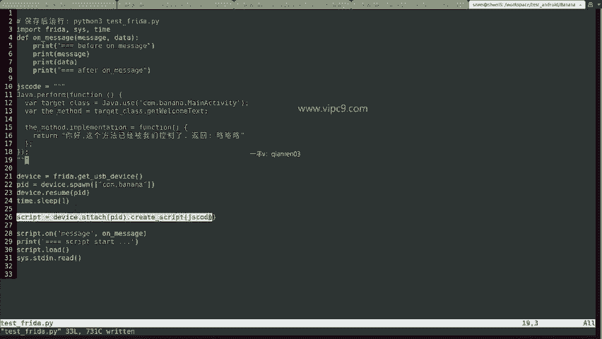

好的，那么万事俱备，我们给它运行一下。pyon3。啊，python3test freedom。我这边一回车啊，大家看这啊。

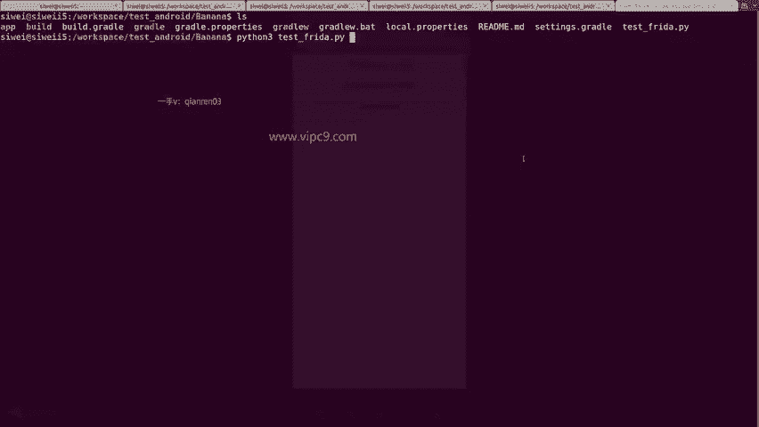

你看一回车立刻就APP就重启了。😊，重启之后呢。我们点击一下这个文字啊。点击一下这个。按钮刷新。可以看到。底部的文字已经发生了变化。他说你好，这个方法已经被我们控制了。略略略啊。

这个就说明我们的fredda这里已经生效了。😊，同时我们看一下安卓的log。grape这个等号就好了啊。看哈。现在我们再回到这里，我再点击一下。看下面又出现了这个log，他说已经刷新怎么怎么怎么样。

这个就是一个。最好的演示啊，这个方法是可以通过fred，我们对它进行钩子方面的影响。比如说改写它啊，那么这个方法最常用的就是绕过java代码层面，对于SSL证书的验证。那么这里呢再跟大家说几个点啊。😊。

那么有的同学可能会问，老师，为什么我这边进来的时候第一次看到的这个按钮，它没有返回6略略，就这样点击之后。啊，为什么会显示你好啊，安卓逆向高手，因为安卓在首次加载的时候，它是。

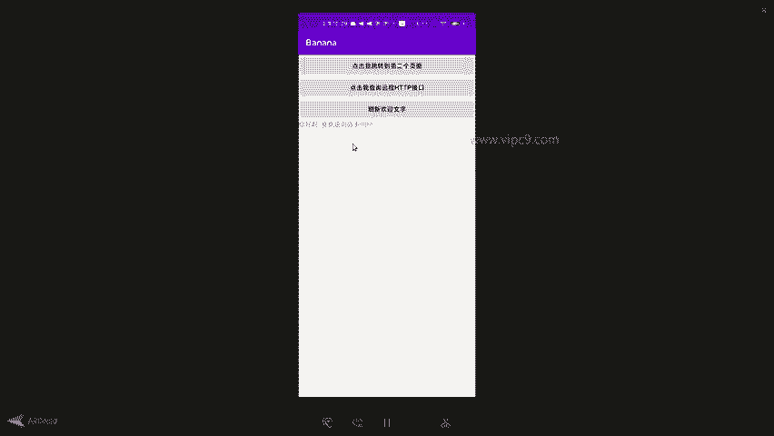

遵循着代码走的。那么在首次加载的时候，这个时候，fedda并没有。运行啊，或者说我们的脚本并没有运行。所以说呢安卓这里的代码还是走的get welcome text括号里面的内容啊，所以说这个的话。

我们在第一次的时候看到的还是这个值。只有当我们第二次这个fa在跑的时候。

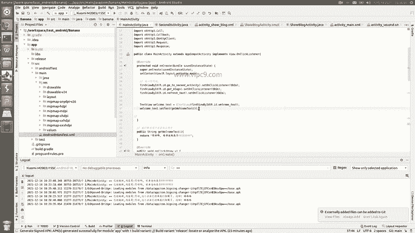

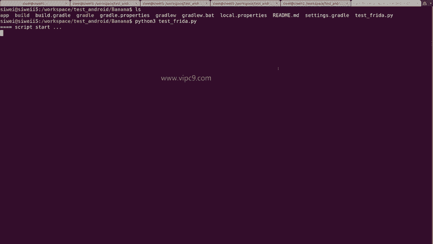

给它跑起来的时候，并且这个APP这个时候重启了，然后我们再处发对应的这个方法，才能够看到对应的值啊，是这么一个情况，这是第一点。第二点就是一旦这个APP我们把进程给它杀掉。在重新启动的时候。

那么这个时候再摁是不好使的。

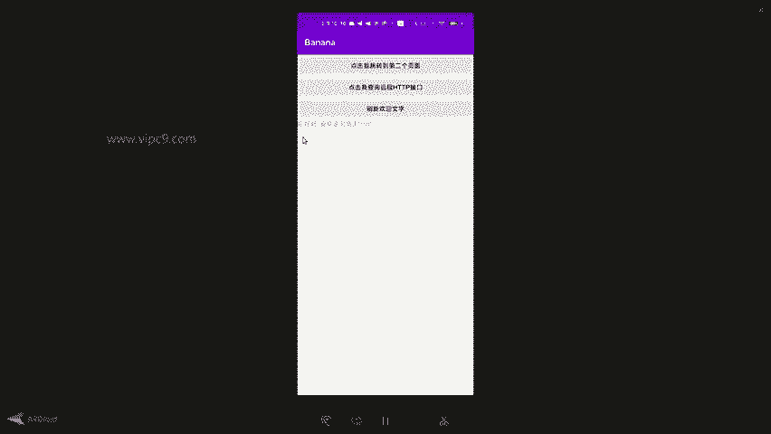

看到了吗？啊，为什么呢？因为这个时候并没有加载frreee环境啊，尽管这个上一次的脚本还在这里运行，但是呢它是不管用的，我们还要给它关掉，重新再来。

这个时候我们再点击啊就可以了。

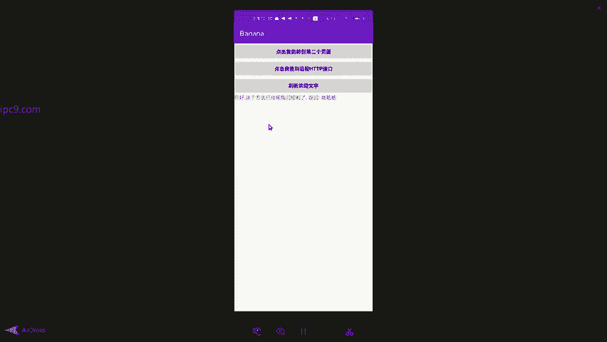

好的，那么这个就是一个。

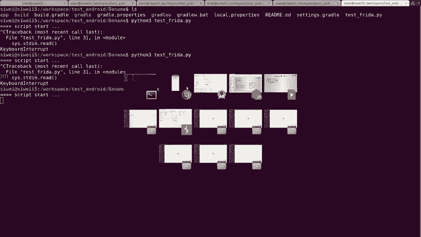

feda实现钩字方法的真实的例子。

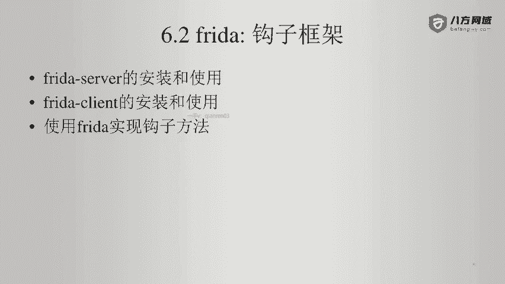