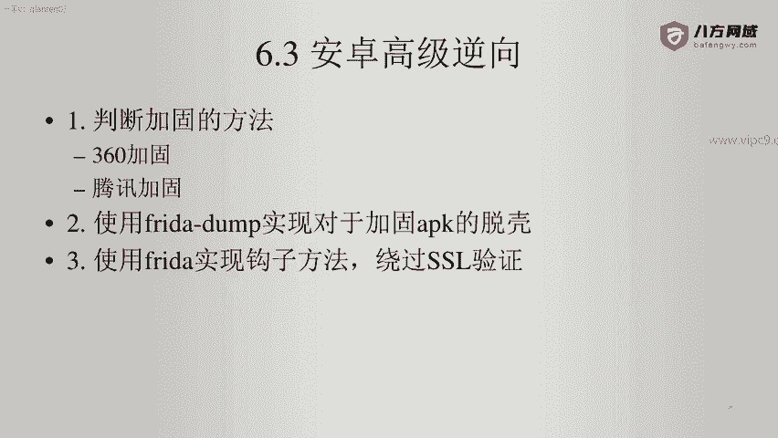
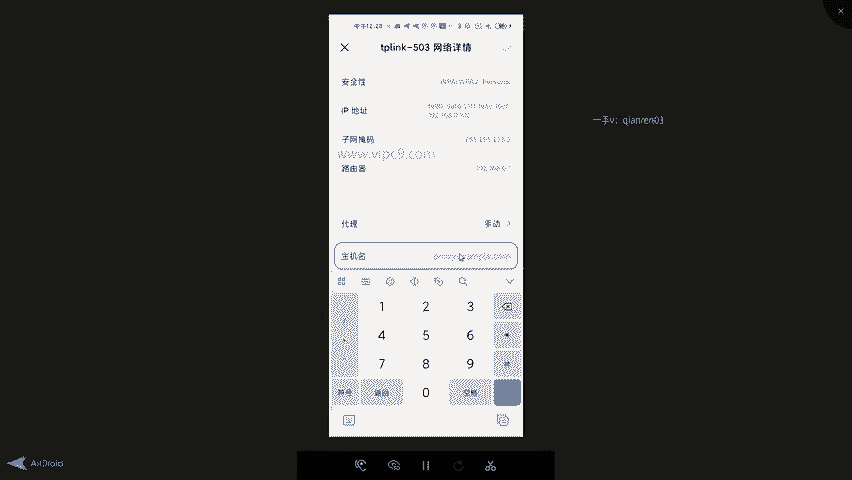
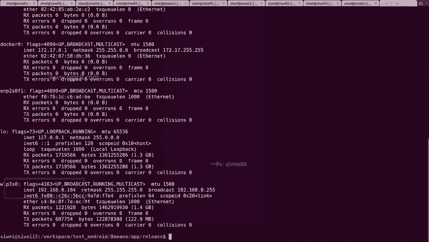
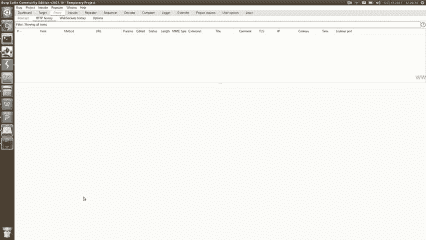
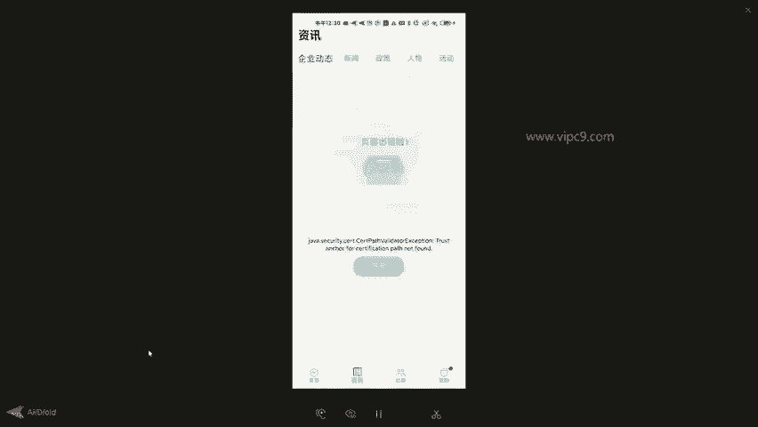
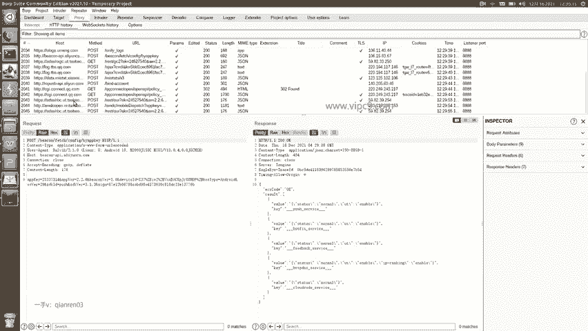

# Android逆向-基础篇 - P47：章节7-5-判断是否存在代码层面的证书校验 - 1e0y_s - BV15jhbeCEQk

下面我们看一下使用fredda进行钩子方法，绕过java层面的SSL验证。

那么第一步我们先看一个正常的APP啊。比如说右下角有一个叫做数联通的APP。点击打开。这个呢是一个数字货币，数字货币目前来说它是一个灰色的东西。那么点击首页可以看到有这些内容。点击我的。社群没有资讯。

这里是有些内容。所以说正常的话是这样。下面呢我们对它进行抓包。设置一下。找到这个局域网叫503。然后点击代理。手动。输入PC机的IP地址。

我们看一下。PC机的IP地址，刚才我已经输入了啊，看到这个页面我再来一次。对于windows的同学是IP configlinux和mike是if config。在这里呢。就找。有很多种地址。

那么这个就是局域网的地址，192开头，有的时候是10开头。所以说呢这里是点104。

所以我就在。这里输入192。点168点1点0点104。端口号是8888。点右上角确定。好的。这个时候呢已经通过。

verb suit开始了抓包。但是在这里呢，由于我什么都没有打开啊，所以说这里是空白的。

好的，回到手机端。打开这个应用。重新打开吧。看一下有没有抓到什么东西啊。嗯，进来之后看我点几下。嗯，发现跟刚才就不一样了，看到这个页面没有？

叫做shird pass validator exception已经报错了。

点击首页什么都没有。然后回到bb suit。发现bb suit这里抓到的。哎呀，要么就是淘宝的，要么就是有盟的，要么就是Q的啊，没有一个是这个APP对应的真实的服务器的地址。

所以说呢这个就是我们判断。这个应用有没有在java层面上对SSL证书进行校验的一个标准？那么这个应用呢其实是非常实在啊，它都已经报错了，我们稍微有一些编程的功底或者编程的常识。

就知道它这个叫做cerhirt path，什么什么exception，对不对？cerert不就是证书嘛？啊？certificate的缩写。然后viidator不就是校验嘛，所以说证书校验出问题了。

所以说这个APP非常实在啊。

