# Android逆向-基础篇 - P48：章节7-6-脱壳并使用frida绕过ssl证书校验 - 1e0y_s - BV15jhbeCEQk

下面我们看第二节。对于加固APK的脱壳。

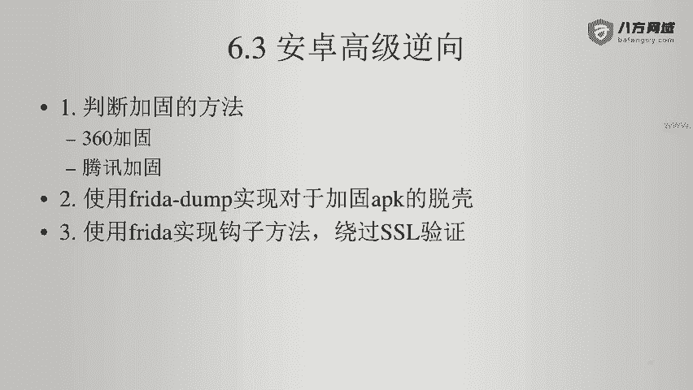

仍然使用数联通这个例子啊。大家注意这个APK啊，第一步先让它在我的安卓设备上运行。

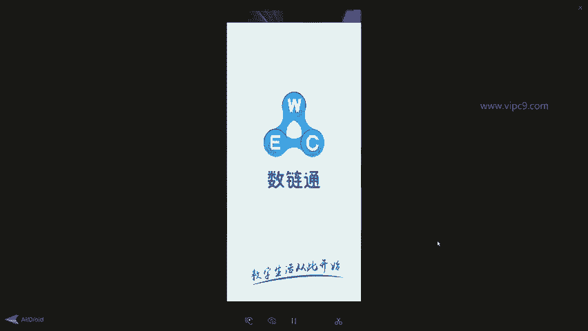

第二步，我们进入到。我的ADB啊。看一下，现在是已经连接到了我的PC端。然后我们。ADB share进来。看一下。I。Confit。发现权限不足，不要紧。先进入到我们的。

freder server目录下。看一下这个目录。然后切换到root。验证一下。没问题啊。所以说。把这个fred的 server跑起来。跑起来之后。进入到本机。Dax stamp。安装目录。在这里。

实际上从gitthub下载之后是这样的。然后进入到这个文件夹。现在APP已经运行在这个最顶层了。所以说我们。运行。可以看到这个APP。自动的识别出来进程是5010。包名是点vol作为结尾。

绿色的文字就表示创建了这个dex文件，蓝色的就表示。跳过了。好的，我们继续等待。发现相关的进程有3个，一个是5010，一个是5156，一个是5200。好的，那么这些就都弄出来了。看一下。这里。

多了一个目录。目录的名字。跟APK的报名是一致的。所以我们进来看一下。可以看到。这几个。这几个。内容都很大，以兆为单位。下面这些。基本可以忽略啊，太小了。这个也是以照为单位。所以说第二步。

我们使用这个命令。把所有的dex文件。都做一个转换。好的，我们就这样等。可以看到现在转换的是E8000。对应的是。E80006。5兆。所以说耗时略酒。这里给出的警告啊，我们可以给他忽略，不要紧。好的。

这些都是输出。啊，可以看到。这里come点等等等等。这个是不是就是我们目标的这个。文件的目录结构。等好。那么在这里呢可以看到继续在输出。这个过程基本上就是几十秒。好的，结束了。然后我们看一下。红色的。

都是JR文件。然后我们就可以通过启动。JDGUI。

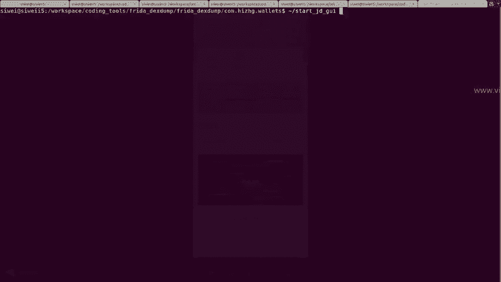

来依次打开。那么我们先打开哪个呢？看一下哈，我们先打开大的文件哈。wiite一下吧，这个是linux的命令。那么在这里面最大的文件是6。9兆这个。那么我们就打开它，它的尾号是8000。

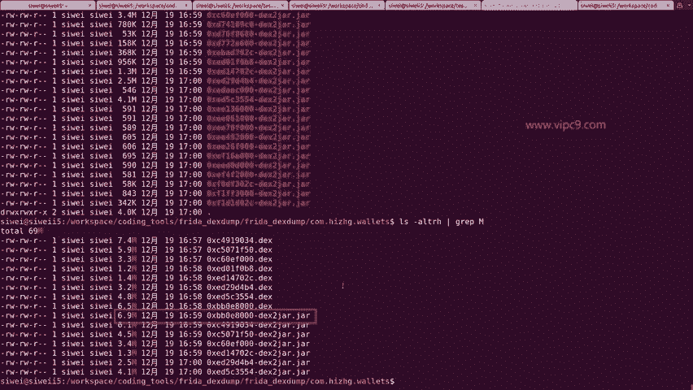

尾号是多少？18000。所以说他找到这个。一把钳双击。看这里有个com，对不对？打开它。嗯，发现这三个没有用。😊，不认识一个是TF。啊，这是什么？我们不认识。不理会。这个是腾讯的。上面这个是什么？

AMS。等等等等啊，我们不予理会。看一下第二个，这个是。9034。找到9034。这里有一个com。开箱验一下货，看看是不是啊，找到了在这儿。😊，看到了吗？还智慧谷。那么就是他了。

在这里面我们随便打开几个看一看。对不对？那就是这个啊。报名什么什么都是一致的。好的，那么我们就把这个文件给它导出。在这里啊。因为我们要导出这个包下面的所有文件。

所以说呢在这里我们就要选择filesave all。然后在这里，比如说。1o2。19。接下来我们就等待。这个时间。长短会根据项目不会根据项目的不同而不同啊。那么现在看起来我们现在这个保存还是很快的。

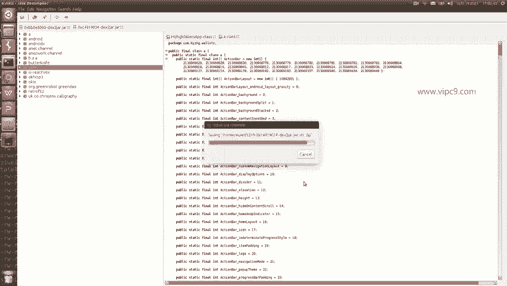

好的。那么下一步我们就进入到一个文件夹吧。比如说。Test。Read达呆。在这里，然后呢我们把刚才的。那个文件。给他copy过来。加缩。加压缩了之后呢。可以看到这里已经在这儿了。已经在这了。

所以说这个是我的比较喜欢wim编辑器啊。喜欢slam的同学可以自己更换。嗨智慧谷对不对？是不是就在这儿了？那么这个是第一步。然后我们再回过头来啊，找一下刚才它为什么会出现说一个异常。

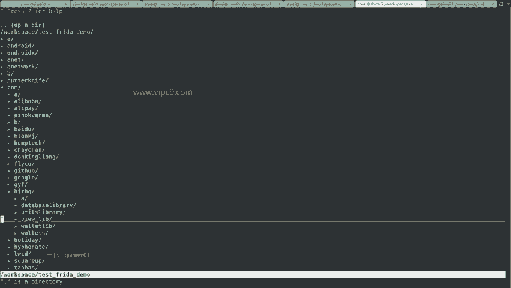

这个异常啊，那么我就先不给大家重现了啊，只需要我在这里。啊，把这个代理服务器手动的改成。

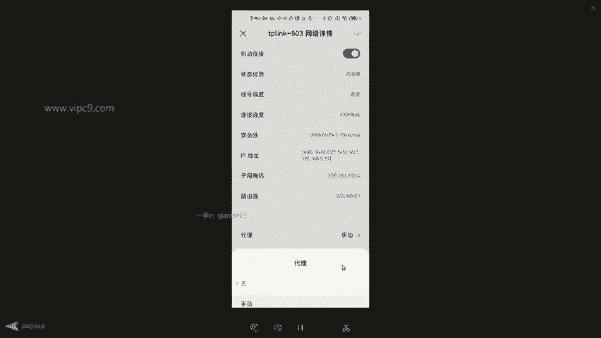

对应的代理啊。

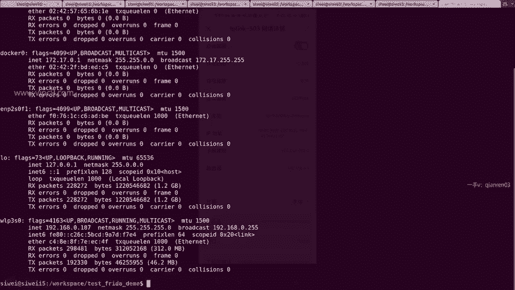

在这里点107。还是试一下吧。好的，现在我给他增加了代理服务器。然后重新运行这款APP。看一下有没有报错。好的，我们就找他的这个报错，对不对？什么shirt validator exception。

那么为了节省时间，我给它输在这里。输在这儿了之后呢。点击啊找几个看起来差不多的。那么在这儿呢。这个就是异常的完整的名字。java什么什么什么。那么这个异常我们看一下。他的出现一看，这个就是跟证书相关。

啊，这里显示的都是。证书啊。那么这个就很好说了。为什么好说呢？在这里。这个就是完整的信息。我们可以对它进行。啊，复制粘贴，然后再搜几个。找线索啊找线索。那不能。会找到一个这样的线索。

就是这里会有一个叫trust manager。看到了吗？这段代码。我省略了大约5到10分钟的这个搜索过程。那么这段代码大家。啊，之前我们用。呃，10分钟的时间做了一个java的极速入门。可以看出来啊。

在这里先声明了一个key store。这个文件，然后呢。在本地打开。打开之后呢，在这里通过trust manager啊进行了一个调用，然后在这里又进行了一个验证啊，对不对？

所以说呢在这里我们就先记住一个关键的类叫做trust manager。然后我们。回过头来。这里由于都是我们的。呃，源代码。所以我们搜索一下。在这里我用的是linux下的命令叫grab啊。

windows下的同学可以用你喜欢的编辑器来搜索。搜一下，嗯，可以看到源代码里面出现了很多这个class。其实你也可以搜刚才最开始出现的。这个异常的名字。但是搜一下吧。搜这个发现没有搜到啊。

那么就说明这个异常跟编程是没有特别特别直接的关系的啊，所以说我们就根据这个继续来查找，就发现啊这里有个这样的东西啊。那么这个trust manager刚才我们搜了一下啊。

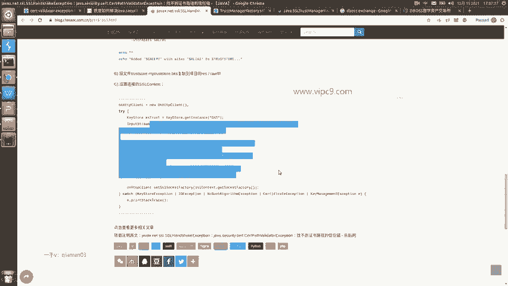

搜索结果是这样，啊那么在这里面呢，我们可以看啊在这里面我们可以看到啊OK这个开头的都是呃没有用的。😊，在这里有一个最最关键的，看到这里了吗？come high什么ZHG等等等等等等。

这个文件就是这个APP的最原始的原文件。所以说我们。起来看一眼。进来之后呢，发现。😊，是在这里。在这里啊。certificate factory get instance X。509。然后呢。

在下面就会抛出各种异常。通过读这个源代码，我大概能估计出来，这是一个对证书做校验的过程。所以说呢我们下一步要做的就是通过fred server啊来绕过这个东西。怎么绕过呢？包名是这个对不对？这个是类名。

这个是方法明。方法带两个参数都在这里。

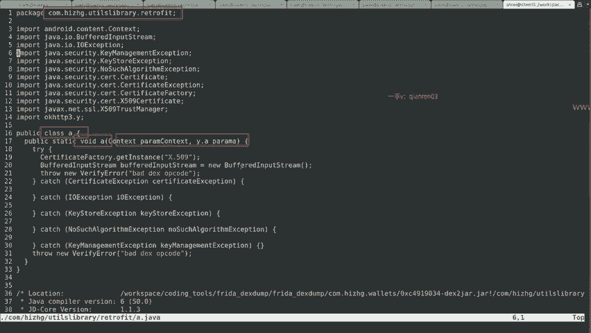

所以说我们就需要写一个脚本。

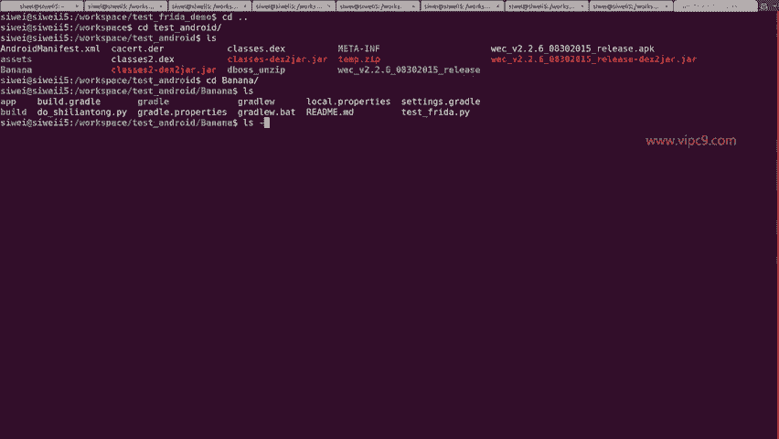

那么这个脚本我给他起一个名字叫做啊。度是联通啊，左下角就是它的名字。那么在这里呢。为了节省大家时间啊。我花了5分钟。写好了这个文件。这个文件第二行这里是python的语法啊，大家不需要懂啊。

导入一个frreed的第三方包啊，导入系统和时间这样的第三方依赖。这里是声明了一个方法，这个方法是仅供我们调试使用。第九行非常重要，这是一段JS代码。那么GS代码呢运行在pyython的虚拟机当中。

在这里。java点us后面这个包名加类名。看到了吗？就对应了我们刚才源代码里面的上面。packackage名字啊，come点什么什么点retrofit。class名字是A。刚好是这样的。所以说。

这个代码的第十一行就声明了一个我们要挂载的目标的类。第十二行声明了方法啊，那么方法名就是target class点儿A。这个点A对应的就是。这个点儿。由于这个点A方法，它有两个参数。

一个是context，一个是Y点A。那么在这里面，我们对这个方法进行重写，看到了吗？implementation重写有两个参数，A逗号B。那么在这里面。重写的话啊，什么代码都没有，就是一个空的方法。

也就是说这个原本对于。SSL证书进行验证的方法，现在是啥都没有了。

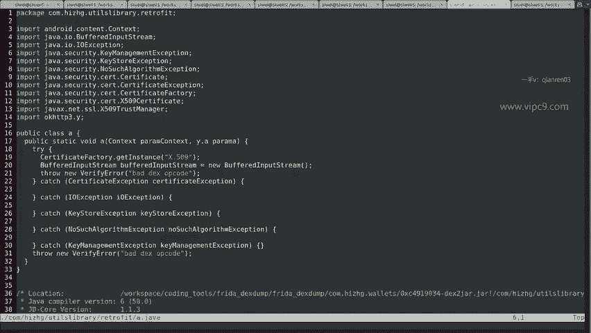

我们挂了一个钩子。

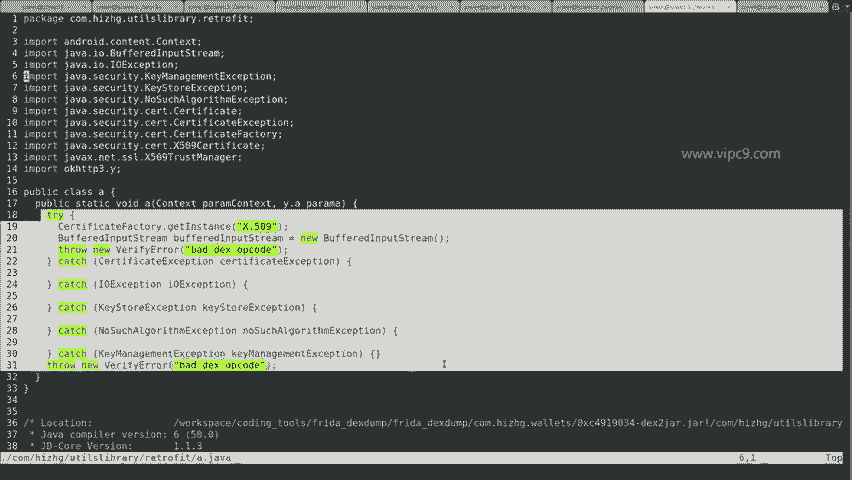

好的，然后下面看一下。第二十行找到这个设备。2一行通过报名找到对应的进程。然后呢。等一秒钟之后。运行这个脚本儿。然后啊。做下面的事儿。好的，我们给它运行一下啊。

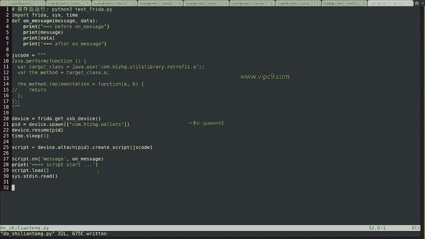

看好大家现在是。啊，现在是这个APP的页面。那么我们先不理会他。

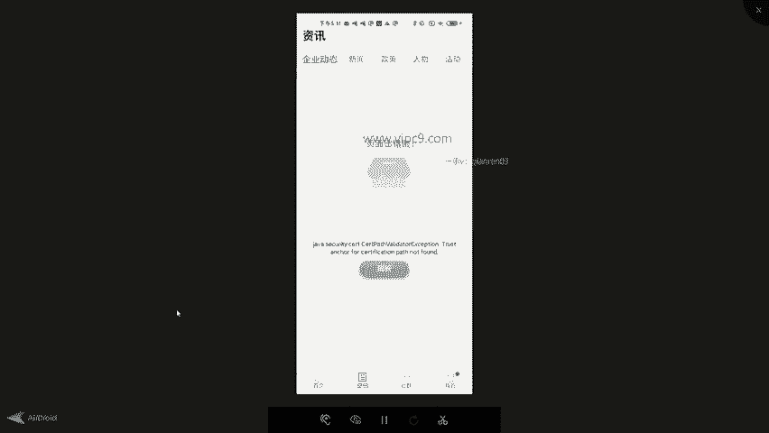

直接运行脚本。

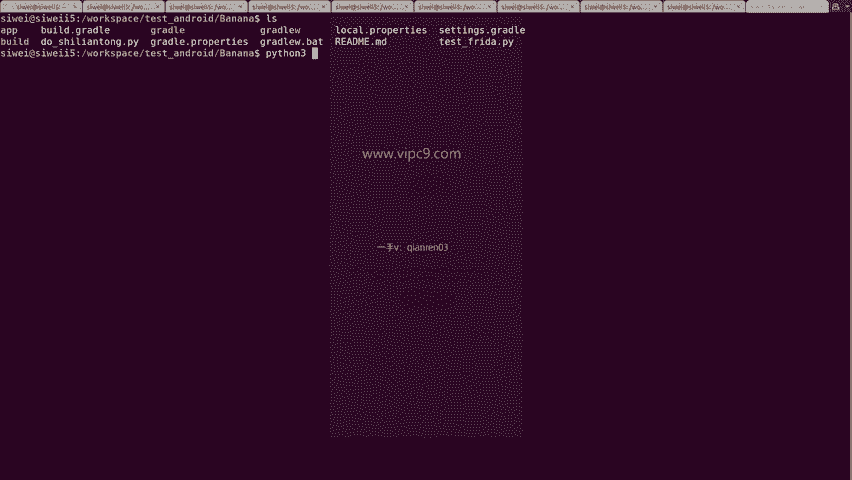

回车。看一下。嗯，这个APP重启了啊，这个重启就是由刚才的脚本造成的。嗯，看到没有？现在数据都已经出来了。资讯。嗯，刚才还报错，现在不报错了。对不对？所以这个就是用free的脚本。绕过java代码层面。

对于SSL证书校验的过程。

看这个呢就是我们跑起来的这个python代码。然后呢，这个时候一定记得哈。

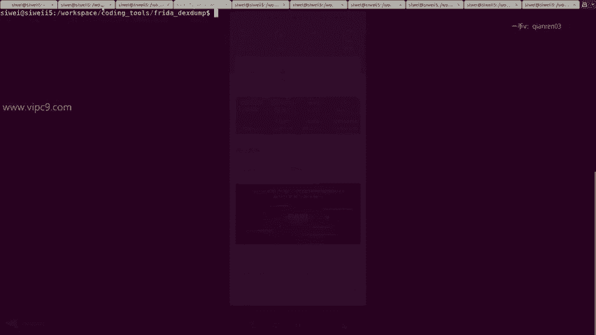

一定记得哈，我们的在这里。安卓端一定是要运行一个呃frreee服务器的。好的，那么这个就是一个比较正常的，或者说顺利的过程。老师在做这个时候呢，第一次也会发懵啊，第一次时间大约是现在的2倍到3倍吧。

好的，那么说一下他的几个注意事项啊。第一个啊。我们使用这个fred deck dump的时候。如果发现有问题，比如说昨天用还好好的，为什么今天用啊它的对应的DEX文件就拿不出来了呢？这个时候。

我们要记得删除缓存文件。缓存文件是这个。缓存文件是下面的，看到了吗？RE点儿fred点server。这个是一个文件夹。看一下。这个文件夹里面包含了一些管道文件啊，fred德的帮助文件以及代理文件等等。

所以说一个稳妥的方式就是。给他删掉。那么这是第一个。当然了，删了之后啊。你当前的用户有可能就。不是root用户了。所以说如果你想再给它运行一下。继续切换SU，然后再怎么怎么怎么地。这是第一个注意的。

第二个啊就是。重新安装目标APK也就是说我们现在看到的这个啊给它删掉，重装一下。好的，那么这个是。第一种。问题。第二种就是fredd dump啊，它偶有是不成功的。

它不是百分百能够保证把一款APP里面的啊对应的dex文件都给它导出来。

那么这个时候我们就需要多尝试几种其他的方法。比如说unz。安啊这个按zip是可以把APK文件里的。内容。通过。呃，解压缩之后啊，导出这个dex文件的。比如说啊我们之前一直在讲的。啊，就这里啊。APP。

Release， releases。然后。按z AK啊看这个就是我刚才通过按z命令。加缩命令导出来的。那么在这里就会有一个class点dex。

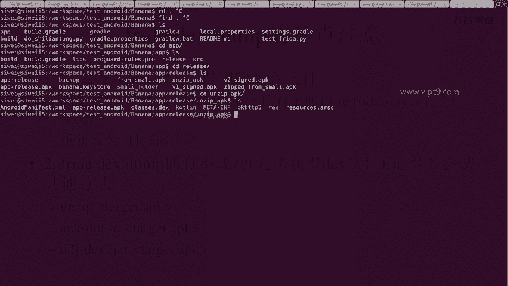

这是一种。第二种方法，通过APK two来。加缩或者导出。第三种，通过D two jd toJR也可以给它导出。我们看一下。嗯。做一个copy吧。给它copy一下。

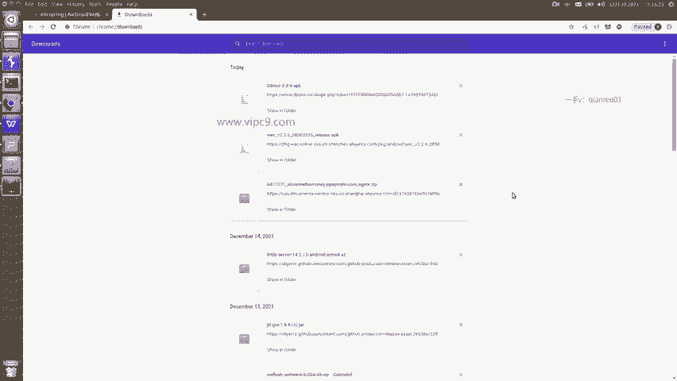

比如说这个就是。啊，最原始的APK文件。然后就可以D twoJ。dex two JR，然后。这么一回车啊。啊。我们分别看一下。这个是APK two来解压缩。嗯，可以看到。class这是可以获得的。

记得先不说了，演示一下D two G。这个。它也可以把APK直接转换成JR文件。然后我们通过JD。这边。不过不要紧。这啊我们先启动一个。JDGUI。提前准备好。嗯，好了。看一下在这儿对不对？

所以说我们打开这个文件夹。workspace下面的test free demo。在这儿。好的，就是他啊，稍等啊。

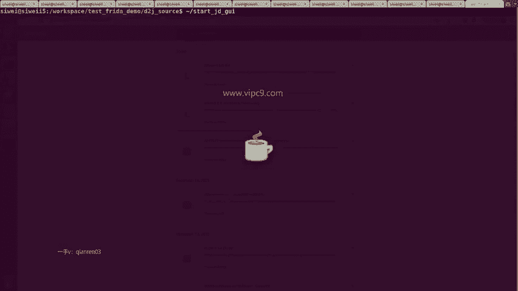

Test free the demo。下面的D two G。Soce。好的，那就是他的。可以看到啊，在这儿也有一个com文件夹。这里面看到这儿了吗？也是一样的，有目标文件。好的。

所以啊这个就是我们的第二点注意。

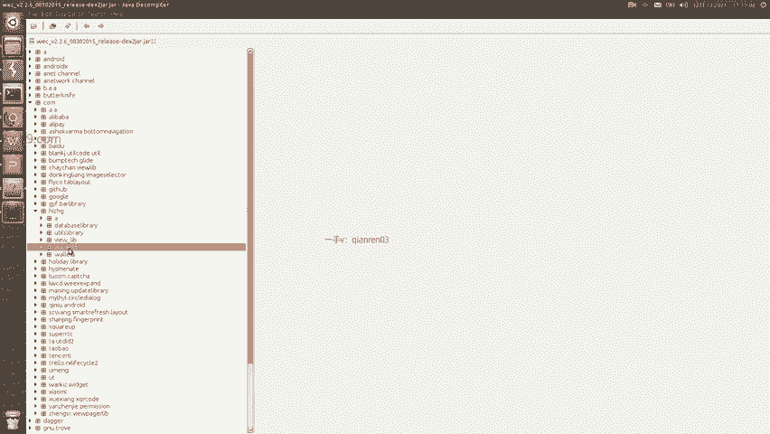