# Android逆向-基础篇 - P49：章节7-7-apk反编译成smali再重新打包成apk - 1e0y_s - BV15jhbeCEQk

下面是重新打包。他的过程是这样。第一步，先根据APK得到smarly。第二步，修改smarly。第三步。使用APK two把修改后的代码重新打包。第四步呢就是签名。先生成一个签名文件。

然后再分别做V1和V2千米。这样的话，我们得到的文件就可以在手机上面安装了。那么我们依次看一下啊。现在我们看这个我们的测试机。在这里的话增加了一个按钮。叫返回te或者false。

那么正常这里点击之后返回的永远都是处。我们看一下源代码。在源代码里。这个是main activity点java。在这里面，我们。在它对应的视图层。增加了这个内容。看到这个按钮了吗？

button这里显示的是返回处或者false，它的ID叫做return bullet列。然后回到刚才的activity。在这里面对刚才的。按钮做的事件监听。同时。在这个按钮这里。加了一个事件。

只要点击了，就会调用show alert。然后在这里呢。打印的内容来自于这个函数叫做get SSL verify result。这个函数我们看一下。在这里。他在这里返回的永远都是处。

那么我们接下来要做的就是通过修改smarly的代码，让这里变成false。好的，我们再看一下这个APP进来之后。点击永远都是返回处，对不对？下面我们对它进行反向的过程。Build。我们。先拿到一个。

经过了V1和V2签名的APK。稍等片刻。好的，那么这个文件已经签名好了。在这里。我先删掉一些没有用的东西啊。那么在这里呢，这个文件就是刚刚刚刚生成的。我们。打开一个。

命令行。进入到这个文件夹。

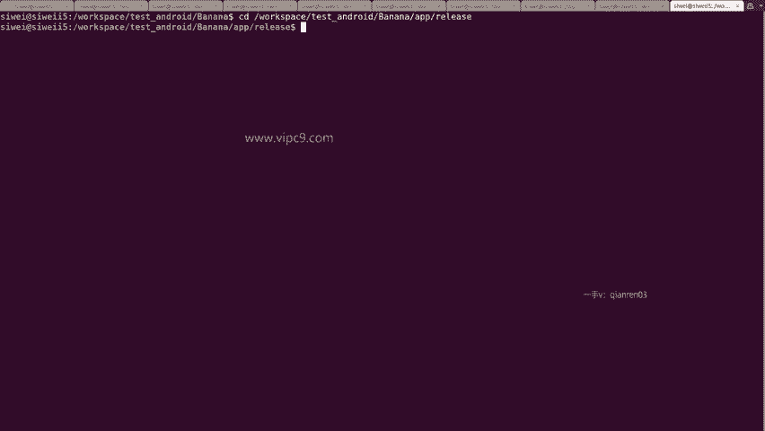

可以看到只有这个文件。那么。

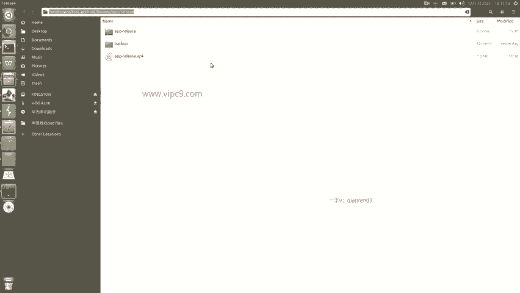

根据我们根据我们的这个PPT先通过这个命令。对他进行。反编译。比如说这里就叫做。Smarly soda。好的，现在APK工具正在对这个文件进行反编译。反变译之后，我们看一下。

多出来一个文件夹叫做sly folder，对不对？我们进来。

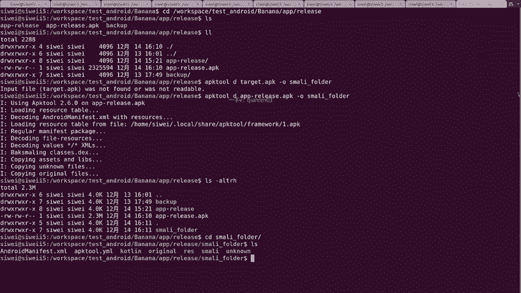

看一下啊，这里面。蓝色的都是文件夹。coorinalRES等等，这些我们都不变。有兴趣的同学回头可以改一下它的图片啊什么什么的。在这里我们只是修改smarly。那么smarly这个文件夹下面。

这个com啊，安卓 X啊等等，这些都是跟我们的原文件这里相对应的。

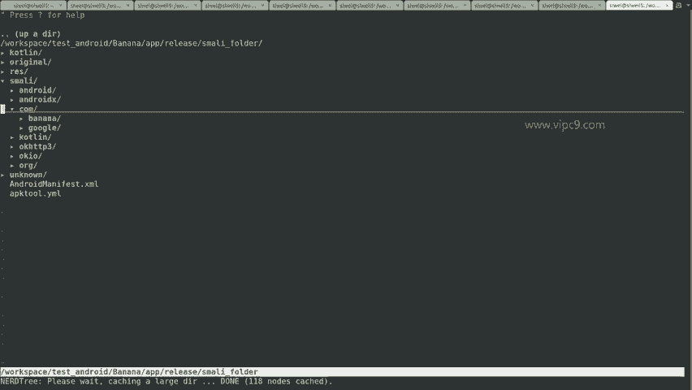

那么我们看一下原文件，这里是main activity的java，对不对？

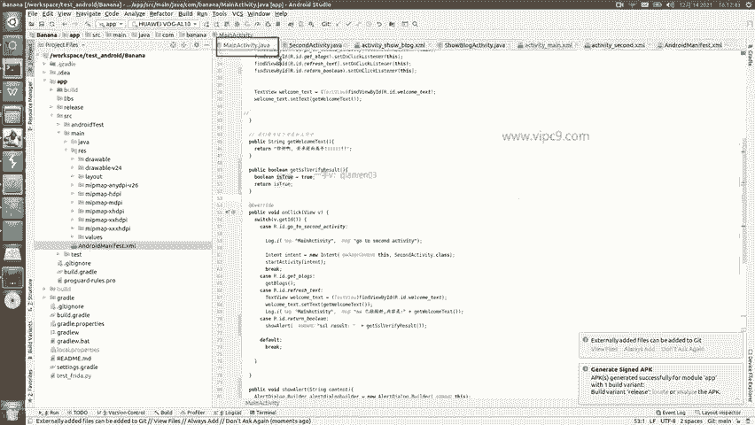

所以说我们在这里找。看都在这儿啊，叫做main activity。然后呢，有几个后缀，我们依次看一下。这个是第一个啊，内容非常干净，就叫做main activity名称很干净。第二个。

发后面发了一个doller一没有找到。那么。我们可以在这里面打开啊。

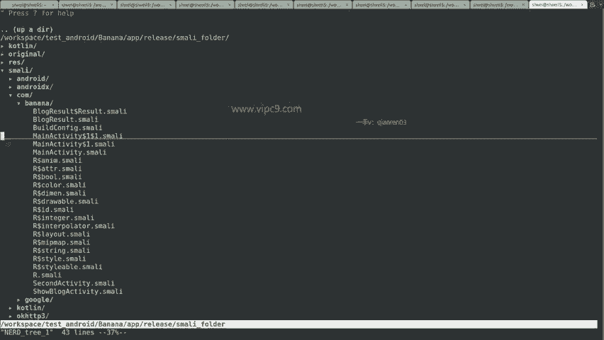

Smily folder， smartly， calm。看一下他们都是什么。这个打开了之后呢，也能看到main activity等等等等。但在这里。的一些内容看到没有？

都是什么on responseon failure等等等等。像这种方法一看就是继承于它的父类。继承于。这个它的负类啊。刚才看到的那些方法并没有放在maakeactivity这里面。所以说。

这个文件是没有必要改的。再看一下这个2个SE。在这里面呢，他的方法都有什么？有run，对不对？那么看起来这个更加底层。所以说呢这个也不改。我们只需要修改这个main activity就可以了。

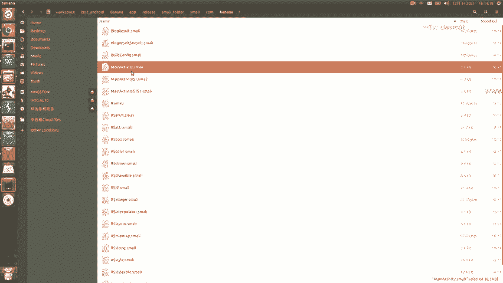

所以说。打开它。在这里面看到啊有这样的方法，比如说这里叫做metd， method就是对于方法的定义。这里呢我不会对smarly语法做过多的阐述啊，大家能够基本看明白什么代码是什么代码就可以了。

比如说这个点and。metd就表示一个方法声明的结束啊，第二implements这个对应的就是上面的这个。

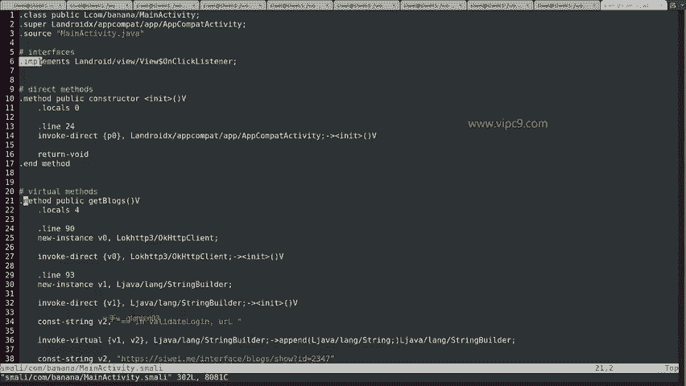

所以这个我就不细说了。那么我们找到这个方法叫做get SSL。

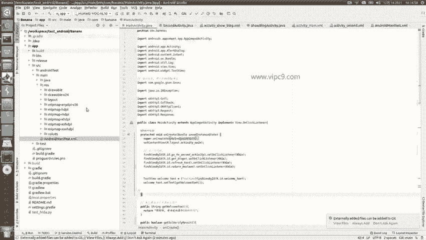

very fine。所以说在这里啊。Get S，SL。已经找到了方法就在这儿，对不对？那么我们要记住一点啊，smarly是一个比较底层的语言，也就是汇编语言。

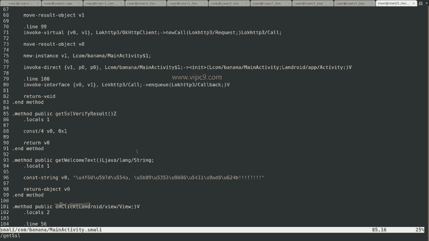

那么汇编语言呢？它的值我们就知道了啊，一般都是0X开头的。那么在这里源代码里面。定义了一个变量，然后这个变量的值就是处。

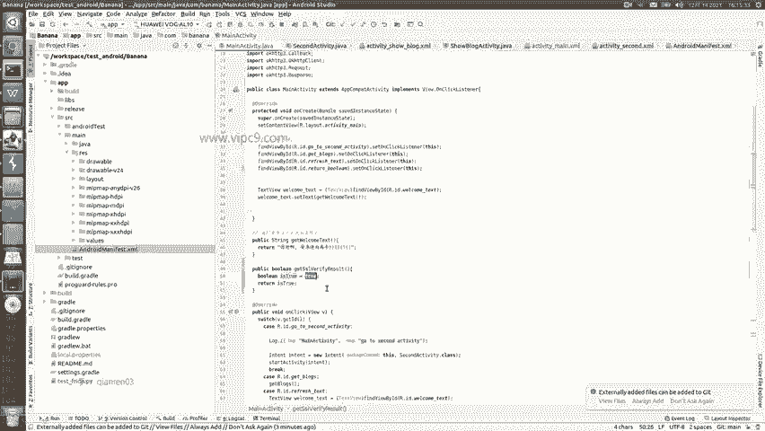

跟这里刚好对应。看到没有？定义的变量在这里叫做V0。然后返回的值是处的话，那就是0X1，这个就是十六进制的一。那么可以看出啊，在smily文件里面。处和一是一样的。那么我们在这里可以给它修改。0叉0。

这个就表示0。所以说大家只要记住。在smarly语法。0叉一是处，0叉零是false。好的，修改完毕。那么我们的目的就是为了让这个按钮点击的时候能够返回false。

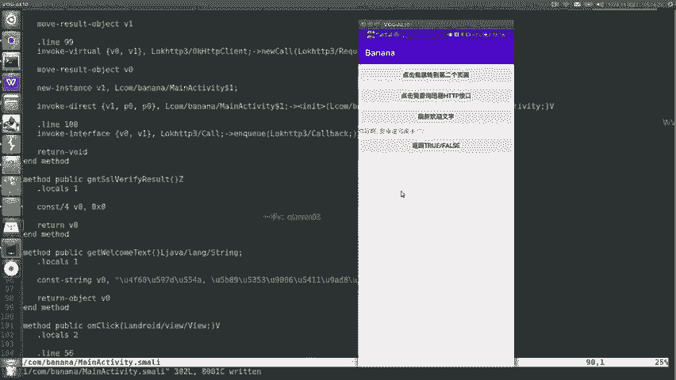

修改完了，保存退出。保存退出之后。下一步。使用APK two重新打包。对不对？这个就是语法。我们复制。粘贴。那么修改smarly的文件夹叫什么呢？就叫做sly folder。回车。可以看到。

日志已经在打印了。smiing什么什么intodex，这就把smaring文件转换成dex文件。然后嗯开始不断的放进新的内容，最后打包成新的APK。看一下。可以看到。在现在当前时刻，这个文件已经出来了。

叫做from money。看一下。第二步吧好。这步呢就是叫做zip line。嗯，据说是可以。把。文件进行一些优化。这个呢只是做检查，检查之后说验证失败，说明我们这个还是没有达到最优的状态。

那么这个就很简单，我们只需要给它复制粘贴。把刚才的这个呃横线C这个命令给它去掉，然后加上这个zip。就是给它打成一个。新的文件。改一个名字吧。Zpped from Smalli。他说。

z line没有找到。拼错了。C盘 line。好的，那么现在的话呢。这个。经过对齐之后的APK就出来了。然后再往下。生成签名文件。在这里整体复制粘贴。在这里生成。这里使用的。

名称叫做key two啊这个命令。然后生成key的名字，我给它叫做key啊，banana点key store。然后在这里是别名叫做banana。然后其他的参数就先不解释了。

这个过程跟我们在安卓啊studio这里面做的这个janurate等等等等。这个过程啊其实是一样的，只不过这里是命令行的模式。

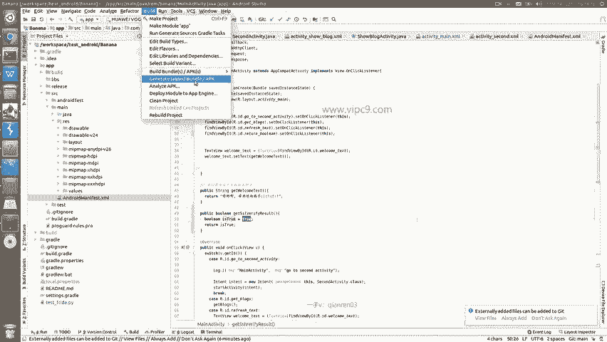

这个是首次呃进行签名的时候才需要。我们回车输入密码。那就6个6吧。输入两次密码，然后比如说你的。嗯。名字其他的这些其实可以都不添。然后在这里问。这些对不对啊，问就是你的名字啊，所在的省市区啊等等等等。

我们就说yes。回车。然后又问说。呃，正在生成一个。什么什么什么文件，然后请输入密码。仍然是6个6。好的，那么这样就可以了，他告诉我们说什么什么什么已经已经生成完了。

叫做banana点key store。好的，我们看一下。这个文件总共是2。2K已经出现了。下面我们进行V一签名。V签名的命令格式是这样。这个JR signer大家只要是。安装了。安装了JDK之后呢。

它就会自动带上。另外就是APK3呢。APK3呢呢是位于安卓SDK的bud tools目录下啊，到时候大家可以把嗯。对应的路径放到我们的path变量里面。然后我们就准备开始签名。那么在这里啊。

这个命令需要。两个参数。一个是签名之后的，比如说我们叫做VE signed。APK然后在这里是被签名的APK那么被签名的APK就是我们上面做的这个ziip。对齐的。然后最后的这个banana。

最后的这里banana就是以一个。文件的别名啊，那么这里跟上面的这个key store。在创建时候要做到对应。回车。输入密码。6个6。好的，那么现在V一签名已经做好了，上面其实输出内容很多啊。

那么就不依次给大家说了。总之呢这里就是对所有的文件都做了一个签名。然后。我们在做V2的签名。看一下刚才V一得到签名叫做V一s，对不对？我们。改一下被签名的叫V一。Signed。

然后前面这里得到的假设叫做V2sine。回车。然后问。密码啊输入666。好的，那么这样就好了。我们得到了一个V2s。然后就可以安装了。可能有的同学会问，为什么嗯。为什么要这么复杂呀，对不对？

因为你不这么复杂，不做签名就没法安装。所以说呢到这一步我们就可以退出，然后把这个APP给它卸载掉。记住啊。现在看到的已经安装的APP，它属于正版的APP。他的签名用的是正版的签名。

而我们刚才做的这个反编译变成smarly之后，再重新编译的这个签名是盗版签名。所以说安卓就是说你已经安装了一个正版签名，你是不能够再安装盗版啊，你你是不能够再安装盗版的这个文件的。

因为你的这个现在的这个banana是一个正版。所以说我们需要先把。正版呢给它卸载掉。然后。再把这个APK给它安装。安装的话呢可以通过命令行的形式，也可以通过。手动啊给它ADBpush。

然后在文件夹里边安装的形式。那么在这里的话呢。好，先给它安装上。好了，安装成功打开。然后点击下面按钮。看到了吧。这里返回的是false，说明我们这里已经生效了。那么这个就是。

把一个安卓文件啊从反编译到修改，再到重新编译的过程。