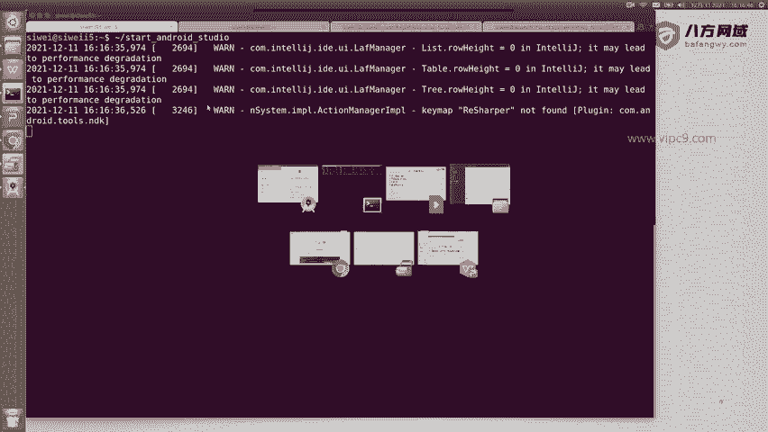
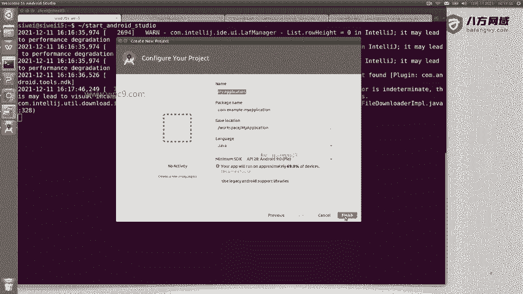
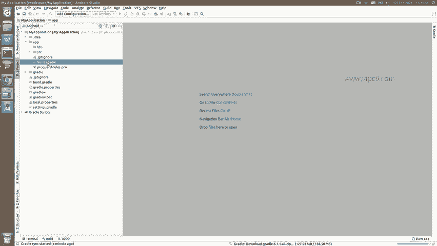
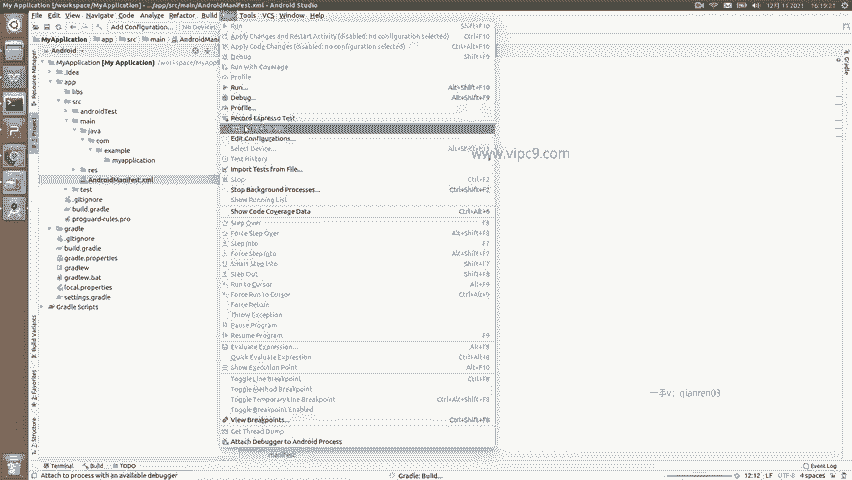

# Android逆向-基础篇 - P4：章节2-3-安装android-studio - 1e0y_s - BV15jhbeCEQk

好的，那么我下面把安照 studio给它打开。正常我们双击那个图标就可以啊，我这个是lininux系统，所以说需要在命令行里面运行这个脚本。那么现在呢这里我们可以看到。

这里已经。跑起来了。那么在这里呢，我就比如说选择start a new什么什么什么。就这里啊，那么说一下，第一个就是我们创建一个新的androidroid studio啊项目。第二个。

打开一个已有的安卓项目，已有的安卓项目就是这里这些。那么左侧都是历史上我曾经创建的像。第三个是从版本控制工具这里下载啊，我们一般都不用。然后下面这些比如说import呀等等等等等等。

这些我们几几乎都用不到的。比如说我创建一个新的安卓项。在这里面他问我随便什么选什么activity，这个我们先不选吧。啊，问我们创建一个名字等等。好吧，我先默认吧，我先让这个。

按照studio来快速打开啊。

那么下面我们看到这里就是一个按照studio它的开发操作界面。那么左侧这里可以看到啊，这里是有很多种不同的视图啊，这里是一个空白的。安卓项目啊，那么在这里可以看到APP呀，grad啊等等。

这个我在后面会细说。那么左侧这里的这个视图。就是一个导航视图。那么导航视图呢，在这里可以选择，比如说根据项目来看，根据这个呃package来看，或者根据这个文件夹目录来看，这个是我最喜欢的啊。嗯。

当然了它也有默认的。比如说通过这个按roid的来看。这是一种。然后就是中间的这里到时候会给我们展示各种代码啊，比如说。我们随便打开一个打开一个gradle文件。

或者随便打开任意的这个。安卓的配置文件对不对？是这些。然后上面就是分别是文件编辑等等等等。这个都是跟我们写代码相关的。那么在这里面有一个非常非常重要的一步啊，就是通过安照studio来安装安卓的SDK。

