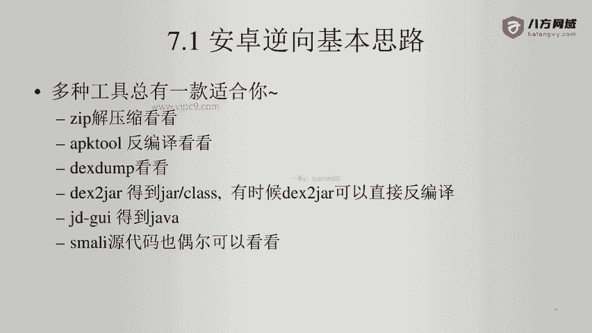
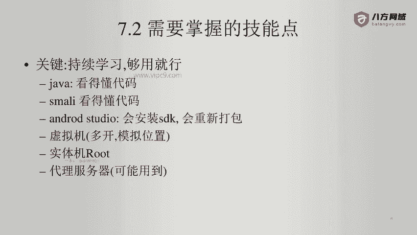

# Android逆向-基础篇 - P50：章节8-1-总结 - 1e0y_s - BV15jhbeCEQk

下面本章做一个总结。第一。安卓逆向的基本思路。第二，需要掌握的技能点。

第三，最佳实践。安卓逆向的基本思路啊就是。多种工具总有一款适合你。比如说使用zip把APK加缩先看一看。比如说使用APK two，把APK直接反变译看一看啊，有没有dex啊，行不行，有没有加固。然后呢。

可以使用dex stamp看一看。比如说B boss或者一些APP。大部分都加固了。那么dex stamp总能够从内存里面。把相关的东洞给它加载出来。然后呢。

dex to JR也不要把它简单的认为它只能处理dex文件。很多时候他能直接处理APK文件，而且效果更好。再比如说可以使用JDGUI从点JR得到java文件。另外，smar里源代码偶尔也可以看一看啊。

比如说实在没有思路了，那就瞅两眼。所以说啊这种是多种工具啊，大家都要尝试。

第二啊需要掌握很多的技能。也就是说我们一定要持续学习，这个是第一点。第二点呢就是不要学太细，够用就行。比如说java啊，我本身是做java呃，出身啊，我在入行的前三年半一直是做java的。

你要想往深学的话，那这辈子都学不完啊，比如说java的多线程，对不对？java的TCPjava的web socket，但这些对我们来说没有用啊。所以说大家一定要记住。我们就是多多点亮技能术够用就行啊。

完全不用当学究。那么smarly也是看得懂源代码就可以。安卓studio啊这个可以通过它，比如说可以安装SDK，可以重新打包，可以呃自己写几个小demo试一试。再比如说虚拟机啊，这个也要学习啊。

不能说我有实体机的，虚拟机就不碰了。因为虚拟机很多时候也是非常有用的。比如说可以多开，比如说它可以模拟位置啊，比如说国内的像雷电模拟器啊等等。那安卓版本低是低了一点。但是对于一些场景来说。

可能会特别合适。啊，再比如说实体机的root啊。否则的话，如果没有root实体机，那可能我们做逆向都没法做。另外就是有可能会用到的就是代理服务器。啊，比如说你在做逆向的时候，如果目目标啊比较敏感。

如果目标比较敏感，那你不能用你们自己家的IP去。啊，做一些这个探测方面的事吧。那么代理服务器啊，IP池等等，这些大家也要掌握。

然后就是一些最佳实践啊，第一点就是永远保持一个学习的心态。不要说我干了两年三年的安卓逆向，我这辈子就都够了。然后我就要吃老本儿，那肯定是不行的。比如说未来啊华为他们的那个鸿蒙系统，对不对？

再比如说未来到谷歌、安卓12、安卓13、14的时候，那可能技术跟现在又不一样。所以说一定要保持学习。第二个测试机，你就认为它里面装满了病毒。啊，所以说绝对不要放任何私人信息。比如说我的生日啊。

我的呃什么什么密码呀，对不对？我的照片呢绝对绝对不要放测试机。第3个，测试机的前置相机镜头啊，最好拿一张纸给它遮住。还是那句话，这个测试机上面装了好多APP，你根本就不确定这个测试机还是不是受你控制。

第4个，法无定法，不要拘泥啊，总会有咱们短期之内搞不定的APP。但是呢。也不存在百分百永远一直无法公破的APP啊，无非就是看一个时间嘛。比如说。有一款APP啊，黄赌毒的打开之后，哇塞里面内容非常劲爆。

但是呢反面译之后发现哇塞特别厉害啊，没有任何的dex文件，你也看不到任何java文件啊。它的加密方式甚至在APP里面放了一个代理服务器啊，然后这个代理服务器呢，你又没法通过普通的形式来抓包。😊。

那这个时候我们就要花心思啊去研究它，去攻破它啊，可能需要一些源代码，或者呃需要一些这个读取源代码的能力，或者需要借助一些其他的工具等等。甚至可能我们需要学什么JNI呀，学C呀等等的。所以说呢法无定法啊。

保持好的心态。好的，那么我们的课程就到这里啊，谢谢大家。😊。