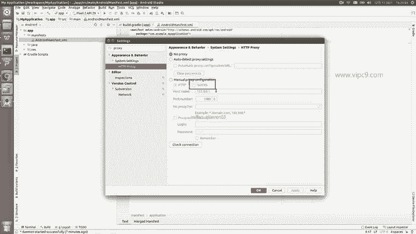
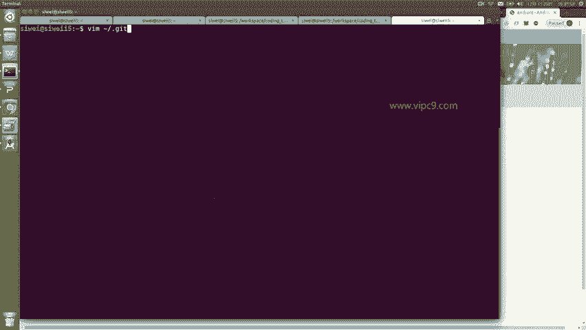
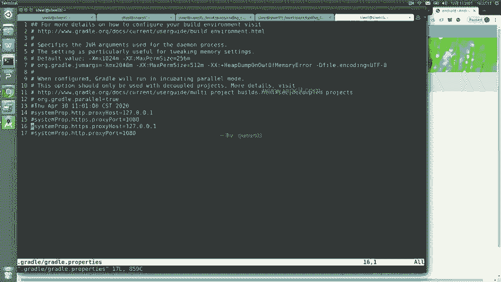
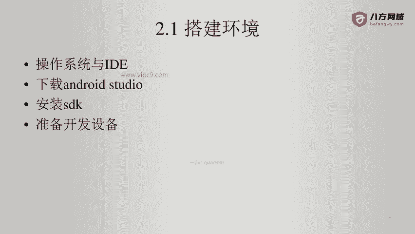

# Android逆向-基础篇 - P5：章节2-4-配置android-sdk与代理的使用 - 1e0y_s - BV15jhbeCEQk

这里有一个菜单叫做toth工具。在这里面。可以认为有一个最重要的。项目叫做SDK manager。点击。就可以看到，现在安卓啊总共是出来这么多种。不同的SDK。那么在这里可以看到最新的版本是API32。

这里啊API32，我呢并没有安装啊。那么大家可以到时候根据你的需要来下载，下载的时候很简单。点击一下勾选啊，比如说我勾选一下最新的啊，到时候大家也可以勾选几个。比如说安卓5啊，比如说安卓7，那么安卓4。

4以前的话呢，是没有什么安装必要啊。因为安卓5的话在时间上大约是对应了我们的20。15年或者2016年。啊，那么安卓4。4以前基本上就是1314年，然后再往前的话是完全没有任何必要了啊。

比如说我选择一个按照的API32，那么在这里可以看到没有？上面这里。android SDDK locationation啊，在这里的话大家也可以对它进行编辑啊。

这样的话啊比如说把它放到一个呃你的硬盘的深处，E盘或者D盘等等。这样的话呢，当你的安roidstudio被删除被修改的时候，之前下载好的SDK也不会被删除。所以说呢这个很重要，我们点击编辑啊。

就能够看到。另外呢这边啊是SDK toolsth可以看到SDKtth包含了NDK。包含了build toolsths make等等等等等等。

这些东西呢大家呃我认为选择安roid studio给我们默认带的就好了。比如说下面的google play这些内容一般来说是用不上的啊。然后下面这些就是更新安卓的SDK的一些站点，这个我们也不用改。

总之这个地方是最关键的。那么我们选择这个API32啊。然后我们点击OK。啊，正常来说就会下载啊。如果你那里没有下载的话，就配一下代理服务器。那么我这里点击下载，它弹出菜单说是否要确定安装。

然后在这里说预计下载的内容是63兆啊，需要的这个空间，这些这些当前有203个G，我点OK。那么可以看到现在就开始下载了。这里downloading啊正在下载当中啊，看来这个网速还不错啊。

下载的这个使用的是这里，他说请等待。好的，那么刚才暂停了一下啊，看来非常快，现在已经安装好了啊，告诉我们说安卓呃SDK32已经下载好了，并且安装到了这个位置。😊，我们点fininish就可以结束了啊。

那么对于国内的同学呢，可能嗯有的同学说哎呀，老师我。网络不太不太好，或者说我没有买到这个代理服务器啊，那么这个时候其实就嗯不行啊，我认为做安卓开发离不开google啊，那个谷o歌google啊。

那么在这个这个时候，我们一般来说是需要进行设置的。如果你用的是一个普通的HTTPS的。代理服务器的话，我们可以在这里搜一下proxy啊，或者说搜一下代理，看到没有？在这个页面我们就可以对这个进行设置。

啊，比如说这个这个这个啊，那么在这里的话呢，需要记住一点，就是说除非你的代理是HTTP的，你可以用这个。如果你的代理啊不是HTTP或者不是HTTPS的代理的话呢。

你需要啊比如说你的是这个socks5的代理服务器。那么这个时候你需要在呃。

安卓的这个配置文件里面做一个配置啊。在这里面我们需要做一个配置啊。

在。gradle目录下有一个属性。那么在这里面是可以把。代理配置在这儿的啊，gradle这里啊，这个地方是有用的。

好的，那么这个就是and卓 studio它的配置代理的两种方式。好的，然后我们来准备一下开发设备。开发设备的话呢有两种方式啊。

