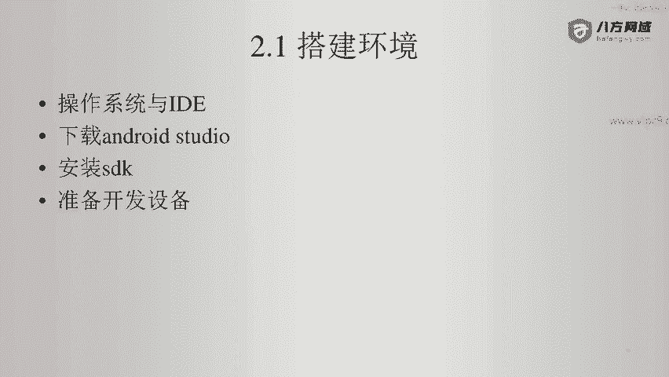
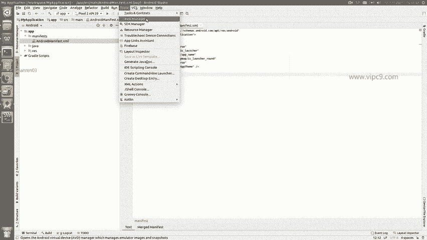
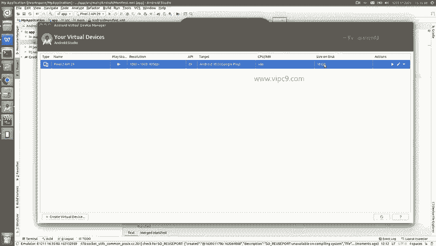
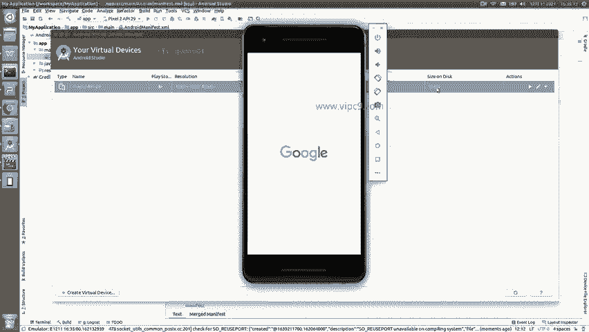
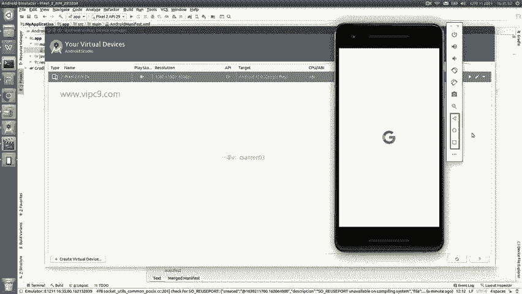
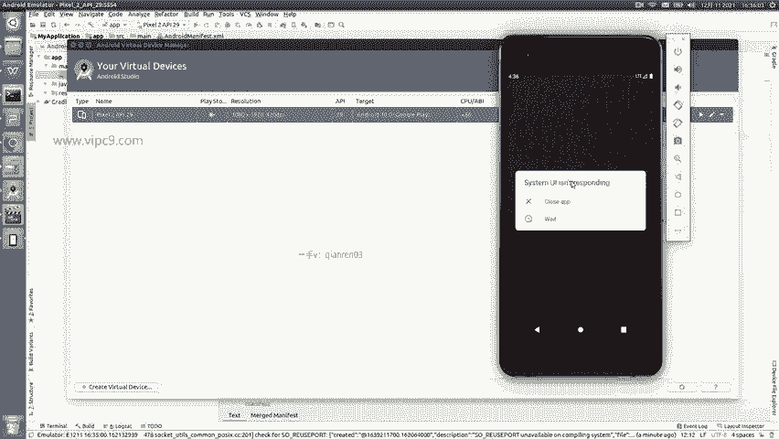
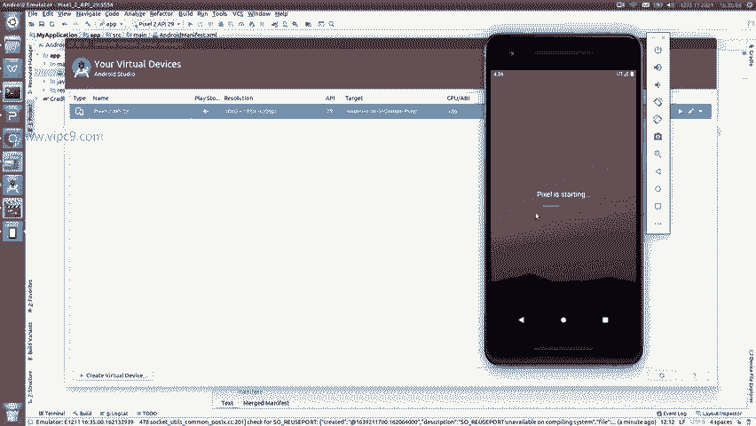
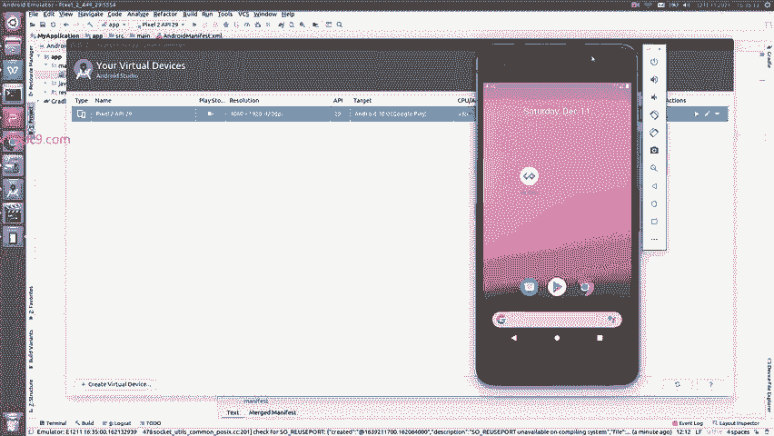
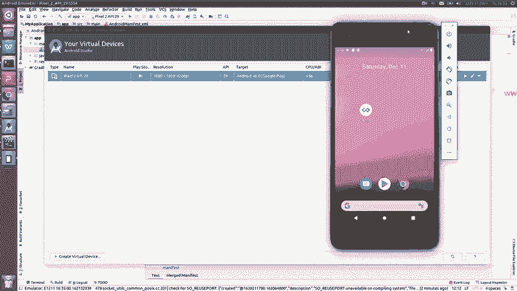
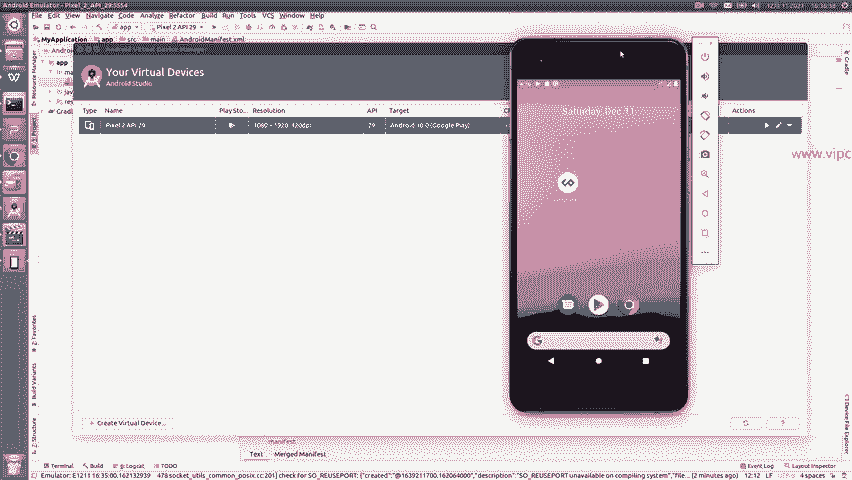

# Android逆向-基础篇 - P6：章节2-5-配置开发设备虚拟机 - 1e0y_s - BV15jhbeCEQk

下面我们要准备一个开发设备。开发设备可以认为分两种，一种是虚拟机，一种是实体机。

虚拟机啊安卓 studio已经给我们带了一个啊入口在这里。AVD manager。

点击啊。可以看到啊，这里显示你的虚拟设备。目前我是装了一个，它来自于google啊play store啊，呃它的分辨率是1080。对应的这个。安卓的版本是S呃是29啊，然后占的。

占的硬盘是10个G。

啊，那么我刚才通过双击，这个虚拟机就跑起来了。然后在它启动的过程当中，我们可以看一下右上角这里。这个是关机。或者开机。等音量这两个。这两个是对设备进行水平或者数值调整。这个是截图。然后这个是放大。

下面这几个就是安卓系统上的按键。啊，后退。返回屏幕菜单和查看所所有的进程。

大家可以看到哈，像这个。

好的。已经启动了。

大家可以看到，像这个虚拟机哈，它其实是比较占用系统进程的，或者说比较占用系统资源。

所以说如果我们的呃电脑并不是那么的强劲啊，那么这个时候我的建议是使用一个实体机，实体机会比虚拟机啊快速流畅很多啊，也能够稳定很多。

那么我们给它先放起来，我给大家演示一下。

