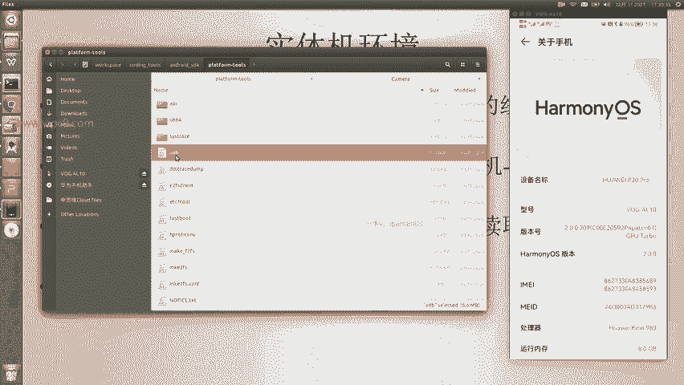
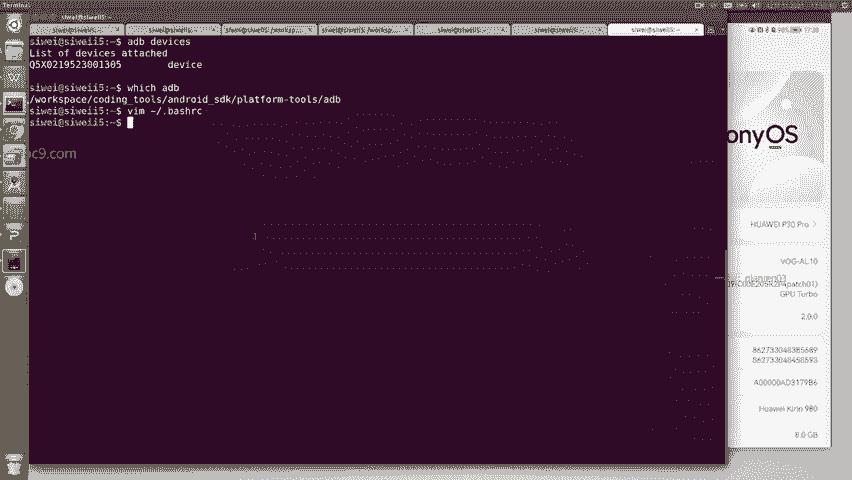
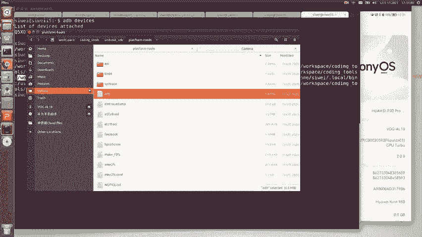

# Android逆向-基础篇 - P7：章节2-6-配置开发设备-实体机 - 1e0y_s - BV15jhbeCEQk

那么实体机环境治理使用的话非常简单。首先要找到一根数据线啊，注意这里不要使用那种10块20块的非常便宜的充电线，它们的规格是不一样的啊。比如说呃对于华为来说，这种数据线都是紫色的线啊。

所以说这个一定要注意，否则的话到时候大家会呃发现这里这个情况非常的难以理解啊。所以说第一个必须得是数据线。第二个，手机要开启开发者模式，一般都是在设置关于手机里面。比如说给大家看一个例子。

这个是我的测试机啊，进来之后点击底部的关于手机，在这里有个版本号啊，正常来说，狂点这里点几次5次或者10次就会进入到开发者模式。然后呢，把手机和电脑连在一起啊，这个时候手机上过个几秒钟会弹出一个窗口。

问是指充电还是要干嘛？我们要选择允许读取文件夹的选项。然后呢。我们就可以通过一个命令叫ADB来确认ADB这个命令呢是在我们的安卓SDK的目录下。比如说这里是安卓SDK的目录。

里面有个叫做platform toolss这个文件夹，这里面这个命令叫做ADB啊，把它放到我们的。路径下啊，也就是说对于windows和linux都是把这个可执行的文件放到pathth这个路径下。

给大家看一下啊。可以看到吗？在这里有一个building tools。啊，就是在这里building toolsth2点啊building toolsth29。0。2。

以及上面这里的这个platform toolsth啊。这些啊里面就包含了这个ADB啊，所以说当我输入ADB的时候，就能够告诉我。

这个命令来自于呢啊？对于windows和mac的同学设置的话也非常简单，我就不说了。那么进来之后，我们输入ADB空格deices回车。这个就是我们现在看到的这台华为机器。啊，华为机器。

所以说这个就是ADB的作用。那么使用实体机作为开发设备，它的好处在于非常非常的快啊。响应很快，开发呃运行的速度也很快。同时呢我们对于我们的这个主机也不占任何内存。所以说这个是推荐的啊。

