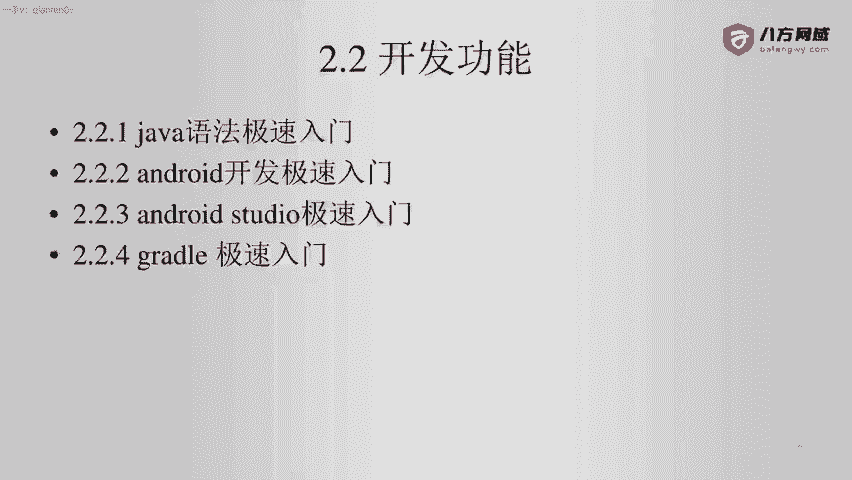
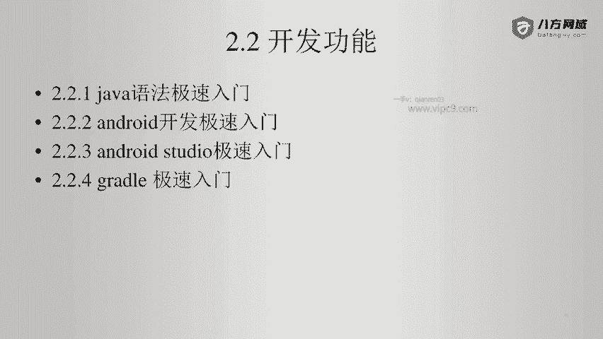
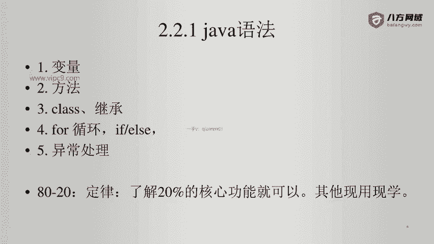

# Android逆向-基础篇 - P8：章节3-1-java语法概述 - 1e0y_s - BV15jhbeCEQk

下面我们学习一下相关的开发。这个也就是我们正向所需要的相关的知识。2。2。1需要学习java语法。java语法非常重要，没有java的话，我们就没法做安卓。同样如果看不懂java语法的话。

我们也没有办法做安卓逆向。第二个是安卓开发极速入门。第三个呢是按jo studio极速入门。第四个是gradle的激速入门。

好的，那么下面我们来学习java语法啊，大家不要怕，我带大家用极短的时间啊，就能够让你们来看懂java语法。那么我们都知道有1个8020定律，也叫28定律。就是说只要我们了解20%的核心功能就够了。

它就足以让我们应对80%的场景。啊，那么在我看来呢，可能甚至20%都不够。因为很多这个边缘性的知识吧，我们学的是没有用的啊，那么需要的时候现用现学就可以了。那么java语法啊。

我认为只要从下面这几个方式。去学习就可以了。第一个变量。第二个方法。第三个class啊，也就是它的类啊，第四个就是for循环if循环。第五个呢就是异常处理啊，其实我们学任何语言，有这么几种方式都够了。

下面我们就来看一下。