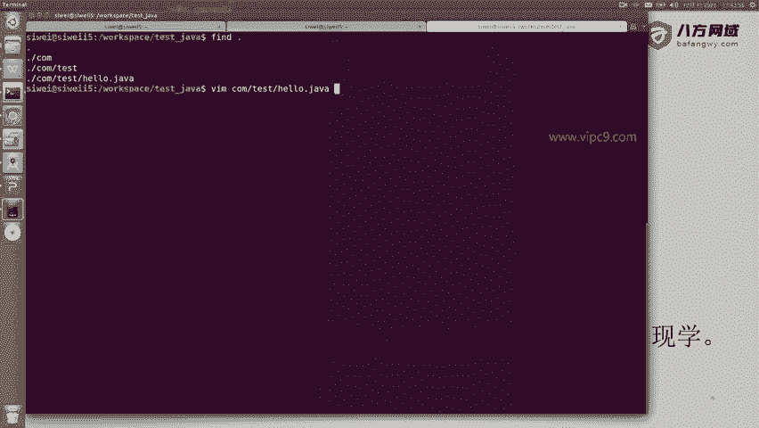
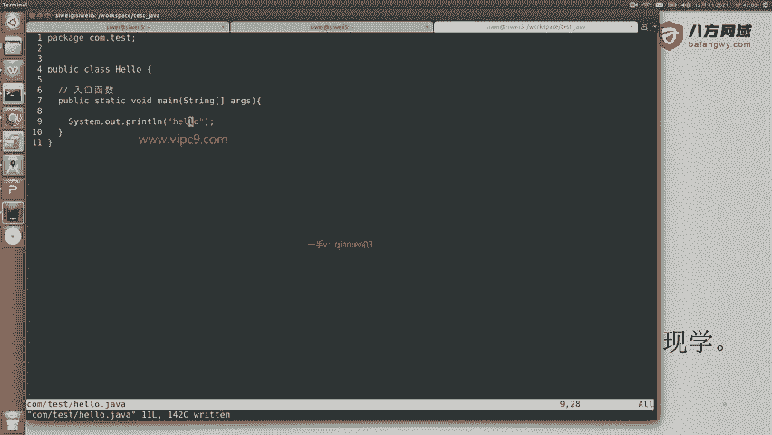
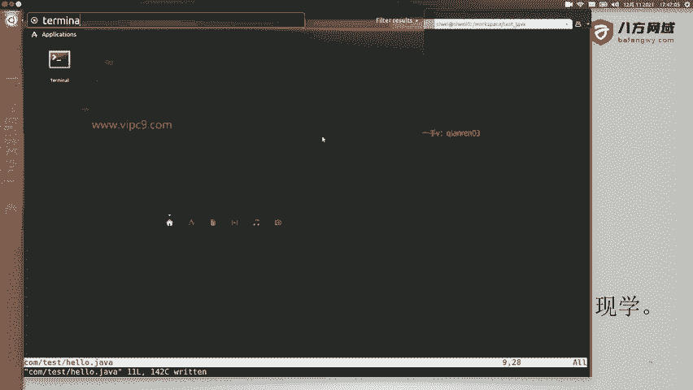
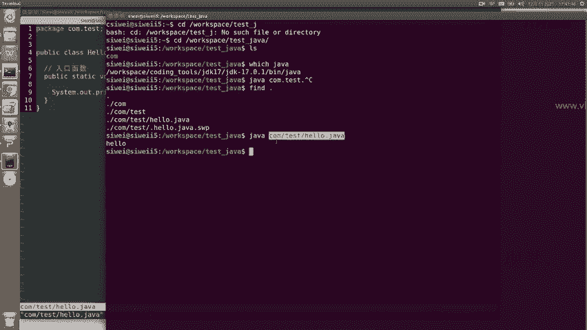
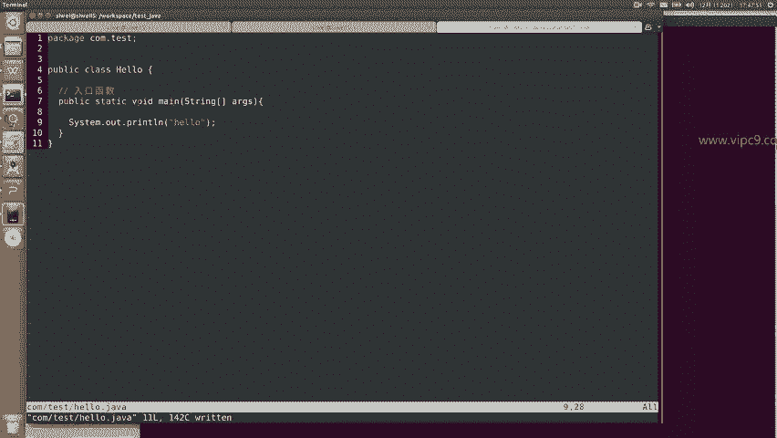
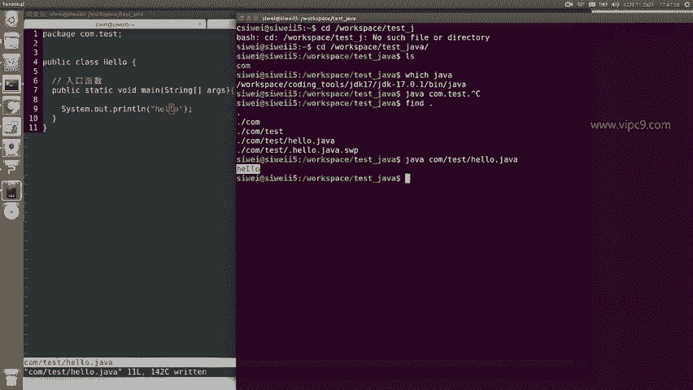
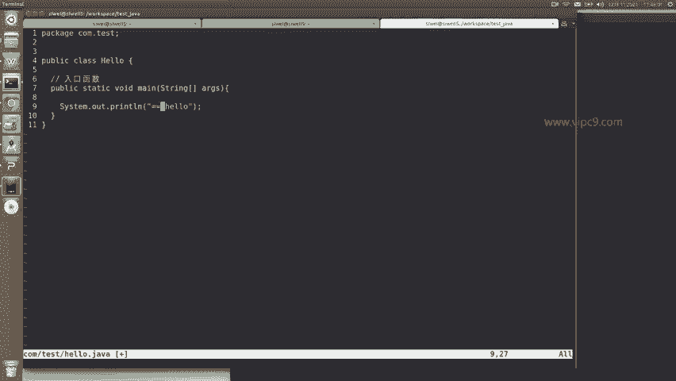
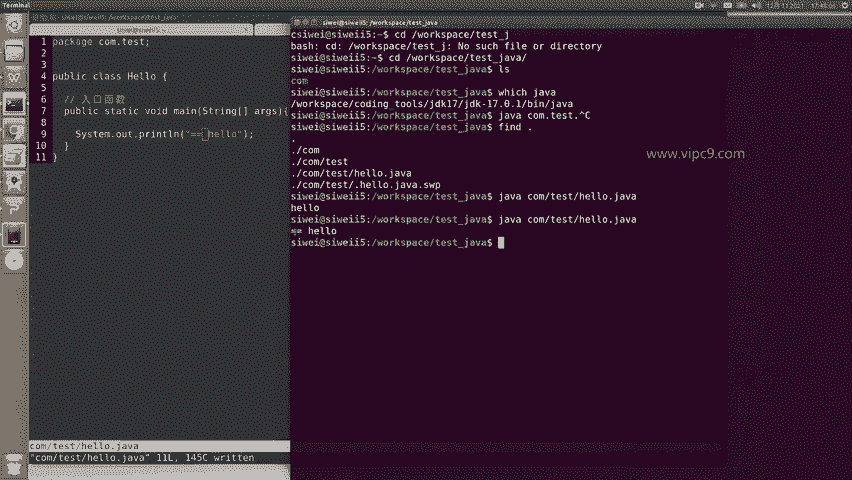
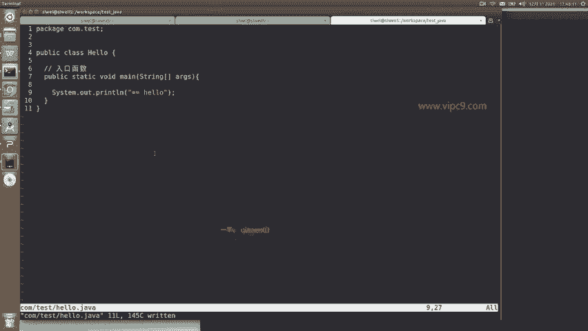

# Android逆向-基础篇 - P9：章节3-2-java语法hello例子 - 1e0y_s - BV15jhbeCEQk

下面我们先通过一个例子来看啊，那么我们打开命令行工具，然后呢创建一个文件夹，就叫做test下划线java。进来之后呢，我们给它创建一个文件啊。啊，那么创建这一个嵌套的目录，com目录下有个test啊。

com test test的目录下有个hello点java，我们看一下它是什么内容。

在这里可以看到哈package啊第一行package中文翻译成包。这里呢我们给它加上com点test，一般来说包的名字都是你的项目所对应的域名的名字。那么在这里的话呢。

其实我们这个项目的意义在于使用一个嗯是一个测试的目的。所以说我就给它命名成com点test。一般来说我们在这里也会给它教程。比如说。packackage点，比如说。com点百度啊。

这个就表示是百度公司的com点QQ表示是腾讯的。比如说com点IBM啊，这个就表示IBM的。所以说package报名呢，嗯对于新手来说，它是挺有意思的。但是对于老手来说。

我们会认为package它的其实没有没有任何的编程逻辑上的意义啊，那么它从老手的一个观点来看，它只是给当前的class作为分组的一个依据啊，那么分组的时候呢。

当前目录或者说当前的路径com test要等同于你的package啊，所以说如果你的package是比如说A点B点C点D点E点F啊，最后是用分号来结尾的。那么你对应的这个文件的话呢。

就应该是A目录下的DCDE就好多层级啊，然后到最后才是一个hello点java。啊，才是一个这样的。行，那么这个就是package。然后呢，java是一个面向对象的语言，我们原则上在写java的时候啊。

要先写一个class，然后class里面有多个方法。那么这个class呢啊前面是分成public啊private和这个默认的这个default等等啊。

我们一般都给它写成public class是一个关键字，在这里hello就声明成了。呃，当前的这个class就叫做hello。然后这个呢public static word main啊。

大家给它背死了就好了。这个呢是入口。程入口程序啊或者说入口函数。入口函数呢它就这么写，没有什么意义啊，public就表示这个函数是一个公开的函数。t表示它是一个静态的函数。

vo表示这个函数不返回任何值啊，所以说在这里呢我们可以看到它的名称是叫做main，然后传参数是一个数组，这个数组每一个都是一个字符串啊，然后在下面这里sstem点out啊。

sstem是一个类是一个class。out呢是这个class里面的一个小的classprint LN这个是一个方法，方法里面hello，这是方法的内容。好的，那么这个函数和方法我们介绍完了。

我们给它运行一下啊。

在这里我们就通过看一下java啊，java在的，然后我们就come目录下的什么呀？come目录下的testhello点java。回车。对于老版本的java来说是需要一个编译的过程。java C呀等等。

那么对于这个现代的java来说，是可以直接运行了。那么java加上这个源代码的名称就好了。只要这个源代码里面有一个main函数就能够运行。所以说我们现在在这里可以看到啊，返回了一个hello。

刚好就是上面的。

我们把这里修改一下。

加两个等号到这里再运行。嗯，两个等号。

所以说就是这么简单啊。hello world啊。

