# BIT NSC暑期培训2023-lec04-web01 - P1 - BIT-NSC - BV1KN411a7zB

O那我们开始今天的内容啊。今天是外CTF外部课程的第一天。这个我在这儿其实也就准备讲一些比较基础简单的东西啊，因为。毕竟这个留给web的时间，他只有两天，一天一个小时左右，很难去把这个。这。

里面具体的内容说的很清楚啊，因为任何一个点单拎出来，你可能学到学生一周差不多吧。所以说这更多的是大家。课下可以自学一下啊，这个是比较重要的一点。然后那就首先开始一下这个课程介绍，这个我在那个。

这个我在给大家就是预习的课件里面已经写过了。第一天就主要是这些方向。第二天的话就。呃，没有太多这些。呃，非常非常经典的知识性的东西，给大家分享一些有意思的东西啊。😊。

那首先给大家介绍一下CTF中的web是什么东西。这个webweb安全实际上是CTF里面一个很大一个门类。它CTF里边的外部题型，它的表现方式基本上是给你一个外部网站。

然后你通过题目中所给的一些信息去找到这个和其他一样嘛，找到这个flag字符串。它的整个流程呢有点类似于渗透测试，但实际上和渗透测试有区别的。它通常是渗透测试的一个部分，一个小小环节。

然后他可能涉及到这些方面。这个就不多说了，你你可以看到这个外部所需要的知前置知识，可能它这列的非常详细，比较多，有PHPPthonGS然后数据库的就是cicle查询语言啊。

然后阿帕奇这些主流服务器的配置啊等等等等。还有一堆东西，这个实际上是非常非常的。你要细说的话，其实内容非常多，也是很值得很很值得下功夫的一个篇章。我当然我们这些内容今天也就不会讲了。😊。

讲这个我觉得是没有太大意义的。那现在对大体对这个CTF里面we部方向有一个主要大概的认识以后，我们就先学一些基础性的知识吧。这个当然只是web基础其一啊。

非常小的一部分给大家介绍一下HTVP协议相关的内容。

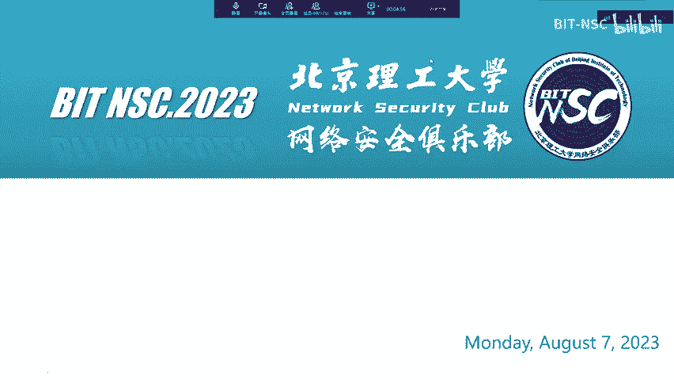

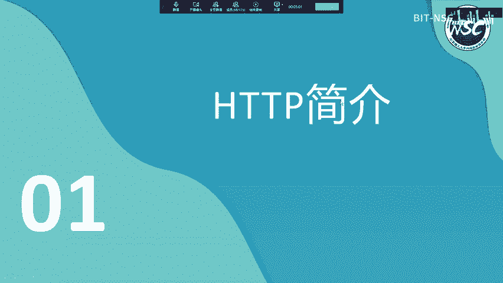

首先简单介绍一下HTTP是什么。啊，我们这个经常上网的时候，有时候会碰到这种情况，这个能不能收起啊，我看放到这。有有的时候会碰到这种情况。吧它这个提网页提示你这个站点的连接不安全。

然后有的时候它会有右边这样子一个框，直接把它的内容不显示了。然后说什么，比如再说这个安全证书有问题啊。但是像这种情况发生的时候，我们如果要去浏览里面的内容。对你肯定不能按他推荐那个绿色的点。

你要点继续浏览这个网站，坚持坚持访问，对吧？那出现这个的问题和原因是什么呢？相信接下来的讲解可以大家有一个大概的认识。首先介绍一下HTDP它当然也是一个一组英文单词的缩写。是超文本传输协议。

它实际上是在这个。对，这个网络层里面它是一个非常重要的协议。然后与它相类似的，现在用比较多的是HTTPS协议。HTTP协议实际上你现在看的话，它在主流网站使用的并不是很多了。

更多的是用这个HTPS也也它相较于HTP有什么改进和进步呢？其实就是多了一个首先多了一个加密算法，他把这个原来明文传输的HTP豹文，他通过加呃非对称的加密。给它加密起来了。

又保证它里面里里面豹纹的安全性。然后其次呢，它有一个就是认证体系，它会有证书颁发，然后验证这个过程。然后我们可以看到HTP的这个URL一会会讲什么是URLURL通常是以HTP冒号双节杠。来开始的。

然后HTPS呢就是比他多个S。这个的话你我们比如说通通常的这个访问网。呃，访问网网站，比如说访问一个百度，访问一个必应，我们有可能给那个网址填的是。3W点儿百度点儿CO。然后他会给你默认的。

先去尝试HTPS协议，它能否连接上面。你会发现我们通常使用网站是不添加这个端口号的。但是呢如果你使用了这个HTPS协议，它默认的就使用的是43端口。如果是HTTP协议的话，这个默认的是80端口。

你给他你你比如说你打上3W点百度点com冒号80。他就访问了HCDP这个。这个端口的服务了。然后什么是URL呢？上面提上面提到了U2L，这个是一个非常典型的1个URL的例子。

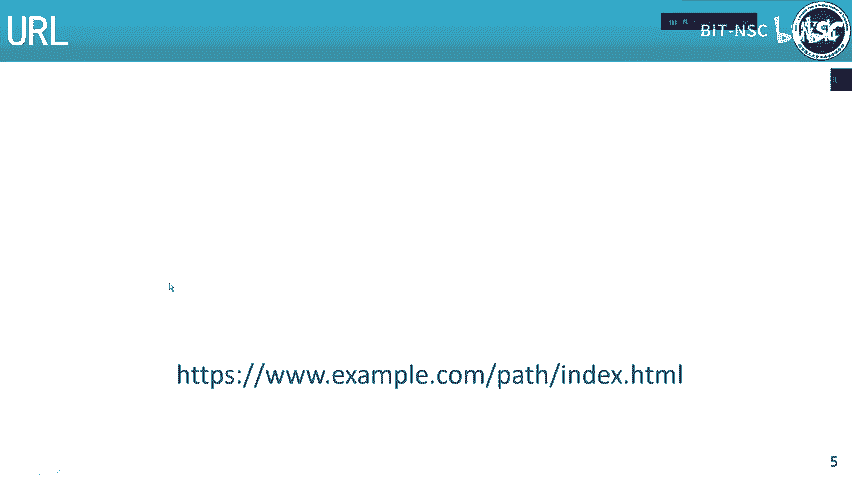

URL它的全称是统一资源定位符。这个资源你可以理解成通过互联网访问的一个个文件。1个URL呢通常对应一个资源，但是也有可能同一个对资源对应了多个URL。我们来细分看一下这个HT呃URL这个组成吧。

刚才说了，这个是HTP。这个这个前面那一部分就是声明了他那个使用的协议嘛，对吧？然后后面这个主体部分可能大家比较熟更更为熟悉一点，这个就是表明了它的主机主机地址。

就比如说你访问百度就是3W点百度点com，你上哔哩哔哩看视频，就是3W点哔哩哔哩点CO。这个通常和网站预测的域名有关。然后这个80呢，就是刚才说的，它是在服务器上开设的端口。

那服务器开的端口大家不知道有没有了解，是0到25535是吧？这这些端口都是可以使用的。这个刚说HTVP它默认的。端口号就是80端口。后面这一长串呢，其实就是U21它定位的那个资源的路径路径所在。

他在这个服务开设之下，定位到past my file点HML这个HML文件，它里面展示的文呃的网站内容就是这样来确定的。其实前面这一部分就已经能定位到它的资源所在位置了。那后面这一这一部分是做什么的呢？

哎，这个标的可能有一点小疏漏，这方还有个问号。这个问号后面呢其实是跟着。啊传递给这个前面服务器的一些参数。我们后面。后面呃现在可以提一下这个通过这种在在路径后面添加问号方式添加这这些这些参数也简直对。

这些限制都是它是用这个and符号来隔开的and就是。把他们分隔开了，前面是一个，后面是一个。这一组一组的参数传递方式，实际上是。是使用get的方式。一会儿可以看一下对比，除了ge的方式。

还有什么其他方式来请求。然后后面还有这个井号，井号，它实际上是呃标注了一个网站的锚点。这个锚点呢说起来比较抽象，但是简单提一下，大家可能就就能理解。有的时候比如说你去看。而你去看一片攻略。

然后他不是会有目录吗？他会告诉你第一张是干什么，第二张是干什么的那有的时候你点那个他那个目录是带抄链接的。你点你比如说你点一下第二张那个链接，然后唰文章就滚动到那个第二章去了。

他这个第二张那个位置怎么固定呃，怎么确定呢？就是通过这个这个锚点，它设置的值来确定的。H。然后U2L字符啊URL它的组成部分。它整个这些前面提到的这个U2L这个结构，它只能有用以下的字符来表示。

就是首先是英文字母，包括大小写，然后阿拉伯数字这个短横杠。句点和下划线。啊，那这就有一个问题了。那比如说我们去比如说你在网上面查一个中文单词。你中文单词，你作为参数传入的时候。

实际上它是作为这个类似于前面那样问号这种get形式的参数参数传递的，它怎么传递这个。他怎么传递这些其他的没在这个范围里面的字符呢？这个就要提到一种叫转译的方法了。这个转译的方法。

大家学过编程的应该也不不陌生。举个例子，C语言里面呢有个转移字符是。反斜杠吗。反C杠后面。他默认是转移内容，比如说反C杠N，它是。这个换行符它如果要打出来反斜杠，就是代表单独一个字符。反斜杠的话。

你就要打两个反斜杠。它是前面一个是转移，后面一个是。转移之后的代表内容吗？然后下面来介绍一下这个。以下字符在U2L转译里面，它是对应的什么值。这个当然大家不用记住啊，大家知道有这么一回事就行了。

需要的时候可以再查，对吧？那这个一会儿是一会儿后面可能会用到，大家可以注意一下。

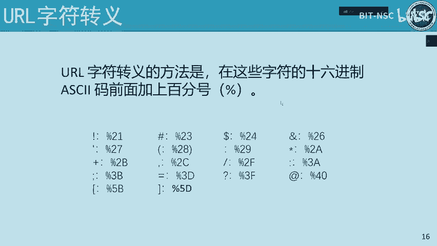

接下来大概讲解一下这个HTP的原理。

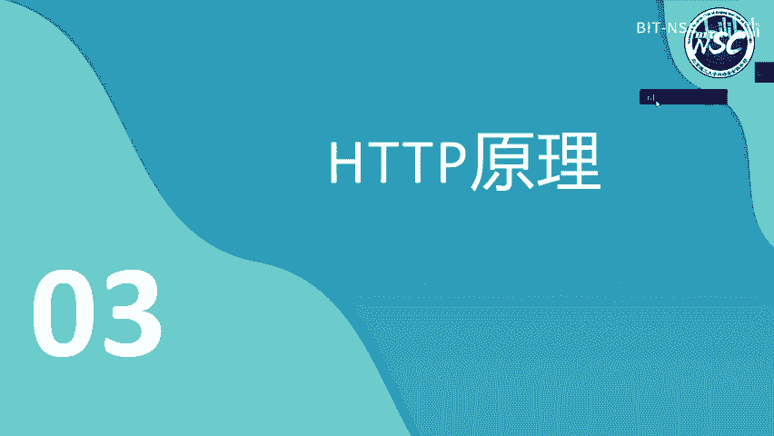

HTP协议呢，它其实是。呃，作用也是搭建于一个非常经典的CS。呃，搭搭建一个非常经典的CS结构上面，CS就是client server，就是经典的客户客户端到服务端的结构。

然后我们可以看到一个你要搭建一个完整的服务的话，通常。会有以下右下角展示的这么一个结构。这vab browser就是他的你的用户的客户端，然后右边这一部分就是你的服务端的配置了。

他俩之间的通行是通过这个HTP思考一下啊，当时有人开麦了吗？思？

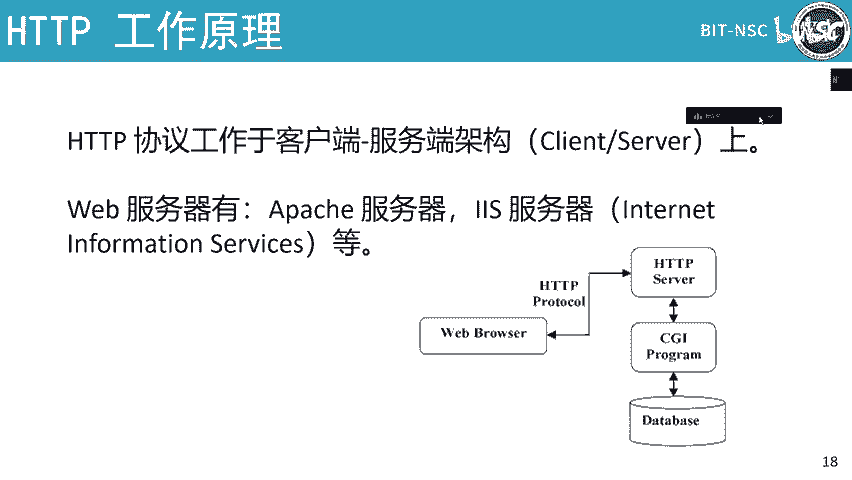

这个开麦的同学可以把麦声闭上展。要思考一下。

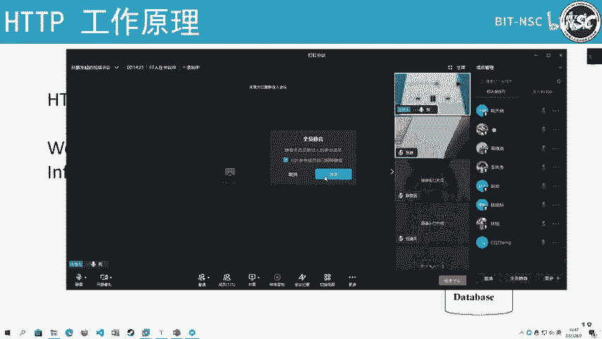

好。好，我们继续啊。诶。我还要买okK。好，我们继续。呃。讲到哪儿了，我看看。对，左边的话是我们的客户端，右右边的话是我们的服务端。他俩之间是通过这个HTTP那个叫超文本什么传输协议，它来传输的对吗？

然后右边的架构呢，它会首先有1个HTTP呃服务器，然后它搭载的一些CGCGI程序。CGI程序是什么呢？C是common剂质吗？🤢。

gatewayI是 interfaceterface就是通用网关接口程序。对你可以理解为搭载上面的一些服服务的程序。然后下面的话它是后端和后端的这个呃数据库进行交互嘛，进行呃就是数据的呃存和取。对。

刚才我们前面提到了HTTP协议和HTPS的协议的差别，这块可以再继续细说一下。HTDP的主要作用是在不安全的网络上面创建了一个安全行道。刚刚才提到HTDP其实不是安全的。

也就是说你比如说一台你在这个宿舍里面，比如方说你在宿舍里面牵了根网线，然后建了一个路由器。然后你是不给同学说啊，这是我办的新网，你以后用你以后用网不用用校园网了，我这不限量，你就用我这个wifi。

然后同学也就呃，然后舍友就信你去用你的wifi了。但是呢你在这上面做了点小手脚，你在wifi上面不停的抓它这个传递这个网络包。怎么抓包呢？我们一会儿也可以介绍一下。你不停去抓这个包。然后呢。

你抓牢这个HTDP报HTTP的报文。他实际上是铭文传输的，也就是说他那个发送和。和就是他的请求和响应，你都是可以直接明明看到的。这个确实不是很安全。但是大家刚说这个情景现在已经很少见了。

因为绝大部分的那个绝大部分的。正常对，绝大部分的这个网站现在都使用HCPS协议。就是刚才那种类似的中间人的监听是不太不太现实。呃，对，然后再其次呢，它是有这个受信任的证书颁发这个机制。

也就是说我们举个例子吧，这干讲也没啥意思啊。打开比如B站，我们要看B站。我们能看到这个浏览器，它这。你在输了这个URL以后，它左边有个小锁，这小锁它会有什么信息呢？里面有一个就是告诉你连接安全。

这个连接安全的话，其实就是有出信证书，看一下是不是可以看他证书信息。对你就可以看到他这个你们以后可能会学这个证书相关的一些一些知识。这可以先大概看一下，这就是啥，这就是。他们那个哔哩哔哩哔哩那个公司。

他申请的一个证书是像是向这个证书的颁发机构申请的，它是有时间的限制的。然后它是有公钥的，这个以后密码学可能会学，它是有公钥的。所以说你然后你在这个自己电脑上，它有一个最根最跟上的一个认证认证的东西。

它验证了它就逐层能验证到你这个哔哩哔哩。给哔哩哔哩颁发这个证书是否收信？你就会发现他这个层级一一路判断下来啊，它这个是合法的，是可用的。所以说它这个锁就显示着连接安全。但是如果不安全呢，比如说前面。

看到这个这个网站对吧？我们试一下。啊。我们看到他这就没有证书，因为为什么呀？他这实际上是HTVP协议传传输的。他没有申请那个HTPS的证书，它就显示没有证书不安全。对。这就是刚才前面课前抛出的那个问题。

但是它到底安全不安全，实际上不是这个证书能说明的。有这个证书只只是告诉你。他是拥有一个机构颁发证书的。我们继续啊。然后这就刚说了，这个是可以被可以被验证的。他提供了一个证书限制机制。

然后还提供了一个加密。然后到这儿的话，HTPS和HTP它整体的内容，大家应该有一个大体的认认识吧。对，这个的话他其实就大概讲了一下HTB客户端和服务端，实际上它都是一个应用程序。

客户端它可能运行在你的PC上面，你的windows电脑上面。他展它的展现可能就是我刚才打开那个A edge浏览器或者chrome浏览器。然后服务器呢，你也可以理解为它是个应应用程序。

你比如说这个搭载搭载在linlinux操作系统上的，通常可能会用NG啊、阿帕奇啊这些的服务。然后在windows里面，它可能会用这个IIS这种服务器。对，就是一个请求一个响应。接下来我们看一下这个。

刚空说那个HTTP是怎么怎么回事，他怎他究竟是。落到具体实现上，他是怎么传输这个信息和内容的？我们可以看到下面这张图，这个就是它HT豹纹的。一个基本结果。可以看一下重点重点的部分啊。

一个是刚才说的请求方法面。刚才没细说。请求方法呢，前面说的那个参数在U2L后面排着的，它是通过get方式来传递的。那还有什么其他方式呢？你可以看一下。其实最常见的就是get和post两种方法。

这个按照设计的时候，它应该get是要请求相关内容。post是发送相关内容。你实际上可以打从它的英文就可以。呃，就可以得知。然后get方法传递参数就是通过在那个URL后面添加参数pos的话。

一会儿我们可以抓个包看一下它是怎么。来这个添加添加参数。然后这个的话就是刚请求的U2L值。然后这个协议版本呢，它可能有HTDP1。1HTDP2。0等等协议。你要在这个。浏量包里面给标注出来。

然后回车符换行符就是反C杠N反C杠R。然后这个的话一会儿具体对应到实际的实际的那个包里面给大家看一下就比较清楚了。这款这个其实是一个事例啊。然后刚说的这个HTP请求，它实际上还有一个状态码。你看状态行。

它这个响应包给你显示了1个200OK这是什么意思？实际上大家可能都听过这个404n放的吧，你在有的时候去访问一些网站，或者说访问一些网站的资源的时候。他就会呃给你挑出来1个404notote放了。

其其实就出自在这儿啊。为什么呢？它这个规定了HDP的状态码里面规定了404是请求的资源，括号网页等不存在200就是正常。OK30130级的好像都是这个呃基本上是这个跳转的，它是重定向了。

然后500的话是内部内部服务器的错误，就和你客户端基本没啥关系。所以说这个一般开发人员或者自己搭搭战可能比较头疼这个事情。有一个网站他非常这个。呃，详细也非常生动的展示这个不同的HTP状态码里面。

他内容啊就这个大家可以下下去打开一下。这HTTPS冒号HTTP点cat看一下它是什么。对一个非常可爱的。猫像有点像猫猫咪咪图一样。它显示不同的这个状态码，状态码里面对应那个状态。2404闹房。对。

这比较有有意思啊。这什么？我卡住了。好，这个HTEP这个技术部分基本上就结束了。这讲了这个。刚才讲的什么HTP不是HTP讲的是HTP它是web里面一个基础的冰山一角吧。这相关类似的知识实际上非常的丰富。

但是可能有一些还有一些入门呃入门的门槛。这个的话其实大家刚才讲的HTP相关的，大家日常都能接都能接触到，对吧？😊，你访问个网站总得要输网址啊，乱七八糟的。你平常在那个浏览器上面。那个导航栏你观察一下。

基本上就能就能利用到刚才这些信息。所以说你在不涉及了保安的时候，也有必要了解一下。嗯，接下来我们。😊，再详细介绍一下web就CTFCTF里面web题目究竟有哪些类型嘛？

因为前前面可能大家也都是跟着题来跟着题来学习的嘛，题型来学习的。提到webCPF的web就不得不提这个sirical入入。😊，这个是web中最常见的类型。

也是很多人一提到web就能想到的一个呃11一类一类题。根据维基百科里面的定义，circle注入是发生在应用程序和底层这个逻辑。这什么资料库层的安全漏洞。啊，反正就简单来说，他在这个。

程序设计和开发的时候，他没有考虑到我的一些不良输入。就是。其实这个很多的漏洞都是程序员对用户的输入过于自信导致的一些错误。所以说用户就可以利用它这个呃没有排除的漏洞，没有排除出特殊字符的漏洞去。呃。

攻击他这个circle查询语句circle不知道大家有没有理了解过，就是数据库。数据库相关的这个查询语言都是用的是circle语言。然后我们网站搭建一些里也里面的一些信息的存储。比如说你账号信息啊。

各种信息存储基本上都是存在数据库里面的。所以说circle注入是针对这个环节和这个方面。他进行没个攻击。这个我们可以看举个例子啊，比如说。这经典梗图啊，一个一个车，他的车牌号。不好贴车牌号。

他给填了一个这个东西。这个东西就想注入到那个。呃，注入到警方的那个监控系统，看他扫的扫进去以后会不会直接报错啊。这个是一个比较搞笑的例子，我们再来看一个就是真正可能的实例吧。比如说某一个网站。

他在就登录的时候。登录验证信息不是通常验证这个嗯你的user name和你的 passwordssword，就你的。这个用户名和密码嘛，他可能他可能会写一个这样的语句。这个语句什么意思呢？

大家看不懂也没关系啊，给大家解释一下，select芯儿 selectlect。字面意思就是从什么里面挑，从里面选吗？芯儿芯儿这个其实很多地方都有用啊，就是一个通配符，就是代表所有的东西，对吧？

就是说把所有的都取出来。但是他后面有个限定，就是from是从什么里面把所有的取出来呢？To users。users这个表里面。where就是他这个表里面的具体的内容啊。具体的内容他想的是。

我只要让你的这个输入的name用户名。相等，并且你这个密码还输对了，然后把这一条信息。给它取出来，是不是就可以做到了登录登录这个事件？就是很很很朴素的想法嘛，我们用户用户名匹配了，然后密码匹配了。

然后我用户登录。这个逻辑上是没有什么问题的，但是它这个设计就存在很大的缺陷。就比如说我不好填，比如说我有可能用户名是addminaddmin，我填上去了，通过了。但是我给他填一个这个东西会怎么样？

就是这个。就这两双号中间那个东西啊。填一个这什么东西啊，这根本看不懂的一个东西，和用户名和密码没有半毛钱关系。但是它就能起到一个意想不到的意料之外的效果。为什么呢？我们可以把这个字符串替代一下。

就等价代换一下，进去看一下他最后这个语句会变成什么样子。这个语句这个查询语句最后就变成了这个样。对，和刚才的结构还是一样。但是你可以看一下它后面的这个条件变成了什么。就是name等于一。

就是把这个用户名是一。并呃，用户名是一或者一等于一，这是什么东西？先不用看啊。然后密码也是等于一或者一等于一。这个其实你可以发现它是一个恒懂的。它是一字符等于一字符。这个是恒等的。然后在二的判断里面。

它有一方一方恒等，它整个式子是一嘛，对吧？所以说他这个查询语句最后就会转换成下面这个样子，就是select share from users。这什么意思呢？

就是把users这个表里面所有的内容全都给取出来。如果这个这条命令这么写的，你就会发现。他在进行这样子一个恶意的注入以后。我呃网站给出的返回的输出是把你所有的用户信息都给泄露了。

这实际上是一个非常大的一个安全隐患。这个的这个的话就是ciirrcle注入一个经典阳历。这个实际上呢你可以发现。这条查询语句它设计和写的非常非常简单。

他根本没有考虑到攻击者的攻击意图和他后面可能发生的事情。所以说这个可能最多是在早年刚开始兴起circle的时候。大家没有没有防护意识，会这么写。现在的话他就会有很多的判断方法。

circle语句的变化方法也是非常多端啊。有的时候它构建的出来的这个构建出来的这个你可以叫payload，它这个负载啊，就中间这点东西，你根本看不懂它。但是他就是可以把你的表给当下来。

哎也不知道有没有听过一个什么。有一个词叫黑客，有的人候会说什么脱裤，脱裤子那个脱裤。这什么意思啊？就是说有可能某公司他在产品开发的时候。他没有做好前期的这个安全。呃，就在开发的时候没有遵循安全准则。

他在上线之前也没有进行安全的一个检验。就直接上线了。😊，但是呢他这个用户他这个数据库我刚说了，这些用户信息是存在数据库里面的嘛？他这个数据库里面存了海量这个用户信息。然后黑客就利用到了这个这个漏洞。

把你数据库里面看看，就用刚才这种方法直接变成了把所有用户信息都给当下来。然后这个就是这个拖。实际上是这个错，打一下。这个脱裤啊。他谐音就转变成了这个。就这样就用类似的方法，circle入入。

把你把裤脱了，这也是很多这个社工库的来由啊。实际上是比较危险的这个企业行为由那个什么有了由用户买单了。然后这是web题目里面一个常见类型。接下来第二种叉SS跨站脚本攻击。它实际上它的英文不叫叉SS。

它的英文叫CSS就是全它的首字母crossize scripting。但实际上他和这个就了解过这个web相关设web设计啊，web编程的你应该不叫编程啊，外b设计的你可以。

应该知道有一个叫层列样式表的CSS的东西，它通常是这个网页上面。就是。可以理解为，比如说美观设计啊，它那些间距啊、排版啊，乱七八糟相关的东西，通过CSS这个文件实现了。对。

他呃叉SS为了不和CSS来重合来混淆，所以说他就把前面这个cros变成了X。就是跨站脚本攻击。这个叉SS能实现一个什么效果呢？我们一会儿可以可以演示一下啊。他的主要他的主要攻击手段是吗？

就是在web页面里面插入一些。恶意的代码。你当用户浏览这个呃浏览这个，就比如说点开这个网页的时候，然后它就自动执行了这个代码。那这段代码被执行了，有什么有什么会有什么危害呢？

一会儿在实例的情况下可以给大家介绍一下。😊，然后第三类型命令执行。我刚说的这个服务器，它是搭建在这个。搭建在一个系统之上的嘛，有可能是呃lininux系统，有可能是windows系统。

当然以lininux系统居多。所以说你可以发现我们很多的操作和很多的应用都是在linux上面实现的。这个命令执行呢？呃，他的他的攻击手段就是通过调用一些外部的程序。就是他不是调调，就是他这个。

应用设计的时候就执行了一些外部的这个呃外部的程序或者外部的脚本，或者说PHP里里面这些可能会用用到这个系统命令的一些函数。然后用户呢，他然后他又没有给这个。呃，输入做做限制。

就还是刚才说的对用户的输入过于自信过度自信。就导致了我在这个添加参数的时候，可以注入一些恶意的命令。你想了你都可以在se里面就是填各种东西了。你想干不是你想你不是想干嘛干嘛？然后这块的话，我们给。

演示一下这个我们。就是在NIC里面NSC那个平台上面一个外部提吧。就在这里面看嘛，一样。对，同学可以跟着跟着来做一下，这个非常简单啊非常简单。大家可以动手来登登一下那个平台。

校外的同学可以通过外部VPN来访问，相信前面大家已经。😊。

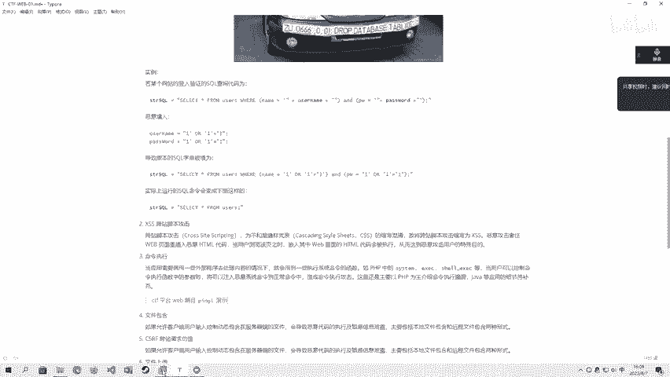

已经动手登录过了。嗯。对，大家可以看到我们这个网站实际上就是没有证HTPS证书的。对，其实想想要的话也是可以有的。啊不代表我们网站不安全啊。Z。😔。

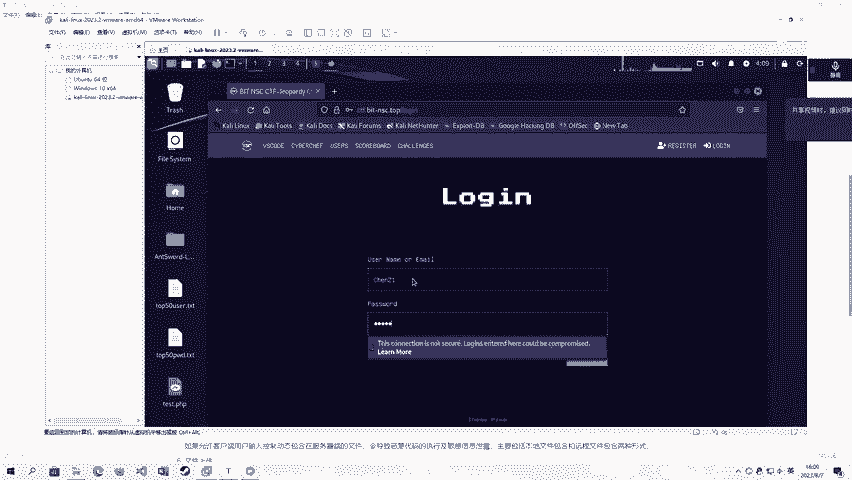

看看外部提吧。这个拼一实际上就是一个命令执行的一个题。大家点开这个题可以看一下。分配了一个容器啊，到这个这可能稍微要等一会儿重新进一下。

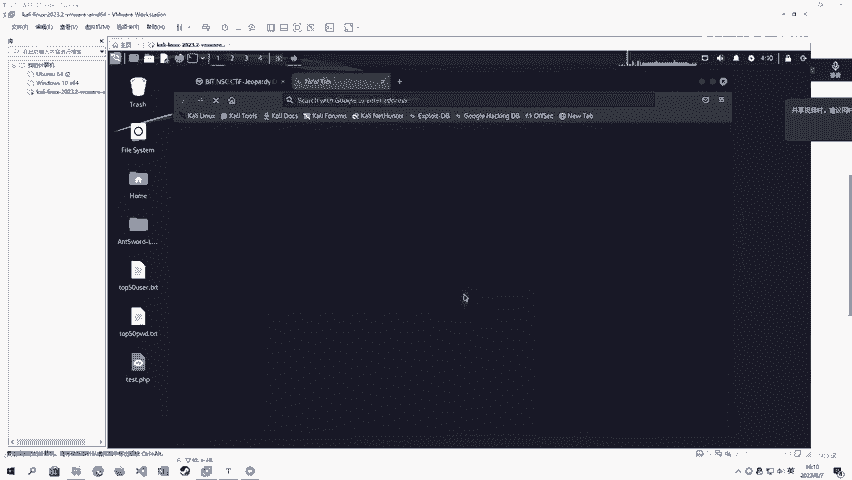

好啊，这刚说了这个web提，它通常是给你一个网页，然后让你去找到flag，对吧？这个其实就是一样的嘛。你在这个申请了一个容器以后，他就给你了一个网网址。通过这个网址可以到你专属这个网页里面去工作。

这个是隔离的，就和前面给大家用的docker的原理是类似的。他是给你给每个人新开一个容器去做的。所以说你的操作不会影响到其他同学的这一点大家不用不用担心啊。这经经常有CTF的外题。

他会在题目里面直接把源码给你展示出来。啊，这个的话就是方便去这个判断判断他这个代码有什么问题。当然这也是在CTFT里面，你通常这个。呃，实战里面他是是你是很难去拿到源码的对吧？

你可以看它是通过这条命令啊，就sso收把这个。呃，这这呃就是这个网站的原码给打印出来了。咱们可以大概看一下啊，这看不懂没关系啊，因为前面也说了，万不要学那么多东西了。但是你用你这个。呃。编程语言的思维。

大概看一下变量名啊，函数名其实就可以有一个基础的判断了。当然想要深究的话，还是得去学这些前面说的语言啊。你看他这个做了一个什么事儿呢？大家可以注意一下这个东西。

有没有一点眼熟和前面讲的什么东西有点有点像。这个是请求方式吧。刚说了有get的请求方式，有pos的请求方式。那这个的话实际上这前面加个doller符号是PHP里面这个变量的变量名的表示啊。

也就是说IP这个变量它把。这个它里面设的这个变量的值是来源于哪儿呢？是来源于你刚说了问号后面加的IP的值。等于多少多少多少多少，对吧？它是这个叉叉叉叉把这个值付给了IP。然后他进行了一个这个检验嘛。

他是要做这个他是要拼一下这个IP能不能拿到结果？那我们就试一下吧。比如说P个127。点0。0。1，这是本他的本本机地址嘛，这个一肯定是能拼到的吧，我们测试一下。你看他就高，然后他就显示了。

是一个这样的一个东西，他拼本级拼通了。我们就发现他这个网站上搭搭了一个什么应用呢？他实际上是想让你通过IP这个参数。来实现对于你一个指定IP的P的结果的显显示吗？想象很美好吗？但是现实呢。

有一些不怀好意的人就可以。拿来干坏事了，为什么？他用的这个shallEXECEXECex执行的意思吗？他是在他是执行了一个sll命令。前面应该也提到了吧，PPT就不不开了，他执行了一个效命令。

你实际上你会发现他对于你这个IP里面的内容是没有做什么限定和限限定和限制的那我如果改一下呢？😊，等下。比如改一下呢，我这个后面我能不能给他加点什么东西，让他执行我想要的命令。实样是可以的。

这个这个s语言里面它是有。这么几种。系啊。有几种符号啊。这三种符号是有一些作用的。如果我现在是一个命令AAA。然后两个and的符号BBB。这个呢它的结果是什么？它的结果是先执行。3、直线AAA。后直行。

B别别。这个的话是。这个大家看到那个回退符号下面那个就竖竖线那个键啊。就是C语元里面那个飞的键。如果我们是这个用这个命令这个符号来限定的话，它是什做了什么事，它是不执行。诶。执行BBB。

那如果是这个情况呢？就是先执行。BBB。后置性。え。嗯，大家可以看到这个sel里面，我如果想要让他执行其他的其他的命令，我们是不是可以。他可以利用一下shall的这个这个符号，这几个符号。

这几个符号可以用哪个呢？实际上哪一个都可以用。啊，所以说呃我们如果只想要看到就是我们自己输的命令的效果的话，我们就用这个。带一个这个符号。后面加上我们的命令就可以看到，对吧？我们试一下。

在这儿呢我们就加一个加一个这个竖线，然后后面加1个L。比如说我看一下我现在当前当前运行这个环境里面。究竟里面还有一些什么其他的其他的文件，IOS大家用lininux用这几天应该也知道了，它是。

这个打印出来就list嘛，它的全拼是list，打印出来这个当前目录下的所有文件了。John some。对，可以啊，你看。实际上是他把前面那个命令就放弃，呃，就丢丢弃了。他只执行了我们现在这个L命令。

L命令可以发现，我们当前目录下实际上是有两个。两个文件呢，一个是inex点PHP，这个是呃大家注意啊，这个是它默认的PHP默认打开的那个文件。就是说你后面如果不加这个路径的话。

它打开的就是这个inex点PHP。那前那你会发现他实际上还有一个文件，这是什么东西啊？😊，我们是不是就可以去看一下这个这个文件里面究竟有什么东西。我们如何去看这个如何去。让它显示出来这个文件的内容呢。

我们可以用一个命令CATca。大家记住啊，这个cat是把一个文件里面的一个指定路径文件里面的内容打印打印出来。你得可以让他ca一下这个东西。哎，你会发现这个非常简单。

他直接把这个flag藏在了当前运行这个环境下，一个叫这个。这其实是flag那个单词的变题啊，在这个。呃，文件之中，这个实际上就是这道题的f。

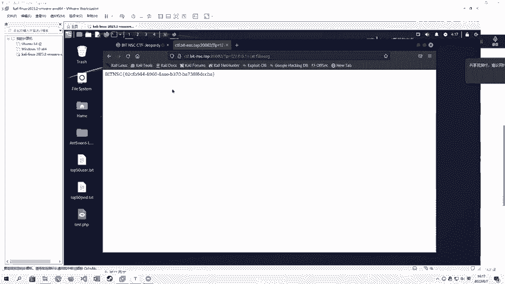

那是不是很简单？实际上就是一个命令执行，没有做排除的一个一个漏洞，一个错误。然后。你看这个病一。

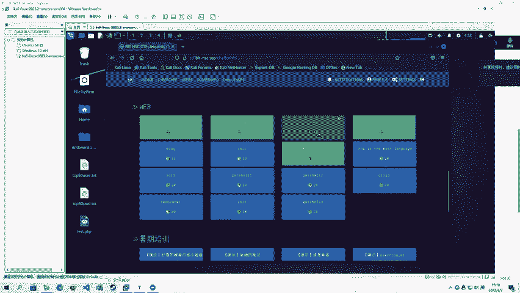

P2一般像这种组合题目里面。他改个数字的实际上都是有关联的。这个P2呢。就留给作业给大家做了。我们再继续吧，看看。P2的话，实际上和平一是类似的，也是这种呃命令执行的。

只不过他可能就进行了一些排除或者一些呃妨碍你去妨碍你去像刚才那么简单的注入方法，大家可以思考一下。实际上这个方法在前面讲HTTP那个那个课件里面是有的。大家如果找不到，如果没没思路。

可以看一下那个HTP那个那个课件。然后文件包含。文件包含呢。它其实是云，它这个是什么啊？你。大家学过C语言呢，知道这个。我们通常在写C元最开头的一行，最开头几行是干嘛呀？

是不是井号include什么什么什么东西。要引入一些库文件。投文件啊什么的东西。这个文件包含我还是类似的。😊，他可能把这个想要动态的去引入一些文件的话，他没把这个文件include给写死。

比如说你C语言可能写个inlude。那什么 standardIO还是什么东西？他你在前面会写死，但是他有的时候想着哎，我要动态的去访问一些东西。我是不是可以不把它写死，他如果不写死。

然后又是用通过参数没有保护的传入的话。你就会发现他可能会导致恶意代码的执行。然后。还有敏感信息泄露吗？这个可以包含本地文件，也可以去include一些远程的文件。比如我inc一个。啊。

就给他一个公网的一个地址嘛，公网的一个文件的指向的指向地址。然后第五个呢，CSRF跨站请求伪造。啊。这是不是写是不是写重复了？啊不要在意啊，这课下午再重新改一下。

他的话其实是可以呃就比如说你在A站的时候，比如说你在我我搭建的一个站台的时候，站站点的地方。啊，我恶意的去插入一些代码，能让你去能能能进行一些。比如说到B站就就到就B站吧。他到B站哔哩哔哩。

的一个一个操作。啊就比如说。你在哔哩哔哩里面给某某某给给ASC这个账号投币，然后我插入到我这个站点里面了。😊，然后又没有做防护的话，这个的话就可能会产就可能会用其他站点。

你的登录信息已经登录的一个状态去执行一些操作。你去给你去给ISA投币是小事，别人把你卡里面钱转走是大事，对吧？实际上很多操作都可大可小，就看你怎么去用它。然后文件上传呢，这个的话。

你看他讲到了这个文件上传实际上是一个在什么时候发稿发呢？你就算是静态网站，你进你网站没有这个交互。那他你网站在更新的时候，是不是也要进行上传上传文件。上传文件的话，他就有可能会被呃这个攻击人利用到。

如果对上传的文件没有没有限制的话。那没有没有限制或者限制绕过的话，就可能会上传一些攻击者想要的文件。这个实际上是非常非常。非常非常危险的，一会儿可以给展示一下，它可以直接导致你的服务器沦陷。

别人想干嘛干嘛。然后点击结时。这个的话可能前几年大家在上一些不太正规的网站的时候，我就会就会碰到这种情况。就明明我这个网站，比如说这块点的是播放按钮。但为什么但是为什么我鼠标放上去。

然后点一下那个播放按钮，它没播放，因为它。对，是这个人。当然这些安全专家他们的出发点肯定是好的，但是被恶意利用了嘛，他是一种视觉欺骗手段。它在你原来的播放按钮上面覆盖了一个全透明的一个图层。

有点有点类似于图层的东西。你不知道那个东西是透明的，你点它。等下这有声音的吧。喂喂喂。你你点它他就呃。定定向到你那个透明的图层上面的文件呃，的的的的内容了。对。然后还有条件竞争。

这个这个实际上在实战之中也比较有用啊。明天的话我们可以细说一下它究竟有哪些应用。然后前面大概介绍了很多啊，这讲了很多很多东西，但是都没细讲。大家这些东西一定是要自己课下去注重学习和了解的。

然后接下来看一下。这个今天早上发的那个手册，让大家跟着跟着搭建DWDVWA的这个靶场，大家应该已经搭建了吧。搭建的同学在这个群里面扣个2啊，我看一下。OK我看到有同学发了。

其他同学呢其他同学是搭建碰到问题了，还是。OK还挺多的。那就可以。跟着那个步骤来，应该是没什么问题的。如果有问题的话，你可以现你可以现在就发群里说或者开麦说或者课价的时候，在QQ群里面问都是可以的。

如果搭好的话，大家应该看像我这样。把它就是如果你已经启动好了，就是按照我那个说的进行最后一步，并且电脑没有关机重启的话，你现在在浏览在虚拟机的浏览器里面打开local host这个地址。

你应该是能看到这个界面的对吧？这个我。这个界面它呢它的默认密码是addmin。不是默认的用户者的命，它的密码是password这个东西你登录进去，登录进去。第一遍应该它会提示你这个要安装一下这个。

安装一下呃。等安装一下那个叫什么呀？数据库。对，安装一下数据库并重启。你点一下这个按钮，它自动安装好了。应该再进来的时候，他这个界面就和我这一模一样了。大家这一步应该都到这一步了吧，到这一步的话我就。

带大家动手看一下刚才讲的这些在这个DWDVWA这个靶场里面。它体现形它的表现形式是什么样？大家可以跟着动手做一下。你可以看到它这个靶场其实搭建出来就是存在了很多很多漏洞。

然后他把这些漏洞的呃的分类都写到左边了，你可以点击特定的分类去进行学习和测试。然后再看看他这其实是有一个安全的设置的。也就是说你可以调整他这个整个靶场的安全等级，有低一中高和几乎不可能。

基本上你能基本上大家能做的就是低中高这三种啊，impposible是。就是很难去很难去呃实现这些前面的这些攻击的。我们就从漏测试一下吧。调整成第低的安全等级后，我看一下第一个。Oh。

这什么bte force，你在BP那个软件里面也能看到类似的说法，暴力破解啊，这就是暴力破解。他给了你一个登录界面，这个和我们刚才登录那个界面的功能是一样的。碰到这种公登录界面的话。

对我们每一关其实都是可以看它这个观察的。编写的源代码是多少？你看你通常你就是你正常正常的网站，他给你的服务，你是没法看见源码的。不像刚才那个CTF那个题目里面他给你的。哎呀，这什么玩意儿？

题目里面他给你的，他是已经把源码给。呃，原码给打印出来了，但是通常的网站是不会打印。你可以在这个靶场右下角这块V view source看一下它的源代码。这就不给大家逐行分析了，大家看大大概看一下。

它实际上还是一个查表嘛，然后来登录。我们发现对这个暴力破解这个手段并没有进行防护。通常的网站，你可能对用户密码登录，它会限制你。比如说10分钟内。你只能错5次，错5次，不让你登了，对吧？

但是他没有做防护。我们可以看一下我们能不能对这个密码进行注入。这密码输入怎么怎么实现呢？前面我看好像是让你们装那个BP那个包了，brsuit我不知道是装到哪儿了，但是卡ry里面也是自带了BP的。

你可以在这搜br suit。对吧打开就是这个样子，这是一个社区版的verbsuit，勉强能用。然后这个这个。这个软件呢是干什么？它可以抓取HTP的豹纹。就非常方便我们进行一些这个外部方向的测试和应用。

我们可以打开它这个自带的浏览器啊。自带浏览器，然后进行一些操作。刚才是哦，对，local host访问一下啊。D为W。暴力破解。哦，我看刚之前那个有同学说这个为什么我把bbq打呃安装好以后，打开浏览器。

它加载不出来东西。因为这块有这个。inter intertercept他直接把这个流量包给就截货了，截货了。就是说流量包到这儿就不走了，就不往不往后发了。所以说你把那个阻塞住，它肯定是没法发的。

这个的通常就是我们需要抓包的时候，再把这个打打开，不需要的话，就让它正常网页能正常运行，正常运行就行。比如说我们现在要去抓这个包儿。要去我我假如不知道他这个用户名和密码是多少，我怎么去暴力破解。

你可以随便输个输，然后把抓包打开，看好是啊点一下login，因会发现它直接弹出来。BP弹出来它是一个这么一个豹纹结构。我们刚才其实也说了HTTP的豹纹结构。对哦，刚才说的HT报怨结构没给大家看例子。😊。

你可以看一下这个例子，这是不是请求方式，然后URL。然后这是后面的参数嘛，对吧？然后这是HTP的协议的那个。呃，随意的。呃，版本信是1。1吗？他这个后背面后面为什么没有200okK呢？

因为200OK是他给你的响应报文服务器给你发的，它是后后面会带那个响应响应的那个状态码的。然后这这一块。后塞这么乱七八糟，这些东西全都是那个header，它的标头信息。以建职论的方法方式来写填的。

你看一个键一个指，一个键一个值。对啊，一个键有可能不止一个值啊。还用分号隔开之类的。

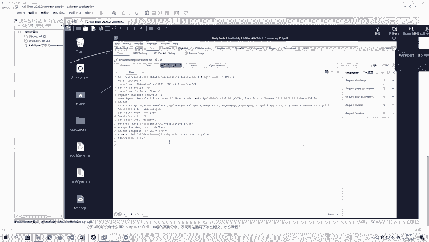

这个的话也是一个经典的HTP标头，这再插插一个内容啊。HC标头还可以还可以，就是你抓包可以用那个抓，我可以用专门抓流浪包软件，这个叫ve shark。我不知道这个前面有没有给你们介绍过。

这个东西是专门来抓流量包的，你可以看我这个是课前稍微抓了一下这个虚拟机上的一些。呃，讯机上一些流量包抓时间比较短。你可以看它究竟它是有哪些协议的。有DNSARPARP讲了没？

然后有TCP的协议协议的数据包，然后还有HTP的协议数据包。假如我有一大堆的话，我想去把这个HTP的协议包给。单独给。呃，筛选出来，我就在这个筛选器这块填一个是。你可以看到这个是。

由本地IP给那个向外请求的HTB包。我们呃你看这就更清楚了，这是不是这是不是说的那个反气杠R是反斜杠和他那个。

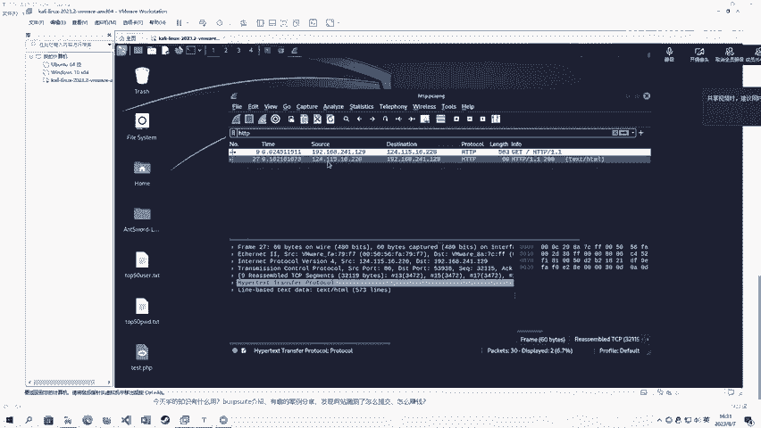

课件里面的那个结构是完全对应的对吧？下面的话后面这个话是它返回的这个报文内容，它是一串HTML的这个代码，对吧？实际上你你浏览器里面打开看什么乱七八糟一大堆东西都是。后面豹文里面那个代码的部分。

这是刚才给大家说要看这个HTP协议。它究竟是在数据包里面长什么样子？这个是他转换的16进制码嘛，对吧？大家都知道数据是二进制传传播的吗？对，刚才到这儿查查玻了一下。

然后这个BP这个软件你打你打外b基本上要灵活使用这个这个具体用法呢，今天也就不说了，再给大家用一下这个主要的几个功能，明天可以给大家可以可以给大家看一下。

今天用了一个功能是这个sn to intruder。给他到这个爆破的这个破让爆破的这个这个什么标签栏下。我们使用这种这种cster book，它其实是你可以设置多个参数，然后它逐一去便利的一种方法。

因为我们这有用户名和密码，假如都不清楚的话，我们就可以用这种方法来进行包破。我们在右边选中你想要爆破的点。添点击ad添加它这个爆破的位置，配露的位置。添加到这个呃用户名和密码，它对应的参数后面。

我们就可以进行下一步的设置了。我们可以给他这个，比如说爆破什么内容来进行一个设置，payload的设置。你在第一个payload上面，因为它是那个用户嘛，用户名我们就可以加载一个用户的这个。

用户的一个字典，那这个是我提前下的这个大大家网上一搜就行了啊，这个不重要。😊，实际上这些。工具啊什么也都不重要。对吧。重要大家是理解，然后去了解它这个流程，大家会做用什么工具和用。其实不重要的。

然后第二个的话，它是密码的位置，再加载一个这个常用密码的字典啊。然后就让他爆破了。我们看差不多的没啥问题，就点上面这个star attack。当然这个因为是没有授权的社区版本，而且还是在。

卡里这个虚拟机底下跑的，所以说他跑的速度非常慢啊，我们可以看到非常慢。如果就是如果要进行这个操作的话，建议大家在安装了之后就professional那个版本的。呃，的物理机上面去跑这个。可能会快。哎。

你看。我们怎么去筛选出来我这个爆破成功没成功啊？刚是不是看那个HTP。他有报文内容啊，报文内容的话，你会你会你可以想一下他你不同的就是你登录成功和登录失败，它会返回给你的内容往往不一样吧。

内容不一样的话，有一个非常明显的，就是说你看它这有个链，这个长度这一栏。你内容你多一个字节，它的长度也就多一个字节，对吧？我们可以通过长目来区分成功登录和非成功登录。呃，通常是这样子。

当然具体你看到这种情况，你就可以看一下它的反响应爆文究竟是不是成功登录了。我们可以看一个，这些都没成功的。点一让他响一包的。I selling like spa。对，这个可能看的不是很清楚啊。

如果它是一些API的一些接口的话，它可能就会在底下给你很明确的写，就是什么登录成功啊，乱七八糟的。我们可以看到这明显有一个。豹纹长度是和其他不一样的。我们就可以尝我们就猜测。

这一组配漏的就是我们想要的结果试一下啊，当然这个先把。对，这个其实我们已经不用试了。因为刚才我们登录的时候就是addmin加password。这个是一个爆破的常用方法，很多的爆破基本上也是这个流程。

所以说在这个靶场里面的靶场里面训练。训练的操作还是具有一定的实际意的。我们再看下面一个部分，下面。字典字典包破说完了，命令出入。来有有靶场同学跟着我一块啊，点这个哎，不是点那个。

在哪儿点这个命令注入comine injection。这个实际上和刚才是不是。是不是一样的？是不是一样的一个功能entterIP address它实际上是搭建了一个pin的功能。他搭建那个P的功能呢。

我输入127。0。0。1。哎，和我们刚那个题里面的效果是一样的，对吧？那我。可以看下它的源代码啊，发现它源代码里面也没有和刚才那个非常像啊，也基本上就一样的，没有对这个进行没有对这个进行过滤。

那么如果既想让他聘127。0。0。1。然后又想看看当前目录下。又又想看看当前目录下有什么文件。我们可以去怎么在这个框里面填呢？刚才那个视例大概也也看过了。有没有同学知道知道的发到群里面。

给大家2分钟思考时间。注意审审题啊，两个都需要。就是我既要让它显示这个，又要显示。当前目录下的这个。当前目录下有什么文件？刚说的显示文件是用IOS命令。只不过是怎么拼接这个。怎么拼接127。0。0。

1和LOS呢？有没有同学知道可以发群里啊？啊，对，秦锦奇同学。非常非常好，可以试一下啊。刚才之前我们用的是这个对吧？我们现在把它变成两个and符号，看看能不能实现这个效果。哎，你看它在这个后面。

它在显示拼完这个命令值，拼完这个操作之后。显示了当前目录下的文件，对吧？这个实际上就是一个命令注呃命命呃命令注入。那。啊，对。这个就过了，因为和刚才的是一样。第三个文件上传。和一键这个工具的理使用。

文件上传漏洞刚才前面已经介绍过了。他是可能对这个服务器进行很大程度威胁的一个操作。那我就得上传一个文件，为什么能造成这么大的影响呢？

实际上有一些类似的工具可以在你的可以直接执行你那个目标呃目标位置的代呃代码。他那个代码的话。你写一个木马的话，他就可以直接连上那个木木马。

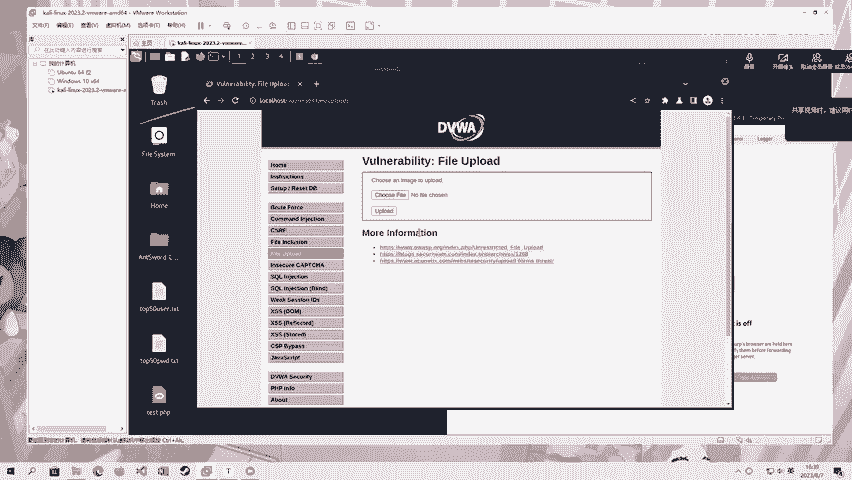

然后去执行命令，并且获取你电脑里面的文件信息，各种各种操作都可以我们就可以。

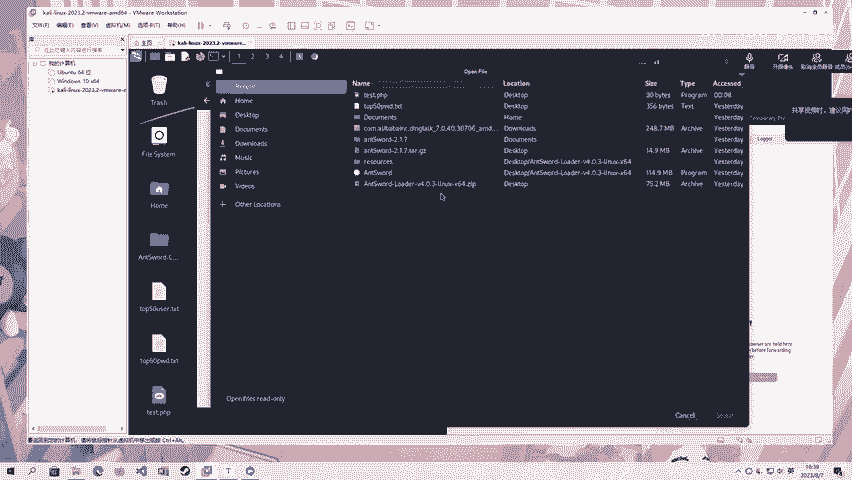

尝试一下，有靶场的同学可以。跟着我做一下，非常的非常简单，但是非常的有意思。首先我们要准备一个一句话木马，什么是一句话木马呢？其实就是。因为这个木马只有一句话，这是一个由PHP写的一个一句话木马。😊。

别看它很短，但是它的确是可以的确是可以执行任何命令的一个代码。你把它然后大家怎么去。嗯，怎么去生成这么一个木码啊？可以这样，我把它删了，跟着大家做一下。那桌面上右键一下。在在此处打开。在此处打开这个。

终端。然后用刚用啊刚这个命令没说过echo命令。Ale命令什么啊？就是把后面的内容啊随便打一打内容。对打印在这个标准输出里面。然后lininux啊它还可以有一个符号，是这个。大于号。

其实像右指的一个一个符号，它可以把上一个的输出重定向到下面那一个呃下面一个内容里面。所以说我们就可以。这样子用这这个。哎呀，我看下。我们就可以把哎对。把这个命令使用这个命令在桌面上生成一个。

生成1个PHPPHP1句话木嘛。哎呀。但不要在意啊。我发到群里面，大家可以转粘下。在桌面点击。哎，在桌面右键点击在此处打开中终端。然后把这句话粘进来，摁一下回车键。😊，你可以看到啊。

在这个桌面上出现了一个test点PHP。这就是我们刚才这个写的一句话木马，我们注意这个hell中间写的这个hell，这个部分是你可以随便改的，你想改啥改啥改个key吧。😊，这个的话实际上就是你连接。

到时候一会儿我们要用工具去连接它的一个密钥。Good人。对，就是一个身份身份认证的一个密钥。

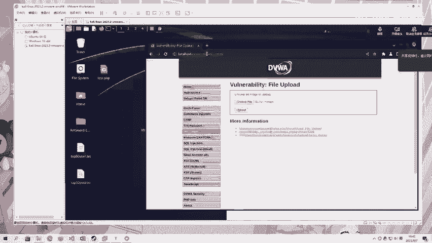

我们现在选择。上传文件上传什么呀？上传我们刚才桌面上生成这个test theirPHP。

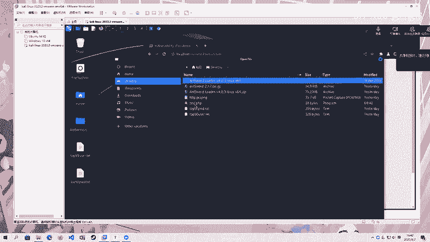

选择好以后，点击上传。你会发现他上他把这上传的位置都告诉你了，上传到点儿点儿的意思，在在unix的那个系统里面，代表上一层文件文文件嘛，上一层文件夹的层级。这两个点点就是上上两层的。

然后再加后面那个路径，后面后面这个路径对吧？它是相对相它是相对于当前目录的，也就是相对于这个目录，我们可以。看一下他是不是在他是不是在这个位置啊。She。大家感觉这是上一层，这是上上一层。

他应该是在这个位置。那他这块没显示，不过问题不大。

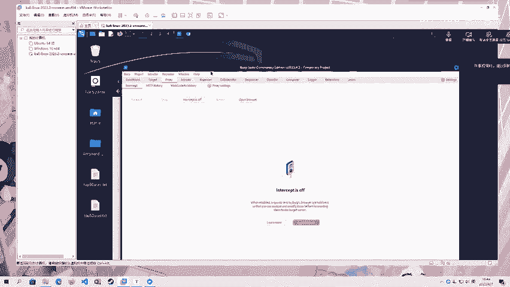

我们现在BP先放后面，我们现在用。就用到是给大家。课前发的这类这个这两个文件夹大家都拖到讯拟机里面了吧。这两个文件夹呢它是一个工具，就是用来连接一句话木马的这个叫中国已建。其实很早之前。

那个中国菜刀和它的作用是类似的。我们先先把这个之前弄的删掉。我们先解压这个先解压这个文件夹。这个带loader加载器。这个文件夹把它拖到桌面上。到桌面上以后，你会发发现这个的话其实就是它的可执性文件。

就是这个andor这个可执性文件。我们接下来把第二个文件，第二个另外一个压缩文件打开。在我们的你随便放个地方，你可以放到桌面，也可以像我一样放到这个document。放到文档啊。

放到document这个目录底下，把它给拖进来，我已经拖过了，我就不动。脱脱下以后，我们打开这个加载器，双击这个二进制文件。可以发现它提示你必须要指定一个工作目录，这个工作目录就选你刚才拖进去的那个。

位置我刚拖的是。document这个文件夹下，你选择这个目录以后，你看到这个app点GS这个文件所在的地方点OK。

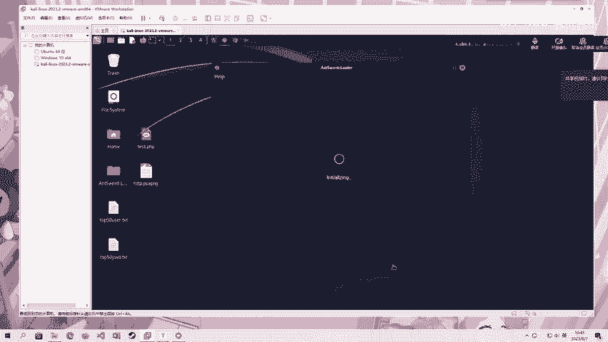

他就加载好这个中国一键的这个源码了。他其实刚才闪的很快啊，他告诉你你要重新的。重重新呢手动打开一下这个软件。我们可以发现。诶。那可以发现打大家打开应该和我现在的状况是一样的。就是空白的。

然后这块是可以右键，它有一些交互的。我们在这块呢添加上我们刚才。在哪儿呢？这个浏览器里面上传的热个码对吧？张传这个码它的位置应该是在这儿吧。宝威A呀。把位置指定好，然后连接密码，我们刚才填的KEY对吧？

底下有其他的选择默认。当是实战里面他不推荐使用这个这几个方法，因为他有可有可能被流量监控就给查到了。然后测试一下连接，它显示连接正常啊，那我们就证明那现在实际上就和上传那个码连接上了。哎呀。稍等啊。

连着正常连接正常以后点击添加。我就在这块能看到这个。上传上去的吗？连接上有什么用呢？你就可以直接双击，然后他就把它整个这个文件目录就直接给加载出来了。你可以看到刚才。

我们是把它实际上是上传到了这个服务器的这个位置。hckable upload这个地方，你现在实际上就拥有了对于这个整个。呃，整个服务器的一个掌控权了，你想干嘛干嘛了。

它只不过这块是可视化的显示出来的这些文件和目录所在位置。而且这些东西你都是可以直接给里面添加，然后。你看。比如说我要看一下它这存放，这是一个什么东西，直接给它下载出来。下载到桌面上面。

因为发现他这显示的是一个。他们的邮箱当当然有可能在CTFT里面，他这可能就是显示的一个flag了，对吧？然后我们也可以给他上传新的东西。比如说我给他改个名儿。诶。My file the。然后给他上传。

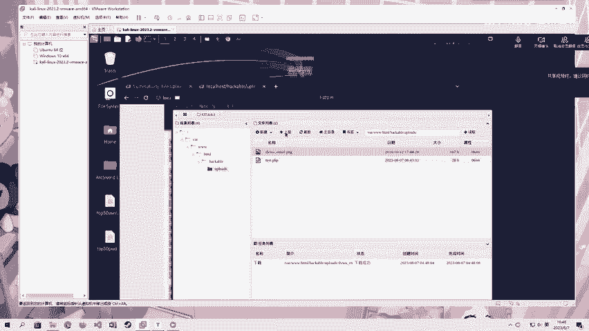

上传文件。点刚才这个你看上传成功了。

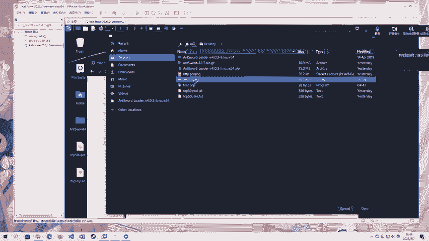

啊，所以说这这个行为实际上是非常危险危险的啊。这个我们get shell这个这个操作叫get shell以后，你就拥有了对那个目标机的一个掌控权了。😊。

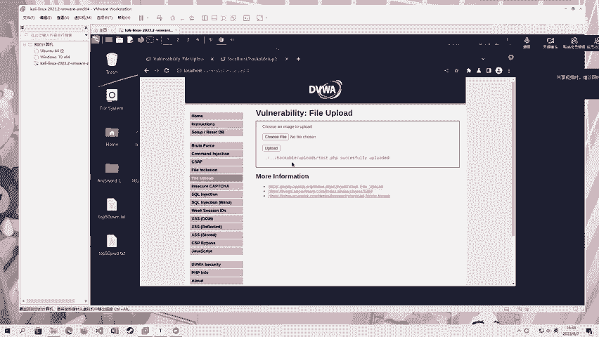

然后。这文件上传给大家展示完毕了。哎，不是文。对。然后再给大家说一下这个叉SS。

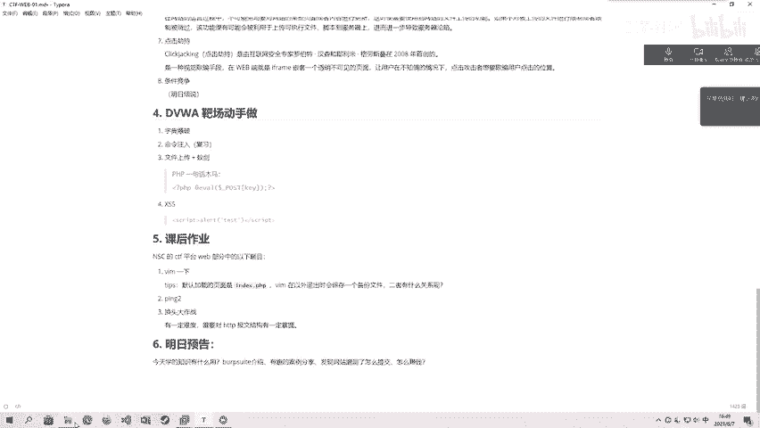

叉SS是其中一个，你会发现他给的一个这么一个交互。可以还是同样先看一下原码，原码里面他啥都没写，证明它后端没有操作。它这个PHP。没有操作，它都是在前端的GS脚本里面进行操作的。你实际上可以F2。

看一下他这脚本里面写了啥啊，但是这个不重要。这些大家私下去再仔仔细深究一下，我今天就带大家大概过一下，了解一下，这实际上还有很多的功能。我们可以发现它这个进行了这个交互进行了什么操作，点一下。

它实际上是给get了一个get了一个参数。😊，我选择了语言，选择了默认是english英语。但实际上呢，刚说的叉SS是有可能在里面插入一些人为添加的代码的。举个例子。

我添加一个这么这么一串代码。

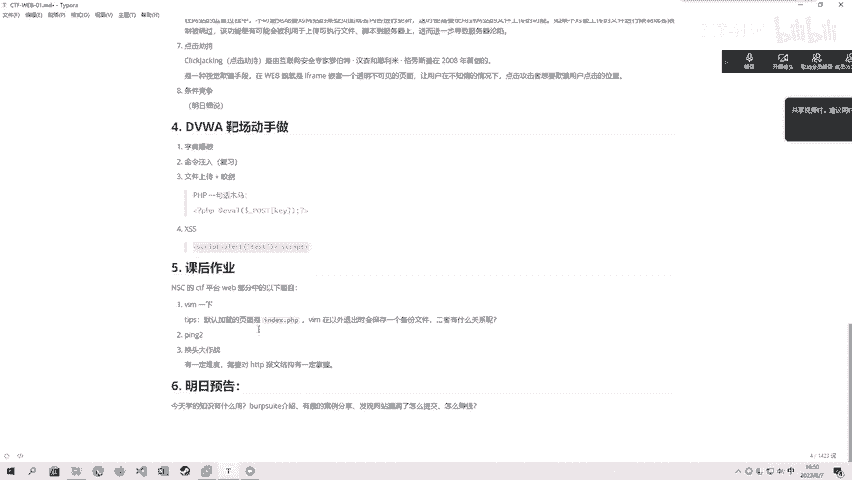

这这串代码也通常。被用于测试这个网站是否有叉SS，因为你不可能去在测试的时候用一些恶意的代码。这个代码的意思是弹出一个弹窗，显示test这个字样。你尝试一下按下回车，你会发现它的确能实现这个效果。

能实现这个效果也能实现其他的效果。就看你怎么去利用它。还是刚才这句话。那这有什么一些危害性的利用呢？这其实大家都知道我们这个。你看登录信息是如何保存的呀？比如说这个靶场也一样嘛，登录信息。

我们有可能登录一个网站。你可以在半个月之内再不用重新登录。或者说如果你天天都登的话，它可能你一直都不用重新登录。这是为什么？它存储了一个叫cookies的东西。啊，他就是相当于在本地存储了一个。呃。

可用的一个凭证。在这个凭证没有过期的时候，你就可以通过这个凭证来直接访问。那我在这个。人为添加的脚本里面能不能添加一些能不能添加一些恶意代码，把你这个凭证给抓下来。获取到你这个cookies以后。

我在我的电脑上用你的凭证是可以是可以直接打开你的登，就是是可以直接仿造你的登录信息的。这也是一个利用啊。所以说叉SS还有就它能执行脚本，就这种危害。好了，DWDEDVWA给大家展示这么多吧。😊。

还是一样，内容很多，大家自己。课下来自己学习一下，好吧，这个ciirical注入很大一个部分。学习一下去网上找一些CTF的。就是什么BUUCTF呀，然后攻防世界啊。

他们有一些现成的circle入的题可以去学下，或者说。detop上面。Sure么。giit他ub上gi他ub上面有那个。啊，这块好像不太行。

gegiar上面有一个circle注入的一个专门开发的一个靶场和这个类似啊。不过是针对circle注入的，大家可以下去去搭建去学习一下。

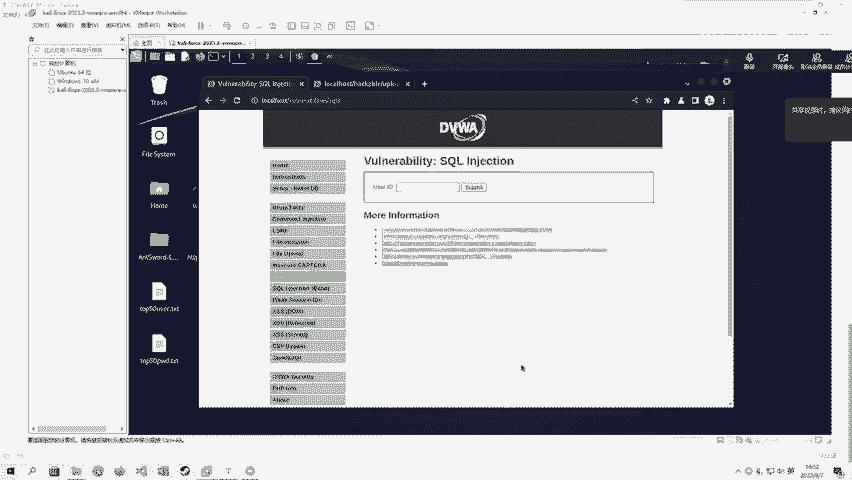

把场的这个相关内容给大家介绍到这。好吧，今天时间也差不多了，最后给大家布置一下课后作业。😊，一个是刚才说的这个命令执行的第二第二难度P2这个题。然后还有。

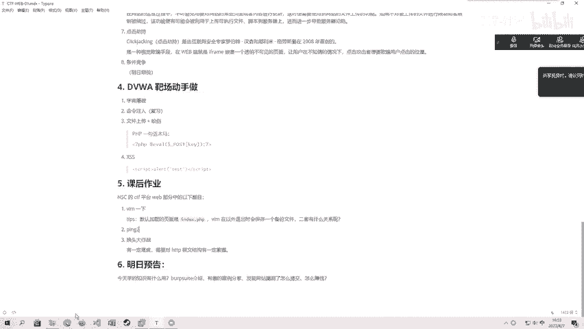

刚才应该已经看到了吧。

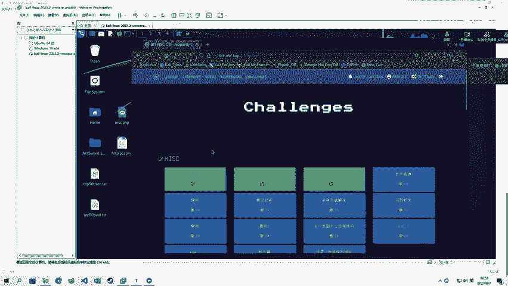

这个为m一下这个题。这个实际上是一个签到体啊，比较简单。然后我这还做了一个小的提示。大家可以去了解一下。然后第三个呢是和今天那个PPT里面讲的HTP协议相关的。这个的话它的就套娃嘛，它套的娃比较多。

可能需要去。发挥一下脑洞去。去呃去尝试一下。就给大家布置这么三道题，好吧。😊，那今天的课程内容就到这儿基本。结束了。那预告一下明天的内容。就今天可能前面大家听了这么多啊，外CTF里面外部有这么多环节。

这么乱七八糟东西究竟。有什么用？如果不打CDF我能做什么，我能让他做什么？然后再其次呢，今天刚用到那个BP抓包这工具还是非常重要的。明天再给大家详细介绍一下。然后再可以给大家分享一些有趣的案例。啊。

这个就是实际的案例啊，用外b刚才学的这些知识。发现那些洞啊之类的。然后再包括我前面啊前面给大家介绍了这么多的。他外不得漏洞相关的。你假如说发现了有一个漏洞。那我们遵纪守法嘛？我们遵遵做遵纪守法的好公民。

然后不能做违法行为，所以说不会进行不会去恶意利用它。我们想要督促这个开发商或者运营商去解决这个问题，去修复这个漏洞。我们怎么去提交这个漏洞？😊，那我们提交这个漏洞了，发现和提交。

我也我们也是出了力干了活的，用这个东西能不能赚钱呢？这个明天可以给大家随便聊一聊。就内容没有没有这么正式了。大家有什么疑问，相关的疑问也都可以在明天给大家做一个答疑，好吧。

这个今天上课也基本上没有什么同学发言，也没有人中间打断我。明天大家可以就更活跃一点嘛，对吧？因为也是闲聊为主嘛。😊，能说的，咱们开开着录播讲，不能说的，咱们把录播掐了讲吗？好吧。那就这样了。

今天内容就到这了。好，谢谢大家，大家可以退出会议了。😊。

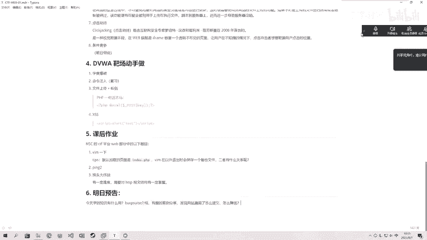