# BUUCTF-Crypto-Alice与Bob - P1 - Edu济宁古Sir - BV1noVWeFEcy

B your city have cr， Alice与 Bober。

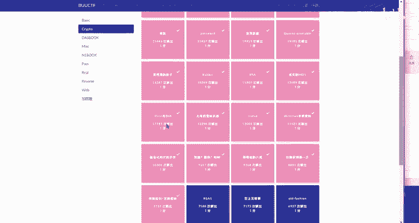

啊。经过置换和轮加密。分解两个素数。小的在前，大的在后MD5。哈西加米。O。分解成两个素数。

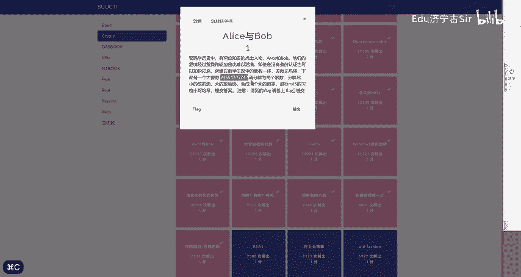

然后打开。

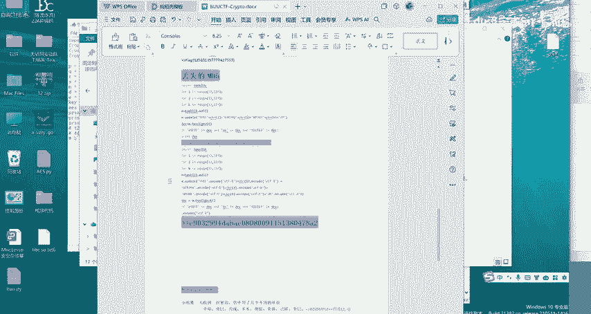

之前写的。😔，海西加米，还有这个。分解直因数。嗯。🤧嗯。就这个数。我想把题目复制一下。

Alice， Alice Bob。

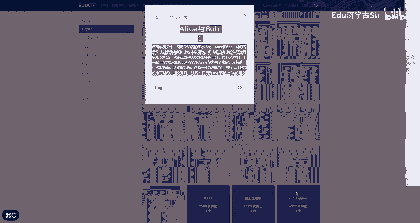

然后他就变成了。😔。

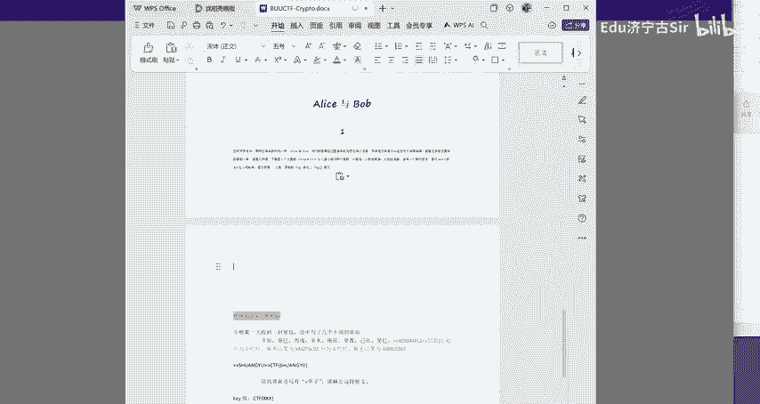

这一个新的数。

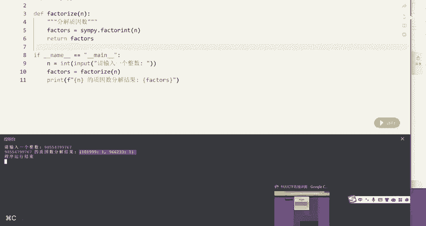

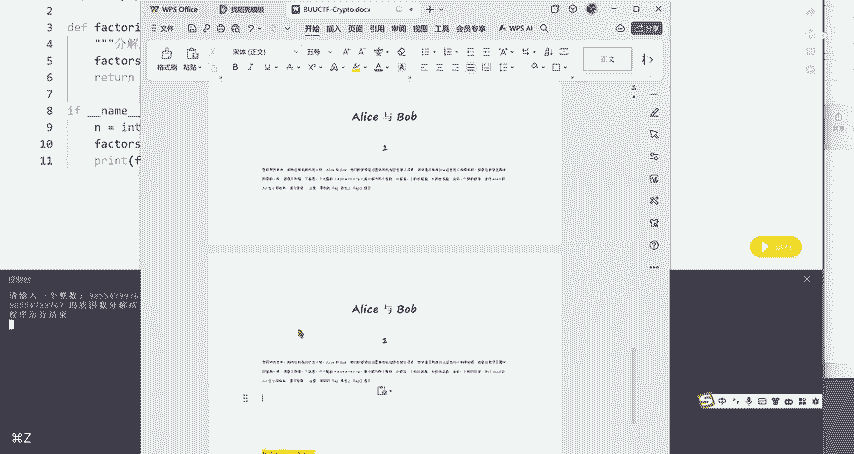

他说我得这样复制。右键复制。

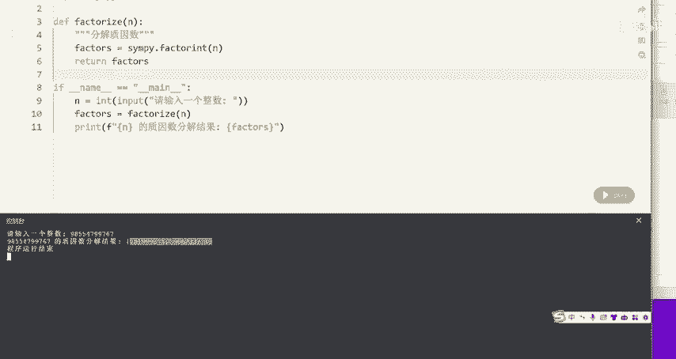

小的在前，大的在后。O。变成了这么一个数，然后再进行。哈稀。😔，哈稀一下。

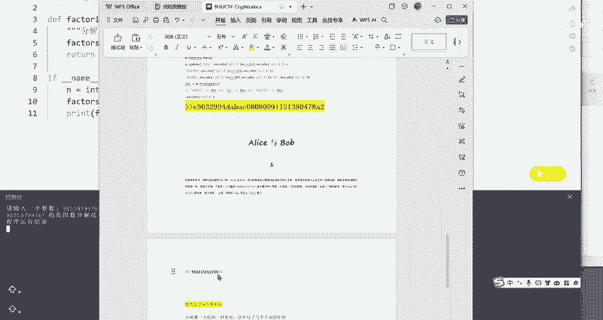

OK它就变成了这么一个。

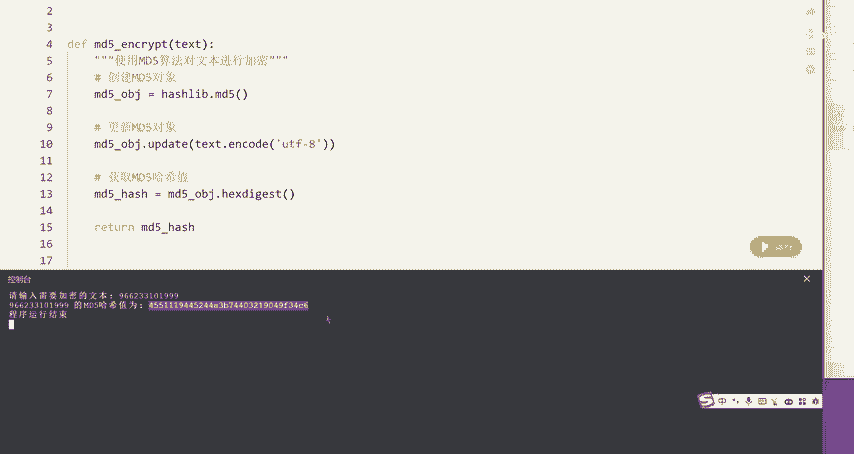

就OK啦。32位。这几位。这几个数。哼我这个不显示。

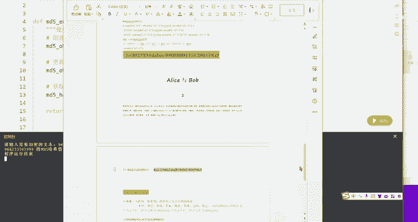

OK暂时先这样吧。