# BUUCTF-Crypto-大帝的密码武器 - P1 - Edu济宁古Sir - BV1fT421v7Y1

B， O U City， I cr。大地的密码武器一看就是凯撒。

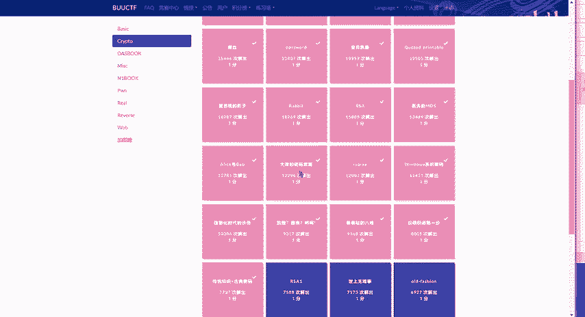

开锁大地。嗯，还来个这个VIP。

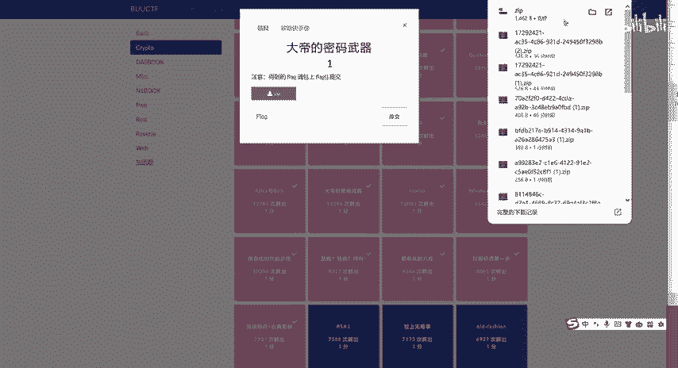

OK把它改成点VIP呗。题目。先给它复制到这里边来。密文。Come， China。O。哎。

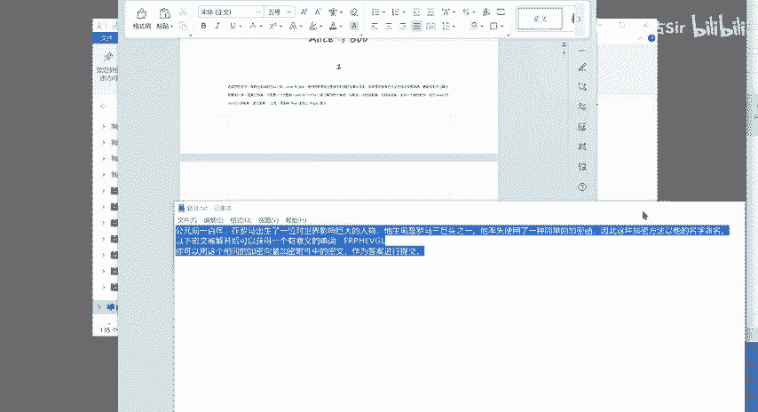

还有个什么东西？

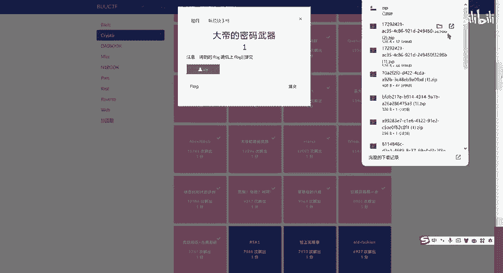

这有什么？都不用管。

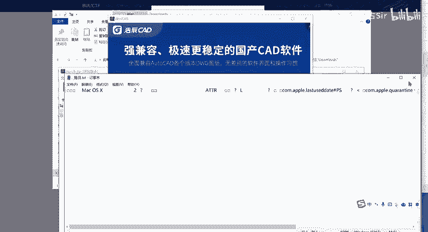

不用管。

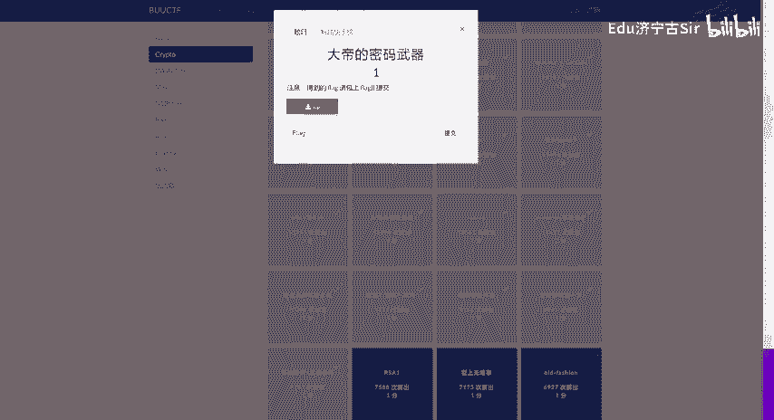

来看题目吧。以下密文被解开后，可以获得一个有意义的单词。也就说，他变成他。也就是说这个经过凯撒加密之后，会得到一个。有意义的单词。呃，咱们放在脚本里边。

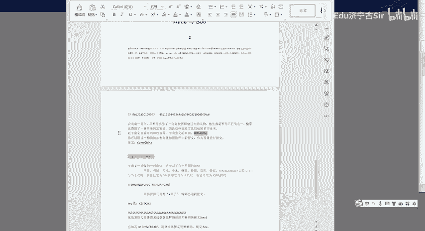

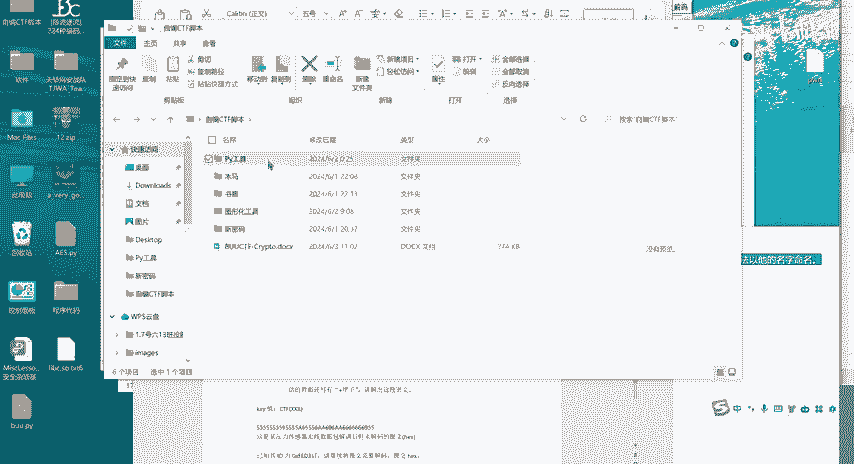

凯撒偏移。Okay。那你的英文得好。😔，Security。哎，这个这个是那个什么安全的意思，secret安全偏量13。所以说。

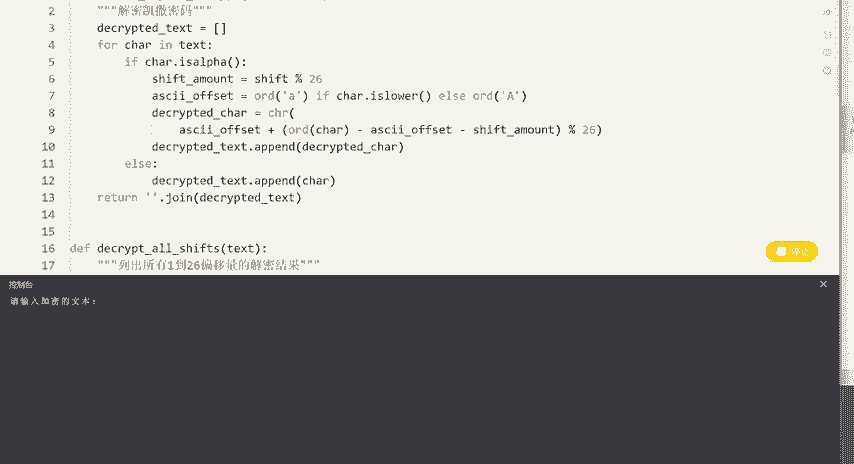

嗯。那你的。😔。

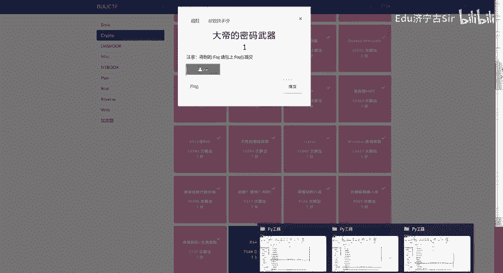

这个。相同的加密向量，加密它。他也加密13次。对吧偏移13次就可以了。

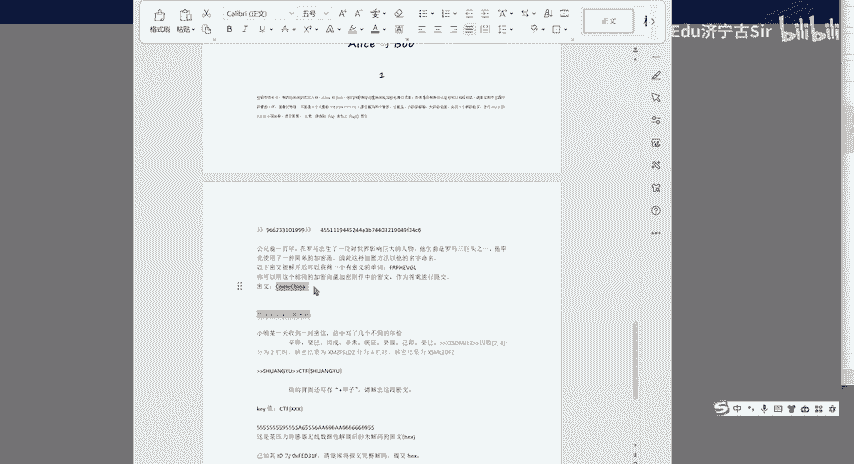

偏1位。Okay。13次的话，那就是他了。

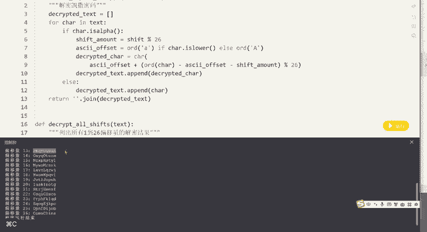

那就是他了。Fag个。O了。这个来算了。

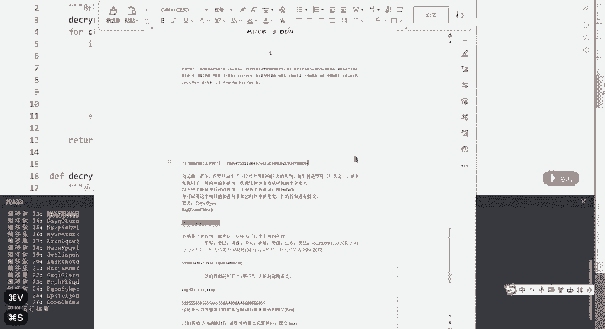