# BaseCTF2024Pwn-Ret2text-栈溢出 - P1 - 武汉网络安全CTF培训 - BV1q2sbehEa2

大家好，我是阿阳。本视频为2024年baseCTF高校联合新生赛赛迪详解视频。大家可以扫描右侧的二维码，免费领取工具资料或者报名CTF培训班。今天讲的赛题为胖赛迪站役出。

可以看到题目的提示是原来站是可以溢出的。注意一下函数地址呢是函数地址，谢尔地址是share地址，不要弄混了。

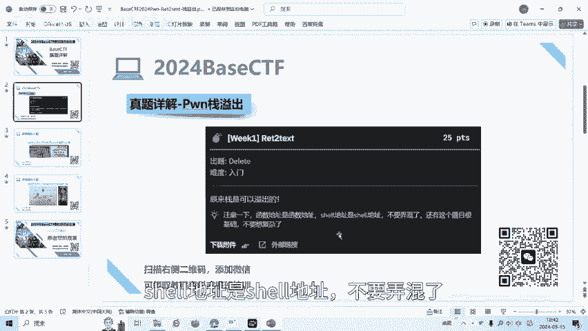

好，我们来看一下这道题目。下载题目文件。

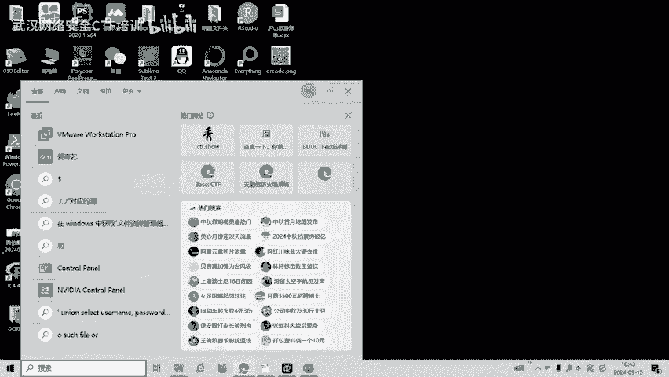

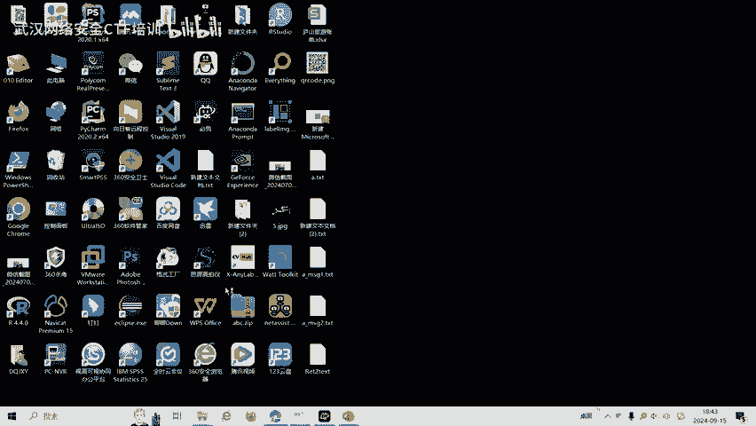

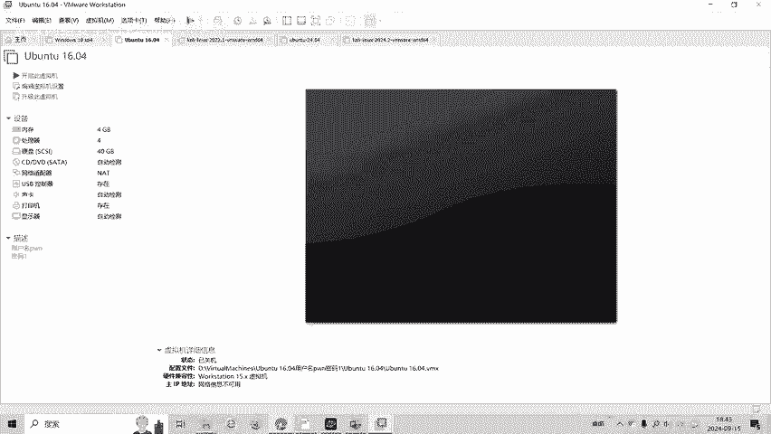

打开我们的安装了胖工具的虚拟机。

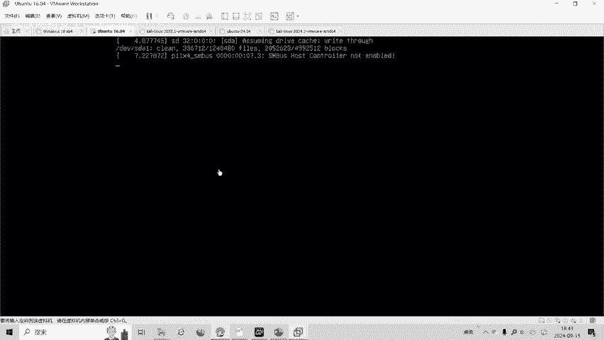

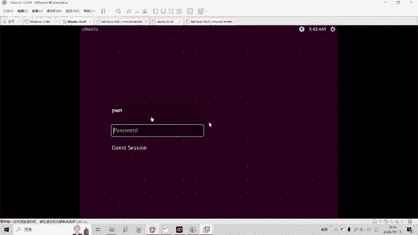

我们把比赛的文件。拷贝到我们的。虚拟衣里面。我看一下当前呢是我们拷到桌面了，那我们去桌面的部分看一下这个文件。我们把这个文件呢。添加可生选序777。现在变绿了，也就是它具有可执行的权限了。宝边看一下啊。

没有这个n C。啊，没关系。我们首先遇到胖题，先checkCC。

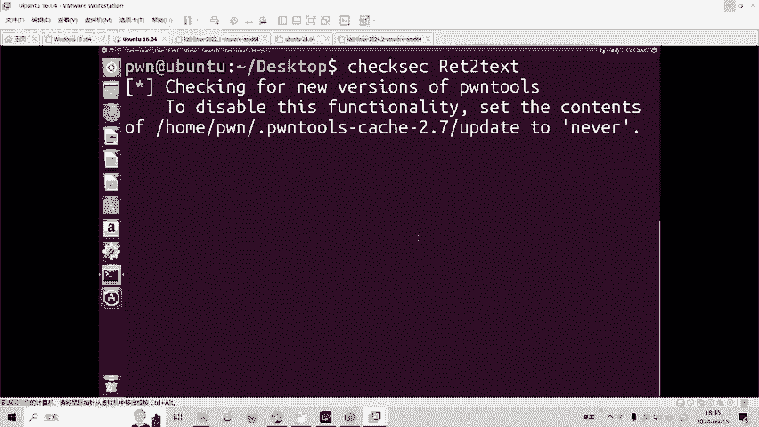

发现它是1个MD64位程序，那么我们就用IDA64去打开它。

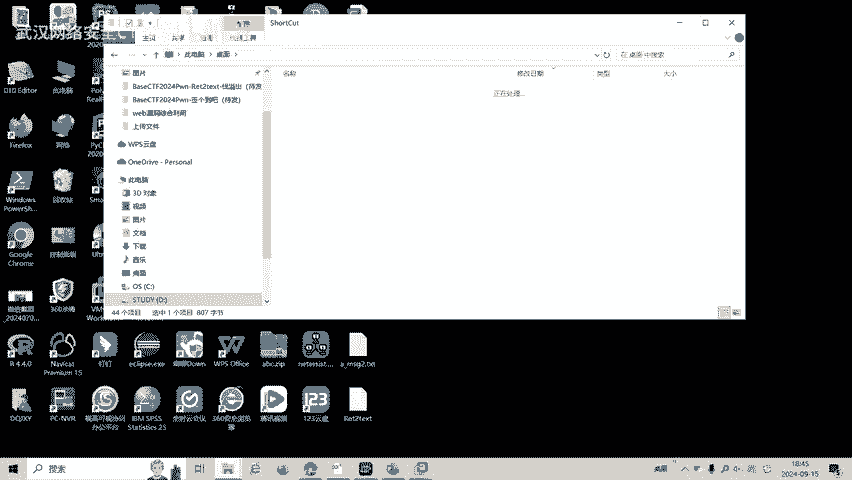

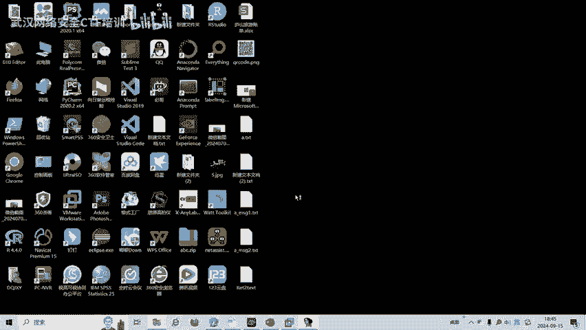

我们可以看到这里呢有个buff。数组啊32个字节。read呢读读0是100肯定会超过32个字节，这里的就存在了这一出。这里呢有一个C的函数。这个函数里面有Cson和BSH。那么这里呢就有一个。气啊。

并SH。

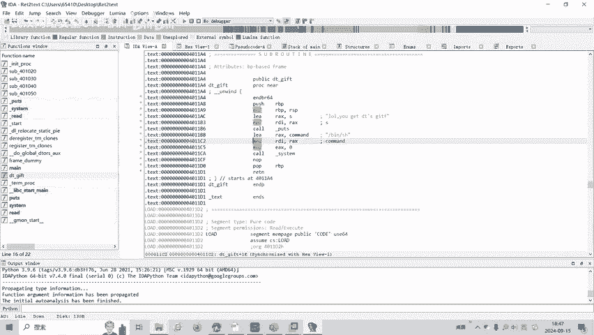

然后BSH在4011BD这个地址。

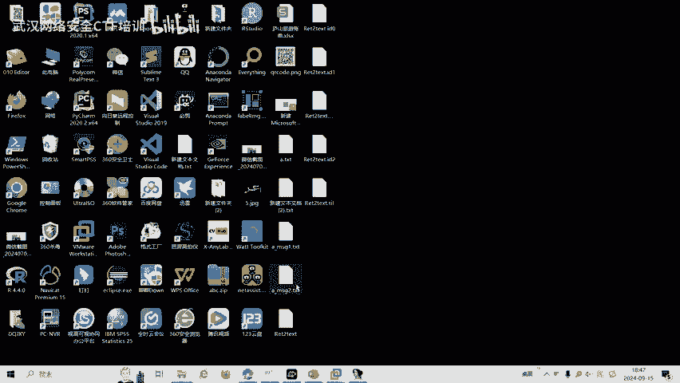

0X4011DB。做烫体，我们一般怎么做？首先che个se，然后呢。用相应的IDA发现64位，我们用64位大白的。然后我们找到了啊包含BSH的 sharere的这个函数地址。我们要。

输入并 share的地址，而不是这个函数地址啊，函数地址是不对的。我们需要找到be share地址。然后呢，64位，我们找到64位相应的代码。复制一下。

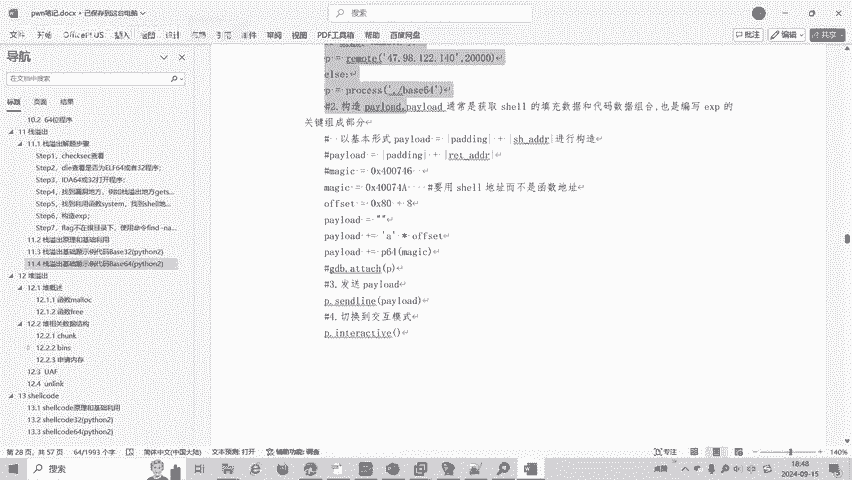

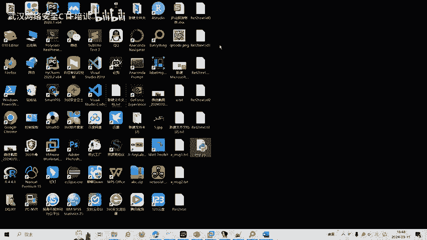

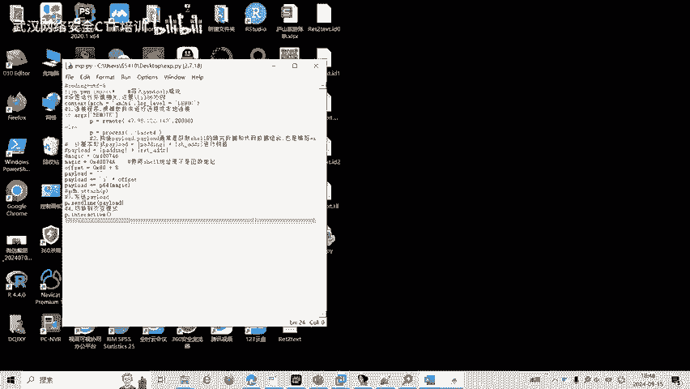

这是地址。这张子浩。然后呢，我们这个线R地址呢。是这个。内函数。3月。字符呢这个数组呢是32个字节。对我们这里 이제。20。

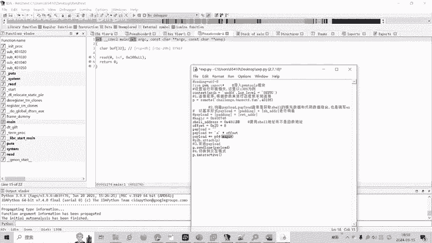

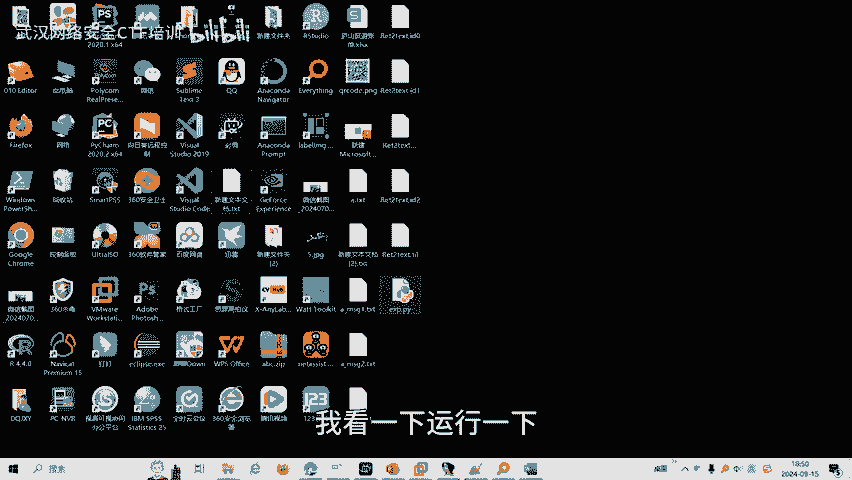

我看一下逆一下，放到我们的。环境里面运行一下。Yes。发现了有flag，我们开了flag。就找到了这道题目的那个。

大家如果有兴趣进一步深入学习CTF可以扫描视频中的二维码，免费领取工具资料，或者呢报名我们的CTF培训班。

我们的教师团队均来自CDF省赛市赛前1名选手。通过顶尖战队的手把手指导，大家学完之后，尽可达到现赛车赛的夺奖水平。好了，今天的贝CTF赛题讲解到此结束，感谢大家的观看。Yeah。🎼Yeah。🎼The。

🎼。