# BaseCTF2024Pwn-签个到吧-连接靶机 - P1 - 武汉网络安全CTF培训 - BV1iEtye2ERa

大家好，我是阿阳。本视频为2024年BCTF高校联合新生赛赛题详解视频。大家可以扫描右侧的二维码，免费领取资料，或者呢报名CTF培训班。今天讲的是贝子CTF胖赛题的第一道题目，签道题。

我们可以看到题目的提示怎么连接到靶机。我们可以看一下题目，这里呢给了我们一个靶机的网址。这个网址呢是不能够通过网页连接的。我们可以打开卡利。

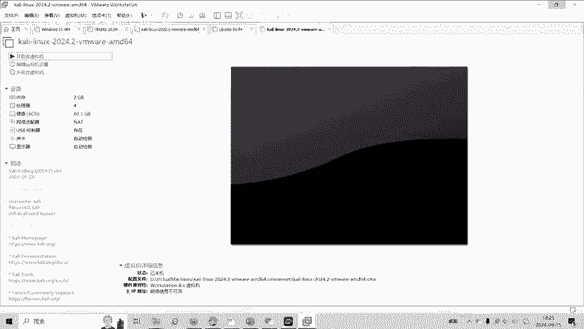

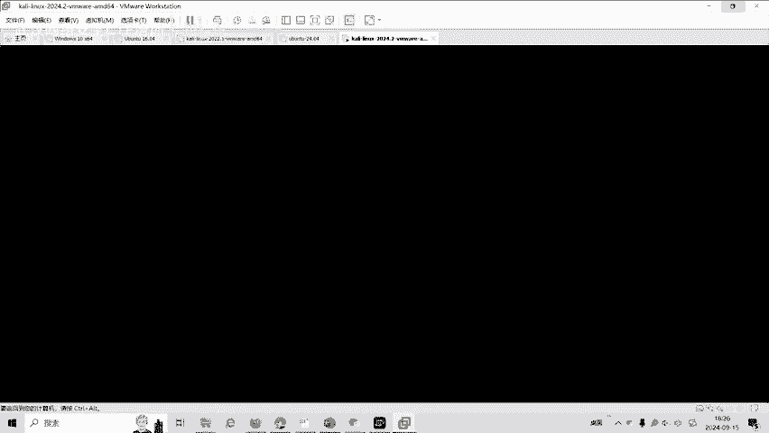

NC。

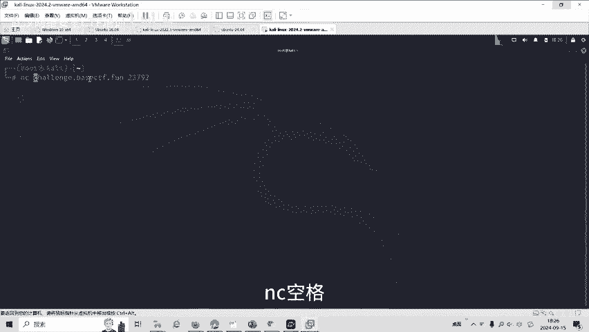

空格。

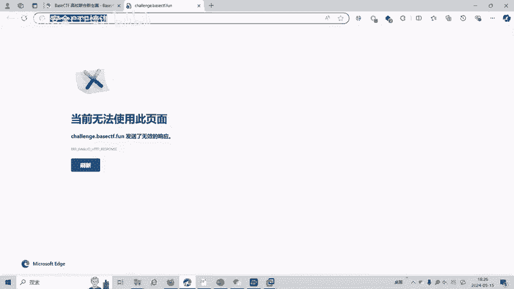

我们把这个。网址复制过来。把它删掉。

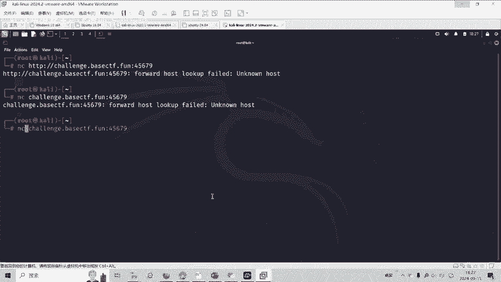

我们看一下NC的使用教程。

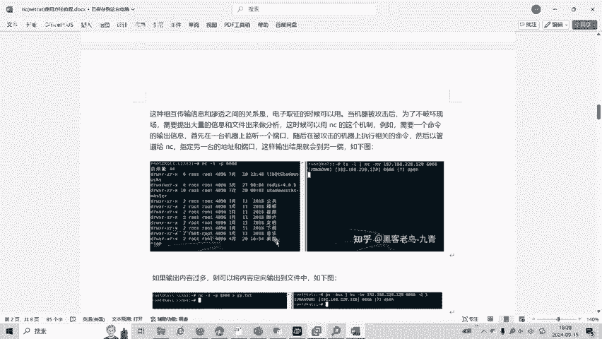

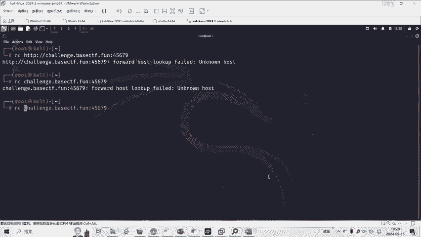

这试嗯C。

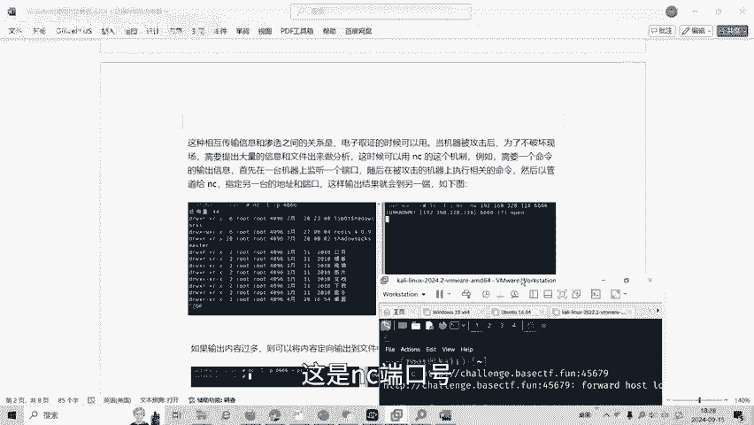

港口号用的是。

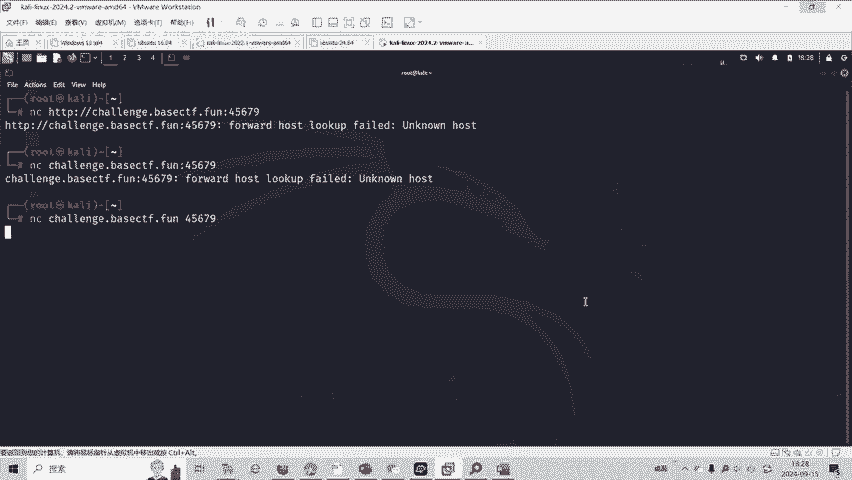

NC输入IP地址和端口号，我们进行连接。

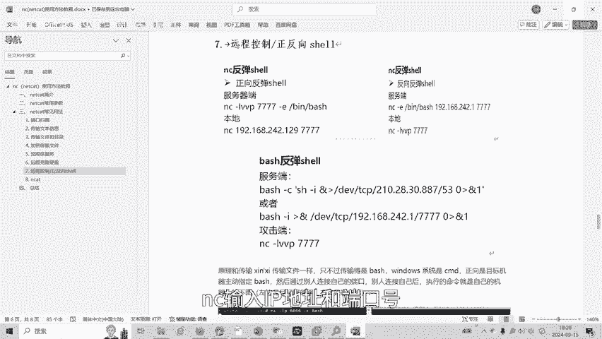

嗯打S可以看到的我们。当前是在跟目录下也要做flag。试一下。这就是我们的一个flag答案，用NC可以直接连接我们的码机。

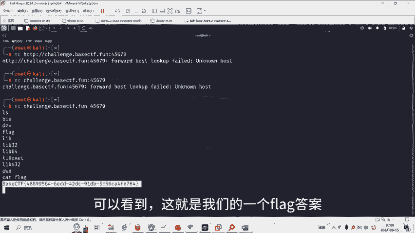

注意。

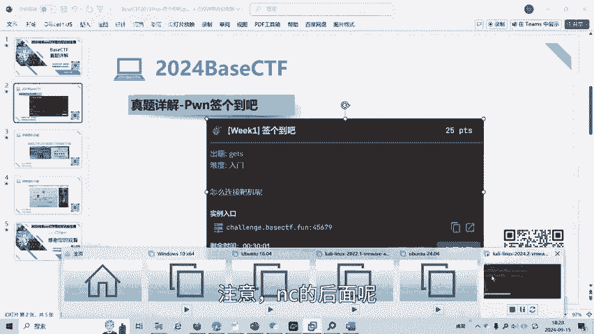

NC的后面呢写的是I地址啊，IV地址或者是域名网址，然后再加空格端口号，通过NC这样子进行一个反弹连接。

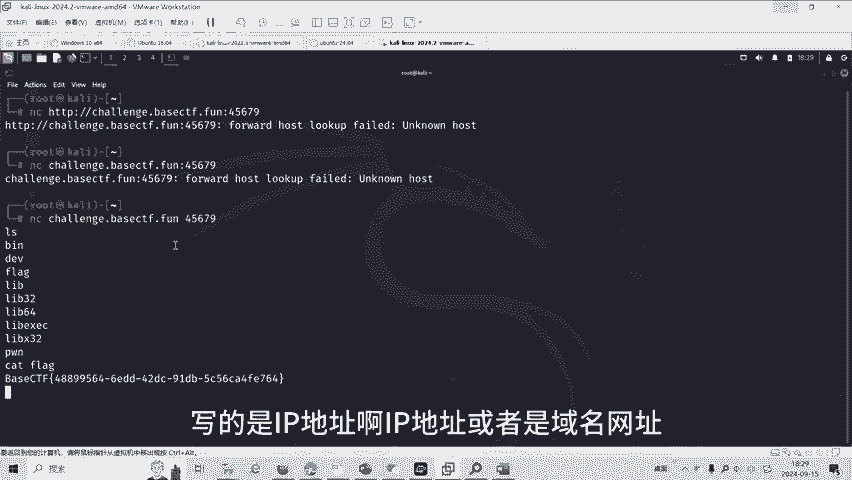

可以连上我们的靶机。好了，大家如果有兴趣进一步深入学习CTF可以扫描视频中的二维码，免费领取工具资料，或者呢报名我们的CTF培训班。我们的教师团队均来自CDF省赛市赛前10名选手。

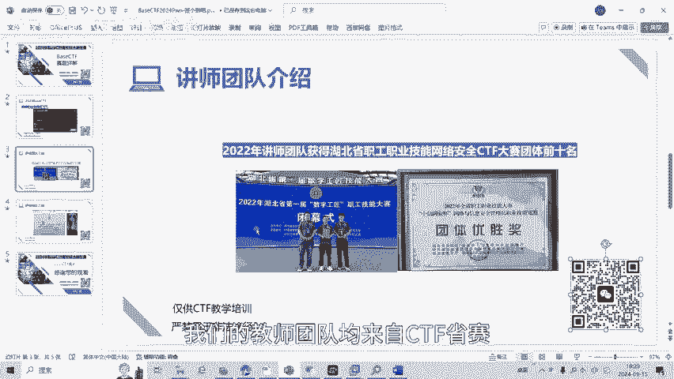

通过顶尖站的手法手指导，大家学完之后，即可达到省赛实赛的夺奖水平。好了，今天的贝子CTF赛迪详解到此结束，感谢大家的观看。

