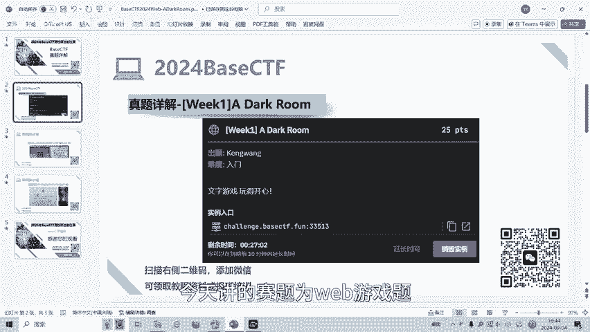
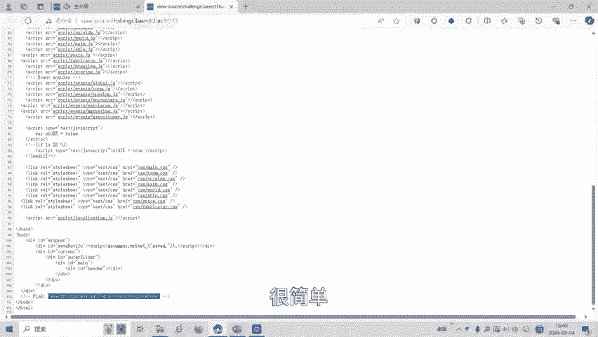
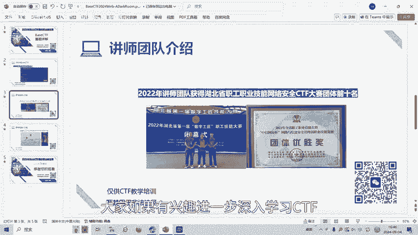

# BaseCTF2024Web-ADarkRoom - P1 - 武汉网络安全CTF培训 - BV1YppFeqEEE

大家好，我是阿阳。本视频为2024年贝aseCTF高校联合新生赛赛季详解视频。大家可以扫描二维码，免费领取工蜜资料，或者呢报名CT培训班。今天讲的赛题为未补游戏体。

然后贝CTF呢，今年这一道题目是叫呃 dark room。黑暗的房间我们可以看一下。页面里面呢有一个。游戏界面我们点击enable，我们可以看到这里有一个生活。因为点击了一个A的话。

这里就可以听到一些声音。然后给一天才。填海之后呢，我们再去生活。一般在做游戏体的的时候呢，我们首先第一步，右击查看源代码。在代码里面呢有可能会有flag。如果是这个游戏呢，是用GS加入s写的。

那么呢我们就可查看GS文件，然后从而查看flag。好了，我们右击查看源代码，发现呢今年的贝aseCTO比赛的这道题目呢很简单，答案呢就在我们的源代码里面。

大家如果有兴趣，进一步深入学习CTF可扫描视频中的二维码，免费领取工具资料，或者报名参加CTF培训班。我们的教师团队均来自CTF省赛试赛前10名选手。通过顶尖战队的手把手指导。

大家学完之后即可达到省赛试赛的夺奖水平。

好的，今年今天的贝CDU比赛赛题讲解呢到此结束，感谢大家的观看。Yeah。🎼Yeah。🎼The。🎼。