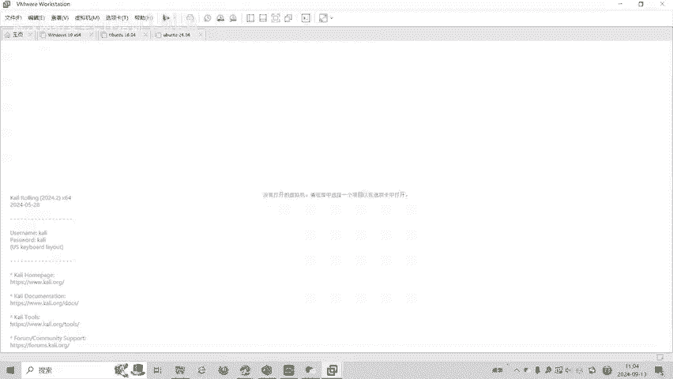
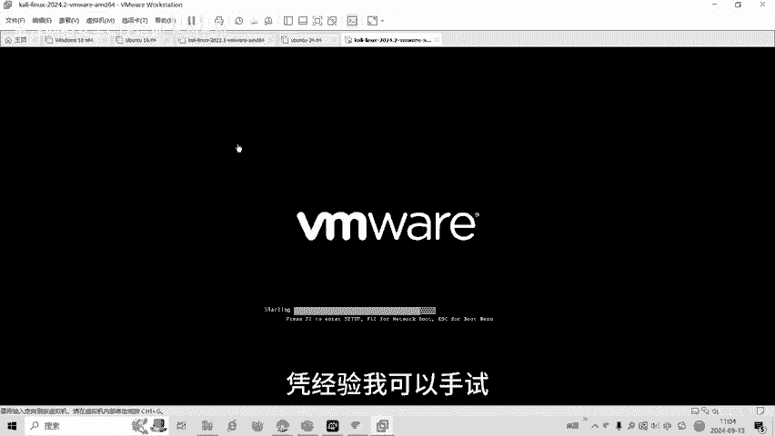
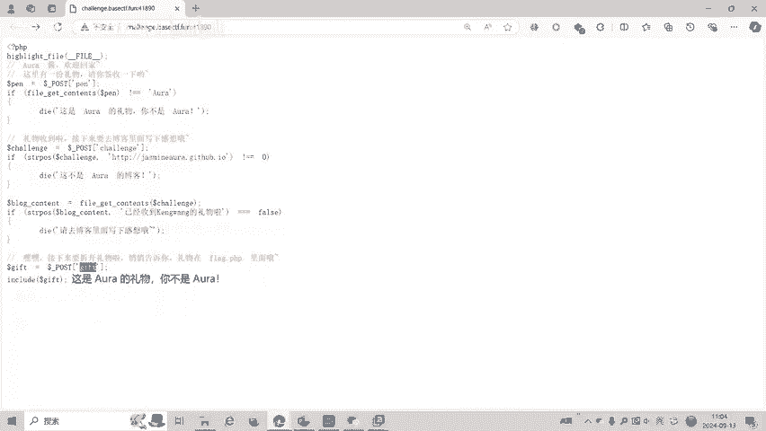
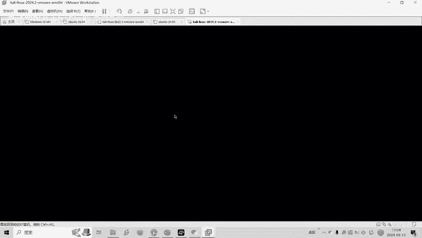
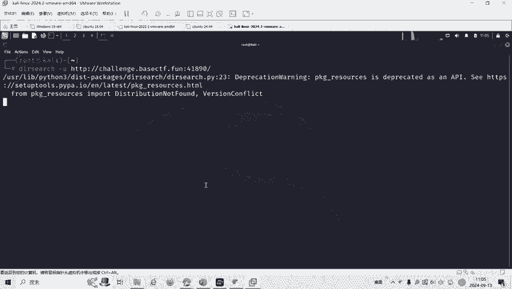
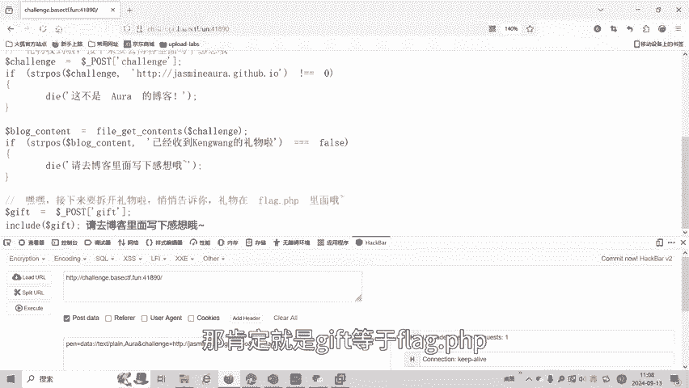
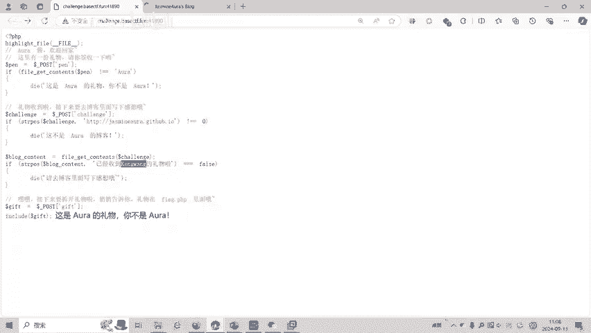
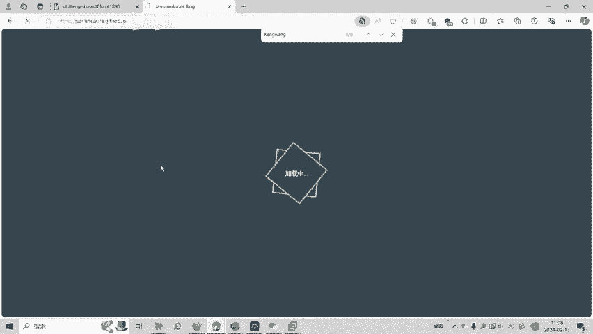
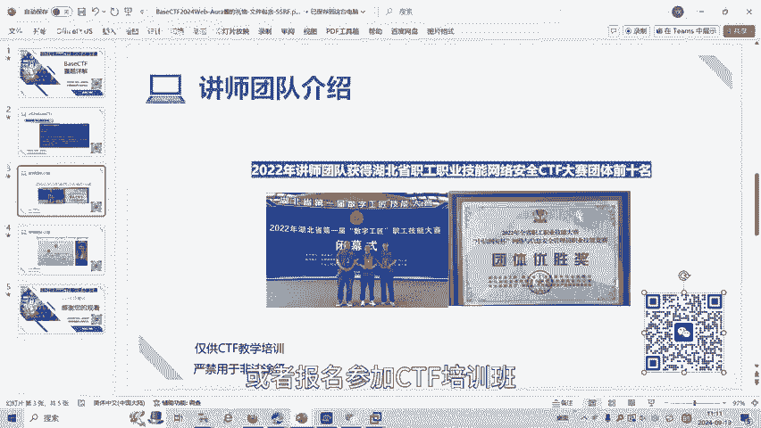

# BaseCTF2024Web-Aura酱的礼物-文件包含-SSRF - P1 - 武汉网络安全CTF培训 - BV1XEtKeAEqx

大家好，我是阿阳。本视频为2024年贝斯CTF高校联合新生赛赛题详解视频。大家可以扫描右侧的二维码，免费领取工具资料，或者报名CTF培训班。

今天讲的赛题呢为外部赛题涉及到了文件包含伪协议和SSRF等多个知识点。这是一道综合性的外部题。我们可以看一下题目。题目的原来码。首先我们看一下，第一你要po着船舱传一个喷，并且呢传舱的内容呢等于。

Ara era by该 contents。然后呢，po子传餐传迁里去。千里级的STRposition就是字符上的位置啊，千里级字符上的位置呢。如果不等于0就会输出报错。也如说我们的这个左串。

传入千里字符串的必须以它开头才会等于0，自转以它为开头。然后呢，博客的内容呢，就是访问这个千里的网址，我们就会回回到博客的内容。博客内容里面必须这个网址里面呢王址内容必须含这个已经收到坑望的礼物。

博客的那容网址内容必须有这个。否则呢就会报错。最后呢po传三传gift，然后呢包含了我们的gift。一般比赛的话，他都会有个文件包含的话，一般都是包含本地广场目前有个8个0PP。我们可以看到可以访问。

只不过呢是空白页面。当然了，我们也可以用预键啊，或者是卡利的dea去扫描这个网址，看一下这里面有没有。包含flag的片的PAPP或者是信息网页等等。

凭经验我可以手饰。如果呢。

大家出去的不是很清楚的话呢，不知道包含哪个文件，最后一库的话。

这个地方不知道包含哪个文件是不类的，我们就可以用但 search。去扫描。我们打开卡利。

输入。杠U就是U儿L网址的意思。我们输入这个题目的网址，扫描这个网站。

好，这个时候就开始扫描了。那我们可以最后一个上传的或者传的gi。我们可以扫描出来，也可以手势出来。那么前面一关一关的过，我们把它复制到火红里面，打开火糊的黑油吧。首先第一关pose传餐传喷。

要求喷的内容。通过fin get content获得这个文件内容等于。I吧。这个地方我们就看到了文件包含的卫型。我们看一下。培训课的课件。总共有14门课，外国。课程在最后一章我们有讲过。文件的尾协议。

利用data为协议，我们可以。读取这个文件的内容。别着我些议。然后呢，读取一个文件内容，要求等于。All right。点击指定。这不是阿尔伯克，也就是说我们这一关已经过了第一个义回句。

现在到了第二个到这来了。然后呢，要上传圈里。钱品才要求以他开头，那我们就以他开头。后面可以打ABC都可以啊，只要是有它开口就行了。有这个字符串，这个网址开头。那我们就可以过了。第二关。

请去博客里写一下答项，也要到了第二个英务语句，我们绕过了，我们到第三个英务语。第三个语句要求这个网址的内容。有已气收到看到礼物，我们可以打开这个网址。看一下这个博客亭能在。

同时呢我们这里的d设计也扫描到了blag点PAP了。那么我们最后的一个po gift，那肯定就是。并不开。等于不来表偏偏P。

这里面可以打开了这个网站的独客，正在加载。我们看一下这里面按道理来说是不会存在。

题目的这个坑罐。

可以搜索，这个肯定搜索不到的。

那怎么办呢？那我这个网站如果包含我自己是不是这个网页的内容。算有。这个字不算对吧？就我包含自己是肯定可以的，包含这个题目自己。题目自己是有这个的。题目自己的源代码是吧？

ATM代码是有这句话的那我多按字母就行了。但是又一必须要以他为开头，我可以帮他自己要去点一点击点。但是又鱼啊它有个开头，那怎么办呢？这里讲到了SS2F漏洞绕过。我们课件里面。有讲这个。也是样。

培训的时候，我们有上过如何绕步呢？如果前面是一个网址，后面加个阿特服加IP地址，那么实际上访问的就是IP地址。那么们这里我们再加个R的符号就可以了。加个L方然后呢就是117。0。002。

就是本机的IP了。包含一下。包含完之后呢，发现呢没有回血。牛仔。当然了，这个题目的答案已经告诉我，你如果再复杂点PATD了，那么你们也不用带谁去扫了。啊，没有回旋怎么办呢？文件包含里面。

in库的文件包含没有回去，我们是用违协页。上个是讲过的尾建音。铁皮。Con外3とい。将flag点PPP呢通过我协议来读取，获得了它的贝64。然后呢，进行一个。face就个是解码就可以获得到对对？

可以看到这个时候那个就出来了。baCTF是这个。这道题目就考了SSI不绕顾啊，data韦胁E，然后文件包含的PAAP。回形那种不可见的如何绕过的一个尾斜音，可以就beter。

大家如果有兴趣呢进一步深入学习CTF5，可以扫描视频右侧的二维码，免费领取工具资料或者报名参加CTA5民班。

我们的教师团队均来自CTF神赛蛇赛前10名选手，通过顶尖战队的手把手指导大家学完之后呢，即可达到神赛时赛的夺项水平。好了，今天的贝CTF赛题讲解到此结束，感谢大家的观看。🎼かわいい かわいいな。

🎼可いじゃん。