# BaseCTF2024Web-MD5强弱比较-真实碰撞-扩展攻击 - P1 - 武汉网络安全CTF培训 - BV17Bt3eREMM

大家好，我是阿阳。本视频为2024年贝aseCTF高校联合新生赛赛题详解视频，大家可以扫描右侧的二维码，免费领取工具资料或者报名CTF培训班。今天讲的web赛题。

涉及到MD5的强弱比较和扩展攻击等多个MD5知识点。题目名称叫，所以你说你懂MD5。然后呢，还有个提示，可以了解一下MD5的长度扩展攻击。我们来看一下这个题目。我们首先。放到火锅里面。

我们进行开个拜的串餐。第一个要求pos的传参，传apple和pada。然后呢，墙比下三个等号。PAAP的强比者。我们可以看一下MD5的知识点。强比较要求呢两个字符啊两个参数呢不是字符串。

这样呢就可以进行一个强比较绕过。因为呢MD5呢无法解除其数值就会报错，都是force。要求两个数组，那我们就串两个数组。apppo等于一数字不相等就可以了。执行一下。难吗？不来。看一下。

也就是说第一个衣语句我们已经绕过了。再看第二个语句。第二个衣附语句。是两个等号，是若比较。MD5的如何比较。只要是以01开头都解释为哈希，有这两个不相等。但是呢。MD5值相等。只要是以01开头即可。

可以把它转换成哈西。apple呢等于他。然了。等于。这个这两个值呢。相同，但是都是以01箱子的啊，01开头都会被解释成0。因为呢两个等号若比较呢，就会把01这个。科学技术把它转换成零。执行一下。

到了第三个引文句。第三个业务语句呢。他是要求。阿克和博拉拉不相等。但是呢版换转换成str对象啊。就不能是数组的。想象的。

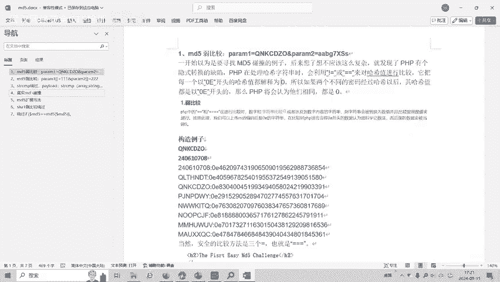

这个时候就可以用我们的一个碰撞攻击。

我们可以使用fat core这个软件。需要这些软件和。资料的可以添加我们的微信。

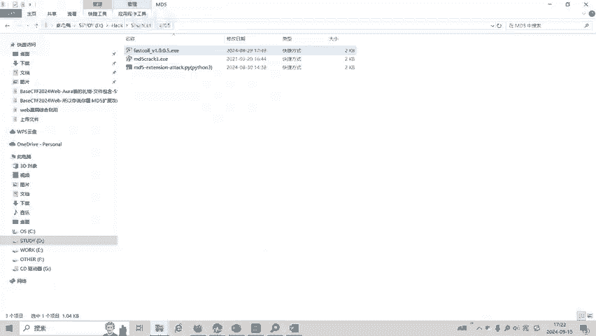

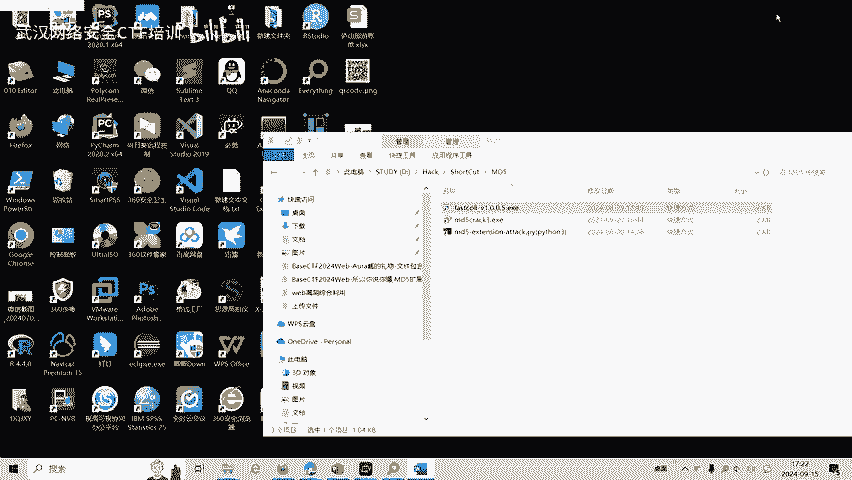

我们首先输入一个字符，以这个字符开头，我们再把这个拖进来。就会产生。

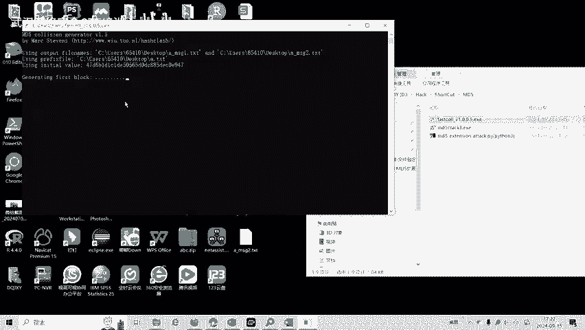

MD5的一个真实碰撞。

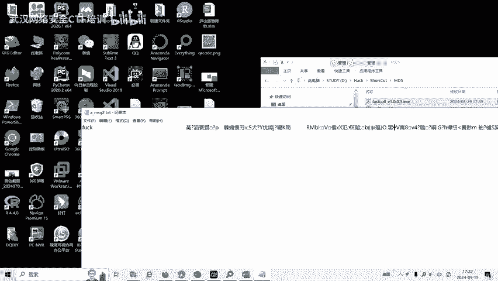

然后呢，再用PAAPP写的PP脚本将生成的铺正式自状。

因为这都是。乱嘛。我们要把它转换成16进制UR编码。

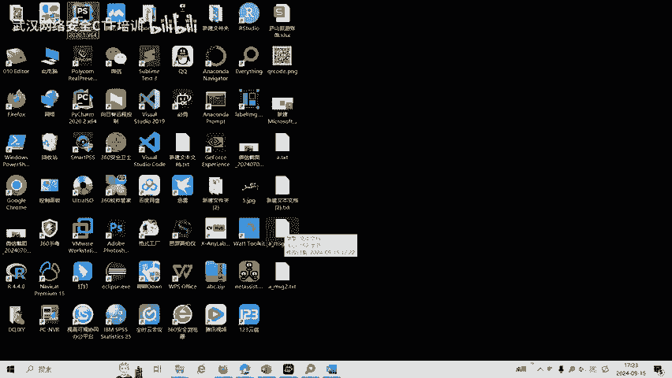

从第五城市工作。我们开始读生成的mess机和M3202个铁T，并且进行UR编码。这时候就得到了这两个文件的UIRP码。它的MD5这是相同相等的。这两个值。但是呢。

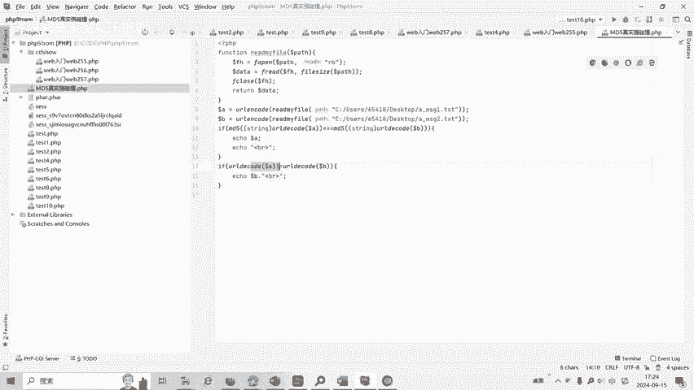

这两个值不相等，只是MD5值相等。这就是用fas core这个软件生成的2个一。这个开头。

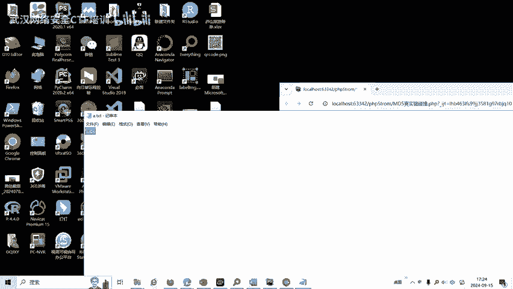

的MD5的一个真实碰撞。我们必须撞到一下。好，BP抓包。这时候呢我们就把生成的这个值放进来。s等一下。不是管理员也来凑热闹。我们看一下，现在呢就已经到这里来了。也如时候我们的真实碰撞。

咱们队伍真实碰撞也绕过了。我们看一下后面代码，创建一个随机函数人等。并就是二进制到16进制。16个字节。16个字节16个字节，总共48个字节。48个字节一个字节的话呢，一个字节的。二进制啊就是8位。

8位二进制呢就转换成了。两个字符的十六进制，因为十六进制是两个字符表示的两个字符表示一个字节。一个字节呢就会用16进表示就是两个字符，所以3乘16等于48，48乘以2就是96。就是96个字符啊。

这个三选是96个字符。然后呢，把筛选这个ren呢复制给reom这个。变量。并且呢输出reM第5值。也就这个指的是人懂。随机输的1个MD5值。pos传餐传 name。问号user。

name的最后5个字符为admin。并且还要穿餐穿MD5。rile随机数呢与我们的name。合在一起呢，要求不等于MD5。如果不等于能比，我就报错，有时候很猛那人的最基数。呃，和 name。

连接在一起的MD5值呢与我们code串它的MD5值要相等。我们只知要扔到了M第5值。以及name的后5位为admin。那么这里考的就是MD5的扩展攻击。注意这个地方呢是48个字节。

就变成了96个字符MB5的扩展规就是已知。bllaag的。长度和MD5值也是我们现在知道这个ren的长度是96个字符，48个字节，然后呢，以及它的reMD5值可以计算出添加某个结尾。

以某个结尾后新的MD5值以添加的值。让我们看一下。

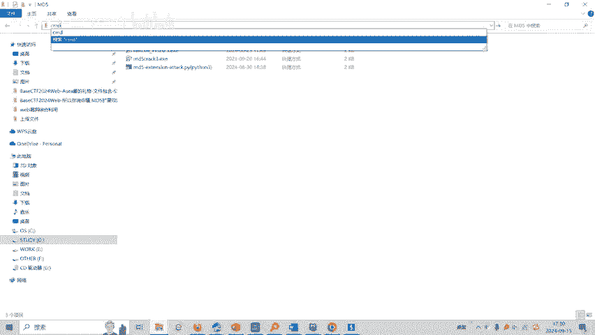

拍摄。

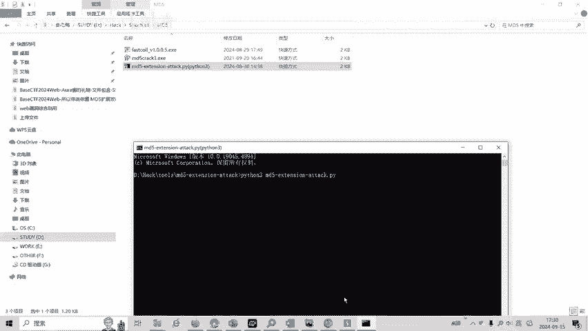

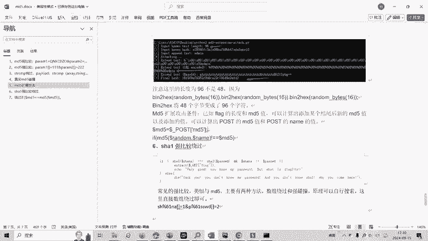

输入。知道的文本长度，也就是说我们是96个字合，输是它的哈希值。

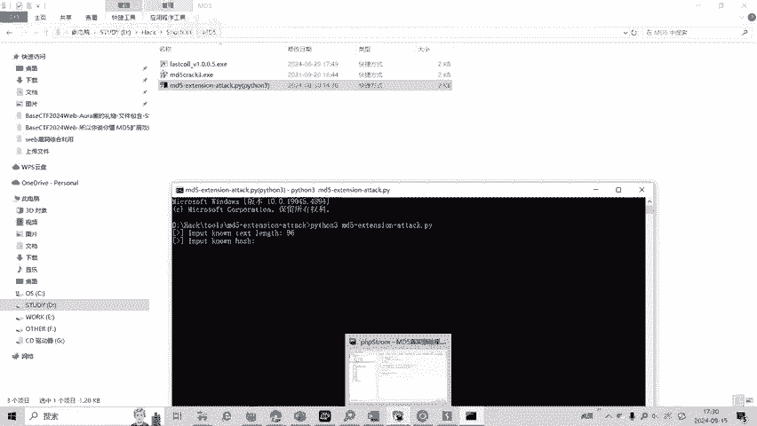

也就是MD5值。lander的MD5值是这个。再输出。他应该也按的命结尾。最后呢我们就获得了。能命的事。也就是name的值name day。在BP里面直接改。

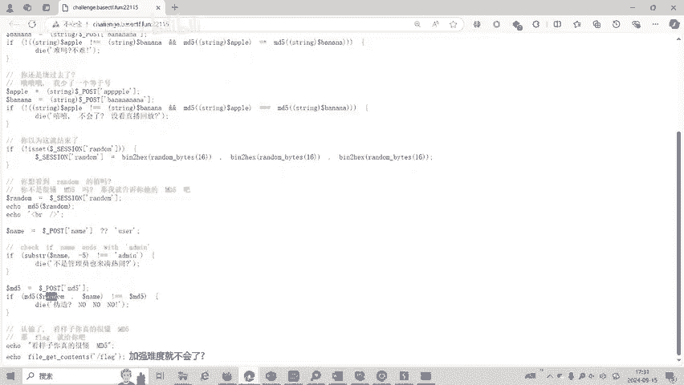

name是以最后5个字或是al me。我们看一下这里生成的name的最后5个字叫al me。

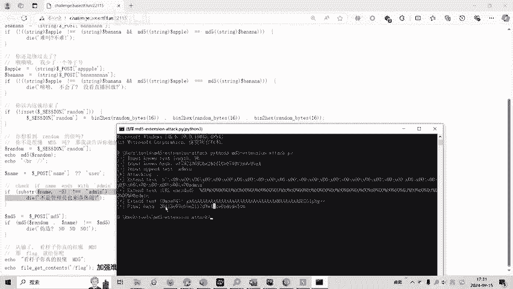

然后最后的哈西纸是这个。那么我们。要求了哈西纸。M第5只就应该是这个。有就认do，然后再加上name连接在一起，生成的MD5值。是等于这个。这等于26。26有4G的。而我们已知了rendo的字符长度。

以及zendo的MD5值是这个。然后呢，我们就可以计算出这个redo后面添加以某个结尾为字符的一个长的字符串。之后可以计算出它的MD5值是这个。我们试了一下。这就是这道题目的答案。好了。

大家如果有兴趣进一步深入学习CTF可以扫描视频中的二维码，免费领取工具资料，或者呢报名CTF培训班。我们的教师团队均来自CTF省赛试赛前十位选手。通过顶尖战队的手法手指导大家学完之后呢。

即可达到省赛试赛的夺奖水平。

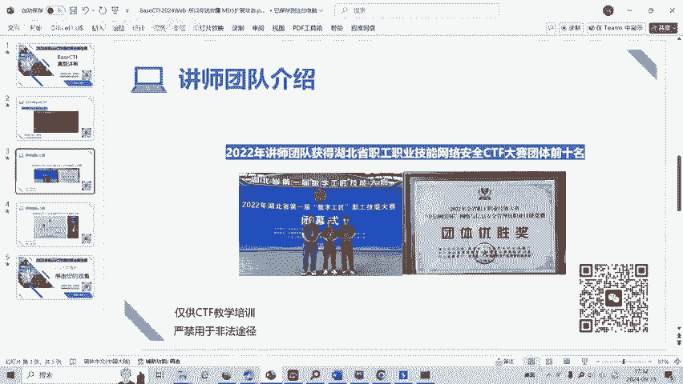

这是我阿阳，然后呢获得的武汉市CGO比赛前10名的一个奖状和证书，获得武汉市技术能手的称号。大家呢如果有兴趣的可以扫描二维码，然后呢呃您免费领取一些工具资料，或者呢报名我们的CT培训培训班。好了。

今天的贝CDF赛题讲解到此结束，感谢大家的观看。