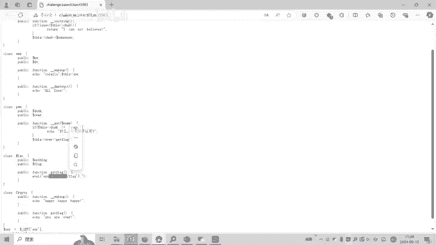
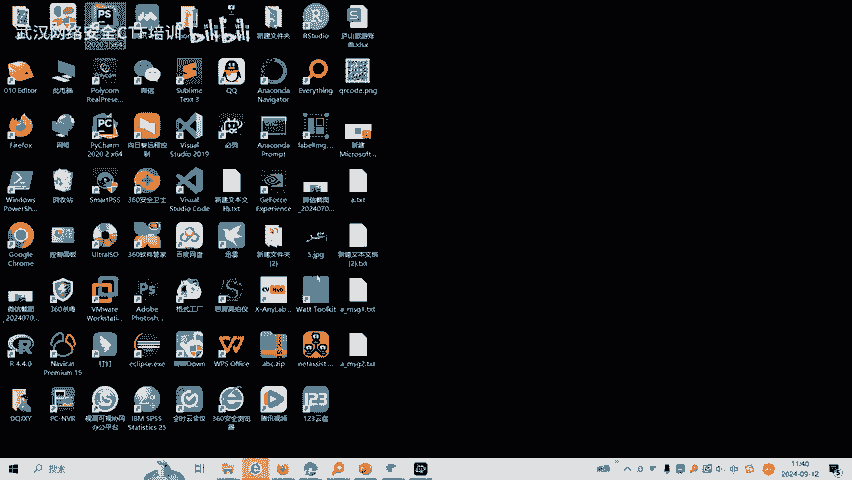
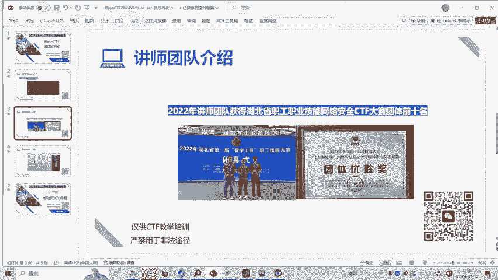

# BaseCTF2024Web-ez_ser-反序列化 - P1 - 武汉网络安全CTF培训 - BV1Tn4te7EhK

大家好，我是阿阳。本视频为2024年baseCTF高校联合新生赛赛题详解视频。大家可以扫描右侧的二维码，免费领取工具资料或者报名CTF培训班。今天讲的赛题为we部反序列化漏洞。

大家可以看到题目是EZ容易的简单的序列化。简单的把序化入门题。我们看一下题目。我们前面的几个类先不看。先看我们的主程序。这里呢是要你盖的传舱。传一个。SER变量。

变量的值呢就传给了这个SE啊do纳这个变量。最后呢通过百序的化。也就是说你传入的值呢是一个序列化的值，通过反序列化呢来执行漏洞来获得那个。我们看一下法律循环漏洞。unair是反序列化。

那么unair呢会出啊我们的wake up函数。对不对？然后呢，这里有get flagget flag get flag的话呢，我们可以看到。只有这个ge呢才能获得。flag值通过ca查看。

后来根录下的flag值。这个glect flag是无效符。也就是说我们实际上需要执行的是miss这个类的get play。这里有一个evener函数，eer函数。那么前面讲了反序列话呢。

会首先触发微开函数。我们看一下还有哪里微他，这个微 hub是不行的。因为这个这里ge出来的是无效的。这里还有个问号，比如说外部的有个问号。外来有个微up按这个Vup就会触发。

on satelliteize我们入口里传入了一个序列化值之后，就会触发unsize函数un satellite。然虽然函数呢就会触发，不开要排除。微害函数这里可以看到一个一个函数。

一个函数如果把类当做。字符串来执行的话，这个点是一个字符串连接符。如果B4。然后呢，K单位方法，这是一个类的话，是一个对象的话呢，就会触发tto string函数。把内当做对象。来执行的话。

就会出了出虚衡。Q4圈还是这里也看得到。由从wake up跳到了我们t three，跳到R一类的。然后Q4运函数执行完之后，就可以看到，如果你存在处理。这个出现变后呢就会执行。

这这句话如果没有的话就会返回。那我们就要求这里有个处名对象。处名对象呢有一个low6 no变量。那么我看到low变变量呢，这里呢就会有一个get。什么时候执行这的呢？就是当不存在。

这个对象之后就会执行get。我们可以看到任何我们这几个类RE类、外部类、碰类、miss类、cple类都没有漏漏漏这个成员变量。那么就说明了。我们可以处名，就相当于是一个胖美。

对象才会出版getge呢就是说。如果访问了不存在的对象的时候，就会执行get，那么get的时候时候呢，就会执行d over，get不带正函数，对不对？首先大ask要等于gas。

然后呢over呢就会执行get。那over呢什么时候才会执行ge flag？只有over是miss对象时候才能获得论，对不对？那么我们的。这个逻辑关系就清楚了。有unsreless到。

触发了wake upwake up这里呢有一个一口字不串法对象当中呢就会触发t stringto string这里呢就会触发处理一个low low对象。

没有这个对象就会触发访问不可访问的不存在对象就会forgetge就会触发di over。d go flag呢我们就触发miss。

我们看一下这个题目的代码怎么写。

我们呢是把这里的对象呢那个对象都复制过来，这些代码复制过来，复制到这里呢。PAAP里面。我们这个看法是这样子的。P亮话不管。然后呢，我们定义呢ABCD。这几个变量。溜了这几个对象。AH webBR一。

A是web，因为首先到A到we have，然后B再到BRE到 to three。这速运呢，然后再到了C胖。最后呢叫到Dmiss或者f。那么我们要求A外的变量。A的KWKW呢，因为这里呢是反对对象呢。

然后自算直行就出发这B。那么呢那KW就应该是RE对象。那，A的W呢K单位就复制给啊，就把它录制B啊，一个而一对象。好，触零呢应该是什么呢？处零呢应该说访问的6露漏啊，不存在。处零呢就应该等于月。胖啊。

要处0呢那B呢处0。主系你史。嗯，等一下。那C这个地方呢，胖呢胖这里面他要求dusask要等于gusask，否则就会输出。あとリンクってね。所大致。等于干s。

然后over呢又等于ge the flag要和 the flag over就等missmiss就行。我来就那miss然后。那么这时候输出啊输出输出我们的。所以说我们虚拟化值A那是虚列化值。输出A就行了。

因为我们是从A外部这里出发。这个地方除了V号，所以我们输入A。A的序列化的指量是这个。打去的话，这个。传进来。要求传仓传ge传参传SER。然后呢，这几单的。CTFbl就获得到了。好了。

大家如果有兴趣进一步深入学习CTF可以扫描视频右侧的二维码，免费领取工具资料，或者报名CTF培训班。我们的教师团队均来自CTF省赛世赛前十名选手。通过顶尖战队的手把手指导呢，大家训完之后。

即可达到省赛实赛的夺奖水平。

好了，今天的贝子CTF赛题详解视频到此结束，感谢大家的观看。🎼Yeah。🎼，🎼あた。🎼。