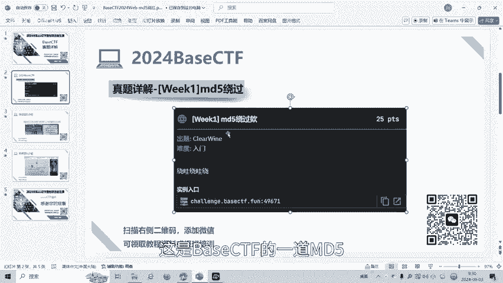
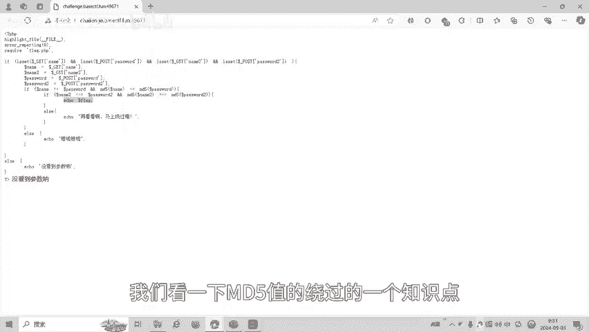
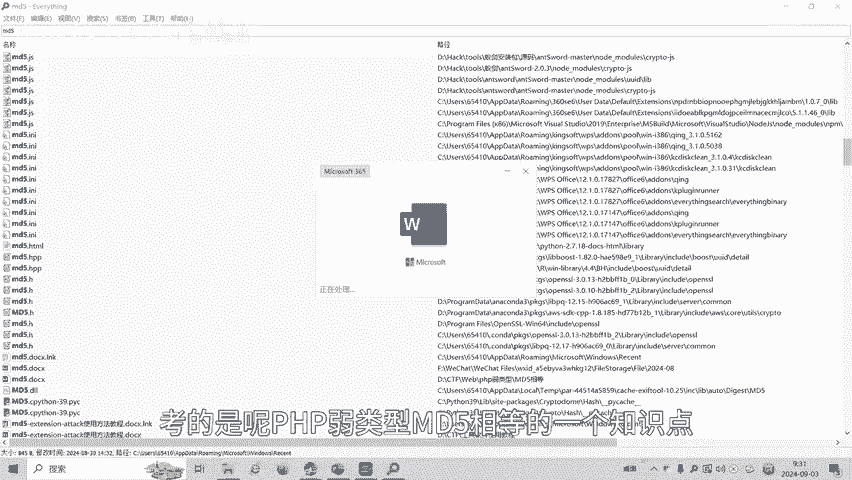
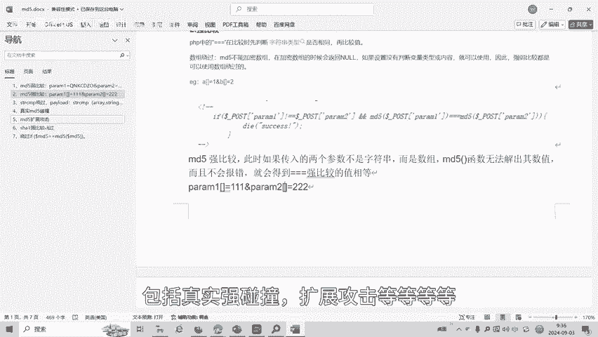
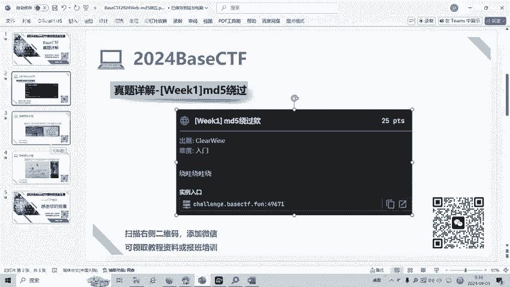
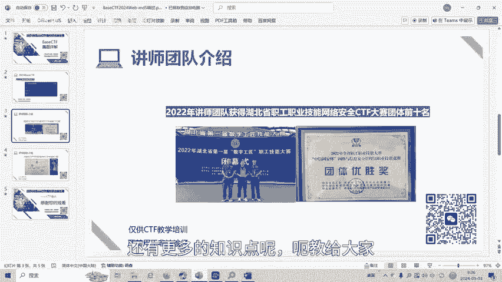

# BaseCTF2024Web-md5强弱比较绕过 - P1 - 武汉网络安全CTF培训 - BV1ySHne1EzM

大家好，我是阿阳。本视频为2024年贝子CTF高校联合新生赛赛地详解视频。大家可以扫描二维码，免费领取工具资料或者报名CTF培训班。今天讲的赛题为MD5绕过。这是被子CTF的一道MD5绕过题。

我们可以看一下题目。

题目呢要求get传参namepasswordname2password2。并且呢要求。name和pas word的值不相等，但是呢MD5值。两个等号就弱相等。name2和pass word2不相等。

但是要求呢。name2和pass word2的MD物质强相等。只有这满足这两个条件，两个if语序之后呢，才会输出我们的blag。我们看一下MD5值的绕绕过的一个知识点。

考的是呢PA弱类型MD5相等的一个知识点。

我们可以看一下。当MD5值持弱比较的时候。只有两个等号，这叫弱比较。那我呢？他会把每一个以01开头的哈希纸都解释为0。所以呢两个不同的密码。经过哈信以后呢，其哈信指呢都是以0一开头。

那么呢PAP就会认为他们相同，这就是弱比角。字符串比较涉及到数字内容的字符串的则字符串呢会转换为数值。你0一开头呢，它会把它当做科学技术法，后面数据就会当做你。比如说这些。经过MD5值。哈息以后呢。

都是以01开头，那么他们只都是0。我们随便举一个例子，以这个以这个。嗯M第5值进一个弱比角都是相等的。我们可以看一下。我们用火狐的ha怕进行一个串餐。Get and name和 password。

我们随便取两个值。只要他的哈息值以1。开头就行了。比如那个。啊这个。这两个的字符串的不相等，但是含西都以01开头，我们执行一下。哦，我们还没有穿餐内面和派了号。另外一个帕子2，我们随便写。写一个值。

我们待会再做强比较，我们先做弱比较。嗯，他做的是pose川菜，那这个是pose传菜。执行一下。再看看马上绕过。比如说我们第一个强弱比角已经两个等号的弱比角已经绕过了，然后呢。进了第二个应文语句。

第二个应用语句是墙壁角，我们没有绕过，所以他一口再看看。我们再看看墙壁角三个等啊，墙壁角怎么绕过的？强比较是先判断字符串的类型是否相同，再比较值。如果我们传的是数组，不是字符串。

而是数组MD5值呢就无法解析数数值会报错。会报错，会返回force。forse那两个for两个都是数组，两个都是forse，那就是相等了相比较。所以我们这个地方呢就把它变成数组就可以了。

这个时候就达到了我们的代表。因为是数字之后，两个返回MD5这返回都是forse，所以它们强相等force等于foralse类型相同，都是不合时宜。那么第五职呢还有很多种绕果。

包括真实强碰撞、扩展攻击等等等等。

大家呢如果有兴趣进一步深入学习呢，CTF呢可以扫描视频中的二维码，免费领取工具资料，或者报名我们的参加CTF培训班。还有更多的知识点呢呃教给大家。

我们的教授团队呢均来自湖北省市赛省赛前10名的选手。通过顶尖战队的手把手指导呢，大家学完之后即可达到省赛试赛的夺项水平。好了，今天的贝CTF赛例详解到此结束，感谢大家的观看。🎼喂喂小狗。😊，🎼小狗。

🎼乖乖。😊。