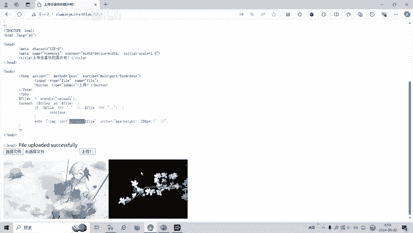
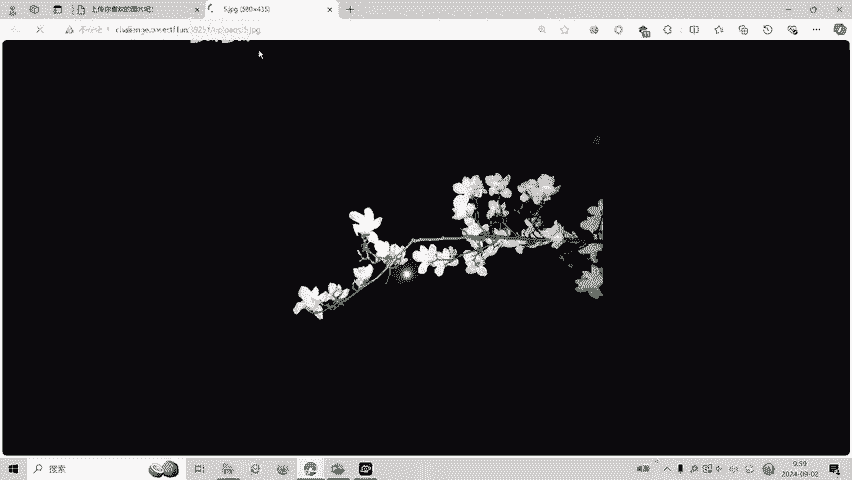
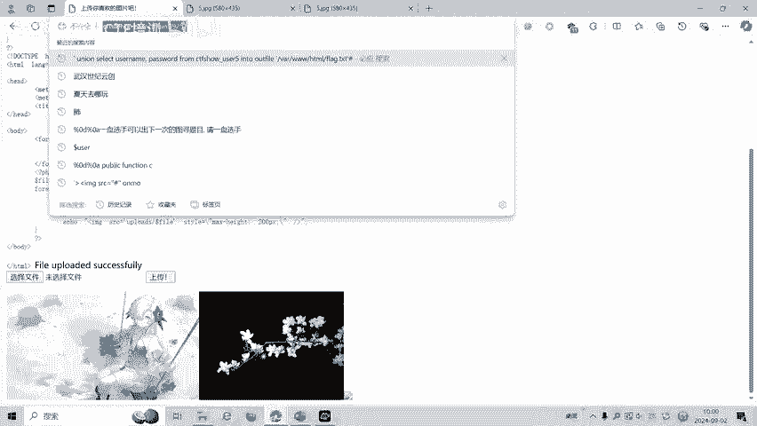
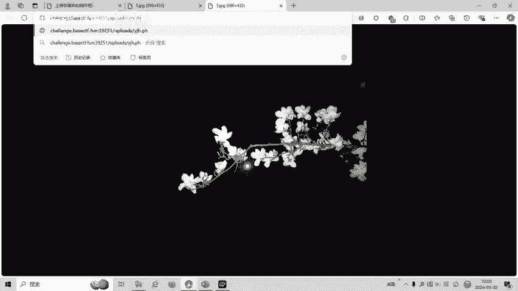
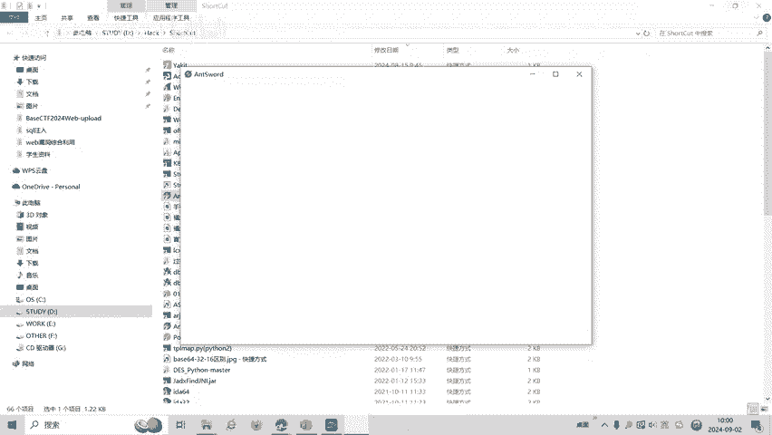
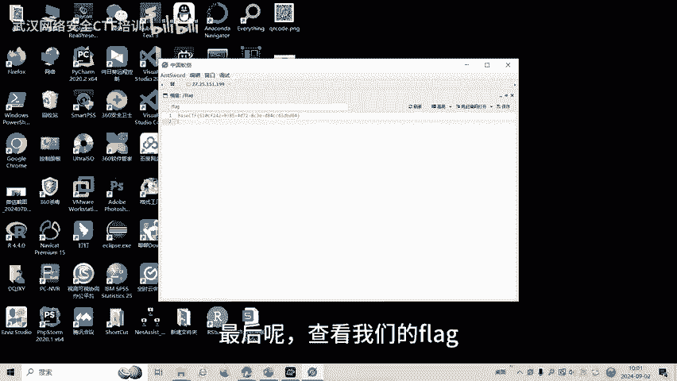
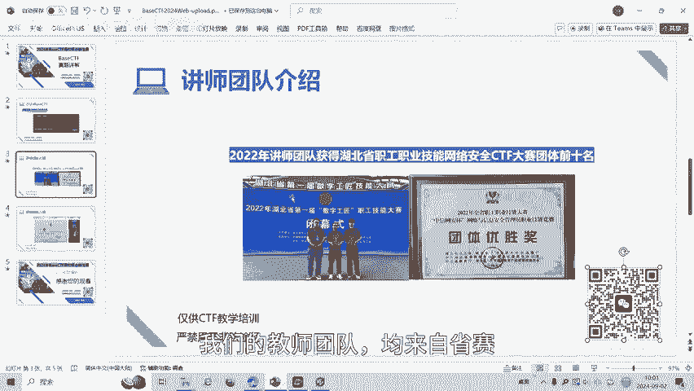

# BaseCTF2024Web-upload文件上传 - P1 - 武汉网络安全CTF培训 - BV1kUHzeFEk1

大家好，我是阿阳。本视频为2024年贝斯CTF高校联合新生赛再填详解视频，大家可以扫描视频中的二维码，免费领取工具资料或者呢报名CTF培训班。今天讲的赛题为upload文件上传。我们可以看一下。

这是这道文件上传的题目，要求我们选择一个文件进行一个文件上传。一般呢我们会选择一个图片进行一个。图片上传，最后呢就告诉我们文件上传成功。然后呢，文件呢是上到upload这个文件夹下面。

这是我上传的这个图片。

I不了。5点接不接是我上传的文件名。那我们呢这道题目呢文件上传题呢一般我们就会上传一个一句话木马。我这里呢有一个一句化木完程序。一句话点PHP我们可以用。漏个的拍给佳家打开看一下这个一句话古吗。

PAPP代码，然后呢连接的pos传舱传线尔变量。也就是说我们最后密码呢是希尔。我把这一句话木马上传。点击上传。文件上传成功。然后呢，我们用已键连一下。上传的文件。

我们上涨的应该是。一句话点PHB。

这里面是没有内容的，但是呢。是个空白的页面，说明呢我们已经连接进来了。因为我们一句划呢没有写任何内容。没有输出，所以呢我们把这个一键进行一个连接。

密码呢是细。测试连件。然后呢，我们就发现我们连接进来了。最后呢查看我们的flag，放现呢这道题目flag就是这个，也就是我们找到这道题目的flag。

好了，大家如果有兴趣进一步深入学习呢CTF可以扫描视频中的二维码，免费领取工具工具资料，或者呢报名我们的CTF培训班。我们的教师团队呢均来自省赛市赛前十名的选手，通过顶尖战队的手把手指导呢。

大家学完之后即可达到省赛实才的夺奖水平。

好了，今天被CTF赛题讲解到此结束，感谢大家的观看。嗯。哇哦不错哟。😊。